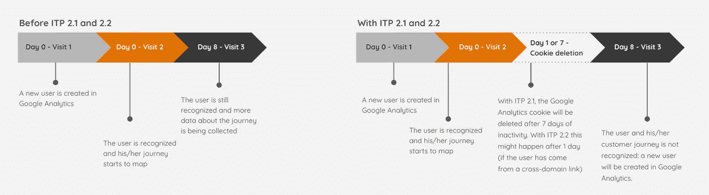
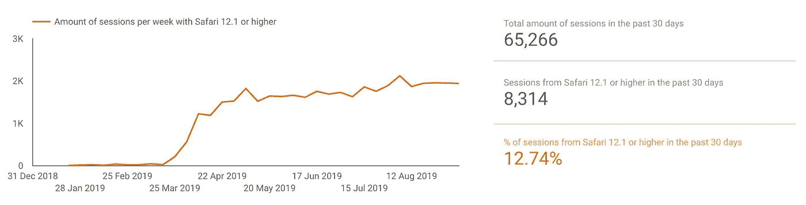
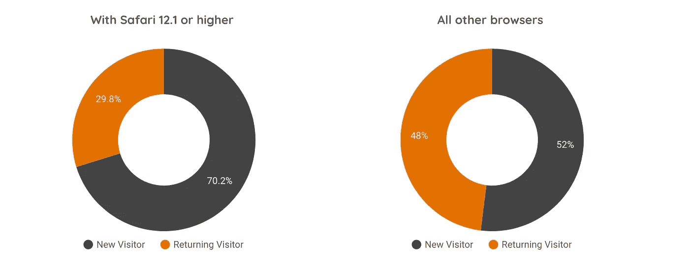
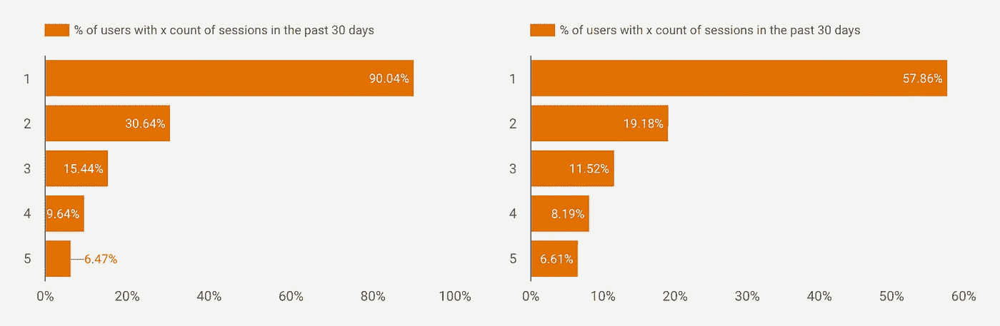
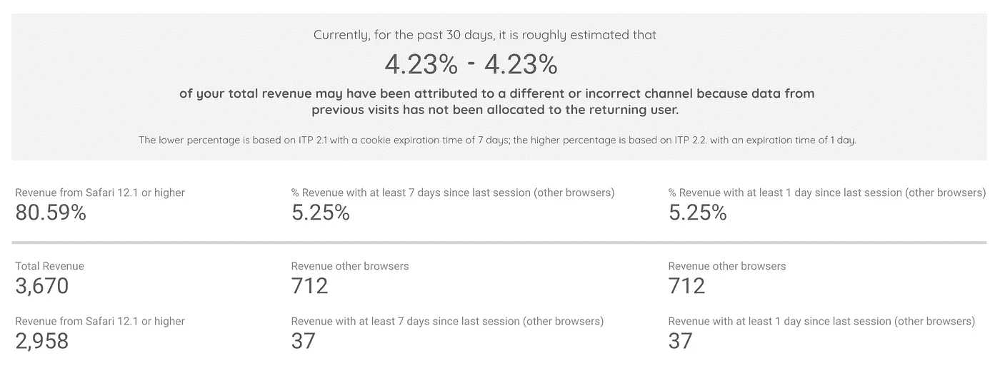

# ITP 2.1 和 2.2 对你的谷歌分析数据有什么实际影响？(+免费工具)

> 原文：<https://towardsdatascience.com/what-is-the-actual-impact-of-itp-2-1-and-2-2-on-your-google-analytics-data-free-tool-99e42c5978a6?source=collection_archive---------12----------------------->

关于 ITP 2.1 和 2.2 对谷歌分析数据的影响，已经有很多文章发表。这些文章往往停留在理论层面，解释什么是*可能是*的影响。今天就来点实际的吧。随着 ITP 2.1 和 2.2 的发布，你的谷歌分析数据真正发生了什么变化？让我们找出答案。

## **理论**

谷歌分析依赖于一个 cookie，它是在你第一次访问一个网站时设置的。如果你几天后再次访问同一个网站，同一个 cookie 将确保你被识别为回头客，你的完整旅程开始绘制地图。至少只要你不删除你的 cookies，每两年*留在同一个设备上至少访问一次网站。随着 ITP 2.1 的发布，最后一个条件发生了巨大的变化。*

*当苹果在 2019 年 3 月底发布 Safari 12.1 和 iOS 12.2 时，ITP 2.1 进入了画面。几周后，ITP 2.2 在 iOS 用户中发布。这从两个方面影响了 Google Analytics cookie:*

*   *谷歌分析 cookie 将在 7 天不活动后被删除(ITP 2.1)。*
*   *如果访问者来自跨域链接(ITP 2.2)，并且只访问一个页面，谷歌分析 cookie 将在 1 天不活动后被删除。*

*因此，我们现在面临的 cookie 过期时间是 1 到 7 天，而不是两年！这意味着，如果回访者在过去 1 或 7 天内没有访问过您的网站，他/她将不会被识别为回访者。理论上的影响是:新用户的会话增加了，每个用户的旅程缩短了，你的收入来源渠道减少了。*

*当涉及到*你的*数据时，让我们来看看这个理论是否正确。*

## ***工具:ITP 影响计算器***

*不要犹豫，使用 [**ITP 影响计算器**](https://datastudio.google.com/open/1llqii9oyHXx2kLy6AOHI8AQnKIS1BrX6) 来找出 ITP 2.1 和 2.2 如何影响你的谷歌分析数据。下面你会发现这个工具的输出解释。当然，你也可以不使用工具继续阅读。*

## ***您的访问者中有多少人实际上使用了 ITP 2.1 和 2.2 版本的浏览器？***

*首先，了解实际使用 ITP 2.1 或 2.2 浏览器的访问者数量是很重要的。只有 Safari 12.1 或更高版本具有 ITP 2.1 或 2.2。通过创建这个浏览器和版本的一个片段，你会发现你的访问者何时采用了这个新的浏览器，以及它在你的访问者中的总份额是多少。使用这种浏览器的人越多，ITP 2.1 在你的数据上留下的印记就越多。*

**

*The graph on the left shows a timeline of when your visitors have adopted Safari 12.1 (or higher). The scorecards on the right provide insight in the total share of Safari 12.1 (or higher) sessions in the past 30 days.*

## ***ITP 如何影响回头客的数量？***

*新访客还是回头客？这就是问题所在！在 ITP 2.1 中，新用户可能会将更多的会话归类为一个会话。这是因为在过去的 1 或 7 天内没有访问过您的网站的访问者将不再被识别。*

*要找出您的数据中是否存在这种情况，您可以查看“用户类型”维度，并将其分为两个部分:一部分用于 Safari 12.1 或更高版本的用户，另一部分用于使用任何其他浏览器的访问者。通常，你会发现 Safari 12.1 或更高版本的用户中新访客的数量要高得多。这两者之间的差异有助于了解 ITP 2.1 对数据集中数据的影响。*

**

*The pie charts indicate how the amount of new and returning users may have changed. In this example: with ITP 2.1, only 30% can be recognized as a returning user. Among other users, 48% can be recognized as a returning user. This is a difference of no less than 18%*

## ***你的访客的旅程长度发生了什么变化？***

*Google Analytics 用“会话计数”这个维度来跟踪某人访问你的网站的次数。在 ITP 2.1 和 2.2 中，预计无法识别返回用户。结果:它们的会话计数将被重置。换句话说:我们希望会话数只有一个的用户比例更高。通过在谷歌分析或 [ITP 影响力计算器](https://datastudio.google.com/open/1llqii9oyHXx2kLy6AOHI8AQnKIS1BrX6)中查看这个维度，你会发现与其他浏览器相比，这个差异有多大。*

*如果你想知道为什么 ITP 影响计算器中提供的百分比加起来不是 100%——我必须称赞你的警觉性！这有两个原因。首先，这是因为“会话计数”维度看起来比计算器中的 30 天更久远。这意味着某人在此期间可能只去过第二次。第二个原因是，这个维度是递增的:在过去的 30 天里，某人可能会有第一次、第二次和第三次访问。因此，百分比显示了在过去 30 天内，有多少用户进行了第一、第二、第三、第四或第五次会话。*

**

*The graph shows the percentage of users who with their 1st, 2nd, 3rd, 4th and/or 5th session count. With ITP 90% of the users had their first session in the last 30 days. This is was only 58% among other browsers.*

## ***这对您的营销渠道归属意味着什么？***

*ITP 2.1 和 2.2 对评估不同营销渠道的价值的影响可能是最大的挑战。由于可以识别的用户越少，他们的客户旅程中可以链接的接触点就越少。想象一下这个场景:有人在点击了一个脸书的广告后，第一次用最新版本的 Safari 访问你的网站；8 天后，这个人通过谷歌搜索你的品牌并下订单。在这种情况下，这种交易将只归因于(有机或付费)搜索。引发第一次接触的脸书广告的巨大作用被忽略了。*

*ITP 影响计算器提供了受 ITP 2.1 和 2.2 影响的收入百分比，这些收入可能归因于错误的渠道和/或不完整的客户旅程。这一估计基于(但略有不同)Paul Koks 的一篇[早期文章。](https://online-metrics.com/intelligent-tracking-prevention/)*

**

***救命！ITP 在很大程度上影响了我的数据，现在呢？***

*到目前为止，已经提出了一些(技术上具有挑战性且耗时的)解决方法。但是，正如[西蒙·阿哈瓦](https://www.simoahava.com/analytics/itp-2-1-and-web-analytics/)正确指出的那样:“随着 ITP 的变通办法被发明出来，ITP 的新迭代将被引入”。已经成了猫捉老鼠的游戏。在这场游戏中，特别有趣的是，谷歌将来可能会也可能不会为 ITP 找到变通办法。*

*就目前而言，我认为在 ITP 问题上有两件事很重要:*

*   *作为分析师、在线营销人员或营销经理:要意识到 ITP 2.1 和 2.2 可能对你的数据产生的影响，以及你能从这些数据中得出什么结论。 [ITP 影响计算器](https://datastudio.google.com/open/1llqii9oyHXx2kLy6AOHI8AQnKIS1BrX6)让您初步了解您的数据受到了多大的影响。*
*   *如果可能，尝试在会话范围而不是用户范围内进行分析。在谷歌分析中分析会话仍然是完全可靠的。如果你仍然想在用户层面上进行分析，考虑把 ITP 2.1 和 2.2 浏览器从你的数据集中去掉。*