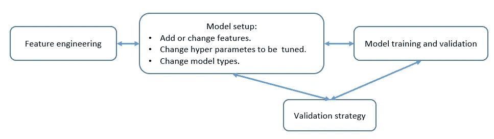
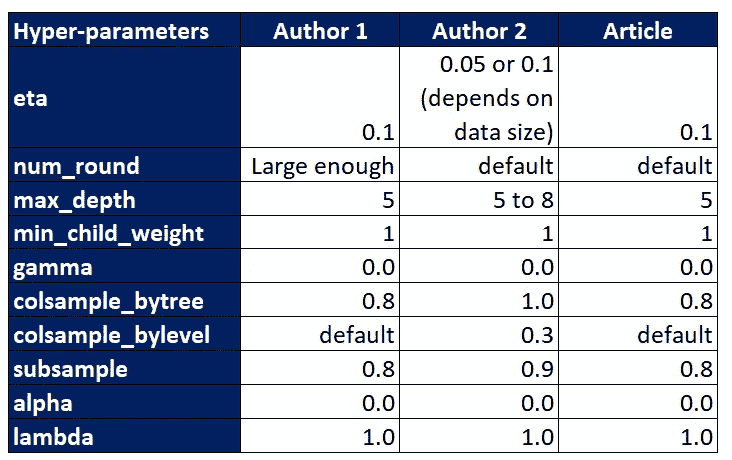

# 表数据 ML 中最好的入门模型是什么？——从一位高层卡格勒的新书中得到的教训

> 原文：<https://towardsdatascience.com/what-is-the-best-starter-model-in-table-data-ml-lessons-from-a-high-rank-kagglers-new-book-f08b821db797?source=collection_archive---------30----------------------->

## 《赢得 KAGGLE 的数据分析技术》一书

## 在 Kaggle 或业务建模中开始建模的提示

Photo by [Jon Tyson](https://unsplash.com/@jontyson?utm_source=medium&utm_medium=referral) on [Unsplash](https://unsplash.com?utm_source=medium&utm_medium=referral)

这是另一篇文章，介绍了新书*“赢得 Kaggle 的数据分析技术”，*中介绍的技巧，作者是三位高级 kaggler(不包括我自己，因此这不是个人提升！:) )

这本书本身的完整目录，见我的[其他帖子](https://medium.com/@daydreamersjp/a-new-book-data-analysis-techniques-to-win-kaggle-is-a-current-best-and-complete-for-table-data-4af66a88388)。

在这篇文章中，我将谈论哪个模型是围绕特性和参数的首选，以及模型集成的其他选项。

# 拿到数据了😚！我要去做模特😄！但是等等，我能从哪里开始🙄？？

**在你把你的最终 ML 结果**发给你的老板或 Kaggle 的排行榜或其他地方之前，你应该把这些模型和最终分数并排比较，用:

*   他们的超参数完全调整好了，
*   它们的功能被完全设计和利用，和/或
*   这些模型是成套的。

然而，**在第一步，** **你的问题可能是“好吧，我知道要去哪里，但是我能从哪里开始呢？**🤔**“玩意儿。**

通过建模，普遍的看法是"**特征工程最重要。**“模型的改变可能也很重要，但不像特征工程那样重要；同样，超参数调整可能会影响模型性能，但对分数影响不大。

所以，我们想决定什么样的特征工程最适合我们的建模，但我们至少需要一些模型来尝试，看看我们制作的特征是否适合进一步发展。那么，这里我们说“**从哪里开始呢？？**😟"

Illustration of modeling cycle

# 顶级卡格勒人的选择👈🏻是…

首先讲结论，在表格数据分析(记住本书的主要主题是关于表格数据 ML)中，本书建议:

*   **从 GBDT 开始** *(本文稍后讨论)* **、**
*   **花费最多的时间进行特征工程(主要作者称占总时间的 80%)来查看对 GBDT 预测的影响，**
*   **不时检查超参数变化的影响，但还没有剧烈调整，**
*   **根据任务和模型的多样性，考虑神经网络和/或线性模型** *(本文稍后讨论)*
*   ****做 ensemble 时，考虑 Kaggle 常用的模型多样性的其他类型模型；kNN，随机森林，极度随机化树(ERT)，正则化贪婪森林(RGF)，场感知因式分解机(FFM)** *(本文稍后讨论)* **，****
*   ****如果新方法更适合数据和/或任务，可能会改变验证策略。****

**GBDT 是许多卡格勒人的首选。**

> **对于第一个模型，我们希望它能够快速正确地运行，并成为一个基线模型。**
> 
> **我们不喜欢它需要太多的数据转换、功能工程或超参数调整。**
> 
> **我们也希望它不要花太多时间运行，因为我们将尝试许多不同的输入选项一个接一个。**
> 
> **GBDT 可以跳过其中的任何一个。**

**我们将在下一节看到更多的细节。**

# **GBDT 是受爱戴的💖这么多，但是为什么呢？**

**GBDT 是基于决策树的模型。因此，模型训练中的核心行为是将节点分成两个分支。这使得 GBDT:**

*   ****不需要可变缩放**，**
*   ****不需要缺失值插补**(如果变量缺失，分割规则也决定了记录转到哪个节点)。**
*   ****能够通过** [**标签编码**](https://scikit-learn.org/stable/modules/generated/sklearn.preprocessing.LabelEncoder.html) 来处理分类变量(尽管因为 sklearn lightgbm 和 catboost APIs 及其原始包会在发现分类变量是分类变量时自动对其进行编码，但这种优势在实践中可能并不明显)**
*   ****能够在没有明确交互变量的情况下反映变量交互**(这是通过多个不同的具有交互的变量的重复分割来实现的)。**

**此外，这本书还提到了 GBDT 的好处:**

*   **良好的预测性能，**
*   **倾向于提供足够高的性能，而无需强烈的超参数调整，**
*   **拥有不必要的变量不会对模型性能造成太大的损害，并且**
*   **能够默认处理稀疏矩阵对象，例如`scipy.sparse`中的`csr_matrix`或`csc_matrix`。**

****使用 GBDT，我们可以设置一些默认参数，并可以围绕特征工程进行操作，直到找出下降变量，以及一些并行的超参数调整。****

**下表显示了书中介绍的 xgboost 的默认超级参数集。**

****

**xgboost hyper-parameter defaults introduced in the book.**

**调优时，一般`max_depth` 和`min_child_weight`是最先照顾的，比如`max_depth` = 3~9，`min_child_weigh` = 1~5。**

**接下来，`subsamle`，`colsample_bytree(_bylevel)`，`alpha`，`lambda`，`gamma`，像`subsample` = 0.6~1.0，`colsample_bytree` = 0.6~1.0，`alpha` = 1e-5，1e-2，0.1，1，100，`gamma` = 0.0~0.4。**

**有三个常用的 GBDT 图书馆:**

*   ****xgboost****
*   ****lightgbm****
*   ****catboost****

**在这篇文章中，我不会深究每个模型本身。我建议查看一下 t [的牛逼对比帖](/catboost-vs-light-gbm-vs-xgboost-5f93620723db)。**

# **神经网络是🖖的第二选择🏻**

**在表数据中，广泛使用的神经网络是相当浅的，如 2 至 4 层，也是完全连接的；又名**多层感知器(MLP)** 。**

**NN 的属性是:**

*   **需要估算缺失值，**
*   **更好的模型训练需要缩放，**
*   **对超参数选择敏感，**
*   **非线性和可变的相互作用可以在一定程度上得到反映，**
*   **擅长多类分类，并且**
*   **使用 GPU 加速。**

**神经网络不像 GBDT 那样方便，它没有激烈的调整和变量转换，但仍然取决于任务，它比 GBDT 工作得更好。**

**有针对 MLP 的 sklearn 包装器，但是使用特定的框架在神经网络建模中也很常见。**

*   **克拉斯**
*   **pytorch**
*   **张量流**

# **其他型号💮**

**其他模型可能无法单独击败 GBDT 和 NN 的性能，但**可以用于在集合中获得多样性**。**

## **线性模型**

*   **性能较低，但在数据量不足或数据有噪声时可能比其他产品更好，**
*   **缺少的值需要被估算，**
*   **需要仔细的变量变换(最小值、最大值、宁滨)和缩放，**
*   **需要明确地嵌入术语来表示非线性和相互作用，**

****kNN****

****随机森林****

**[**极度随机化的树**](https://scikit-learn.org/stable/modules/generated/sklearn.ensemble.ExtraTreesClassifier.html)**【ERT】****

*   **类似于随机森林，除了分裂规则的改变。**
*   **比随机森林更不容易过度适应。**

**[**【正规化的贪婪森林】**](https://github.com/RGF-team/rgf/tree/master/python-package)**【RGF】****

*   **接近 GBDT，但使用不同的方法来制作新树和调整现有的树。**

******(FFM)******

*   ****与推荐任务非常匹配。****
*   ****用于“[展示广告挑战赛](https://www.kaggle.com/c/criteo-display-ad-challenge/discussion/10555)等 Kaggle 比赛****

# ****结论👏****

****由于其易于处理模型设置和下降精度，GBDT 是在表数据 ML 中开始建模的第一选择。****

****使用 GBDT，我们可以在特征工程周围玩耍，直到找到运行良好的变量。****

****神经网络或线性模型可能是一种选择，取决于任务的类型，也将为集合中的模型多样性工作。****

****kNN，随机森林，ETR，RGF，FFM 也可以考虑模型多样性来集成。****