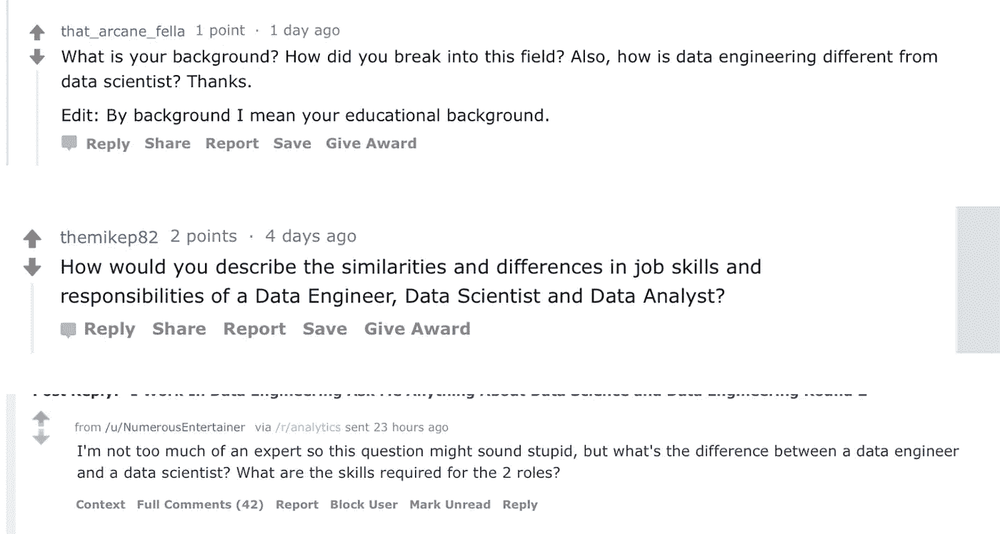

# 数据工程师和数据科学家的区别是什么

> 原文：<https://towardsdatascience.com/what-is-the-difference-between-a-data-engineer-and-a-data-scientist-a25a10b91d66?source=collection_archive---------6----------------------->

由本·罗戈扬

我们最近在 Reddit 上做了一个 [AMA。最常见的问题是数据科学家和数据工程师之间的区别。所以我们想就这个主题发表一篇更深入的文章。](https://www.reddit.com/r/analytics/comments/apiryv/i_work_in_data_engineering_ask_me_anything_about/)

有许多数据专家职位听起来相似，使用相似的工具，因此很难知道每个角色应该做什么。此外，较小的公司可能会限制他们可以雇用多少数据工程师或数据科学家。这意味着很多时候，特定的任务和目标可能会混合在一起。

这使得明确区分这两种角色变得更加困难。因此，我们希望通过讨论数据工程师和数据科学家的不同目标、思维模式、工具和背景来了解这两个职位的不同之处。

在我们讨论这种差异之前，我们想先简单介绍一下。事实是，许多数据科学家和数据工程师将执行其他技术角色的任务。一个数据科学家可能需要[开发一个 ET](http://www.acheronanalytics.com/acheron-blog/sql-best-practices-designing-an-etl-video) L，一个数据工程师可能需要开发一个 API 和前端。因此，我们在下面指出的区别只是为了明确技术差异在哪里。

by DataCamp

# 目标

数据工程师的目标更侧重于任务和开发。数据工程师构建自动化系统和模型数据结构，以便有效地处理数据。这意味着数据工程师的目标是创建和开发表格和[数据管道](https://hackernoon.com/best-practices-creating-an-etl-part-1-bdb563381025)以支持分析仪表板和其他数据客户(如数据科学家、分析师和其他工程师)。和大部分工程师差不多。为了能够完成最终任务，需要进行大量的设计、假设、限制和开发。每种设计和解决方案都有自己的局限性，即使它们都能完成最终任务。

相比之下，数据科学家倾向于关注问题。从某种意义上说，他们正在寻找降低成本/增加利润、改善客户体验或提高业务效率的方法。这意味着他们需要问问题，然后回答问题(问一个问题，假设，然后得出结论)。因此，他们需要问这样的问题，什么会影响患者的再入院，如果向客户展示类似于 [A vs. B](https://hbr.org/2017/06/a-refresher-on-ab-testing) 的 add，客户是否会花费更多，是否有更快的路线来递送包裹？跳过剩余的过程。我们的目标是找到任何问题的答案。这可能是一个最终的结论或更多的问题。在整个过程中，数据科学家分析、收集支持，并得出问题的结论。

# 工具

这就是事情变得令人困惑的地方。数据科学家和数据工程师通常都依赖 python 和 SQL。然而，这两个技术角色使用这些技能的方式各不相同。这又回到了思维模式的差异。Python 是一种非常健壮的语言，它的库可以帮助管理操作任务和分析任务。

数据科学家将使用像 Pandas 和 Scikit Learn 这样的库，而数据工程师将使用 python 来管理管道。这就是像 [Airflow](https://airflow.apache.org) 和 [Luigi](https://luigi.readthedocs.io/en/stable/example_top_artists.html) 这样的库派上用场的地方。

类似地，数据科学家的查询将特别关注(例如，关注问题)。而数据工程师的查询将集中在清理和转换数据上。

现在，两位数据专家都可以使用其他工具。这包括 [Tableau](https://public.tableau.com/en-us/s/) 、 [Jupyter](https://jupyter.org) 笔记本和其他一些。归根结底，是他们如何使用它们造成了这种区别。

# 背景

现在，当谈到数据工程师和数据科学家的区别时，另一个常见的问题是需要什么背景。

数据工程和数据科学都需要对数据和编程有所了解。即使是有限的范围。然而，有一些超越编程的区别。专门针对数据科学家。由于数据科学家更像是一名研究人员，因此拥有基于研究的背景是一项优势。

这可能是在经济学、心理学、流行病学等领域。将研究背景与 SQL、Python 和良好的商业意识结合起来，你就有了一个数据科学家。现在，这些都不是固定的。事实上，我们遇到过各种学位的数据科学家。大多数雇主更愿意雇佣至少拥有硕士学位的数据科学家，这些数据科学家具有某种技术或数学方面的重点。

数据工程职位通常不需要硕士学位。数据工程更多的是作为一个开发者。这需要更多的实践经验，而不是理论知识。所以获得硕士学位并不能提供相同的价值。

# 一个例子

假设一家医疗保健公司的主管决定，他们想知道如何减少患者在初次就诊后 30 天内再次入院的数量。从数据的角度来看，有几件事情需要发生。

数据科学家需要弄清楚是什么推动了患者的再次入院。这是他们将试图回答的问题。根据他们得出的结论，他们将与企业合作制定指标和政策，以帮助提高患者的再入院率。

数据工程师将开发表格来帮助数据科学家回答问题，同时开发分析表格来帮助跟踪过去和未来的患者再入院指标。如何创建这些指标将取决于数据科学家得到的答案。

数据科学家和数据工程师有很多不同之处。他们有不同的目标和背景，但这就是同时利用两者的价值所在。事实上，数据工程师更专注于设计健壮的系统，这使得数据科学家可以轻松地查询数据并有效地分析数据。他们的合作伙伴关系为公司带来了数据价值。

我们希望这篇文章是有帮助的！如果您有任何问题，请随时联系我们。