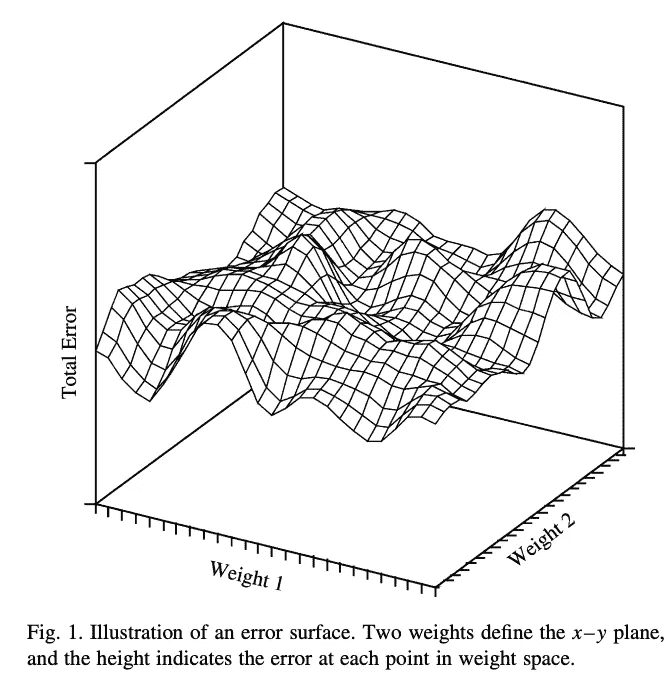
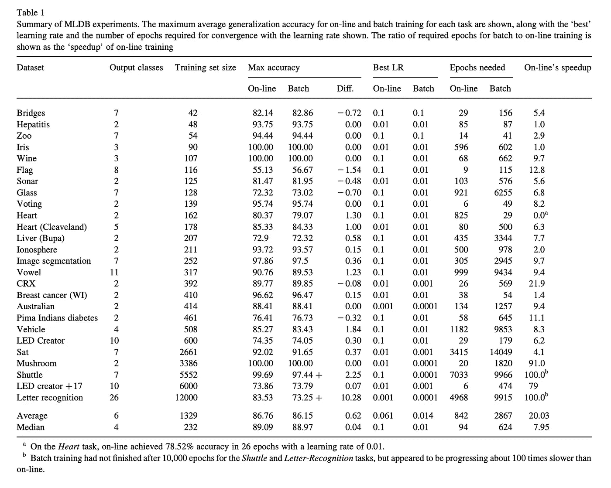

# 优化和深度学习的区别是什么，为什么要关注

> 原文：<https://towardsdatascience.com/what-is-the-difference-between-optimization-and-deep-learning-and-why-should-you-care-e4dc7c2494fe?source=collection_archive---------7----------------------->

如今，训练神经网络最常见的方法是使用梯度下降或 Adam 之类的变体。梯度下降是一种[迭代优化算法，用于寻找函数](https://en.wikipedia.org/wiki/Gradient_descent)的最小值。简而言之，在优化问题中，我们对一些度量 **P** 感兴趣，我们希望找到一个函数(或函数的参数)，它可以在一些数据(或分布)d 上最大化(或最小化)这个度量。这听起来就像机器(或深度)学习。我们有一些指标，如准确性，甚至更好的精确度/召回率或 F1 分数，我们有一个可学习参数的模型(我们的网络)，我们有我们的数据(训练和测试集)。使用梯度下降，我们正在“搜索”或“优化”我们模型的参数，最终将最大化我们数据的度量(准确性)，包括训练集和测试集。

From [The general inefficiency of batch training for gradient descent learning](http://axon.cs.byu.edu/papers/Wilson.nn03.batch.pdf)

优化和深度学习之间(至少)有两个主要差异，这些差异对于在深度学习中实现更好的结果很重要。

第一个区别是度量函数。在优化中，我们有一个明确定义的指标，我们希望最小化(或最大化)。不幸的是，在深度学习中，我们经常使用不可能或很难优化的指标。例如，在分类问题中，我们可能对模型的“准确性”或“F1 分数”感兴趣。准确性和 f1 分数的问题是，它们不是可微函数，我们不能使用梯度下降法，因为我们不能计算梯度。出于这个原因，我们使用像负对数似然(或交叉熵)这样的代理指标，希望最小化代理函数将最大化我们的原始指标。那些代理指标并不总是坏的，可能有一些优点，但是我们需要记住我们关心的真正价值，而不是代理指标。

确保我们关心原始度量的方法之一是使用[提前停止](https://en.wikipedia.org/wiki/Early_stopping)。每一个时期，我们都使用一些验证集上的原始 metic(精确度或 f1 分数)来评估我们的模型，一旦我们开始过度拟合，就停止训练。为了更好地理解我们模型的性能，打印每个时期的精度(或任何其他度量)也是一个好的实践。

第二个重要的区别是数据。在优化中，我们只关心手头的数据。我们知道找到最大值将是我们问题的最佳解决方案。在深度学习中，我们最关心的是[泛化](https://en.wikipedia.org/wiki/Generalization_error)，即我们**没有**的数据。这意味着，即使我们找到了我们拥有的数据(训练集)的最大(或最小)值，我们仍然可能在我们没有的数据上得到糟糕的结果。把我们的数据拆分成不同的部分，把测试集当成“我们没有的数据”，这一点非常重要。我们不能根据测试集做出任何决定。为了做出关于超参数、模型架构或早期停止标准的决策，我们可以使用验证集，但不能使用测试集。

这还没有结束。我们通过将参数推向“正确”的方向，使用梯度下降来训练我们的模型。但是什么是“对”呢？它是适用于所有数据还是仅适用于我们的训练集？例如，当我们选择批量时，这是相关的。有些人可能会声称，通过使用整个训练数据(所谓的批量梯度下降)，我们将获得“真正的”梯度。但这只适用于我们现有的数据。为了将我们的模型推向“正确”的方向，我们需要近似我们没有的数据的梯度。这可以通过使用更小的批量来实现(所谓的小批量或随机梯度下降)。[这篇](http://axon.cs.byu.edu/papers/Wilson.nn03.batch.pdf)论文表明，只使用一个批量就可以达到最好的结果(有时称为在线培训)。通过使用较小的批量，我们在梯度中引入了噪声，并可以提高泛化能力和减少过拟合。下表显示了在 20 多个数据集上“批处理”与“在线”训练的性能。我们可以看到，平均而言，“在线”更好。

From [The general inefficiency of batch training for gradient descent learning](http://axon.cs.byu.edu/papers/Wilson.nn03.batch.pdf)

机器学习问题有时被称为优化问题。了解差异并解决它们是很重要的。

参考资料:伊恩·古德菲勒和约舒阿·本吉奥的《深度学习书》