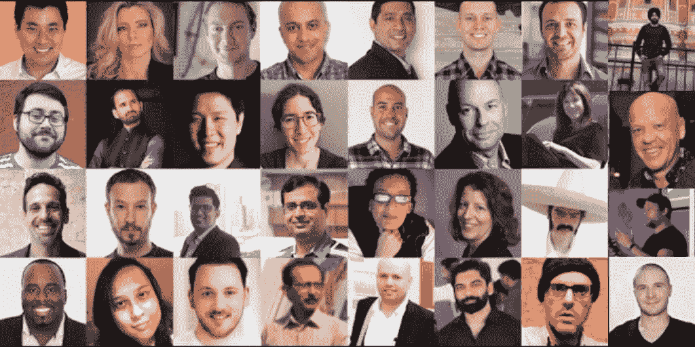

# 2020 年 AI 对 SEO 有什么影响

> 原文：<https://towardsdatascience.com/what-is-the-impact-of-ai-on-seo-in-2020-10e20a68cb90?source=collection_archive---------38----------------------->

从简单的桌面网站优化到复杂且不断发展的内容增强过程，搜索引擎优化在过去十年中经历了各种变化。虽然有些方面从未改变，如关键字和元标签优化和链接建设，但 SEO 在移动优化、用户体验和社交媒体营销方面发展得更快。

但当谷歌在 2016 年推出 RankBrain 时，一个巨大的变化引起了人们的注意。RankBrain 使用机器学习算法来识别模式和桶数据，这个过程导致揭示了一个分析新的谷歌搜索的新系统。

从那以后，随着人工智能和机器学习算法在提高搜索内容的相关性方面取得了巨大的进步，SEO 发生了很大的变化。在即将到来的 2020 年，人工智能很有可能通过视频、图像、语音搜索和预先训练的模型来影响 SEO 的未来。

# 人工智能的影响[专家意见]

让我们再听听专家们的看法-

[Signity Solutions](https://www.signitysolutions.com/blog/wp-content/uploads/2019/12/What-is-the-impact-of-AI-on-SEO-in-2020-Experts-Opinion.jpg)

# 1.[拉里·金](https://twitter.com/larrykim)—[手机钥匙](https://mobilemonkey.com/)的创始人兼首席执行官

随着 AI 的必然推进，将 AI 纳入营销策略的改革已经成为每一个营销者的必然。

人工智能工具，如人工智能聊天工具(https://mobilemonkey.com/chatbots)及其执行多种功能和分析大量数据的能力，一直在塑造 SEO 景观，并正在进入主流营销。

最重要的是，人工智能工具还将有助于改善关键词研究方法，以实现更好的内容策略，为 SEO 团队提供更强大的分析和报告系统，以及更智能的个性化。

早期采用者肯定会收获人工智能的好处。

# 2.道恩·安德森——贝蒂公司的总经理

接下来，我们有请 Bertey 董事总经理 Dawn Anderso，他是国际 SEO 和数字战略顾问、演讲者、培训师和讲师。

2020 年，人工智能对 SEO 的影响远没有你想象的那么大。人工智能和机器学习在实践中的应用比理论上少得多。虽然在搜索排名和分类领域会有人工智能和机器学习的元素，例如，在 Google BERT、Elmo 和 BERT 的各种后代中，在遗留系统中实施巨大变化的实践是很成问题的，需要时间。虽然发展速度在加快，但机器学习面临的挑战并不小，仍有许多未解决的问题。我们可以把它比作这个。如果我们制造了一架超音速飞机，这并不意味着我们放弃所有其他的飞机，这些飞机在停产后仍然运行良好。

# 3.伊莱贾·马塞克-凯利——强大外联的创始人

它在这里。这一刻我们都在等待 5d 的到来…奇点。当人工智能成为我们的霸主的时候！

哦，等等。现在才 2020 年。而我们说的只是 SEO！

总的来说，我不认为人工智能会对 2020 年的行业产生巨大影响。不管我们使用什么样的搜索引擎优化工具，谷歌仍然会优先为搜索者提供优秀的内容和无缝的 UX。

也就是说，我确实认为在 2020 年，我们将经历人工智能技术的出现和普及，最终将对我们的工作产生巨大影响。即使在 2019 年，我认为至少有三个领域的人工智能技术正在改变我们处理 SEO 的方式:

*   人工智能搜索
*   人工智能内容写作
*   人工智能技术页面分析

有很多有趣的公司在这些领域开展工作。作为一名作家/内容创作者，我怀疑人工智能能否在 2020 年前创造出任何有实质内容的东西。然而，作为一名数字营销人员，我对这里的潜力感到兴奋。

可能变得真正奇怪的是这些不同的元素是如何相互作用和协同工作的。如果我们有人工智能创造的内容，这些内容通过人工智能的页面分析进行优化，并通过人工智能支持的搜索发现——我想知道，我们人类会留下什么样的体验？

无论如何，2020 年仍然需要人类的投入。理想情况下，这意味着我们可以更快、更有效地完成工作。

现实将会如何，还有待观察…

# 4.[山姆·赫利](https://twitter.com/sam___hurley?lang=en)——OPTIM-EYEZD 董事总经理

我不相信这是 2020 年 AI 影响的问题；我们已经置身于它全能的力量和荣耀之中了！

这项技术只会继续扰乱搜索引擎优化的方方面面:

从谷歌不断发展的算法(RankBrain 是三大排名因素之一)，到语音搜索(目前约占所有搜索的 20%)，到视觉搜索(Pinterest 首席执行官本·希伯尔曼表示，视觉搜索将完全取代关键词)，到今天我们可用的一系列人工智能驱动的搜索引擎优化工具(WordLift 和 Acrolinx，仅举几个例子)——这是绝对不可否认的。

未来就是现在。

山姆·赫尔利是一位横向思维、以人为本的数字营销人员，在代理和客户方面都有丰富的经验。他现在经营着自己的全球个人品牌和影响力营销公司:OPTIM-EYEZ。

在 Twitter 和 LinkedIn 上找到大量关于创业和营销的有用资料！

# 5.[奥米西多](https://www.linkedin.com/in/omisido/)——佳能欧洲公司高级技术 SEO

随着网络上的竞争对手越来越多，影响搜索算法的因素变得越来越复杂。

因此，一方面，谷歌正在使用人工智能(准确地说，我们称之为机器学习的人工智能的一部分)通过模仿人类行为来更好地理解“搜索意图”。因此，人工智能将改变 2020 年及以后的 SEO 格局，将重点转移到用户行为上。

另一方面，SEO(数字营销人员)已经在使用人工智能(数据挖掘、机器学习)来分析历史数据，以预测未来趋势。再次强调，焦点是人类行为，所以我想我们都在朝着“人类行为优先”的方向前进。

# 6.[Amit Dua](https://www.linkedin.com/in/duamit/)—[Signity Solutions 的首席执行官](https://www.signitysolutions.com/)

到 2020 年，人工智能将使数字营销变得更加强大和有效。它将改变目标营销的说服因素，从而导致基于转换的营销。十年来，有人分析说，为数字广告收集的数据不准确，也不狭窄。自从数字营销进入该行业以来，据监测，100 个用户中有 80 个因为任何原因被错误地锁定，无论是细分还是人口统计。在这 20 个国家中，这种转变根本没有获利。

这就是人工智能将改变事情的地方——人工智能支持的数据分析有能力向用户正确地提出产品建议。因为所有被选择的用户将根据他们先前的基于决策的数据被过滤，使得信息更加真实和准确。人工智能的另一个好处是，人工智能显示的所有见解都是易于理解的形式。

# 7.[马尔哈尔·巴莱](https://twitter.com/MalharBarai)——全球科技巨头的营销主管

我相信在搜索引擎优化中总是有一定程度的人工智能。谷歌一直表示，他们的算法足够智能，可以识别垃圾邮件活动，并将继续改进这一点。像往常一样，在 2020 年，谷歌会希望你继续在他们的平台上搜索，并希望你在这个平台上花更多的时间。它会找到像移动优先索引、特色片段、本地列表、个性化等方式。以确保您在平台上停留更长时间，并将利用人工智能来实现其目标。

鉴于人工智能的能力，我们将看到更多个性化的结果，取决于设备、位置、时间等。2020 年谷歌快乐！！

# 8.Nathan Gotch —创始人— Gotch SEO，LLC

人工智能会抢走我们所有的工作。开个玩笑，但是真的有机会和它一起工作并取得更好的结果。

我们将从人工智能中看到的最大“影响”将在谷歌这边。谷歌的最终目标完全依赖人工智能来确定他们的 SERPs。这是很远的路。但是，如果他们的 Rankbrain 算法(AI)在挑选 serp 方面比人类更好，他们就可以更有利可图，这主要是因为他们只需要从事 AI 工作的人，而不是从事 serp 工作的人。

我在这里有点超前，但我确实相信这是他们的长期目标。

从 SEO 专家的角度来看，开发带有人工智能层的软件可以提高效率。例如，如果人工智能可以完成一些更平凡的搜索引擎优化任务，如关键词研究，这将是巨大的。这将允许更多的搜索引擎优化(内容，外联等)的创造性方面的重点。)，这会产生更好的结果。也就是说，人工智能不会对 2020 年的 SEO 产生巨大影响，因为还有很多工作要做。但是它正在到达那里。

# 9.[塞缪尔·施密特](https://twitter.com/samuelschmitt?lang=en)——数字解决方案专家和 [thruuu](https://app.samuelschmitt.com/) 的创始人

人工智能每年都越来越多地出现在数字营销领域，并帮助营销专业人士从数据中获得洞察力。

通过 CRM 或营销自动化等关键营销技术，人工智能、机器学习或其他预测分析功能已经可供营销人员使用。

SEO 不会落后，人工智能提供的高级分析能力将有助于获得客户和提高漏斗顶端的努力。

SEO 过程中涉及到几个活动。它从分析用户的意图和竞争策略开始，产生相关的内容。那么 SEO 的一个重要部分就是监控结果，测试新方法，学习和重复。

在人工智能和机器学习模型的支持下，大多数这些活动都可以自动化和规模化。

人工智能可以帮助 SEO 日常工作的一些场景:

客户意图和竞争分析:自动分析有机搜索和竞争执行内容，以确定差距和关键词机会

SERP 分析:监控目标关键字的 SERP，以确定趋势并洞察要采取的行动

自动化搜索引擎优化实验和网站性能:人工智能模型可以在网站的各个页面上自动应用更改，以增加有机覆盖范围和网站流量。

# 10.[查德·m·克拉布特里](https://twitter.com/ChadMCrabtree)——主编——[卡瑞尔·卡尔玛](https://careerkarma.com/)

人工智能在 2020 年对 SEO 的影响肯定会与它迄今为止的影响类似——只是更加显著和重要。人工智能已经是谷歌算法的一个主要部分，它有能力识别黑帽 SEO 和其他过时的技术，如关键词填充。事实是，人工智能将继续成为搜索引擎优化的主要因素。幸运的是，SEMrush、Ahrefs 和 Moz 等工具走在了人工智能游戏的前面，已经提供了许多有助于在人工智能和机器学习时代优化 SEO 的功能。

# 11.[库尔旺特·凪良](https://www.linkedin.com/in/kulwantnagi/)—[公司创始人兼首席执行官](https://www.afflospark.com/)

回到 2015 年，当 RankBrain 推出时，SEO 行业受到了震动。每个论坛和网站都在谈论它。虽然早在 2015 年，我们还无法消化 SEO 中的 AI，但现在它已经成为主流。谷歌正在使其知识图和排名算法变得如此强大，以至于它都是关于人工智能的。

从我的角度来看，人工智能将为 SEO 专家带来更多令人敬畏的想法，而不是将它们向后推。

我相信互联网一定是一个很棒的地方，在那里我的祖父和我的孩子们可以获得正确的信息。

毫无疑问，谷歌搜索引擎优化人工智能的这一重大变化将会扰乱搜索引擎优化从业者，因为在 2012 年曾经奏效的反向链接或关键字填充正在慢慢消亡。但另一方面，对每个人来说，谷歌将是一个比以往任何时候都更好的地方。

我个人认为 SEO AI 是一个积极的信号，它将激励内容创作者创造更多令人敬畏的内容，为人们的生活增添价值。

# 12.[肖恩·斯](https://seo-hacker.net/)—[SEO 黑客](https://seo-hacker.net/)创始人兼 CEO

“从历史上来说，谷歌一直在进行不同的实验，将人工智能应用于他们的搜索算法。去年 2015 年，他们发布了“Rankbrain”，这是一种帮助他们处理数百万搜索结果的算法。甚至谷歌的联合创始人之一谢尔盖·布林(Sergey Brin)也表达了对人工智能的希望和兴趣。

这意味着，作为 SEO，我们需要熟悉或者至少理解谷歌如何在搜索过程中使用人工智能。我相信 Rankbrain 只是一个开始，随着时间的推移，他们也在慢慢改进他们的 AI 应用。所以，当他们在搜索过程中慢慢推出人工智能，影响我们努力工作的结果时，我们需要做好准备。2020 年与 2019 年不会有太大不同，因为人工智能的使用不会在一年内发生。会有一些小的算法更新，但完全由人工智能驱动的搜索还不太可行。我很兴奋地看到谷歌将如何利用人工智能来改善搜索行业——如果他们能够改善它，那么搜索将获得突飞猛进的进步。"

# 13.OnCrawl 的内容经理 Rebecca Berbel

“2020 年的人工智能看起来会像 2019 年的人工智能……打了类固醇。搜索引擎已经开始使用人工智能来确定用户的意思和需求。我们将继续看到更频繁，更不透明的核心算法更新，而没有真正的最佳实践来维护网站排名。这些更新将帮助搜索引擎人工智能处理抽象概念，如“质量”，纠正偏见，并解决非英语市场。2020 年，人工智能还将带来更多个性化的搜索，使不同用户的 SERPs 看起来越来越不同。

由于 SEO 看不到排名算法是如何工作的，也看不到每个用户是如何看到 SERPs 的，2020 年很可能是未来许多年中的第一个“数据年”。数据将帮助我们超越页面排名因素的列表，进入搜索引擎人工智能的思维。SEO 将需要使用商业智能平台来组合来自许多来源的数据——从 Power BI 等广泛的解决方案到 OnCrawl 等面向 SEO 的解决方案——因为 SEO 在不同的可测量数据之间运行自己的相关性研究。2020 年大概会是技术 SEO 的好年景！"

# 14.[Jean-Christophe choui nard](https://www.linkedin.com/in/jeanchristophechouinard/)—魁北克数字营销专家| [jcchouinard](https://www.jcchouinard.com/)

“机器学习和人工智能已经塑造了 SEO 的日常工作。谷歌的排名已经被反复测试，试图模拟用户的决策过程。典型的 SEO 策略开始变得不那么可靠，我们全球 SEO 知识的基础变得越来越模糊。我不是 AI 专家，但我会这么说。机器学习将帮助 SEO 摆脱重复性任务，如关键词研究，因此他们可以专注于更具战略性的任务。2020 年似乎还为时过早，人工智能将成为主要的内容创造者，但我们应该开始看到人工智能驱动的内容排名为低研究内容，如每日体育新闻。

# 15.[蒂姆·休斯](https://twitter.com/Timothy_Hughes) —首席执行官&数字领导协会的联合创始人

SEO 将在未来几年经历巨大的变化，因为 Goggle 正面临巨大的竞争压力。

首先，我们使用搜索的成熟度在不断变化和提高。例如，研究表明，我们不会点击链接，并倾向于在搜索中忽略任何付费媒体。这意味着公司必须咬紧牙关，走出一条赚取媒体的道路。

第二个影响是，谷歌必须改变技术，努力确保搜索者获得最佳的客户体验；此外，谷歌将努力让搜索者在平台上停留更长时间。

虽然我们曾经说过每个公司都会有一个网站，但我不认为可以说每个公司都会有人工智能。谷歌必须从搜索中去掉一些重担，让搜索变得更容易，为搜索者提供他们想要的答案和他们想要的预测。

# 16.[贾尼斯·沃尔德](https://www.mostlyblogging.com/about/)，博客作者，博客蔻驰，自由撰稿人

谷歌的算法总是在变。SEO 也会随之改变。人工智能从何而来？谷歌的人工智能试图确定用户搜索查询的含义，以快速提供准确的答案。

因此，搜索引擎营销人员需要改变他们的做法，这样他们的网页内容就会出现在谷歌的 SERPs 中。

几年前，人们可以输入很多关键词，然后期待大量的搜索流量。

现在，网站创建者需要输入他们的关键词，所以他们会出现在查询中。当然，这就是语音搜索的用武之地。

随着语音搜索的兴起，人们在手机上口述他们的查询；关键字将变得更长，并以“如何”开始，因为这是用户如何表达他们的查询…“我如何…”

# 17.[UX 长尾公司的市场总监杰夫·多伊奇](https://www.linkedin.com/in/jgdeutsch/)

人工智能将帮助公司在 2020 年为他们的网站带来更多的长尾 SEO 流量。在今天的 SEO 中，最容易挂掉的果实是那些在本地每月搜索中不到 250 个精确匹配的关键字，并且是 4+个单词。这些搜索有更高的购买意向，因此有转化的潜力。AI 可以在你的 feed 中匹配这些关键字的产品，并构建无头商业页面，只显示与搜索相关的确切产品。AI 还可以在内部页面之间做更好的上下文链接，可以在 Google 的第 1 页对那些长尾登陆页面进行排名，而不需要建立外部的入站反向链接。长尾 UX 已经提出了一个解决这个问题的方法，并且正在寻找对这个领域感兴趣的 SEO 和 SEM 专业人士的反馈。

# 18.Juan Merodio 博客作者，演讲者，营销顾问

“如果我们考虑 2020 年的搜索引擎优化会是什么样子，我会说更个性化，像播客一样有新元素。零点击现象正在谷歌上发生，因为在谷歌上发生的大约 50%的搜索停留在谷歌上，而不是将用户导向外部网络。

总而言之，如果你想在 2020 年成为谷歌的优秀排名者，就应该制作一个视频，录制一个播客，并根据你的买家角色需求制定一个强大的内容策略。"

# 19.[Jitendra vas Wani](https://www.linkedin.com/in/jitendravaswaniseo/)[的数字营销顾问 BloggerIdeas](https://www.bloggersideas.com/)

人工智能对搜索引擎优化的影响已经动摇了许多营销人员，现在谷歌每天都在发布更新，谷歌现在越来越难获得排名。数字营销人员现在必须从基于关键词的内容转向与概念相关的内容。因为谷歌试图更好地理解用户意图，他们想给用户最好的体验。随着人工智能的减少，blackhat SEO 将会起作用，PBN 的可能会起作用，这完全取决于个人经验水平，但肯定的是，许多营销人员受到了谷歌 PBN 更新的严重打击。聊天机器人将被许多电子商务企业使用，因为它可以很好地处理支持查询，帮助用户获得最佳结果。谷歌人工智能现在能够智能地理解图像和视频等视觉内容的价值。现在他们想要更多的视觉内容，因为用户对视觉内容的关注度非常高。不要忘记通过关注主要关键词来优化你的视频和图片。这是 2019 年 AI 冲击搜索最简单有效的策略。

# 20.Dan Willis 关系营销顾问，千禧一代主题演讲人

随着人工智能改善“欺骗”，一种算法将被证明几乎是不可能的。停止尝试。事实是，这对于内容营销和 SEO 整体来说是个好消息。你将不再被玩算法游戏所困扰，相反，你现在将只专注于创建教育和通知你的观众的内容，而人工智能将完成剩下的工作，以确保内容出现在想要和需要看到它的人面前！

# 21.Level343.com 管理合伙人加布里埃拉·桑尼诺

作为一名语言学家和一名在国际市场工作的 SEO，我只能看到人工智能的积极影响。我能看到的最大影响是我们处理数据的方式。如你所知，营销工作的成功需要良好的数据，而人工智能可以帮助我们实现这一目标。

我们处理多种语言和地点。尤其是现在，这已经超越了搜索引擎优化，成为了政府问题。想想 GDPR、英国和欧盟的广告法规等。随着人工智能变得更好，我们将能够使用它更容易地弥合特定国家的法规、目标语言、目标术语等之间的差距。

我们肯定可以使用人工智能来收集数据，并推断出关于我们受众的信息，帮助我们建立买家角色。虽然现在这是可能的，但我认为目前这是一项更加手工的活动。聚合和外推的数据可以帮助我们获得更好的营销数据，人工智能可以帮助进行更强有力的活动。我希望看到一个我们可以使用动态信息的人工智能平台——插入我们的活动数据，并估计它将在流量、排名和收入方面带来的变化。我们现在可以用 SEMrush 和其他工具做一些事情，但是潜力要大得多。

我仍然认为我们离取代营销人员还很远。我不认为营销活动应该完全委托给一台机器，不管这台机器有多复杂。然而，我确实预见到人工智能将成为一只更坚定的援助之手，帮助我们找出我们应该在哪些方面努力，以获得更好、更有针对性的结果。

# 22.Lisa——社交媒体营销人员、顾问、博客作者

我相信 AI 在 2020 年将会有一些 SEO 的显著形象。关键字填充和黑帽 SEO 的旧时代已经过去了。搜索引擎现在知道我们在做什么以及做了多久。他们知道我们在他们的引擎和社交媒体网站上搜索什么。他们可以利用这一点，每天实时向我们投放广告。使得营销更有针对性。人工智能将真正接管搜索引擎优化和数字营销世界。它已经在 2019 年开始了。

Lisa 喜欢通过社交媒体、博客和 SEO 的内容营销来帮助他人在网上发展。如果你不能与他人分享，知识有什么用？她在营销/广告方面有 30 多年的经验，在内容营销、社交媒体、博客和 SEO 方面有 8 年的经验。看看她最新的电子书，“如何在推特上发微博和发展”，现在在亚马逊上。

# 23.[Tadeusz Szewczyk](https://www.linkedin.com/in/onreact/)—[on react](http://seo2.onreact.com/tadeusz-szewczyk)的博客作者、社交媒体经理

我们至少从 2015 年就知道[谷歌名为 RankBrain 的人工智能用于独特的搜索查询](https://www.searchenginejournal.com/google-uses-rankbrain-to-answer-queries-that-have-never-been-searched-before/144053/)，即以前从未在谷歌上问过或搜索过的问题或关键短语。

随着语音搜索在手机助手和智能音箱上的使用越来越多，我们可以有把握地假设这些独特问题的数量将保持高水平，甚至会增长。

谷歌越适应这种晦涩难懂的搜索，用户就会越期待它们得到回答，这样的查询也会变得越独特。

因此，简单的一个词搜索的时代可能已经结束。人们将越来越多地要求复杂问题的正确答案。我准备为内容的广度进行优化，而不仅仅是关注流行或金钱关键词的几个页面。

此外，谷歌似乎也使用人工智能来完善所有其他搜索，所以即使你更喜欢关注宽泛的术语，你也必须确保你的内容反映了用户的意图，并且是高质量的。

为什么？谷歌的人工智能可以根据参与度指标注意到你的内容没有兑现承诺，因此在未来类似的查询中，它的排名会更低。

# 24.[温斯顿·伯顿](https://www.linkedin.com/in/winstonburton/) —缩写为 SEO 的副总裁

从数据角度来看，人工智能将通过分析和谷歌搜索控制台对 SEO 产生最大的影响，在 2020 年看到最大的变化。基于几个不同的因素，谷歌知道哪些页面应该得到奖励(第一页排名)，但最终的决定将来自最终用户数据，你根本无法自动化，因为这些信息来自人类，如果人类喜欢这些内容，消费它，并发现它有用，这是谷歌提供基于查询的最佳结果的关键。

温斯顿伯顿是一个搜索引擎优化和数字营销专家，有超过 12 年的经验。Winston 目前是 Acronym 的副总裁兼 SEO，Acronym 是一家基于意图的数字营销机构。之前，Winston 是 Havas Media 的 SEO 副总裁，建立了 SEO 实践。他的经验包括企业品牌，包括马克·雅可布，富达，SAP，Scotts，Dish 和许多其他品牌。

# 25.丹尼尔·肯普——Quuu.co 联合创始人&首席执行官

人工智能将在 2020 年及其后几年对 SEO 产生巨大影响。通过使用包含人工智能的平台和应用程序，我们将能够精确定位和识别特定的搜索词，这将增加我们的流量并提高参与度。通过利用人工智能，我们将能够向用户提供有针对性的个性化内容；这将允许公司创建包含动态内容的动态登录页面，更有效地抓住用户的注意力。

在 Quuu，我们使用一个名为 Alli AI 的应用程序；这个应用程序帮助我们预测趋势，并向我们展示我们网站上的最佳优化关键词。该应用程序为我们设定了目标和指标，让我们能够简化我们的搜索引擎优化策略；在过去的几个月里，拥有这个人工智能应用程序帮助我们提高了搜索引擎优化。我很高兴看到更多像这样的应用程序出现，并在 2020 年成为 SEO 市场的自然组成部分。

# 26.安基塔·戈海因·达尔米亚 —数字营销策略师

人工智能已经对 SEO 产生了相当大的影响，特别是聊天机器人和工具，如 Grammarly，CoSchedule，Answer Public，Ubersuggest 等。还有像 IBM Watson Analytics for Social Media 这样的工具，可以帮助你了解你的受众在社交媒体上谈论什么，从而让你了解如何更好地迎合你的受众。利用这些见解，建立买家角色以及设计一个具有智能登录页面的更好的网站变得非常容易。随着我们迈向 2020 年，所有这些只会变得更好，特别是语音搜索、具有更强大情感分析的数据分析、为客户提供更好智能个性化的预测分析等功能。就个人而言，我对 IBM 下一步将推出什么来帮助像我这样的数字营销人员感到兴奋。

希望你喜欢它🙂

安基塔是 AnksImage.comT2 的数字营销人员、作家、培训师和品牌顾问。她的使命是帮助品牌提供高质量的无摩擦客户体验，以便在数字世界中赢得业务。她提供网页设计、内容写作、搜索引擎优化和品牌服务。她已经为 RT Media(中国)杂志和网站撰写数字营销文章超过 4 年。请联系 agd@anksimage.com 的她，了解更多关于 Ankitaa 如何发展您的业务的信息。

# 27.[菲利普·威吉斯](https://twitter.com/PVAriel)——作家、博客写手、编辑

刚刚过去的一年，甚至今年和明年无疑是移动世界的一年！

是的，大部分搜索是通过手机完成的。正如谷歌所坚持的，移动友好的网页将会有巨大的增长，在未来的一年，毫无疑问将会是移动网页的一年。因为这个行业的技术也在快速发展，人工智能在移动语音搜索中发挥着重要作用。最近的一项调查表明，50+的搜索是通过语音搜索完成的。

像谷歌这样的搜索引擎现在非常重视语音搜索优化。有趣的是，老式的文本输入搜索方式将会过时，因为语音搜索会在第一次搜索中给出准确的答案，换句话说，你不需要在第一、第二或第三页滚动列表。相反，你会在最上面的第一页得到准确的搜索结果。这是因为人工智能的影响或魔法。简而言之，AI 在 2020 年及以后的 SEO 中扮演着至关重要的角色。

# 28.Ashok Sharma —数字战略家

人工智能(AI)正在成为当今和 2020 年数字营销的最大趋势之一。

人工智能——特别是机器学习——已经成为搜索引擎如何对页面进行排名的关键组成部分。这意味着在优化搜索时理解人工智能很重要。

随着搜索引擎在为用户识别关键词填充、无关的反向链接和优质内容方面变得越来越好，营销人员不得不使用人工智能来满足搜索引擎的要求。

然而，虽然按照 SEO 规则进行游戏是必要的，但使用人工智能来成功进行 SEO 不仅会给你更大的机会来提高你的页面排名，而且还会让你开发出更有凝聚力的策略和更好的内容。

像谷歌这样的搜索引擎正在更多地利用机器学习和人工智能来提供更清晰的结果。

例如，到 2020 年，估计 50%的搜索将是基于语音的。谷歌理解语音搜索的兴起，并配备了谷歌助手，以更好地理解自然对话。

在许多方面，像谷歌这样的搜索引擎正在更多地利用机器学习和人工智能来提供更清晰的结果。他们为消费者提供各种渠道来寻找他们需要的东西。

# 29. [Salil Attri](https://www.linkedin.com/in/salil-attri/) —数字营销经理

随着技术的不断发展，人工智能将在未来一年在搜索结果方面取得更多成果。综合来看，iOS、Android 和 Windows 三大平台上的语音助手；通过机器学习来处理对局部以及全局结果的搜索查询。我们甚至在谷歌和许多其他搜索引擎上看到一个语音搜索选项。自从谷歌推出名为“Rankbrain”的人工智能算法以来，随着它学习用户行为模式，它精确地提供 SERPs 和丰富结果的方式有了巨大的改进。

谈到搜索引擎优化监控中使用的工具，它们肯定有助于企业提高网站性能。怎么会？嗯，他们的爬虫使用一组可编程的机器代码来检测谷歌搜索参数的变化、算法更新、索引变化、服务器响应等。一旦他们获取并验证了记录中的数据，就会向用户提供建议，创建一个充满优化想法的房间，并对其进行处理，以提高他们的可见性得分。人工智能为大量资源开辟了一条道路，从创建内容到获得特定业务的投资回报，人工智能的用途非常广泛。

与谷歌上搜索的每个关键词相关的常见问题是人工智能帮助用户获得关于查询和相关术语的每一个可能信息的明显例子。

# 30.[吉姆·斯图亚特](https://www.linkedin.com/in/jimboot/)首席执行官斯图尔特媒体

随着谷歌增加对人工智能的使用，它对优质数据的依赖也在增加。SEO 可以对许多渠道产生影响，而不仅仅是有机渠道，因为它在技术 SEO 上加倍努力。大家都知道丰富的片段对有机搜索流量的帮助有多大。很多网站所有者不明白的是，改进结构化数据可以极大地改善动态搜索广告活动。类似地，通过从索引中删除内部重复项，可以提高购物活动的性能。人工智能正在渗透整个谷歌，随着最近推出的“从谷歌购买”零售商可以通过关注技术搜索引擎优化获得很多。

# 31.[乔希·斯皮克](https://www.linkedin.com/in/joshspilker/)——搜索引擎优化内容策略师

我会寻找更多的网站，根据你以前的搜索历史或与网站的互动来提供定制的内容。内容管理者将不必为读者手动计算“下一步是什么”;人工智能将提供这些内容。

# 32.[杰卡拉姆](https://www.linkedin.com/in/jaykaram/)——数字营销策略师

SEO 中的人工智能将成为未来几年的必然趋势。目前，几家公司正在使用人工智能为他们的客户提供个性化和独特的体验。通过这种方式，谷歌利用人工智能为其用户提供卓越的搜索引擎结果。语音搜索引擎、聊天机器人和关键词是人工智能在搜索引擎优化领域使用的技术。因此，随着人工智能趋势的兴起，专家可以很容易地预测人工智能在搜索引擎优化中的作用，以对网页进行分类并确定它们的位置。此外，在搜索引擎优化中使用 AI 不仅可以提供更好的方法来提高您的搜索引擎的可见性，还可以创建更一致的策略和更优秀的内容。基于人工智能的当前部署和未来预测，对搜索引擎优化的影响预计会影响:

*   洞察力和技巧
*   自动化工作流工具
*   个性化

## 最后的想法

正如你所读到的，人工智能对 SEO 的影响将会发生很多变化，除非你了解人工智能的基本概念，否则你无法继续进行网站优化。此外，这是一个正确的时间来刷你的数字营销策略，以满足新的需求。

所以，这就是我们的总结，我们希望你从这里得到一些好的东西。

*原载于 2019 年 12 月 16 日* [*重大解决方案*](https://www.signitysolutions.com/blog/ai-impact-on-seo/) *。*