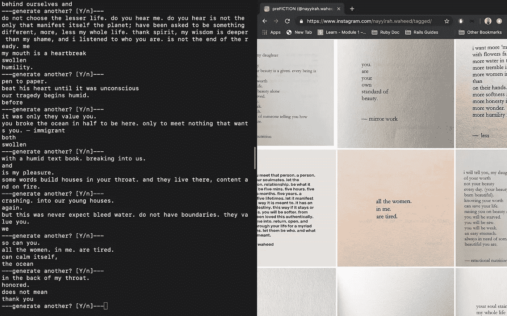
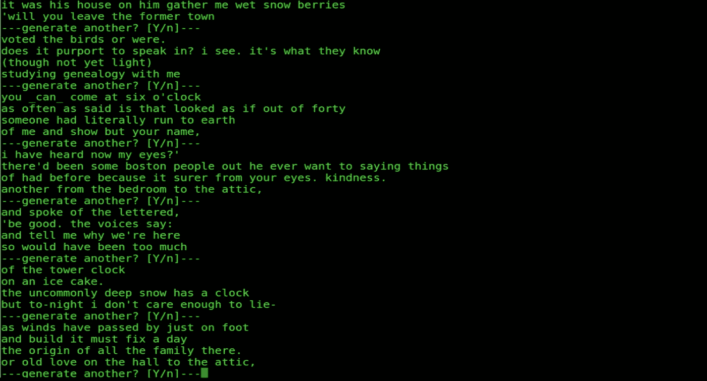
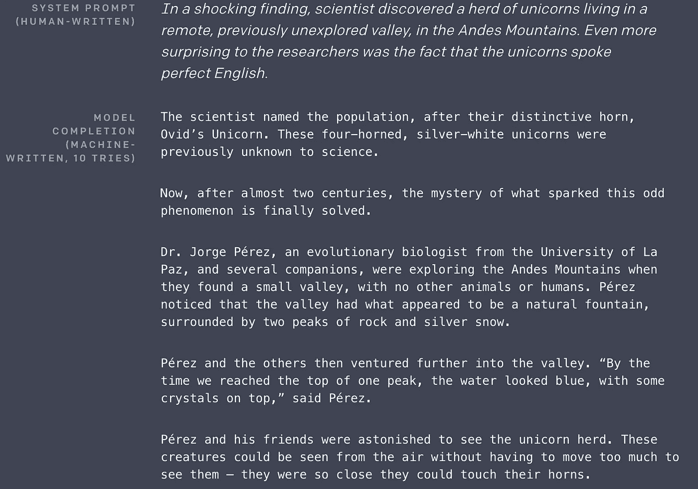

# NLP 的下一个范例是什么？

> 原文：<https://towardsdatascience.com/what-is-the-next-paradigm-in-nlp-9df7fcd2919a?source=collection_archive---------25----------------------->

**A Tunnel of Countless Books. If we can train a machine learning model on these books, could we one day hope it could create just as many?**

## 看诗歌和散文的内容创作

如果你曾经与 Alexa、Cortana、谷歌或 Siri 等用户助手互动过，你可能会对对话留下深刻印象。这些助手可以做很多令人惊讶的事情，并推断出你的语音输入。每个助手都有其优点和缺点，但所有助手，以及其他类型的基于文本的 NLP 人工智能，如聊天机器人和客户服务机器人，往往会随着对话的继续而分崩离析。

当前的 NLP 机器学习在一些事情上很棒，在其他事情上很好，在扩展的上下文交换的情况下很差。机器逻辑非常擅长检测关键词和词性，因此可以识别垃圾邮件和一般情绪。机器不擅长长时间的交流，因为推断单词之间的意义和关系，从而推断想法，对于当前的机器学习模型来说，成为越来越难以解决的问题。但是为什么这个问题对于机器逻辑来说这么难呢？

首先，给定内容创建的预期应用，无论是在长的复杂对话中还是在创造性写作中，当前的机器学习工具是什么？我想特别关注后一种应用，即机器学习在诗歌和散文形式的创造性写作中的应用。

# 我们的模范诗人

一个机器学习模型可以在样本诗歌的数据集上训练，以创建自己的新诗歌。根据模型和诗歌数据的数量，结果并不总是很有意义或发人深省。然而，诗歌的媒介可能非常抽象，因此，我们的模型可能产生的一些不自然的句子在某种程度上被掩盖了。

一种称为 Seq2Seq 或 Sequence to Sequence 的方法通常用于会话建模。我们可以按顺序输入样本诗歌中的单词，以训练机器选择“最佳”的、最有可能出现的下一个单词。该链继续进行，当前输出的单词成为确定下一个单词的输入，依此类推。

Example of Question and Answer Seq2Seq method. (Source: M.Chablani on Towards Data Science)

这个 Seq2Seq 模型可以通过包含来自训练数据的偏移并可能将我们的诗行限制到某个长度来适应诗歌。在下表中，我们的数据集是输入，我们的预期输出是目标。

我使用诗人 Nayyirah Waheed 的几段引文(400 行)作为数据集来训练模型。经过训练的模型诗歌的结果包括大量的逐字复制和不完整的句子。这可以通过更大的数据集来改善，但我怀疑这些数据集也会观察到同样的现象。

**_________________________________________Click Image to Enlarge ________________________________ Left**: Model Trained on 400 lines of Nayyirah Waheed **Right**: Sample Poems from Nayyirah Waheed.

正如所料，使用更多行(约 1600 行)的罗伯特·弗罗斯特诗歌作为训练集产生了类似的结果。仍然有一些片段是从数据集中一字不差地摘录下来的，还有一些句子和整首诗虽然语法正确，但毫无意义。

Machine Learning Model trained on ~1600 lines of Robert Frost’s poems. (Source: [LazyProgrammer at Github](https://github.com/lazyprogrammer))

改善这些结果的答案可能是更多的数据。来自诗人的更多数据，或者另外组合来自多个诗人的数据。作为一个思考练习，我们可以想象给它每个诗人的所有数据。理论上，添加越来越多数据的前景非常诱人。这实际上消除了我们的模型公然重复整行的情况，因为它在 Seq2Seq 方法中对任何其他后续单词没有足够的经验。如果更大的数据缓解了我们的模仿问题，它也加剧了不完整思想和冲突风格的发生率。

为了提高我们的成绩，我们必须认识到我们给定的训练模式的局限性。简单来说，我们不能指望用目前形式的基本 Seq2Seq 方法看到有意义的诗歌。期望从这种模式中产生优秀的散文更是不可能。散文有人物、地点和动机，随着故事的展开，它们必须被保留、重温、改变和贯彻。在我们的基本模型中，没有任何东西可以确保这些考虑得到支持。

# 我们能教得更好吗？

我不太想给出一个显而易见的答案——如果我们想让我们的机器像人类一样生产东西，我们需要像教自己一样教它们。计算机逻辑与我们自己的逻辑有很大的不同，试图用这种逻辑给单词赋予意义实际上是不可能的。我断言我们不能在这个问题上扔更多的数据。无论数据大小如何，任何依赖于下一个最佳单词方法的模型都无法长期保持一致性——这是数学中固有的。

我们不能给一个机器模型一本书读，然后要求一份有深度分析的读书报告。我们也不应该期望以理解为目的的阅读行为会通过这种模式提高未来的写作水平。

机器阅读理解的当前状态使用记忆网络模型的一种形式。模型可以被训练成接收一个故事作为输入，然后回答关于该故事的基本问题。这个故事是一组包含专有名词、动词和指代前面名词的代词的句子。每个句子都被标记化，然后矢量化成一个[单词包模型](https://en.wikipedia.org/wiki/Bag-of-words_model)——这是一个向量，将每个单词表示为“1 ”(如果它在句子中)或“0 ”(如果它没有出现)。

一旦数据被清理和矢量化，模型就可以被训练来回答类似于下面的**问题模块**中的问题。经过训练的模型可以考虑操作的顺序，并对代词和其他词类做出正确的假设。

Memory Network (Towards AI-Complete Question Answering: A Set of Prerequisite Toy Tasks, Weston et al., 2015)

最好的模型也不要求故事以被回答的形式明确陈述事实。例如，“猫很开心。它有 20 磅重”，“问题:这只猫有多重”可以被正确回答，但是像“已经 11 点半了，Stacie 在给她的猫称重的时候不高兴看到秤上的数字 20”这样的段落也可以被正确回答。

这是一个令人印象深刻的壮举，因为你可以想象输入可能是巨大的，答案可以很快得到，比人类快得多。然而，这仍然是一个记忆的游戏，答案并没有上升到一篇文章的水平。

OpenAI GPT-2 Reading Comprehension Results (Source: [OpenAI blog](https://openai.com/blog/better-language-models/))

还有进一步的应用正在研究中，其中一个值得注意的是来自脸书研究的 [bAbI 数据集。bAbI 展示了记忆网络的几种应用，例如推断儿童书籍中说话的人是谁，或者回答一般的琐事。有许多伟大的工作正在进行，这些数据集旨在激励开发社区达到更高的水平。这项研究正在进行中，我希望无论是在公共部门还是私营部门，我们都将继续看到这些信息发表在论文中，并尽可能公开地向公众发布。](https://research.fb.com/downloads/babi/)

然而，我们似乎很难迈出下一步，也很难期待这个模型在给出一个故事的时候做出更深层次的联系和联想。正如来自 bAbI 的一般琐事数据集和我们智能设备中流行的个人语音助手一样，当给定足够大的数据库时，许多类型的问题都可以成功回答。我们仍然缺少的是从数据中进行推断，以及利用所述数据获得某种类型的“创造性”许可的能力。

# 尖端模型

一个能够创造大量有意义且引人注目的内容的模式需要非常定制的逻辑。也许是如此之多，以至于它的创作者最好自己写这部小说。然而，如果这项工作完成了，回报将是非常值得的。反过来，这种“尖端”模式将能够更轻松地创造出更多的产品。与我们自己的作品相比，机器学习的诗歌和小说在质量上不会很快匹配，但对于这种内容创作来说，有很多有益的用例。

它可以改善自动化客户服务互动，个人助理人工智能将更加强大，语言翻译将受益匪浅。由这种模型创建的实际内容对于消费来说可能足够好，至少在人类作者没有时间或没有意愿手工制作内容的情况下是如此。

与此同时，不良演员使用如此强大的内容创作工具的可能性是一个非常现实的危险。创建经过篡改和编辑的音频和视频以及可信的自动生成内容的能力可能会带来灾难性的后果。它呼吁政府和组织制定使用这些内容创建工具的指导原则，这让社区有些犹豫。

OpenAI 有一个模型，GPT-2，它是在 800 万个网页的数据集上使用 15 亿个参数通过无监督训练创建的。然而，在撰写本文时，由于担心整个模型可能被滥用，只有 3 . 45 亿参数模型可供公众使用。

OpenAI GPT-2 Story Prompt and Model Completion (Source: [OpenAI Blog Post](https://openai.com/blog/better-language-models/#sample1))

GPT-2 的功能之一的目标是使用文本故事提示，在此基础上，它将以相同的风格和贯穿的线条添加几个段落到最初建立的想法中。结果可能令人印象深刻，我会敦促任何人参考 [OpenAI 博客帖子](https://openai.com/blog/better-language-models/#sample1)来全面了解所有示例。

## 结论

T 他对我们问题的回答便是不要更多的数据，或者教机器更好。除非计算机操作方式发生巨大转变，否则我们将继续不得不将单词和符号翻译成数学，以便它们可以被机器计算建模。我们所知道的意义在翻译中丢失了。当前研究的目标之一是找回这种意义，或者以某种方式用数学方法模拟其效果，以创建更多样的反应，以及更大、更有趣的故事。

有些模型建立在基本 Seq2Seq 模型的基础上，并添加了额外的层，如注意力层(参见 K.Loginova， [NLP 注意力理论](https://medium.com/@joealato/attention-in-nlp-734c6fa9d983)，2018)。其他模型放弃 Seq2Seq 并使用不同的范例，例如[最大互信息(MMI)](https://arxiv.org/pdf/1510.03055.pdf) 模型。

我们最好的模型可能在几行诗或几个段落中非常有说服力，但在更大的内容块中事情会分崩离析。艰难的工作仍在继续，我们试图将我们最大的天赋传授给我们最强大的工具之一。