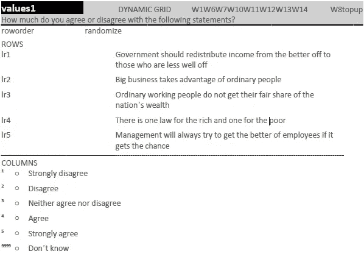

# 什么是右翼媒体？

> 原文：<https://towardsdatascience.com/what-is-the-right-wing-press-c3e7d21789ab?source=collection_archive---------20----------------------->

评论员和[普通民众](https://yougov.co.uk/topics/politics/articles-reports/2017/03/07/how-left-or-right-wing-are-uks-newspapers)对右翼媒体的定义如此宽泛——从《太阳报》,到《每日星报》、《每日邮报》、《每日快报》、《每日电讯报》,再到《泰晤士报》——这几乎是一个毫无意义的概念/屁声。有意义的分解会是什么样的？

很可能会涉及某种极其耗时的文本分析项目。但是你知道什么更容易/更快/更自由吗？查看英国人口的[大样本，其中已经包含了他们政治价值观的标准化衡量标准](https://www.britishelectionstudy.com/data-object/british-election-study-combined-wave-internet-panel/)，并按照他们最喜欢的报纸进行分组:

这个图是什么？这是一个等高线图，其中“高度”代表英国(投票年龄)人口的集中程度——蓝色越深，人口越多；浅蓝色，人少。红色的“x”代表该支线剧情中所有人的平均位置。我增加了 8 个“指南针”来帮助眼睛。每份报纸下面的(N=X)副标题显示了原始样本量——样本量越小，你就越不应该去解读这个分布。

这些轴是政治指南针。每个人都知道——或者认为他们知道——经济左/右意味着什么。但是社会自由主义者/保守主义者(又名自由主义者/威权主义者)又如何呢？这很复杂——与这些术语相关的常识既不是完全错误的，也不是完全正确的。以下是将人们放在这些尺度上的“标准”政治学问题[2](和这里的所有数据一样，都是由英国选举研究提供的):

将问卷数据转化为经济左-右/社会自由主义-保守主义量表的标准方法是将个人得分相加[3]。这对于大多数政治科学的需求来说很好，但是产生的分布既不是很好的高斯分布(钟形曲线)，也不是很好的分布，这使得可视化— [特别是比较不同的分布](https://twitter.com/MariosRichards/status/1098533076664283136) —变得很麻烦。

我所做的[4]是沿着每个轴平均分配——例如，图表最右边的 1/200 包含样本最右边的 1/200——图表的每个*垂直和水平切片包含英国选举研究中所有参与者的相应 1/200 切片[5]。如果两个坐标轴是完全独立的——这些坐标轴最初是由政治科学家创建的，以反映两个独立的政治因素——那么在一个图中绘制所有参与者的结果将是美丽而乏味的单色，因为图表上的每个位置都包含完全相同的人数:

很明显，这是一个技术上的失败(尽管从密集畸形的斑点向前迈进了一大步)。问题是这些轴大部分是独立的，但不是完全独立的。这既反映了问题[6]的某些方面，也反映了价值的实际分布。经济左派确实在社会层面比经济右派更加两极分化。

对于经济左翼人士来说，这是一个现实世界的问题。但是——更重要的是——这对我来说是一个可视化的问题，所以我将继续研究我是否可以通过从混合中添加/删除问题和/或直接最小化分布变形(自动面板跳动)的方法来合成性能更好的轴。

在那之前，恐怕你*必须*查看所有这些图表，同时努力记住基线分布有这三个集群——例如，《太阳报》读者群的平均位置正好在经济轴的中间——欧共体。左倾社会保守 blob 之所以被称为左倾社会保守 blob，是因为该象限中的人们聚集在左上角。《镜报》明显偏向《太阳报》的经济左派……但这只是因为较少的经济右派-社会保守派/较多的经济左派-社会自由派阅读它。

现在你知道所有这些了，下面是图表——作为一个动画幻灯片，分解为特定的“波”(投票进行的日期)。据我所知，没有真正有意义的趋势——但有一个非常便宜、简单的方法来了解这种方法有多稳定/要寻找什么:

那么，关于方法论主导的博客文章的开放式问题/脆弱的诱饵和开关？

你可以用这种方法将“右翼媒体”定义为经济权利(根据读者群)。但这使得太阳/恒星既不是 RWP(也不是 RWP)。

或者你可以用它来定义“右翼媒体”是社会保守派(根据读者数量)——但这意味着《镜报》变成了 RWP，《每日电讯报》变成了“两者都不是”，就像上面的《太阳报/星报》和《泰晤士报/金融时报》最终变成了“不是 RWP”。

我提议一个新的客观分类:

*   左图:每日镜报/记录
*   中天:太阳/恒星
*   《特快/每日邮报》
*   左图:卫报/独立报
*   右页:泰晤士报/金融时报
*   右-宽带:电报

显然，命名方案无疑是完美的，但是方法论呢？人们选择报纸不是出于个人政治以外的原因吗(例如电视版面)？当报纸改变立场时，那些坚持使用报纸的人呢？是啊，好吧…让我们看看你做得更好！

接下来:[大报/小报分裂是怎么回事？](/whats-up-with-the-uk-broadsheet-tabloid-split-80c9426c19fa?source=friends_link&sk=3328cdcdffae0cc7bf798451e4a12a8e)

推荐:如果你喜欢这个，你可能会更加喜欢[宝拉·苏瑞吉的博客](https://medium.com/@psurridge)

代码:[泛数据集值笔记本](https://github.com/MariosRichards/BES_analysis_code/blob/master/Pan-Dataset%20Values.ipynb)(警告:这个笔记本目前只是一个由黑客、死胡同和随机方法组成的巨大的未加注释的大杂烩——将尝试重构一些更干净的东西——而且我还没有集成进行多重插补的 R 代码)

数据:[pan _ dataset _ allr _ values . CSV](https://raw.githubusercontent.com/MariosRichards/BES_analysis_code/master/small%20data%20files/pan_dataset_allr_values.csv)(包括均匀分布和高斯分布版本以及所有 14 个波的 id 列

[1]使用学术标签显然是标签而不是描述(或者是明显过时的描述——你会坐在法国国王的哪一边?)有很多可说的。—它们已经成为标签)。

[2]有不同的说法，但它们不会“变化很大”，而且它们“倾向于”给出相同的答案。

[3]"强烈不同意"->0 …"强烈同意"-> 4，dk 由整个样本的平均值代替，al_scale=al1+al2+al3+al4+al5，lr _ scale = 20-(lr1+lr2+lr3+lr4+lr5)

[4]数据处理:用 nans 代替 DKs，对所有波的所有 BES al/lr 变量进行 Hmisc (R package)多重插补(一次一个)，然后进行 sparsePCA (python 模块 Sklearn ),得出将所有这些变量混合在一起的两个正交分量。然后我对它进行 box-cox (python Scipy stats)处理，得到高斯分布/使用 pandas qcut (python 模块)转换成离散的均匀分布。可视化是 Seaborn(基于 Matlplotlib 构建的 python 模块)使用 FacetGrid 和 kde 绘图。

[5]健康警告:我没有应用英国选举研究的人口统计权重，部分原因是“profile_newspaper”是跨所有波的变量，我知道他们将推出一些代码来生成适当的跨波权重。但主要是因为我使用的 python 模块，用它来构建这些图表很麻烦。这是可行的，但这是任务清单上的最后一项，从过去的经验来看，我知道它不能解决块状分布的问题/产生巨大的视觉差异。

[6]lr1——再分配——与教育/社会自由主义密切相关——这就是为什么大多数政治罗盘风格的分析给人的印象是没有经济右翼社会自由主义者，因为他们对再分配的支持使他们自动转变为经济中心社会自由主义者。随着供给的扩大，看起来这已经成为这种分析的一个问题——所以从经济左派的定义中去掉“支持再分配”有一个奇怪但合理的理由！

[7]如果你知道一个好的、正式的方法来做到这一点，请联系我——出于某种原因，我总是找不到正确的谷歌关键词——最好是一个功能性的 python 模块！