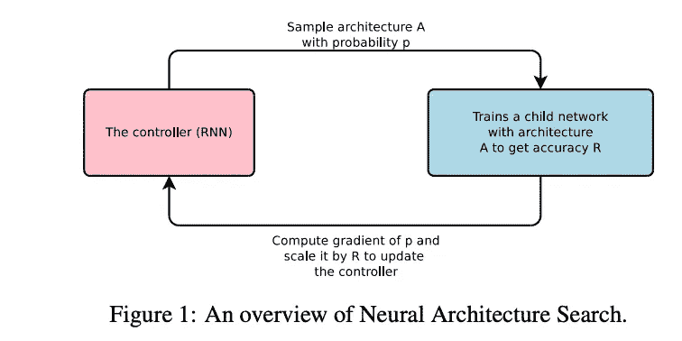
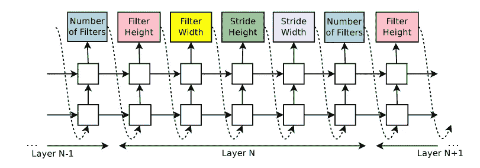
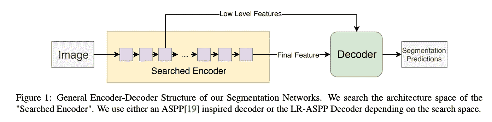
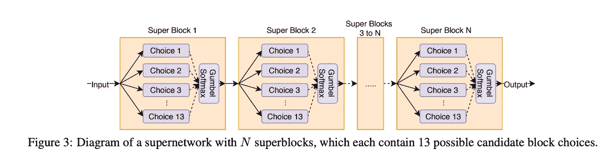

# DeepScale 背后的技术是什么？

> 原文：<https://towardsdatascience.com/what-is-the-technology-behind-deepscale-b40f05fe7423?source=collection_archive---------25----------------------->

## 特斯拉最新收购的公司拥有设计 DNNs 的最佳技术

# 问题是

深度学习正在接管世界，但最具性能的模型正在变得越来越大。这些大型网络需要大量的资源，不仅在电力和使用方面，而且它们需要大量的能量和时间来产生我们想要的结果。

对于处于边缘并产生巨大结果的计算，需要更小的网络。网络越小，获得结果的速度越快，所需的资源也就越少(GPU 数量也就越少)。

为了产生更好的结果，已经开发了一些用较小的网络产生更好结果的技术。他们中的一些人在拥抱脸的博客文章中描述，在那里他们描述了他们如何提取最新版本的 Bert，这是 NLP 任务中表现最好的神经网络。

**DeepScale** 使用另一种技术来寻找小型但仍能产生良好结果的神经网络。DeepScale 执行神经架构搜索。神经架构搜索有望显著减少开发全新神经网络所需的工程时间和计算时间，该网络针对特定计算要求和错误率(或精度要求)进行了优化。

# 解决方法

*   该问题被定义为在某些搜索空间中找到计算和准确性的最佳折衷的网络
*   您可以改变层数、通道数、内核大小、连接数等..

如果你要搜索每一个神经网络，那么搜索空间变得难以训练在这个搜索空间中创建的每一个神经网络，如果每个神经网络都有几个选项的话。

为了找到正确的神经网络，研究人员尝试了一些不同的技巧来实现正确的神经网络架构。研究人员用一些不同的策略优化了搜索过程，这些策略有不同的选项:

*   随机搜索
*   遗传搜索
*   **强化学习**
*   **差分搜索**(基于梯度)

在这篇文章中，我们将回顾最后两种搜索方法，强化学习和差异搜索，因为它们目前是在有限的计算资源下提供最佳结果的方法。

## 强化学习

开创该领域的第一批工作之一是谷歌大脑的一篇论文，名为“具有强化学习的神经架构搜索”。这里可以找到[。](https://arxiv.org/pdf/1611.01578.pdf)

The left image shows the controller that will update the network parameters

其背后的思想是，通过使用强化学习循环来发现网络，以提升具有最佳准确性且使用最少计算量的网络。通过使用控制器找到网络，该控制器是基于 RNN 的网络。

通过改变过滤器的数量、高度、宽度、步幅等来生成网络。该过程通过生成神经网络、训练它、获得它的准确性并将其用作控制器的反馈来生成更好的候选。

使用这种技术，谷歌团队取得了比当时最先进的技术(SOTA)稍好的结果，但它使用的计算量非常大。它使用了 800 个 Nvidia K40 GPUs 天，或 50 万个 GPU 小时。该搜索是在一个小数据集上执行的，因此很难看出它在更大的数据集上会如何执行。

**限制搜索**

同一个小组没有在所有可能的网络中进行搜索，而是决定将搜索限制在每个小区上，即他们固定了网络拓扑并对每个小区进行搜索。结果要好得多。在 ImageNet1000 上，最终网络的准确性提高了 20%,速度提高了 28%。

为了搜索神经网络，这个小组使用了更少的资源。他们使用了大约 5 万个 GPU 小时。在此设置中，所有单元格都是相同的。这仍然计算量太大，不切实际。

## 差异搜索

在准确性和计算资源方面的最佳结果是由脸书的一个小组发现的，该小组使用差分搜索来找到正确的架构。他们的把戏背后的想法是使用一个非常大的网络，其中包含许多更小的实验(内部)，而不是让一个控制器产生小实验来学习。

该小组使用了基于梯度的随机超网，双重优化网络的卷积权重以及选择单个单元的参数。它使用 [Gumbel-Softmax](http://anotherdatum.com/gumbel-gan.html) 从分类分布中采样，该分类分布由架构参数的学习参数加权。Gumbel-Softmax 技巧是一种寻找神经网络参数的方法，其中我们有一组离散的值，并且您想要执行反向传播。要了解它是如何工作的，我推荐阅读以下内容

 [## 疯狂的神经网络！他们现在可以从离散分布中取样了！

### 训练深度神经网络通常归结为定义你的模型的架构和损失函数，并且…

anotherdatum.com](http://anotherdatum.com/gumbel-gan.html) 

脸书团队在一个超级网络上进行训练，以找到网络的权重，并在 ImageNet 或 ImageNet1000 的 10%子集上进行训练。

结果令人印象深刻。他们在 ImageNet 分类上实现了 MobileNetV2 的准确性，同时延迟降低了 1.5 倍。搜索成本仅为 216 GPU (P100)小时。

# 深度扩展解决方案

DeepScale 采用了类似的方法来应用 NAS(神经架构搜索)来设计用于语义分割的 DNNs。语义细分被自动驾驶汽车公司广泛使用。

图像分割比图像分类难多了。它需要更多的竞争资源。对于图像分类，最先进的神经网络的计算资源范围约为 10 GFLOPs，而对于图像分割，SOTA 网络约为 1 TFLOPs。

DeepScale 使用与 FBNet 相同的技术创建了一个用于图像分割的神经网络，它达到了 SOTA 精度，并且性能更好。他们对网络的编码器进行了神经架构搜索。

下面是 DeepScale 的实现细节

**SqueezeNAS 实施细则:**

*   22 层每单元 13 个候选(10 个⁴可能网络)
*   随机初始化超级网络，仅训练卷积权重，然后切换到交替模式。

超级网络收敛后:

*   通过 Gumbel-Softmax 技巧对候选网络进行采样
*   在城市景观验证集上运行每个采样候选网络
*   让最优秀的候选人接受全面培训

在所有这些之后，DeepScale 选择了给定网络精度和计算资源的最佳网络。DeepScale 发现网络具有最佳性能，并且需要较少的计算资源来实现这些结果，例如，与 MobileNetV2[40]分段网络相比，他们的 SqueezeNAS-MAC-Large 网络实现了超过 2.5%的绝对 mIOU，而 mobilenetv 2[40]分段网络的 MAC 是其网络的两倍以上。

每个网络的 DeepScale 搜索在不到 15 GPU-day 的时间内被找到，这比一些强化学习和遗传搜索方法少 100 多倍。

# 结论

总而言之，对于希望实现 SOTA 结果并且同时需要很少计算资源的神经网络来说，神经架构搜索似乎导致了最好的结果。我们可能会在这个领域看到越来越多的创新，从而产生更好的网络。