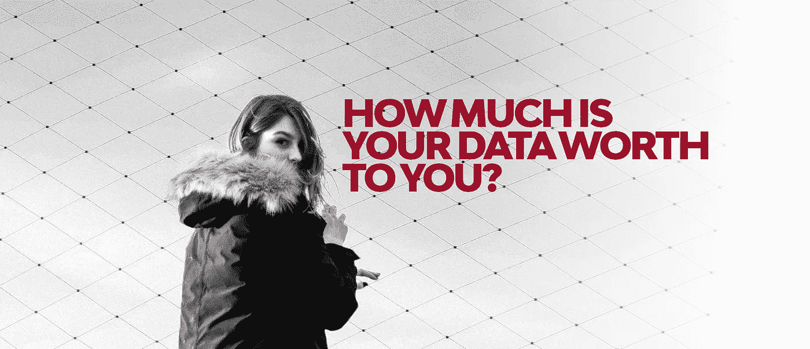
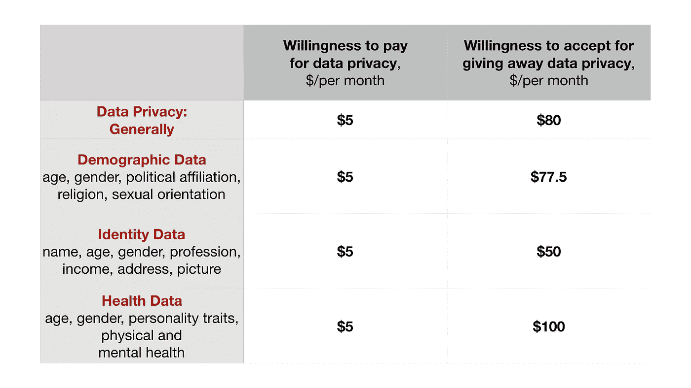
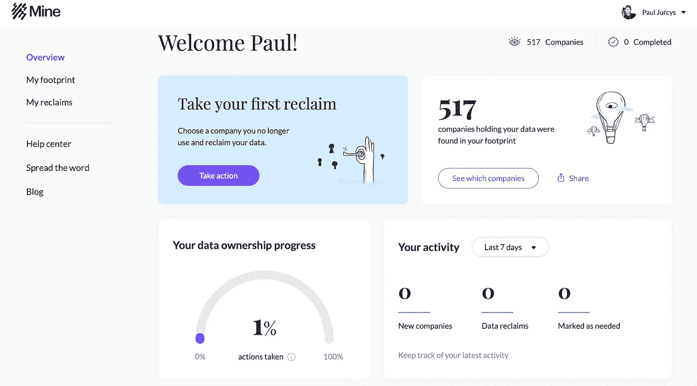
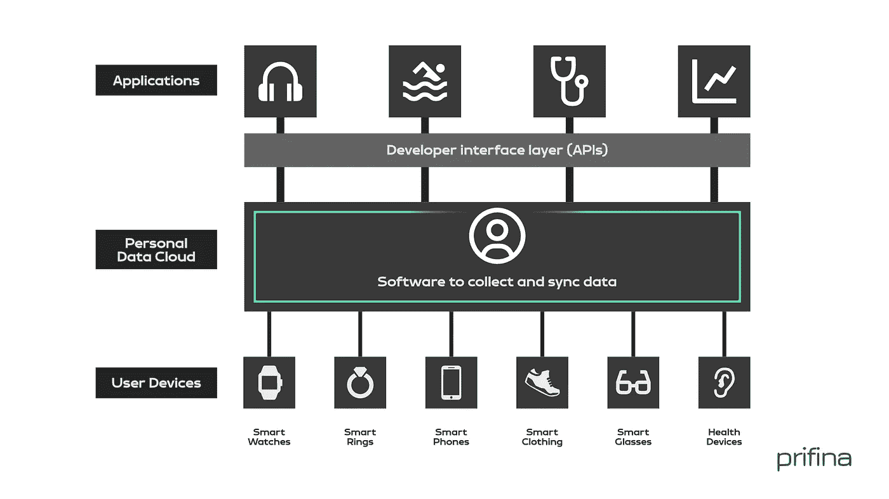

# 你的数据有什么价值？

> 原文：<https://towardsdatascience.com/what-is-the-value-of-your-data-9341cd019b4d?source=collection_archive---------20----------------------->

## 以下是最新的研究表明了我们对个人数据价值的看法。

如今，数据被称为石油、血管或商业基石。有人还形容数据是我们时代的钻石。然而，这是一种分布极不均衡的资产。一些科技巨头，如脸书、谷歌和亚马逊，被认为是数据巨兽，知道我们每个人的一切。他们的整个商业模式是基于他们产品的个人用户的数据:身份，位置数据，在线购买，交易历史，甚至个人偏好。

# ***你的数据对公司的价值***

数据市场的规模很难量化。一些主要的在线服务平台每年花费数十亿美元从第三方获取客户数据。在线服务公司之间数据交换的价值取决于各种参数，如人口统计数据、个人身份信息、家庭状况、财务信息和个人活动。

关于个人的基本数据(例如，年龄、性别和位置)仅值每人 0.0005 美元(即每千人 0.50 美元)。个人的财务信息(如最近的支付历史或健康信息)更有价值。以[脸书](https://www.bloomberg.com/opinion/articles/2019-01-31/facebook-users-should-be-free-to-sell-their-personal-data)为例，一个活跃用户的数据对脸书的平均价值约为每月 2 美元。

从 FTC 和 Equifax 之间的和解中可以找到用户数据对公司价值的另一个标志。2019 年 7 月，Equifax 同意为 2017 年数据泄露支付 5.25 亿美元的赔偿，该数据泄露了个人信息(姓名、生日、地址、社保号码等。)的 1.47 亿个人。这一结算金额意味着每个人将有权获得最低 125 美元的[支出](https://www.wired.com/story/equifax-settlement-money-will-get/)。

英国《金融时报》准备了一个交互式[计算器](https://ig.ft.com/how-much-is-your-personal-data-worth/#axzz2z2agBB6R)，帮助计算个人数据对营销人员的价值。这个计算器提供了一个机会，可以更深入地了解营销人员收集的信息:人口统计、家庭背景、资产净值、健康状况、网上购物以及活动。然而，它并不包含营销人员收集的数以千计的更具体的个人资料。(当你发现你的私人数据可能不值一美元时，不要感到惊讶)。

© Paulius Jurcys & Daniel Ali

# ***如何评估个人物品的价值？***

即使一个人的数据对公司来说没有什么价值，你可能对你的个人信息对你的价值有一个稍微不同的看法。当涉及到个人详细信息、出生日期、社会安全号码等关键数据时尤其如此，更不用说个人财务信息和健康记录了。

然而，如何估计个人数据对每个人的实际价值呢？一些有用的方法可以在研究人类行为和决策的经济学家进行的文献和实证研究中找到。估算某样东西对你来说值多少钱最常用的方法之一是问两个问题:

1.  ***你愿意支付多少钱来获得该物品？*** (支付意愿，WTP)，以及
2.  ***你想用多少钱来换取你拥有的物品*** (接受意愿，WTA)？

*示例 1:咖啡杯。支付意愿和接受意愿的“简单”例证可以是咖啡杯。在一个实验中，参与者得到一个 6 美元的杯子，然后给他们一个机会卖掉它或者换一个同等价值的东西(钢笔)。事实证明，一旦实验参与者确定他们拥有这个杯子，他们出售这个杯子的意愿大约是他们愿意支付的两倍。(换句话说，接受意愿和支付意愿的比例是 2:1。)*

*例 2:门票。*另一个“更难”的例子与门票售罄有关。假设你花 200 美元买了一张 NCAA 四强赛的门票，门票已经售罄。你是其中一个球队的狂热球迷，你愿意支付高达 500 美元的门票。现在你在网上了解到，更富裕或更绝望的粉丝出价 3000 美元。你会卖吗？如果你是大多数持有门票售罄的球迷之一，你不会出售。行为经济学家进行的一项实证研究表明，参与者的假设售价(接受意愿，WTA)比他们的假设买价(接受意愿，WTA)高 14 倍。

## ***前景理论及其含义***

这两个例子提供了关于人们赋予不同商品多少价值的有用教训。首先，买卖意愿取决于一个简单的事实:个人是否拥有该物品。如果一个人拥有这张票，他的决定会受到放弃这张票的痛苦的影响。如果这个人没有票，那么他/她会考虑得到票的满足感。这也被称为“前景理论”前景理论还声称，个人更喜欢保持现状——我们认为不放弃我们拥有的东西会让我们过得更好。这种对现状的偏好是厌恶损失的结果。

第二，愿意为获得一个杯子或一张你最喜欢的比赛门票而付费，这两者之间的价值差异，与你可能希望通过赠送你已经拥有的物品而获得的价值不同。这是因为厌恶损失:放弃一张票比得到一张同样好的票更痛苦。

第三，支付意愿和接受意愿突出了不同类别商品之间的对比:即，为交换而持有的商品(例如，你购买鞋子的预算)和为使用而持有的商品(例如，门票)。此外，WTP 和 WTA 表明，不同的个人往往倾向于赋予相同的商品不同的价值。

# ***重视个人数据:最新研究***

有可能应用相同的 WTP-WTA 方法来确定人们对他们的私人数据赋予多少价值。7 月，两位哈佛学者安吉拉·温格尔和卡斯·桑斯坦发表了他们的研究结果，其中 2416 人被问及一系列关于他们有多重视个人数据隐私的问题。

主要发现很简单:普通参与者愿意为隐私支付相对较少的费用(每月 5 美元)，但要求放弃隐私的费用要高得多(每月 80 美元)。更具体地说，参与者被问及他们愿意支付多少钱来保护他们的一般数据隐私以及他们的人口统计、身份和健康数据(支付意愿，WTP)。他们还被问及愿意为泄露自己的数据隐私得到多少补偿(愿意接受，WTA)。以下是他们的发现:

应该注意的是，在 Winegar/Sunstein 的研究中，63 名受访者对他们的数据隐私给出了极高的估价(每月超过 25，000 美元)。28 人表示他们的 WTA 为每月 100 万美元或以上，3 人表示他们的 WTP 为每月 100 万美元或以上。上表中的数字是基于 Winegar/Sunstein 通过将 WTP 和 WTA 超过 25，000 美元的响应限制在 25，000 美元来标准化响应所做的调整，因为作者认为参与者实际上不太可能愿意和能够支付该金额。

最近在 2022 年夏天进行的一项研究表明，个人消费者给他们的数据贴上了异常高的价格标签。在美国的这五个州，个人数据被赋予了最大的价值:

1.科罗拉多州:2820 美元。内布拉斯加州:2784 美元
3。怀俄明州:2347 美元
。明尼苏达州:2202 美元
5。俄克拉荷马州:2016 美元

# ***资效数据隐私***

在行为经济学文献中，人们更有可能保留他们拥有的物品，而不是获得他们不拥有的物品，这一发现被称为“禀赋效应”。这个概念术语是由诺贝尔奖获得者理查德·塞勒在 1980 年创造的，他注意到当人们面临维持现状和接受替代方案之间的选择时，他们会倾向于选择风险较小的保持现状。咖啡杯和活动门票的例子是捐赠效应的经典例证。

在 Winegar/Sunstein 识别的个人数据的情况下，16:1 的比率非常高。事实上，这是文献中已知的最高 TWP-WTA 比率之一。在支付意愿和接受意愿之间存在明显差异的其他例子在环境商品的情况下已经被注意到，如保护濒危物种(10:1)或清洁空气。

诺贝尔奖经济学家丹尼尔·卡内曼曾经指出，“当你‘出售’重要的捐赠基金可能会让你为糟糕的结果负责时，你的不情愿就会急剧增加”。对于数据隐私来说，这似乎尤其正确。Winegar/Sunstein 认为 16:1 的比率表明了数据隐私的“超禀赋效应”。

Winegar/Sunstein 研究中的受访者愿意只支付 5 美元来获取隐私的一个可能原因是，他们认为自己已经拥有了自己的数据。提供数据访问权限的价格(愿意接受的程度)要高出数倍的原因是，人们认为他们的个人数据具有巨大的价值。此外，仅仅是有人可以访问他们的私人数据的想法似乎就令人愤慨——因此，非常多的人愿意接受。

另一个需要考虑的因素是，人们是否真正理解网上收集的个人数据。不了解第三方收集了哪些数据，就不容易确定个人数据的实际价值。因此，人们可能想知道 WTP-WTA 分析是否恰当。

这也经常表明，人们并不真正关心他们的私人数据和数据隐私。Winegar/Sunstein 的 5 美元支付意愿调查结果支持了这一假设。然而，从行为经济学的角度来看，另外两点可能有助于更好地理解这一范式。首先，人们可能会过于乐观，希望自己的个人数据不会被滥用。其次，关于是否放弃数据隐私的选择，消费者可能会低估长期风险，而强调短期收益，包括访问社交媒体平台和网站(“当前偏见”)。

这就是我们现在的处境。最近通过的法规，如欧洲的 GDPR 或加利福尼亚州的 CCPA，为关于个人数据的价值以及如何公平使用个人数据的讨论增添了动力。

# 构建新的数据经济

GAFA(谷歌、苹果、脸书和亚马逊)目前在消费市场的主导地位带来的一个不幸后果是，个人对这些平台运营商如何访问和使用数据几乎没有控制权。理论上，我们有权知道平台运营商和应用开发者访问和收集了哪些数据，他们如何使用这些数据，以及他们是否与其他任何人分享这些数据。我们也可以要求他们停止跟踪我们，甚至删除所有关于我们的数据。

一些公司帮助消费者行使他们的数据隐私权。自从采用 GDPR 以来，我们已经看到了帮助消费者管理其同意的各种服务的增长。这种服务将显示有多少公司和数据经纪人在跟踪你并收集你的数据(对于普通消费者来说，这种公司的数量通常超过数百家。例如，下面是 SayMine 的截图，它是可以帮助我“控制”我的数据的公司之一。可以看到截止到今天，517(！)服务提供商和数据经纪人跟踪我的在线活动:

© Paul Jurcys

从上面的截图中，您还可以注意到，我没有使用这项服务提供的任何工具(部分原因是我已经调整了我的手机和笔记本电脑跟踪设置，以便暴露我的最小信息)。

> 但真正的问题是，我们如何用消费者的数据赋予他们权力？有没有一种方法可以超越用户生成数据的短期和事务性方法，并创建一种环境，使您的数据成为一种资产，为您带来长期价值？

当我们思考数据经济的未来时，我们不应该试图重新发明轮子。事实上，在互联网的早期，一个主要的想法是，它是由不同用户操作的计算机的去中心化网络。这是史蒂夫·乔布斯和苹果公司的早期愿景:

> “苹果公司成立时，主张‘这是个人电脑。这是你自己的数据。…随着世界的发展，[我们]一直认为…您创建的数据，您用计算机做的事情，都是您的，应该在您的控制之下。您应该知道您的数据发生了什么。"—克雷格·费德里基(苹果)

因此，当我们考虑互联网的下一次迭代(如果你愿意，可以称之为 Web 3.0)时，我们应该回到起点，重新想象如何在用户端捕捉数据的价值。一种可能的实际实施是以用户为中心的用户持有数据方法，用户可以在他们的个人数据云中收集数据，并从他们自己的数据中获取日常价值:

© Paulius Jurcys

在[以用户为中心、用户持有的数据环境](https://medium.com/prifina/getting-value-with-user-held-data-cc7f518d96b4?sk=04dc2471db9130915b6249b5dbfb5652)，个人可以从不同的数据源收集数据——不仅是你的在线账户(如网飞或谷歌的活动历史)，还可以从你的可穿戴设备上收集实时数据。在新兴的用户持有数据生态系统中，您将能够下载在您的数据之上运行的应用程序(即，在您的个人数据云中，而不是在某个集中式服务器中)。

最有趣的发展发生在从你的可穿戴设备中产生价值的领域:如果你可以结合来自不同设备的数据，获得关于你的健康和趋势的独特见解，并改善你的习惯，过上更健康和快乐的生活，会怎么样？

## 你可以在这里阅读更多关于这个的。

# 与我联系并保持联系

我是数据技术公司 Prifina 的联合创始人。你可以在 [Twitter](https://twitter.com/MyPrifina?source=post_page---------------------------) 、 [LinkedIn](https://www.linkedin.com/company/prifina/?source=post_page---------------------------) 上关注我，或者加入我们的[脸书](https://www.facebook.com/groups/557824668309572/)群。你也可以探索我们的 Github:“[Liberty。平等。数据。](https://github.com/libertyequalitydata)