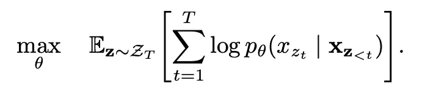
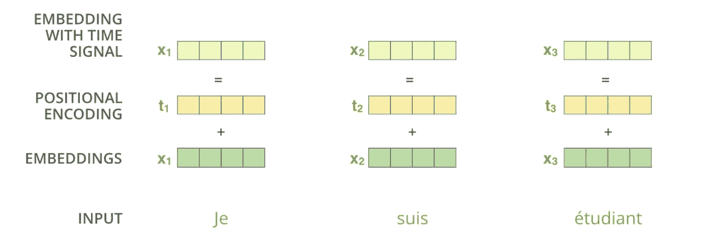
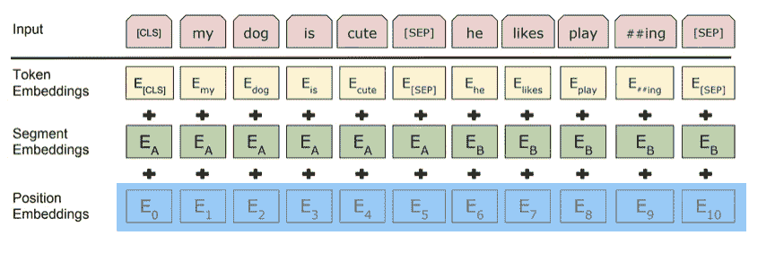
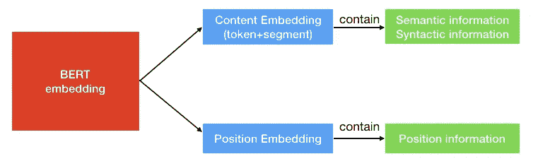
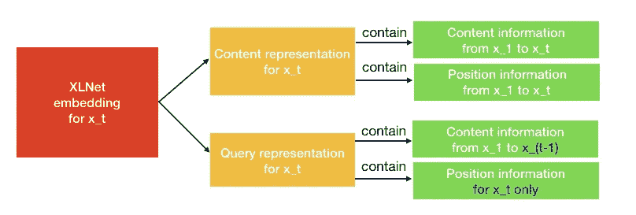
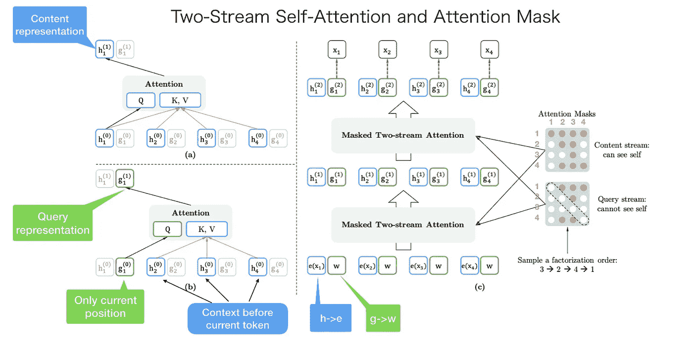

# XLNet 中的双流自我关注是什么

> 原文：<https://towardsdatascience.com/what-is-two-stream-self-attention-in-xlnet-ebfe013a0cf3?source=collection_archive---------6----------------------->

## 直观理解 XLNet 中的双流自我关注


Photo by [Hendrik Cornelissen](https://unsplash.com/@the_bracketeer?utm_source=unsplash&utm_medium=referral&utm_content=creditCopyText) on [Unsplash](https://unsplash.com/search/photos/stream?utm_source=unsplash&utm_medium=referral&utm_content=creditCopyText)

在我之前的帖子[什么是 XLNet，为什么它优于 BERT](/what-is-xlnet-and-why-it-outperforms-bert-8d8fce710335) 中，我主要讲了**XLNet(AR 语言模型)和 BERT (AE 语言模型)的区别**和**置换语言建模。**

我相信对 XLNet 有一个直观的理解远比实现细节重要，所以我只解释了**置换语言建模**而没有提到另一个重要的部分**双流自关注**架构。但是正如陈家明在[评论](https://link.medium.com/OXsOM5ZlcY)、**中提到的，双流自我关注是 XLNet 论文中的另一个亮点，**所以我写了这篇文章来尽可能清晰地解释双流自我关注。

内容结构如下。

*   置换语言建模快速回顾
*   排列带来了哪些问题？
*   伯特有这样的问题吗？
*   XLNet 如何解决这个问题？
*   注意屏蔽:XLNet 如何实现置换？

# 快速回顾**置换语言建模**

特殊术语:

*   AR 语言模型:自回归语言模型
*   AE 语言模型:自动编码器语言模型

为了让本帖更加独立，这里我简单总结一下[什么是 XLNet，为什么它的表现优于 BERT](/what-is-xlnet-and-why-it-outperforms-bert-8d8fce710335) 。

XLNet 提出使用**置换语言建模**到**使 AR 语言模型从双向上下文中学习。**通过这种方式，可以避免 AE 语言模型中 MASK 方法带来的弊端。

排列方法是得到一个序列的排列，并使用前面的`t-1`记号作为上下文来预测第 t 个位置记号。例如，我们有一个句子`[x1, x2, x3, x4]`，`x3`是我们想要预测的第 t 个位置标记。首先，我们得到句子的排列。

```
[('x1', 'x2', 'x3', 'x4'),
 ('x1', 'x2', 'x4', 'x3'),
 ('x1', 'x3', 'x2', 'x4'),
 ('x1', 'x3', 'x4', 'x2'),
 ('x1', 'x4', 'x2', 'x3'),
 ('x1', 'x4', 'x3', 'x2'),
 ('x2', 'x1', 'x3', 'x4'),
 ('x2', 'x1', 'x4', 'x3'),
 ('x2', 'x3', 'x1', 'x4'),
 ('x2', 'x3', 'x4', 'x1'),
 ('x2', 'x4', 'x1', 'x3'),
 ('x2', 'x4', 'x3', 'x1'),
 ('x3', 'x1', 'x2', 'x4'),
 ('x3', 'x1', 'x4', 'x2'),
 ('x3', 'x2', 'x1', 'x4'),
 ('x3', 'x2', 'x4', 'x1'),
 ('x3', 'x4', 'x1', 'x2'),
 ('x3', 'x4', 'x2', 'x1'),
 ('x4', 'x1', 'x2', 'x3'),
 ('x4', 'x1', 'x3', 'x2'),
 ('x4', 'x2', 'x1', 'x3'),
 ('x4', 'x2', 'x3', 'x1'),
 ('x4', 'x3', 'x1', 'x2'),
 ('x4', 'x3', 'x2', 'x1')]
```

然后我们选择一些样本作为训练数据。(在论文中，它从排列中随机选择样本)

```
('x1', 'x2', 'x4', 'x3'),
('x1', 'x4', 'x3', 'x2'),
('x2', 'x3', 'x4', 'x1'),
('x4', 'x2', 'x3', 'x1'),
('x3', 'x2', 'x4', 'x1'),
```

我们可以看到**每一个令牌都有机会出现在 x3** 之前。因此 AR 模型可以从这些上下文标记中学习双向信息。如果你仍然不清楚排列，你可以阅读以前的帖子。

# 排列带来了哪些问题？

排列可以让 AR 模型从两个方向看到上下文，但也带来了原 transformer 无法解决的**问题。**



permutation language modeling objective

*   **Z** :因式分解顺序
*   p_θ:似然函数
*   x_zt:因子分解顺序中的第 t 个记号
*   x_t 的 x_z

This is the objective function for permutation language modeling, which means takes t-1 tokens as the context and to predict the t-th token.

There are two requirements that a standard Transformer cannot do:

1.  to predict the token x_t, the model should only see the **位置**，而不是 x_t 的**内容**(我会在下一节解释什么是**内容**)
2.  为了预测标记 x_t，模型应该将 x_t 之前的所有标记编码为**内容**



graph from [Illustrated Transformer](http://jalammar.github.io/illustrated-transformer/)

尤其是第一个要求，transformer 将位置编码合并到令牌嵌入中。因此它不能将位置信息从令牌嵌入中分离出来。

# 伯特有这样的问题吗？

BERT 是一个 AE 语言模型，它不像 AR 语言模型那样需要单独的位置信息。与 XLNet 需要位置信息来预测第 t 个令牌不同，BERT 使用[MASK]来表示要预测哪个令牌(我们可以认为[MASK]只是一个占位符)。例如，如果 BERT 使用 x2，x1 和 x4 来预测 x3，则 x2，x1，x4 的嵌入包含位置信息和其他与[MASK]相关的信息。所以模型有很大几率预测到[MASK]是 x3。



这里我将对**信息**进行更详细的解释。BERT 嵌入(BERT 学习的信息)包含两种信息，**位置信息，和内容信息**(我只是为了简单起见把它分成两部分)。



位置信息很容易理解，它告诉模型当前令牌的位置。内容信息(语义和语法)包含当前令牌的“含义”。你见过的一个直观的例子是`kind — man + woman = queen`。

# XLNet 如何解决这个问题？

XLNet 提出**双流自关注**解决问题。



顾名思义，包含两种自我关注。一个是**内容流关注**，也就是《变形金刚》里的[标准自关注](http://jalammar.github.io/illustrated-transformer/)。另一个是**查询流关注。XLNet 引入它来代替 BERT 中的[MASK]标记。**

例如，如果 BERT 想用上下文单词 x1 和 x2 的知识来预测 x3，它可以使用[MASK]来表示 x3 标记。[掩码]只是一个占位符。而 x1 和 x2 的嵌入包含了帮助模型“知道”[MASK]是 x3 的位置信息。

来 XLNet 事情就不一样了。一个令牌 x3 将服务于两种角色。当它被用作内容来预测其他令牌时，我们可以使用内容表示(通过内容流注意力学习)来表示 x3。**但如果要预测 x3，应该只知道它的位置，不知道它的内容。**这就是为什么 XLNet 使用**查询表示**(通过查询流注意学习到的)来**保留 x3 之前的上下文信息，只保留 x3 的位置信息。**

为了直观地理解双流自我关注，我们可以只认为 **XLNet 用查询表示代替了 BERT 中的【MASK】。他们只是选择不同的方法来做同一件事。**

# 注意屏蔽:XLNet 如何实现置换？

当我第一次读到这篇论文时，我无法停止对训练中排列的实现细节的好奇。所以如果你感兴趣的话，我会说一点。

在第一部分“排列语言建模的快速回顾”中，我给出了一个例子，一个句子`[x1, x2, x3, x4]`的排列如下所示。

```
[('x1', 'x2', 'x3', 'x4'),
 ('x1', 'x2', 'x4', 'x3'),
 ('x1', 'x3', 'x2', 'x4'),
 ('x1', 'x3', 'x4', 'x2'),
 ('x1', 'x4', 'x2', 'x3'),
 ('x1', 'x4', 'x3', 'x2'),
 ('x2', 'x1', 'x3', 'x4'),
 ('x2', 'x1', 'x4', 'x3'),
 ('x2', 'x3', 'x1', 'x4'),
 ('x2', 'x3', 'x4', 'x1'),
 ('x2', 'x4', 'x1', 'x3'),
 ('x2', 'x4', 'x3', 'x1'),
 ('x3', 'x1', 'x2', 'x4'),
 ('x3', 'x1', 'x4', 'x2'),
 ('x3', 'x2', 'x1', 'x4'),
 ('x3', 'x2', 'x4', 'x1'),
 ('x3', 'x4', 'x1', 'x2'),
 ('x3', 'x4', 'x2', 'x1'),
 ('x4', 'x1', 'x2', 'x3'),
 ('x4', 'x1', 'x3', 'x2'),
 ('x4', 'x2', 'x1', 'x3'),
 ('x4', 'x2', 'x3', 'x1'),
 ('x4', 'x3', 'x1', 'x2'),
 ('x4', 'x3', 'x2', 'x1')]
```

非常容易让人误解我们需要获取一个句子的随机顺序，并输入到模型中。但这不是真的。输入句子的顺序是`[x1, x2, x3, x4]`，而 **XLNet 使用注意掩码来置换因式分解的顺序。**



句子的原顺序是`[x1, x2, x3, x4]`。并且我们随机得到一个因式分解顺序为`[x3, x2, x4, x1]`。

左上角是内容表示的计算。如果我们想要预测 x1 的**内容表示，我们应该拥有所有 4 个令牌内容信息。`KV = [h1, h2, h3, h4]`和`Q = h1`。**

左下角是查询表示的计算。如果我们想预测 x1 的**查询表示，我们无法看到 x1 本身的内容表示。`KV = [h2, h3, h4]`和`Q = g1`。**

右角是整个计算过程。我自下而上解释。首先将`h`和`g`初始化为`e(xi)`和`w`。并且在内容屏蔽和查询屏蔽之后，双流关注会输出第一层输出`h^(1)`和`g^(1)`然后计算第二层。

**注意右边的内容掩码和查询掩码。**两者都是矩阵。在内容蒙版中，第一行有 4 个红点。这意味着第一个令牌(x1)可以看到(注意到)所有其他令牌，包括它自己(x3- > x2- > x4- > x1)。第二排有 2 个红点。意味着第二个令牌(x2)可以看到(注意到)两个令牌(x3- > x2)。其他行依此类推。

内容掩码和查询掩码**的唯一区别**是查询掩码中的那些**对角线元素为 0，这意味着令牌看不到它们自己。**

我们总结一下。输入的句子只有一个顺序。但是我们可以使用不同注意力掩模来实现不同的分解顺序。

# 摘要

在这篇文章中，我主要解释了 XLNet 面临的问题是什么，以及如何使用双流自我关注来解决它。我还提到了一些关于置换的注意屏蔽的实现细节。至于结果对比，可以找 XLNet 团队的[最新帖子](https://medium.com/@xlnet.team/a-fair-comparison-study-of-xlnet-and-bert-with-large-models-5a4257f59dc0)，比论文做了更公正的对比。

> ***查看我的其他帖子*** [***中等***](https://medium.com/@bramblexu) ***同*** [***一个分类查看***](https://bramblexu.com/posts/eb7bd472/) ***！
> GitHub:***[***bramble Xu***](https://github.com/BrambleXu) ***LinkedIn:***[***徐亮***](https://www.linkedin.com/in/xu-liang-99356891/) ***博客:***[***bramble Xu***](https://bramblexu.com)

# 参考

*   论文:[https://arxiv.org/abs/1906.08237](https://arxiv.org/abs/1906.08237?source=post_page---------------------------)
*   实现:[py torch _ transformers/modeling _ xlnet . py](https://github.com/huggingface/pytorch-transformers/blob/master/pytorch_transformers/modeling_xlnet.py)
*   [什么是 XLNet，为什么它的表现优于 BERT](/what-is-xlnet-and-why-it-outperforms-bert-8d8fce710335)
*   [论文解析:【XLNet:面向语言理解的广义自回归预训练】讲解](https://mlexplained.com/2019/06/30/paper-dissected-xlnet-generalized-autoregressive-pretraining-for-language-understanding-explained/)，这主要讲的是 transformer-xl。
*   [XLNet 和 BERT 与大型模型的公平比较研究](https://medium.com/@xlnet.team/a-fair-comparison-study-of-xlnet-and-bert-with-large-models-5a4257f59dc0)
*   [XLNet:运行机制及和 Bert 的异同比较](https://zhuanlan.zhihu.com/p/70257427)
*   [XLNet 原理](http://fancyerii.github.io/2019/06/30/xlnet-theory/)