# 什么是小波，我们如何在数据科学中使用它

> 原文：<https://towardsdatascience.com/what-is-wavelet-and-how-we-use-it-for-data-science-d19427699cef?source=collection_archive---------2----------------------->

source: [https://ak6.picdn.net/shutterstock/videos/28682146/thumb/1.jpg](https://ak6.picdn.net/shutterstock/videos/28682146/thumb/1.jpg)

你好，这是我关于信号处理主题的第二篇文章。目前，我有兴趣学习更多关于信号处理的知识，以理解某篇论文。而且老实说对我来说，**这个小波的东西比傅里叶变换**更难理解。当我对这个话题有所了解后，我意识到了一些事情。如果我用正确的循序渐进的学习过程来学习这个题目，我理解这个**会更快。所以，这里的正确的一步一步在我看来。**

# 小波的概念

所以首先我们需要理解为什么我们需要小波。**小波解决了傅立叶变换的不足**。这就是为什么在理解小波之前，最好先理解傅立叶变换。但是总结一下，**傅立叶变换是实信号和各种频率的正弦波**之间的点积。

source: [https://towardsdatascience.com/insight-to-the-fourier-transform-and-the-simple-implementation-of-it-eee293317efd](/insight-to-the-fourier-transform-and-the-simple-implementation-of-it-eee293317efd)

通过傅立叶变换，我们得到了真实信号的频谱。我们获得了**频率统计，但是我们不知道“频率”何时发生，我们失去了真实信号的时间分辨率**。

为了获得频率和时间分辨率，我们可以**将原始信号分成几个部分，并对每个部分应用傅立叶变换**。这种技术被称为**短时傅立叶变换**。但是这种方法带来了新的问题。当在部分信号中应用短时 FFT 时，它可以捕捉的频率仅为 n/2，其中 n 是部分信号的长度，假设部分信号的持续时间为 1 秒。

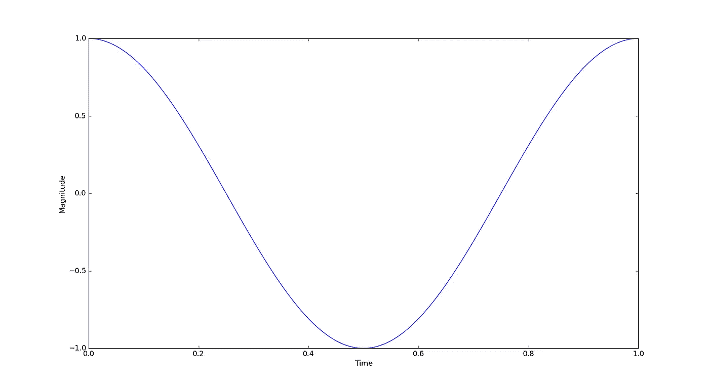

The minimum frequency we can catch with such a window, 1 Hz

因此，**你无法捕捉到频率低于 1 赫兹的信号的信息**(假设信号的总持续时间超过 1 秒，但请记住，当你使用 python 中的某个模块(即 numpy)进行 FFT 时，无论原始信号的持续时间是多长，它总是假设信号的持续时间是 1 秒)。

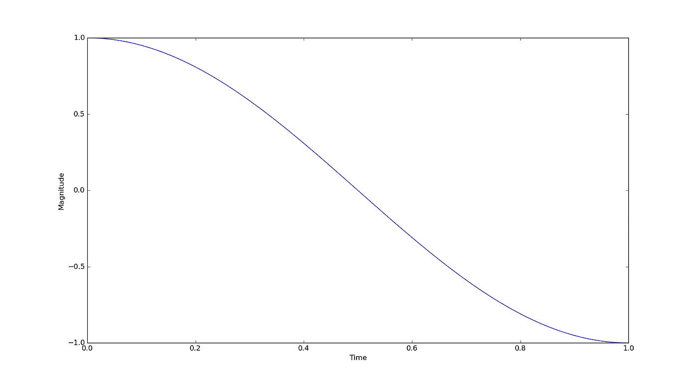

We can't catch a wave with a frequency below 1 Hz (in the picture, a 0.5 Hz wave)

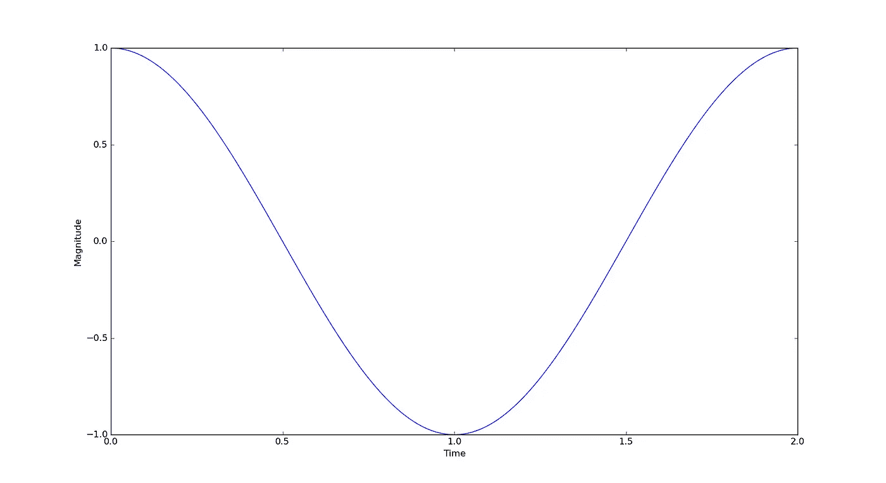

To catch such a wave, we need a bigger window

总之，我们需要一个更大的时间窗口来捕捉低频，而更小的窗口来捕捉高频，这就是小波的概念。

# 小波公式的一般形式

小波的基本公式是

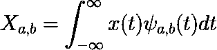

Actually, this is similar to the formula of the Fourier Transform. You can think of the integral as a sigma.

其中 X 是实信号，ψ是任意母小波，a 是尺度，b 是平移(X 当然是处理后的信号)。比例**与窗口大小相同。**这里的插图使用了 Morlet 小波**。**

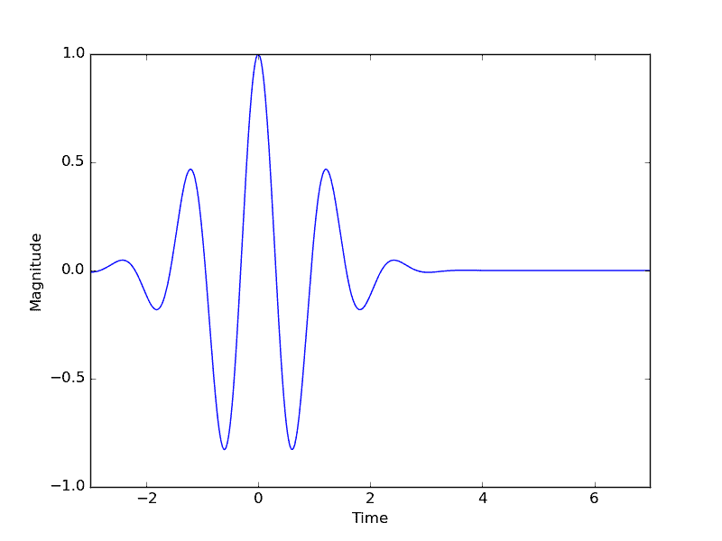

Illustration of how the mother wavelet expand when the scale gets bigger and bigger

“窗户”在哪里？**母小波的非零幅度是我们正在寻找的“窗口”**。任何乘以零的数字都等于零，因此“窗外”的真实信号将被抵消**。尺度**与母小波(窗口)的频率成反比。记住，**较大窗口的目标是较低的频率**。**这类似于傅立叶变换**，因为我们在实信号和某个波(任意母小波)之间做点积。

**翻译过来就是我们从起点**开始“滑动”窗口多远。

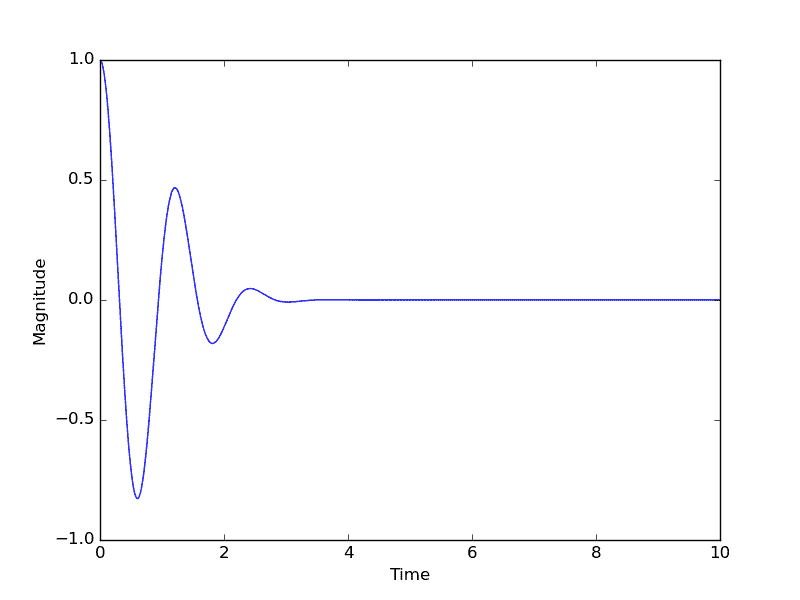

Illustration of how the mother wavelet slide when the translation value increase

因此，我们可以将上面的公式改写为

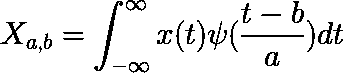

总之，Morlet 小波的方程是

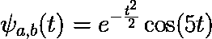

或者我们可以把这个等式改写成

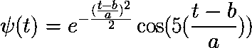

这里的另一个新名词是任意母小波？等等，什么？武断？是的，**小波有很多种母小波，你可以定义一个新的**(当然需要满足几个条件)！这就是傅立叶变换和小波变换的巨大区别，**傅立叶变换只有一种变换，而小波变换可以有多种变换**(变换种类的可能性是无限的)。

# 小波变换的种类

一般来说，基于小波变换如何处理缩放和平移，小波变换的类型被分成两类:

**连续小波变换**

CWT 是一种小波变换，其中**我们可以任意设置尺度和平移**。属于连续小波变换的一些常用母小波是:

*   Morlet 小波

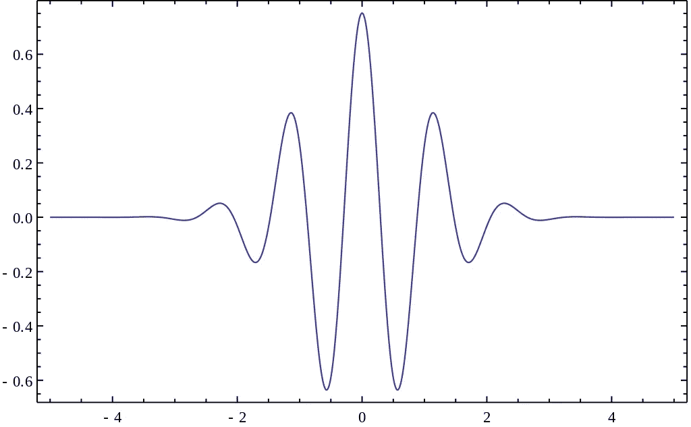

*   迈耶小波

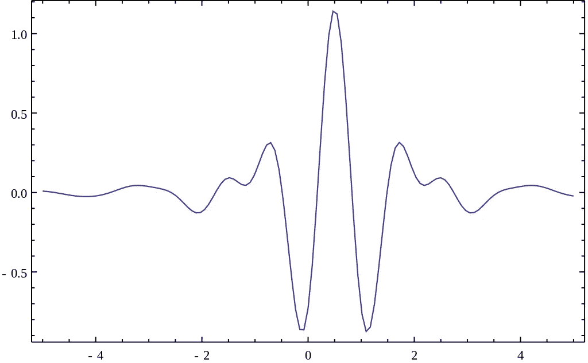

*   墨西哥帽小波

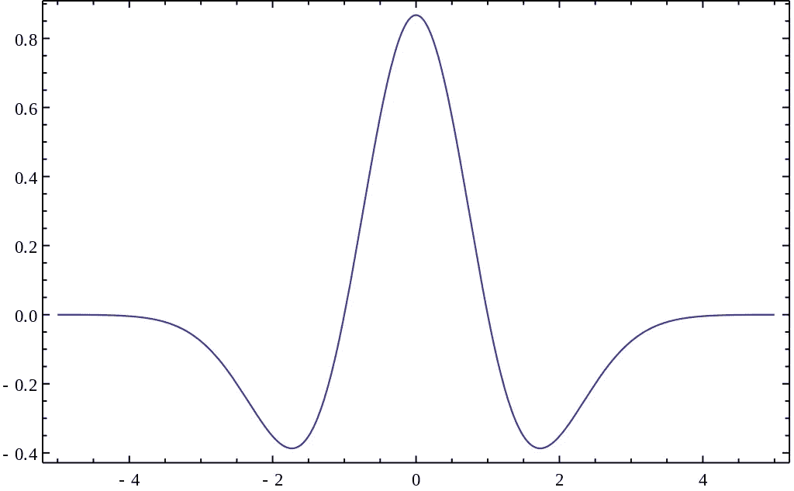

连续小波变换通常用于产生标度图。

**离散小波变换**

DWT 是一种小波，**限制尺度和平移**的值。这种限制就像比例是以 2 的幂递增的(a = 1，2，4，8，…)，平移是整数(b = 1，2，3，4，…)。小波变换的母小波类型不同于连续小波变换。DWT 上常用的母小波如下。

*   哈尔小波

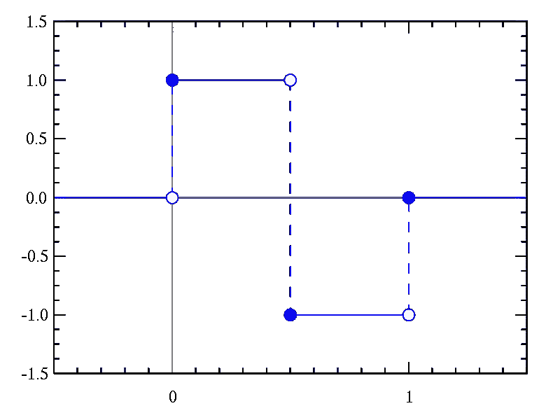

*   Daubechies 小波

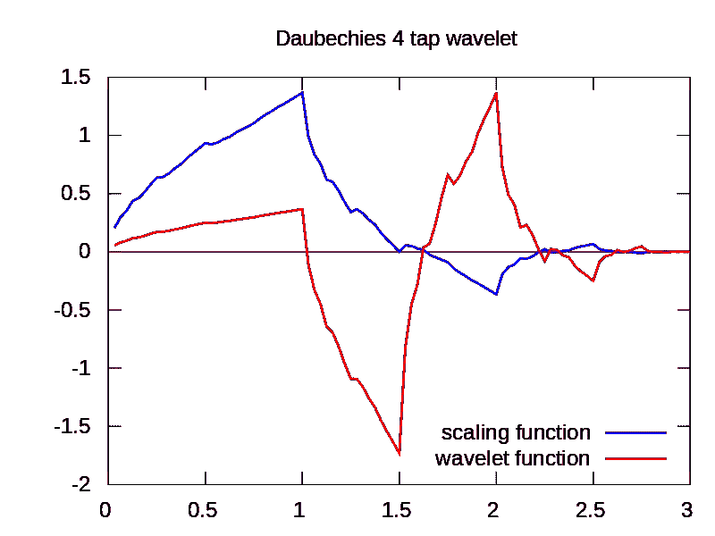

Daubechies 小波具有独特的缩放限制。它有一个称为父小波的尺度函数来确定正确的尺度。

小波变换通常用于对真实信号进行去噪。我们可以用 DWT 来**分解实信号，去掉噪声部分，重新组合**。如何才能知道噪音部分？经常在测量中(测风用风速计，测地震用地震仪)，**测量中的噪声是快速变化的**。**快速变化意味着高频率**这就是它的工作原理。我们可以使用 DWT 对计算机中的数据进行压缩，就像图像一样。它是如何工作的？以图像为例，去噪的情况也差不多。我们去除图像中在 x 轴或 y 轴上颜色快速变化的部分。

这就是小波及其应用的解释。**每个母小波都有自己的应用**。你不需要学习所有的母小波。用就用，学你需要的，实用主义！

参考资料:

[https://www.mathworks.com/help/wavelet/ref/morlet.html](https://www.mathworks.com/help/wavelet/ref/morlet.html)2019 年 5 月 19 日进入

[https://en.wikipedia.org/wiki/Wavelet](https://en.wikipedia.org/wiki/Wavelet)2019 年 5 月 19 日接入

[https://en.wikipedia.org/wiki/Scaleogram](https://en.wikipedia.org/wiki/Scaleogram)2019 年 5 月 19 日进入

[https://en.wikipedia.org/wiki/Haar_wavelet](https://en.wikipedia.org/wiki/Haar_wavelet)2019 年 5 月 31 日进入