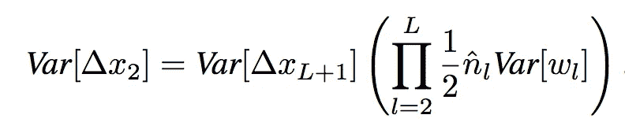
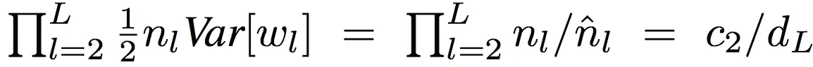

# 为什么谨慎初始化深度神经网络很重要？

> 原文：<https://towardsdatascience.com/what-is-weight-initialization-in-neural-nets-and-why-it-matters-ec45398f99fa?source=collection_archive---------7----------------------->

## 明凯初始化背后的数学。

Careful weight initialization expedites the convergence of neural nets. (photo by [@kimzy](https://unsplash.com/photos/LNDgBERq8Q0) on unsplash)

## 介绍

深度学习最近的成功很大一部分归功于 **ReLU** 激活功能。它在图像分类问题的深度细胞神经网络方面取得了最新的成果。在这篇博客中，我们将讨论一种鲁棒的权重初始化方法，它有助于更快地收敛更深层次的神经模型。**何等**在 [**深入钻研整流器**](https://arxiv.org/abs/1502.01852) 论文(2015)中提出了这种方法。

这篇博客的灵感来自于 [Fast.ai](https://www.fast.ai/) 的《程序员深度学习》课程，第二部分，由[杰瑞米·霍华德](https://twitter.com/jeremyphoward)在 USF 教授。

## 神经网络中的参数

神经网络的参数包括权重和偏差。这些数字首先被随机初始化。然后我们的模型学习它们，这意味着我们在反向过程中使用梯度来逐渐更新它们。

初始化参数最普遍的方法是使用**高斯分布**。该分布的平均值为 0，标准差为 1。

[Bell Curve](https://www.graphpad.com/guides/prism/7/curve-fitting/reg_how_to_gaussian.html)

如果 **m** 是输入尺寸并且 **nh** 是隐藏单元的数量，那么权重可以被初始化为:

random weight initialization in PyTorch

## 为什么准确的初始化很重要？

*深度神经网络很难训练。*随机初始化参数，太小或太大都会有问题，而反向传播梯度一直到初始层。

当我们初始化权重过小时会发生什么(<1)? Their gradient tends to get smaller as we move backward through the hidden layers, which means that neurons in the earlier layers learn much more slowly than neurons in later layers. This causes minor weight updates. This phenomenon is called ***消失渐变问题，其中权重消失为 0*** *)。*

如果我们初始化的权重太大(> 1)怎么办？梯度在较早的层中变得更大，这导致超过最小值的极高权重更新。这就是 ***爆炸梯度问题，权重爆炸到无穷大(* NaN *)*** *)。*这两种情况都使得神经网络难以收敛。

下面是 **Gloriot 等人**在论文[中进行的实验的图像，理解训练深度前馈神经网络](http://proceedings.mlr.press/v9/glorot10a/glorot10a.pdf)的困难。作者考虑了具有标准初始化的 5 层深度的神经网络。他们从正态分布初始化随机权重(0 均值和 1 方差)。

0 peak increases for higher layers (layer 4 and 5).

上图描述了随着训练的进行(从第 1 层到第 5 层的正向传递),所有激活值的平均值在最后一层变得更小(消失到 0)。在第 5 层，它们几乎为 0。

0 peak decreases towards the end.

我们反向计算梯度，从第 5 层到第 1 层。对于第一层，所有的梯度几乎消失了。
不好的初始化真的会阻碍高度非线性系统的学习。由于随机初始化，第一层丢弃了关于输入图像的大部分信息。因此，即使我们广泛地训练后面的层，它们也没有足够的信息从输入图像中学习。

仔细的权重初始化防止了这两种情况的发生，并导致深度神经网络的更快收敛。

## 输入数据的预处理

当输入数据居中(平均值为 0，标准差为 1)时，神经网络工作得最好。因此，当输入值乘以权重值时，它们的激活程度保持在 1 级。它是做什么的？它有助于神经网络的优化。因为隐藏的激活功能不会那么快饱和。因此在学习早期不会给出接近零的梯度。

## ReLU —整流器线性单元

[ReLu](https://ailephant.com/glossary/relu-function/) Function Graph

*ReLU 是一个非线性* ***激活*** *功能。ReLU 的定义是，*

[source](https://pouannes.github.io/blog/initialization/)

ReLU in PyTorch

## 使用 ReLU 激活的优势-

1.  ReLU 解决了爆炸和消失渐变问题，因为它为所有大于 0 的输入输出 1 的恒定渐变

a derivative of ReLU([source](https://pouannes.github.io/blog/initialization/#bringing-forward-propagation-and-backward-propagation-together))

2.这使得神经网络学习速度更快。并且还加快了训练过程的收敛。

3.ReLU 比传统的 sigmoid 单元更快地给出更好的解决方案。

明凯等人(1)通过谨慎地对 ReLUs 的非线性进行建模，导出了一种合理的初始化方法，这种方法使得非常深的模型(> 30 层)收敛。

## 正向传播

正向传递由来自与 ReLU 非线性耦合的顺序矩阵乘法(在层的输入和权重之间)的激活组成。其输出被传递到执行类似操作的连续层。

对于每个卷积层 l，响应在等式(1)之下，

linear equation for convolutional layer l

in python

在哪里

1.  x_l = x_l 是 **n 乘-l** 向量。( **_l** 到此表示*下标 l* 起。)
    x 是 **k x k(长、宽)**和 **c** 输入**通道**的一个**输入**图像。
    我们假设图像是正方形(l=b)。
    n 是输出中**激活**的次数。 **n= k c**
    如果 f 是前一层(l-1)的激活函数，我们有

1.  W_l = d 乘 n 个**权重**矩阵，其中 **d** 是**滤波器**的个数。n 是 x 的长度，即 n = k**c。当前层 l 的通道与前一层(l-1)的滤波器相同。**

1.  b_l =偏置的矢量**(初始化为 0)**
2.  y_l =权重和输入矩阵相乘并加上偏差后的结果向量。

**假设**

1.  W_l 和 x_l 中的元素相互独立，共享同一分布。
2.  x_l 和 w_l 相互独立。

**卷积层为什么执行线性运算？**

另外，如果您想知道卷积层如何像线性层一样执行线性方程。Conv 层做卷积。但是如果你关注马修·克莱恩史密斯的博客。你会明白卷积只是矩阵乘法，如下所示。

Convolutions are simply matrix multiplications.

现在回到我们的方程，如果我们求线性方程(1)的方差，我们得到方程(2)

a variance of linear Eqn. (1)

其中 y_l，w_l，x_l 分别是 **y_l，W_l，x_l** 中每个元素的随机变量。我们假设 w_l 零均值。代入方程。(2)我们将自变量乘积的方差作为等式。(3)

但是我们是如何做到这一点的呢？对于相互独立的随机变量 **x_l** 和 **W_l** 。我们可以用期望的性质来证明这一点

[source](https://www.jefkine.com/deep/2016/08/08/initialization-of-deep-networks-case-of-rectifiers/)

由于 w_l 的平均值为 0，即 **E[w_l]=[E[w_l]] =0**
这意味着在上述等式中。(A)，★评估为零。然后我们只剩下

使用方差公式

以及 E[w_l]=0 的事实我们可以得出 **Var[w_l]=E[w _l]。** 有了这个结论，我们就可以替换方程中的 E[w _l]了。(B)用 Var[w _ l]得到，

抓住你了。通过替换等式。转换成等式。(2)我们得到方程式。(3)

让我们把重点放在 E[x _l]项上。这里 E()代表给定变量的期望值，也就是它的均值。但是低于等式。不成立

除非 x_l 的均值为零。x_l 不能有 0 均值，因为它是前一层(l-1)的 ReLU 激活函数。

如果我们进一步假设 w(L1)在 0 附近具有对称分布，并且 b(L1)= 0。那么 y(L1)具有零均值，并且在零附近具有对称分布。所以现在我们有下面的等式。(4)当 f 为 ReLU 时。

为什么 ReLU 在输出中加入标量 1/2？

对于 ReLUs 家族，我们有通用的激活函数，

其中，
1) y_i 是第 I 个通道上非线性激活 f 的输入，
2) a_i 是控制负部分斜率的系数。

**ReLu** 是 a_i=0 时得到的。合成激活函数的形式为 f(y_i)=max(0，y_i)。

ReLU 激活是一个零阈值，它使网络具有稀疏表示。例如，在权重的统一初始化之后，大约 50%的隐藏单元连续输出值是实零。

Relu 丢失了大量信息(被零值替换),这影响了积极的数据压缩。要保留数据，您可以使用 PRelu 或 LRelu，它们将 a_i 的斜率添加到轴的负侧，

ReLu 激活函数只保留正半轴值，所以我们有

将其代入等式(3)，我们得到等式。(5)作为

现在我们有了一个等式。具有层 l 的激活和层(l -1)的激活。将 L 层放在一起，从最后一层 ***L*** *，*开始，我们得到下面的乘积作为等式。(5)

**注** : x_l 是网络的输入，这就是为什么上面的等式。从 l = 2 开始。这个产品是初始化设计的关键。适当的初始化方法应该避免指数地减小或放大输入信号的幅度。因此，我们希望我们的产品采取适当的标量(如 1)。
正向传递的充分条件(1) 为

这导致零均值高斯分布，其标准偏差为

我们也初始化 bias，b = 0。
对于第一层(l = 1)，我们应该只有 n_1Var[w_1] = 1，因为没有对输入应用 ReLU，所以我们不需要将输入减半。小因子 1/2，如果只是存在于一层也无所谓。

## 反向传播

反向过程是从最后一层到第一层反向计算的梯度。
对于反向传播，卷积层 l 的梯度由等式 1 给出。(6)

the gradient of convolutional layer l

在哪里，

1.  Ŵ是一个 c_l-by- n̂_l 矩阵，其中滤波器以反向传播的方式重新排列。请注意，W_l 和 Ŵ可以互相改造。
2.  x 是 c_l 乘 1 的向量，表示层 l 的像素处的梯度。
    **【x = ∂e/∂x】**
3.  y 表示 d 通道中 k 乘 k 的协同定位像素(长 x 宽),并被整形为 k 乘 1 的向量。**∮y = ∂e/∂y.**
    我们用以下等式表示响应中的连接数

no. of activations

在反向投影过程中，我们在网络中反向移动，所以下面的等式不成立。

**假设**

1.  w_l 和 y_l 相互独立，包含正态分布的随机数。
2.  当 w_l 由围绕零的对称分布初始化时，x_l 对所有 l 的均值为零。

在反向传播中，

其中 f′是激活函数 f.
的导数对于 **ReLU** 的情况，f′(y _ l)是零或一，它们的概率相等。Pr(0)=1/2，Pr(1)=1/2

a derivative of ReLU

我们再次假设 f′(y _ l)和 x_(l+1)是相互独立的。
正如我们在等式中看到的。(4) ReLU 将标量 1/2 加到其输出上。因此，我们有

还有，因为δy _ l 有一个零均值，f′(y _ l)= f′(y _ l)。通过取方程平方的期望值

我们得到下面的等式。在这里，标量 1/2 是 ReLU 的结果。

然后我们计算方程中梯度的方差。(6):

将 L 层放在一起，方差(⇼x _ L)为等式。(7)

我们必须定义一个**充分条件(2)** 来确保梯度不是指数地大/小。

注意，反向传播和正向传递的唯一区别是我们有 **n̂_l** 而不是 **n_l** 。
k 为图像尺寸，d 为输入通道。

当前层 c_l 的通道与前一层 d_(l-1)的滤波器相同。

此外，该条件满足零均值高斯分布，其标准偏差为，

对于第一层(l = 1)，我们不需要计算 x1，因为它代表图像。单个层的因素不会使整个产品呈指数级变大/变小。

使用条件(1)或(2)来使神经模型收敛而没有爆炸/消失梯度是安全的。

假设我们替换等式(2)中的条件。(7)我们得到

然后在方程中。(5)

要寻找的常数不是标量 1，而是 c2/dL。即网络开始和结束时的信道数量。这不是一个使神经网络面临爆炸或消失梯度问题的递减数字。根据作者，该方程适当地缩放向前和向后通道，使得神经网络有效地收敛。

## Xavier 初始化

Xavier 和 Bengio 早些时候提出了“Xavier”初始化，这种方法的推导是基于激活是线性的假设。这个假设对于 relu 是无效的。明凯和 Xavier 初始化之间的主要区别在于明凯处理 ReLU 非线性。Xavier 方法使用下面的条件，该条件从标准分布初始化权重

这里，I 只不过是我们的层索引 l。当根据 **Xavier 的归一化初始化**在网络中上下移动时，保持激活和反向传播梯度稳定的归一化因子是

Xavier’s Normalized Initialization

我们可以使用 PyTorch 中的 Xavier 公式

## 结论

下图比较了泽维尔和明凯初始化方法与 ReLU 非线性的收敛性。在 22 和 30(27 conv，3 fc)层深度神经网络。

no.of epochs vs error rate in 22 layers deep neural model with ReLU ([source](https://arxiv.org/pdf/1502.01852.pdf))

正如我们所看到的，两种 init 方法都有助于 22 层深度神经网络的收敛，而使用 ReLU。但是明凯比泽维尔更早开始降低错误率。

no.of epochs vs error rate in 30 layers deep neural model with ReLU activation

正如我们所看到的，只有明凯初始化方法能够使深度模型收敛。Xavier 的方法完全停止了学习，梯度逐渐减小，导致完全没有收敛。

下面是如何使用明凯初始化策略初始化权重

torch.nn 使用下面的公式来演示明凯初始化

用-
1 初始化有两种模式。**扇入**(缺省)-在正向传递中保持权重的大小。
2。**扇出** —保留后向通道中权重的大小。

我们使用扇出，因为我们需要反向传播梯度是稳定的。明凯初始化对于更深层次的校正神经网络是必须的。

希望你喜欢。

## 参考

1.  [深入研究整流器:在 ImageNet 分类上超越人类水平的性能，明凯等人，微软，2015 年](https://arxiv.org/pdf/1502.01852.pdf)
2.  [理解训练深度前馈神经网络的困难，Glorot 等人，蒙特利尔大学，2010 年](http://proceedings.mlr.press/v9/glorot10a/glorot10a.pdf)
3.  [Pierre Ouannes，深度神经网络如何初始化？泽维尔和明凯初始化，2019 年 3 月 22 日](https://pouannes.github.io/blog/initialization/)
4.  [詹姆斯·德林杰](https://towardsdatascience.com/@jamesdell)，[神经网络中的权重初始化:从基础到明凯的旅程](/weight-initialization-in-neural-networks-a-journey-from-the-basics-to-kaiming-954fb9b47c79)
5.  Jefkine，[深网初始化](https://www.jefkine.com/deep/2016/08/08/initialization-of-deep-networks-case-of-rectifiers/) [整流器案例](https://www.jefkine.com/deep/2016/08/08/initialization-of-deep-networks-case-of-rectifiers/)，2016 年 8 月 8 日