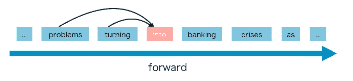
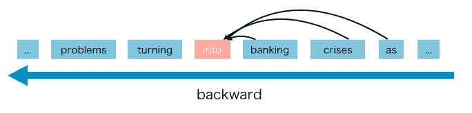
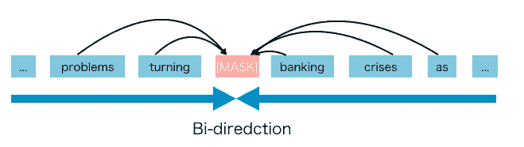
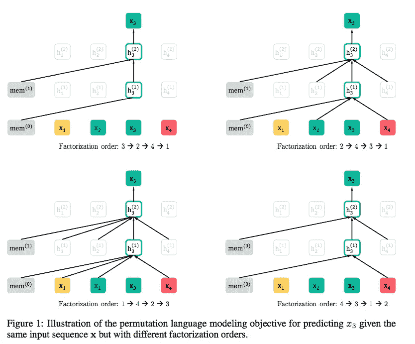
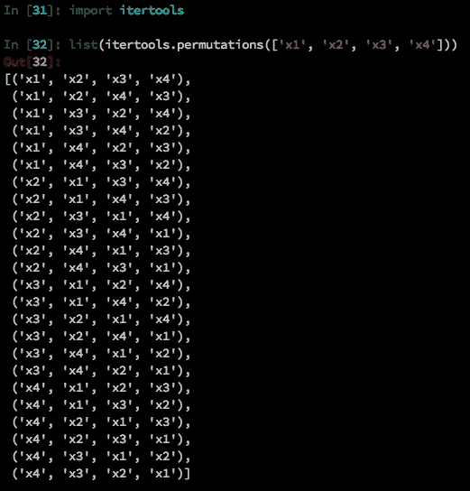
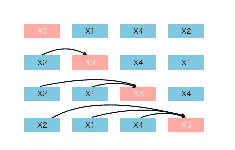

# 什么是 XLNet，为什么它的性能优于 BERT

> 原文：<https://towardsdatascience.com/what-is-xlnet-and-why-it-outperforms-bert-8d8fce710335?source=collection_archive---------1----------------------->

## XLNet 基础知识直观了解 XLNet 和 BERT 的区别


Photo by [Richard Cohen](https://unsplash.com/@rickyc678?utm_source=unsplash&utm_medium=referral&utm_content=creditCopyText) on [Unsplash](https://unsplash.com/t/wallpapers?utm_source=unsplash&utm_medium=referral&utm_content=creditCopyText)

发布后不到一周，似乎我周围 NLP 领域的每个人都在谈论 XLNet。

是的，“**在 20 个任务上改进了伯特”**确实吸引了我们的目光。但更重要的是理解它是如何工作的，以及它为什么优于 BERT。所以我写这篇博客来分享我读后的想法。

内容结构如下。

*   XLNet 是什么？
*   XLNet 和 BERT 有什么区别？
*   XLNet 如何工作？

如果你对 XLNet 中的双流自我关注感兴趣，可以查阅我的另一篇帖子，[什么是 XLNet 中的双流自我关注](/what-is-two-stream-self-attention-in-xlnet-ebfe013a0cf3)。

# **什么是** XLNet **？**

首先，XLNet 是一个类似 BERT 的模型，而不是一个完全不同的模型。但这是一个非常有前途和潜力的机会。总之， **XLNet 是一种广义自回归预训练方法。**

那么什么是**自回归(AR)语言模型**？

**AR 语言模型**是一种利用上下文单词预测下一个单词的模型。但是这里上下文词被限制在两个方向，或者向前**或者向后**。



[GPT](https://github.com/huggingface/pytorch-openai-transformer-lm#pytorch-implementation-of-openais-finetuned-transformer-language-model) 和 [GPT-2](https://github.com/graykode/gpt-2-Pytorch#gpt2-pytorch-with-text-generator) 都是 **AR 语言模型。**

AR 语言模型**的**优势**在于** **擅长** **生成性 NLP 任务。**因为在生成上下文时，通常是正向的。AR 语言模型在这样的 NLP 任务上自然很好用。

但是 AR 语言模型**有一些缺点**，它只能使用前向上下文或者后向上下文，也就是说**不能同时使用前向和后向上下文**。

# 【XLNet 和 BERT 有什么区别？

与 AR 语言模型不同，BERT 被归类为**自动编码器(AE)语言模型。**

**AE 语言模型**旨在**从损坏的输入中重建原始数据。**



被破坏的输入意味着我们在预训练阶段使用`[MASK]`替换原始令牌`into`。而目标是预测`into`得到原来的判决。

AE 语言模型的**优势**在于可以看到**上** **前后两个方向的上下文。**

但是 AE 语言模型也有它的缺点。在**预训练**中使用`[MASK]`，但是在**微调时**实际数据中没有这种人为符号，导致**预训练-微调不一致。**【屏蔽】的另一个缺点是**它假定预测(屏蔽)的记号是相互独立的，给定未屏蔽的记号**。例如，我们有一句话“它表明，住房危机变成了银行危机”。我们掩盖了“银行业”和“危机”。注意这里，我们知道被掩盖的“银行业”和“危机”彼此包含着隐含的关系。但是 AE 模型试图在给定非屏蔽令牌的情况下预测“银行业”，并在给定非屏蔽令牌的情况下单独预测“危机”。它忽略了“银行业”和“危机”之间的关系。换句话说，它假设**预测的(屏蔽的)令牌是相互独立的。**但是我们知道模型应该学习预测的(屏蔽的)记号之间的这种相关性，以预测记号之一。

作者想强调的是，XLNet 提出了一种新的方法**让 AR 语言模型从双向语境中学习**以避免 AE 语言模型中 MASK 方法带来的弊端。

# XLNet 如何工作？

AR 语言模型**只能向前或向后使用上下文，**那么如何让它从双向上下文中学习呢？

语言模型由两个阶段组成，训练前阶段和微调阶段。XLNet 专注于训练前阶段。在预训练阶段，它提出了一个新的目标叫做**置换语言建模。**从这个名字我们可以知道基本的想法，它使用**排列。**



Illustration from paper

这里我们举一个例子来说明。序列顺序是`[x1, x2, x3, x4]`。这种序列的所有排列如下。



所以对于这个 4 个记号(N)的句子，有 24 个(N！)排列。

场景是我们想要预测`x3`。所以 24 种排列中有 4 种模式，`x3`在第 1 位，第 2 位，第 3 位，第 4 位。

```
[x3, xx, xx, xx]
[xx, x3, xx, xx]
[xx, xx, x3, xx]
[xx, xx, xx, x3]
```



four patterns

这里我们将`x3`的位置设为`t-th`位置，`**t-1**` **记号为预测** `**x3**` **的上下文词。**

`x3`之前的单词在序列中有每一个可能的单词和长度。直觉上，模型将学习**从两边的所有位置收集信息。**

实现远比上面的解释复杂，这里就不说了。但是你应该得到关于 XLNet 最基本最重要的想法。如果对 XLNet 中的双流自我关注感兴趣，可以查阅我的另一篇帖子，[什么是 XLNet 中的双流自我关注](/what-is-two-stream-self-attention-in-xlnet-ebfe013a0cf3)。

# 来自 XLNet 的启示

就像 BERT 将掩码方法公之于众一样，XLNet 表明置换方法作为语言模型目标是一个很好的选择。可以预见，未来将会有更多的工作来探索语言模型目标。

> ***查看我的其他帖子*** [***中等***](https://medium.com/@bramblexu) ***同*** [***一个分类查看***](https://bramblexu.com/posts/eb7bd472/) ***！
> GitHub:***[***bramble Xu***](https://github.com/BrambleXu) ***LinkedIn:***[***徐亮***](https://www.linkedin.com/in/xu-liang-99356891/) ***博客:***[***bramble Xu***](https://bramblexu.com)

# 参考

*   论文:[https://arxiv.org/abs/1906.08237](https://arxiv.org/abs/1906.08237)
*   代码:[py torch _ transformers/modeling _ xlnet . py](https://github.com/huggingface/pytorch-transformers/blob/master/pytorch_transformers/modeling_xlnet.py?source=post_page---------------------------)
*   [XLNet 中的双流自我关注是什么](/what-is-two-stream-self-attention-in-xlnet-ebfe013a0cf3)