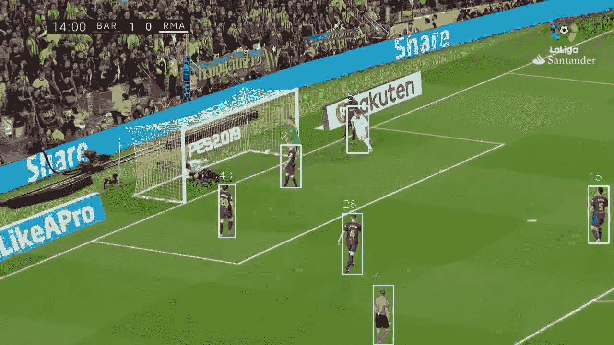
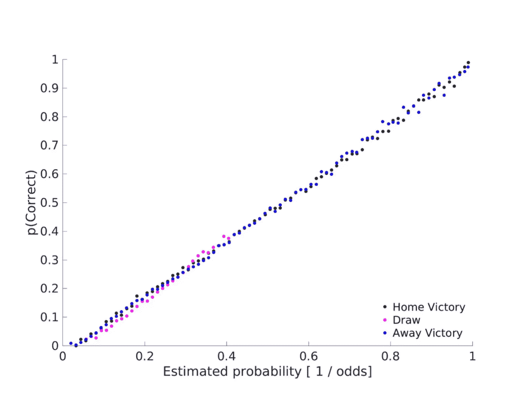

# 我学到了用机器学习预测足球比赛

> 原文：<https://towardsdatascience.com/what-ive-learnt-predicting-soccer-matches-with-machine-learning-b3f8b445149d?source=collection_archive---------7----------------------->

我总是对市场着迷。也许这是从我十几岁的时候开始的，当时我的朋友告诉我这种“稳赢”的下注策略，包括赌足球比赛是平局，并加倍下注，直到我赢了——从技术上讲，他没有错，但从技术上讲，我也没有无限的资金，所以非常感谢 ZJ。

当我第一次听说机器学习时，我认为它比使用传统统计数据建立足球模型要好得多，部分原因是这些模型的限制性假设，部分原因是我当时非常懒得学习 R。

那是 1.5 年前的事了，从那以后我就拿起了 Python(比 R 容易多了！)并阅读/应用了我能找到的所有关于机器学习的东西，最终创建了一个比鞅策略略好的模型。还有很多事情要做，但这篇文章旨在巩固我到目前为止学到的东西，并与任何刚开始学习的人分享。

# 1.博彩公司非常擅长他们的工作，也就是说，市场是非常有效的

> “我会把选股者比作占星家，但我不想说占星家的坏话”——尤金·法玛

在史蒂芬·列维特关于博彩市场的论文中，他认为博彩市场的做市商的运作与金融市场非常不同，因为他们比大众更擅长预测比赛。因此，他们可以设定价格(赔率)，而不需要匹配买家和卖家。

事实上，博彩公司在预测足球结果方面非常准确。如果我们画出隐含的赔率概率与实际比赛结果的概率，我们会得到一条非常直的线，这意味着高度的正相关。

Source: Beating the bookies with their own numbers — and how the online sports betting market is rigged [2]

有趣的是，你甚至可以用他们自己的赔率【2】击败他们，但这只是以一种有限的方式起作用(本质上是在不同的博彩公司之间套利)。

因此，如果市场是有效的，为什么还要费神去尝试呢？嗯，这是因为就像金融中的有效市场假说一样，它并不总是正确的。就在比赛开始之前，赔率的隐含概率反映了结果概率。但在比赛开始前和开始后的几天和几个小时，情绪会进入人群，如果我们能快速捕捉到它并根据真实的概率采取行动，这可能会使胜算对我们有利。这就是使用机器学习可以(有希望地)让我们超越非计算型下注者的地方。

# 2.集合是非常好的开始和结束算法

我希望我可以说我使用了性感的深度神经网络来预测足球比赛，但事实是，最有效的模型是一个精心调整的随机森林分类器，我第一次试验是因为它的简单性。我几乎试过了 [sklearn](https://scikit-learn.org/stable/supervised_learning.html#supervised-learning) 、 [xgboost](https://xgboost.readthedocs.io/en/latest/) 和神经网络中的每一种算法，但随机森林仍然是所有算法中最稳定的。

# 3.移除特征有助于提高可预测性

> “知道的越多，需要的越少。”―芮伟航·舒伊纳德

当我第一次开始这个项目时，我只是把所有的东西都扔在墙上，看看有什么东西卡住了，然后不断地想出更多的功能来改进我的结果。但是当我通过 [fastai 的机器学习课程](https://course.fast.ai/lessonsml1/lesson4.html)时，我了解到去除多余的特征实际上提高了我的准确性，主要是因为它们是噪音，使我的模型的工作更加困难。鉴于我们能够看到哪些特征在驱动我们的预测，机器学习真的不是一个不可信任的神秘黑匣子。

# 4.测试一切，尤其是你固有的假设

> “一切可以测试的东西都必须被测试”——维克多·尼德霍夫

在特征工程和建模中有太多的东西可以调整，我尝试测试所有可以测试的东西，以便更好地预测和概括。给定一系列可供选择的特性/指标，有时当某些特性足够好时，尝试其他特性会很有诱惑力。

我记得在过去的 n 场比赛中尝试用平均进球数作为衡量标准，得到了不错的结果。我已经准备好继续前进，但后来我看到了一个类似的指标，指数加权平均值。在我的脑海中，我认为可预测性的提高，如果有的话，将是微不足道的，所以我想尝试一些更令人兴奋的东西。但由于多疑，我决定快速测试一下，你知道吗，这实际上是一个比平均指标更强的预测指标。你永远不知道什么会起作用，直到你去尝试。

# **5。预测只是等式的一部分。**

在你预测了结果之后，工作还没有完成。关键是要智胜庄家，这意味着我们必须从长远来看真正赚钱。

因为我们的目标是赚钱，所以使用像准确性/验证损失这样的标准评估指标并不能很好地衡量我们的目标是否达到。因此，我用博彩公司的赔率乘以每个正确结果的预测概率，来看看这个模型有多有利可图。

# 6.Jupyter 笔记本改变了游戏规则

在我学会 Python/机器学习并开始应用我所知甚少的知识后，我继续使用推荐的文本编辑器编写我的所有代码，然后在终端中运行代码。文本编辑器很棒，我仍然在学校和阅读我下载的脚本时使用它。但是朱庇特改变了我的实验方式。

我可以在单元格中交互地运行更改，而不是等待运行整个 python 脚本来查看我的编辑产生了什么。我花了一段时间来适应工作流程和键盘快捷键，但是一旦我习惯了，我的迭代周期就大大缩短了，而且我再也没有回头看。

# 7.它永远不会结束。

这是我在 2018 年为自己决定的一次为期 10 年的旅程，并将在未来几年继续努力，并将我在其他市场学到的东西应用到其中。随着新指标/研究的出现，这是一个不断学习和测试的持续旅程——好在我喜欢这个过程。

# 参考

[1]市场如何运作？对国家足球联盟赌博的实证分析

[2]用自己的数字击败博彩公司——以及在线体育博彩市场是如何被操纵的，利桑德罗·，·钟，哈维尔·克莱纳