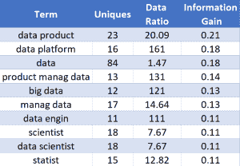

# 关于数据产品经理，招聘启事能告诉我们什么

> 原文：<https://towardsdatascience.com/what-job-postings-can-tell-us-about-data-product-managers-cc8cf9774e6e?source=collection_archive---------19----------------------->

如今，数据产品经理是就业市场上的抢手货。越来越多的公司意识到数据对其业务的重要性，以及围绕数据制定战略和清晰路线图的必要性。产品经理自然是这项工作的一部分，因此对数据产品经理的需求正在上升。

最近，我碰巧参与了一些讨论，这些讨论让我更多地思考数据 PM 与任何其他 PM 的实际区别。仅仅是关于他们的产品领域吗？有没有具体的新技能？也许是正在使用的工具？甚至他们的学术背景？

作为一名数据爱好者，只有转向实际数据来回答这些问题才有意义。于是旅程开始了…

*Photo by* [*marcus_jb1973*](https://www.flickr.com/photos/marcusjb/4653449121/) *on Flickr, available under a* [*CC By-NC-ND license*](https://creativecommons.org/licenses/by-nc-nd/2.0/)

# 数据

首先是数据。起初，我考虑使用实际数据 PMs 的 LinkedIn 个人资料作为数据集。通过比较数据 PMs 和非数据 PMs 的曲线，可以看出主要的区别。然而，即使抛开刮痧和隐私方面，LinkedIn 上的自写角色描述也过于个性化，不容易比较。

所以我转向工作描述。这些都是根据角色的要求而写的，结构更好，也更容易获得。仍然没有可用的数据集，但这似乎是一个更容易解决的问题。Indeed.com 的[提供了一个很好的招聘信息链接的集合，我可以跟踪并抓取内容。我也可以很容易地选择提供数据 PM 和非数据 PM 职位的公司，希望有更好的信噪比，尽管不可否认这可能会对大公司造成轻微的偏见(有两个或更多的 PM 职位)。](https://www.indeed.com/jobs?as_ttl=data+product+manager&limit=10&psf=advsrch)

[产生的数据集](https://alteregozi.files.wordpress.com/2019/04/data_pm_jds.xlsx)包括 50 家不同公司最近发布的 100 份招聘信息，其中每家公司的一个职位是数据 PM，另一个职位是非数据 PM。为此，我将“数据 PM”定义为标题中有“数据”一词；这似乎是一个合理的起点，但我欢迎任何关于这种定义在更大的画面中可能遗漏了什么的反馈。

# 数据处理

开始时，我们可以采取一个有趣的探索步骤，看看我们在这个示例中实际得到的角色头衔。获取 50 个数据 PM 帖子，并删除所有标准 PM 标题关键字(包括“高级”、“助理”、“产品经理”、“产品管理”等)。)，提供标题片段的分布，表明这些数据产品似乎是关于什么的。如下图所示，大约三分之二的帖子集中在一个简短的通用名称列表上:数据科学、数据平台、数据产品或简单的数据。“其他”三分之一是由整个数据管道中的一长串更具体的术语组成的——数据集成、摄取、建模、基础、分析、策略等等。因此，似乎可以安全地假设，在大多数情况下，数据 pm 拥有其组织中的整个数据域，端到端。

接下来，我们将处理职位发布文本本身。我采用的一般方法是将两组 50 个数据帖子与 50 个非数据帖子进行比较，并寻找最能区分这两个类别的特征。我们将从标记化、删除停用词和词干化(都使用 nltk)开始，然后解析结果文本以提取 n 元语法及其在每个类中的频率。对于每个 n-gram，我们将记录它在其中被发现的帖子的数量，数据与非数据计数的比率，以及使用该 n-gram 来区分两个类时的信息增益度量。我们还将删除低计数 n 元文法(匹配率低于 5%)，以及零信息增益或极低信息增益的 n 元文法。

# 分析和调查结果

现在我们终于准备好看到实际的结果了…那么区分数据 PM 和其他 PM 的关键词和关键短语是什么呢？

上表显示了前 10 个 n-grams 的信息增益，或者它们将两个组分开的程度。检查顶部项目表明，组织将数据项目经理视为专业人员，他们**构建数据平台，与数据科学家和数据工程师团队合作，并衍生或使用数据模型**。值得注意的是，术语*数据*本身不再是数据项目经理所独有的，实际上在非数据项目经理的职位描述中也有很高的频率(因此“数据比率”值较低)，而其他热门术语和短语出现在少量帖子中，但当它们出现时，它们具有很高的信息量。

当我们在列表中查找数据工具的名称时，我们会发现很少几个在列表中名列前茅。 *SQL* 是一个突出的工具，在 16 个数据帖子和 3 个非数据帖子中被提及， *Tableau* 出现在 9 个数据帖子和 1 个非数据帖子中，而 *Python* 只出现在 6 个帖子中，但都是针对数据 pm 的。所有这些术语加起来涵盖了大约 40%的数据发布，说明了**许多数据项目经理希望能够访问和操作数据**，从基本的 SQL 到实际的编码。

将列表翻转到非数据与数据发布的高比率，我们可以了解哪些术语高度预测非数据发布。毫不奇怪，我们会发现面向用户的关键词，如 engage、delight 和 experience，但更有趣的是，还有相当多的经典产品技能和术语，如*产品积压*、*产品定义*、*产品组合*和*发布*。这可以解释为表明**数据项目经理被认为是已经掌握了产品管理基础知识的有经验的项目经理**，因此该帖子侧重于数据特定方面。

学位要求呢？总的来说，*学历要求*，无论是本科还是研究生(还有 *MBA* ，对于数据 PMs 似乎都没有什么特别的意义，表现为零信息增益。另一方面， ***统计*，无论是学位还是仅仅有背景，都是数据发布的一个明显属性**，有 30%的人提到它，而在非数据发布中只有 2%。

虽然这个小数据集可能不够大，不足以成为真正的样本，但它确实为就业市场如何看待数据 PM 的角色提供了一个有趣的快照。如果你有任何进一步的见解或评论，我很乐意在评论中听到你的想法！

*原载于 2019 年 4 月 28 日*[*http://alteregozi.com*](https://alteregozi.com/2019/04/28/what-job-postings-can-tell-us-about-data-product-managers/)*。*