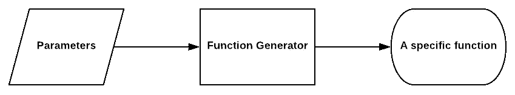
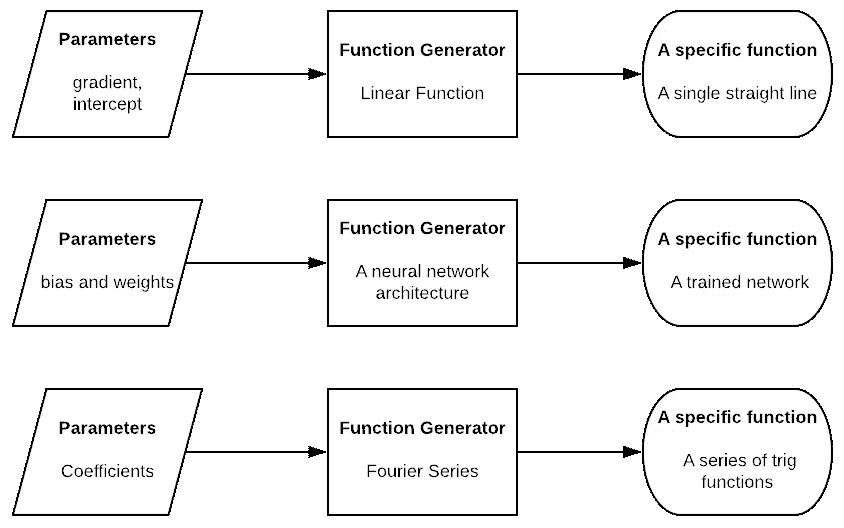
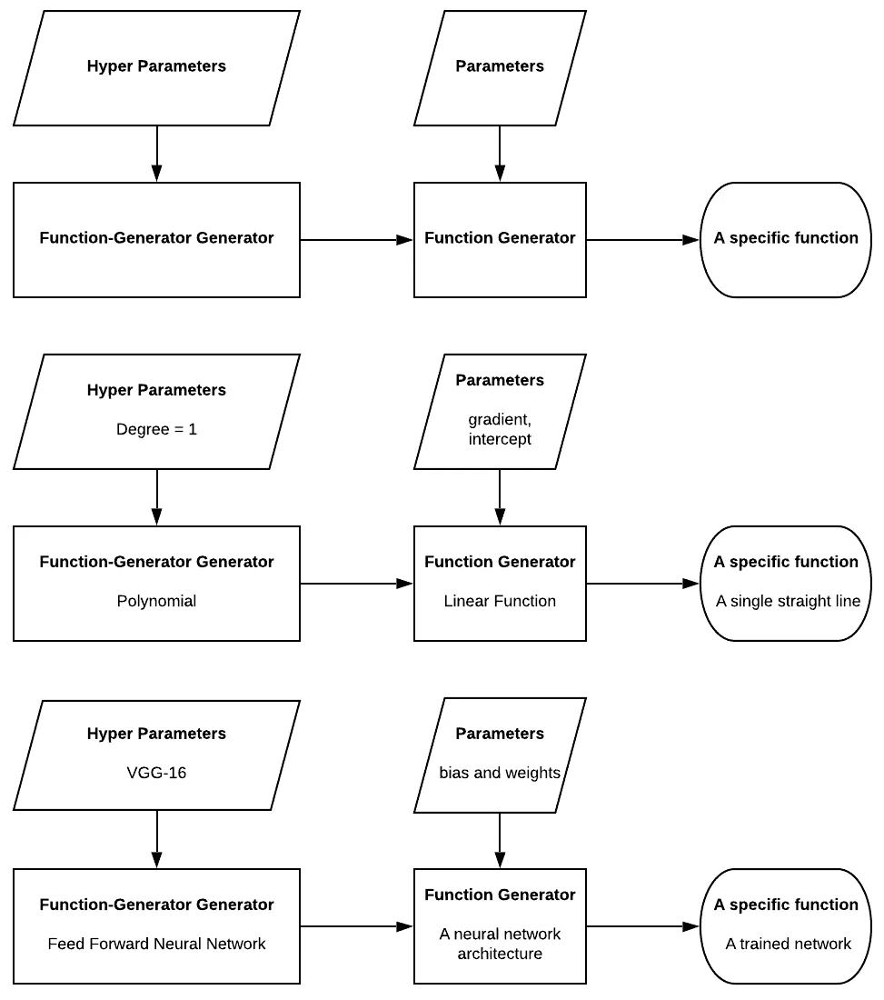
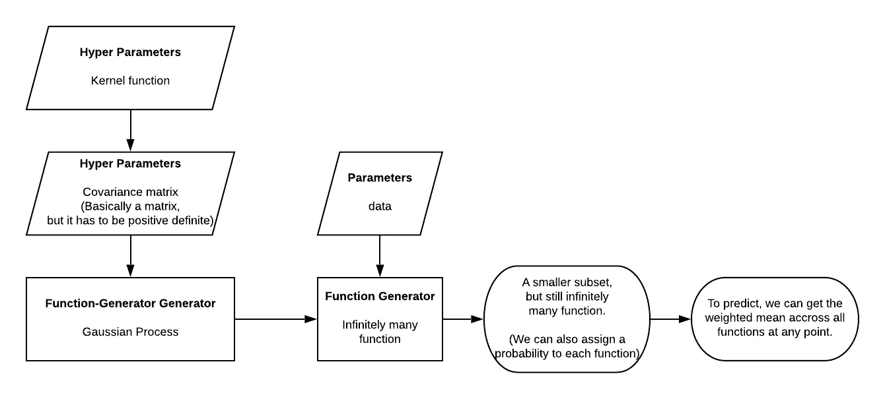
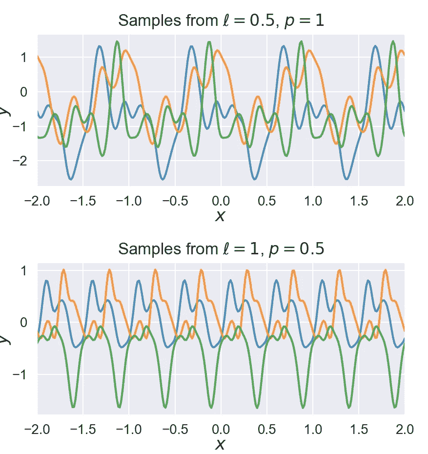
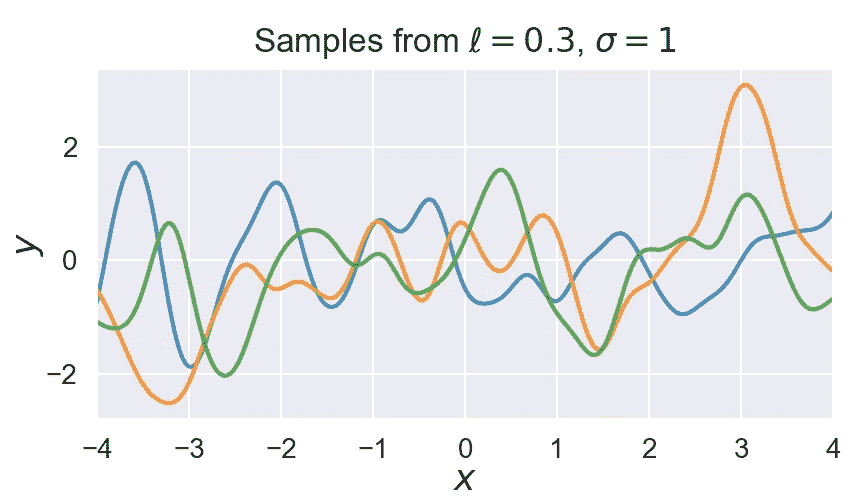
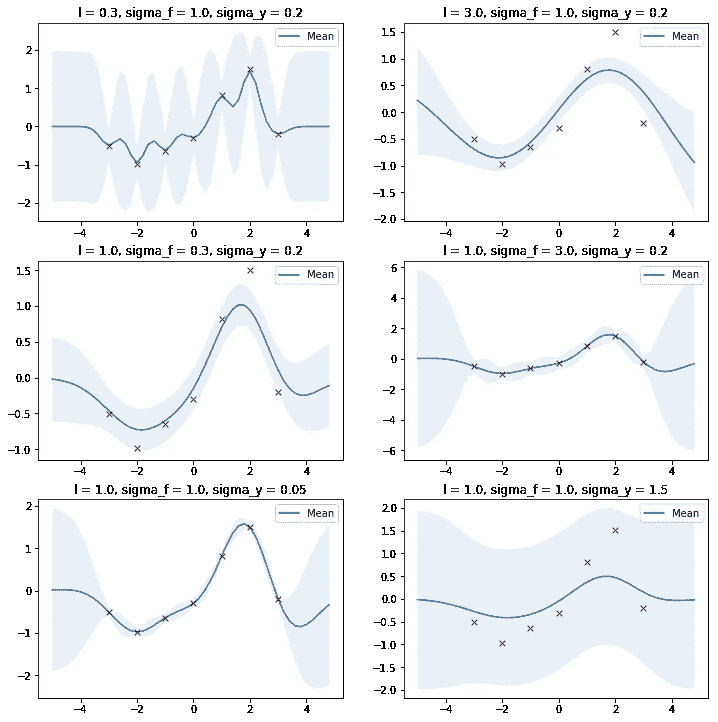

# 最大似然背景下的高斯过程是什么样的东西

> 原文：<https://towardsdatascience.com/what-kind-of-thing-is-gaussian-process-in-ml-context-explaining-through-ml-analogy-488b261b1717?source=collection_archive---------31----------------------->

## 机器学习(ML)学生通过 ML 类比对 ML 人的解释

认知状态:在我开始写这篇文章之前不到 50 个小时，我开始学习高斯过程。所以很明显我在写这篇文章的时候不够资格，而且过于固执己见。与其说这是什么，不如说这是给我自己的一个提示。

**TLDR** :一个函数生成器生成无限多个函数。一个函数生成器生成无穷多个函数生成器。这就是高斯过程。它还附带许多便利的额外津贴。

Photo by [Barna Bartis](https://unsplash.com/@barnabartis?utm_source=unsplash&utm_medium=referral&utm_content=creditCopyText) on [Unsplash](https://unsplash.com/s/photos/math?utm_source=unsplash&utm_medium=referral&utm_content=creditCopyText)

# 为什么我要写这个(你可以跳过这个)

Photo by [Rezel Apacionado](https://unsplash.com/@rezelkealoha) on [Unsplash](https://unsplash.com/s/photos/math?utm_source=unsplash&utm_medium=referral&utm_content=creditCopyText)

我喜欢维基百科，因为我是一个整体思考者。这意味着，为了学习一些东西，我需要完全了解上下文，而维基百科总是给我这一点。至少大部分时间是这样。

例如，维基百科会告诉我[番茄是一种浆果](https://en.wikipedia.org/wiki/Tomato)。现在，在点击了浆果上的[链接后，我知道番茄是一种什么东西了。以此类推，它与葡萄、醋栗、黄瓜、茄子(茄子)和香蕉同属一类；但不是草莓和覆盆子。](https://en.wikipedia.org/wiki/Berry_(botany))

不幸的是，高斯过程本身就是一个巨大的话题。所以[维基百科页面](https://en.wikipedia.org/wiki/Gaussian_process)并没有对我熟悉的任何东西做任何引用(这只在机器学习中)。这意味着我必须浏览 YouTube 视频和博客文章，试图理解这个东西是什么(查看列表末尾)

# 信号发生器

今天，我们将以不同的方式来看待回归任务。我们将围绕一个叫做“函数发生器”的东西进行讨论。

A function generator can generate infinitely many functions.

在大多数有监督的 ML 回归任务中，我们需要类似函数生成器的东西，尽管我们通常不会这样做。函数生成器可以生成无限多的函数。我们需要它，因为通常，任务是找到数据集背后的潜在功能。因此，希望由我们的函数生成器生成的函数中有一个与我们试图寻找的函数足够相似。

Examples of function generators.

例如，在 2D，线性回归是一个函数生成器。它可以生成无限多的线性函数。回归的目标是找到一个最适合我们数据集的单一线性函数。另一个例子是神经网络。神经网络结构可以生成无限多的网络，这些网络基本上是函数，由偏差和权重决定。同样，我们的目标是找到一个最适合我们数据集的网络。

通常，在这一点上，我们谈论参数。参数如何准确地告诉函数生成器要生成哪个函数。通常我们会把整个问题归结为寻找最佳参数，而不是寻找最佳函数。然而，GP 是众所周知的非参数的，尽管有些人认为它有无限的参数。所以我们不会讨论参数，至少不是以我们通常理解的方式。

# 函数发生器

Function-generator generator and 2 examples.

现在我们知道了什么是函数生成器，我想引入一个新的概念:“函数生成器”。例如，我们可以将线性回归函数生成器视为多项式函数生成器的乘积，其阶数设置为 1。类似地，我们可以想到一个神经网络函数生成器，它可以生成任何类型的神经网络，它所需要的只是架构的描述。

通常，用这些术语来思考有点可笑。但是现在，我们确切地知道高斯过程是什么，它是一个函数生成器。它可以生成无限多的函数生成器。它所需要的只是一个叫做协方差矩阵的特定矩阵，它可以由一个叫做核函数的函数生成。

Gaussian Process as a function-generator generator

6 specific functions that could be possibly generated from a function generator that is generated from Gaussian process using a periodic kernel function [https://peterroelants.github.io/posts/gaussian-process-kernels/](https://peterroelants.github.io/posts/gaussian-process-kernels/)

我在这里做了很大的简化，但是内核函数，基本上是接受两个数字作为输入，输出一个数字的函数。但是，在这里，我们可以把它看作一个超参数。选择使用哪个核函数就像选择神经网络架构一样。下面是一些内核函数的例子(更多[https://peterroelants . github . io/posts/Gaussian-process-kernels/](https://peterroelants.github.io/posts/gaussian-process-kernels/)请查看此页面)。此外，查看这两个链接以获得更多示例:【https://youtu.be/clMbOOz6yR0T2[https://youtu.be/e7as_wY0hUI](https://youtu.be/e7as_wY0hUI)

3 specific functions that could be possibly generated from a function generator that is generated from Gaussian process using an exponentiated quadratic kernel function [https://peterroelants.github.io/posts/gaussian-process-kernels/](https://peterroelants.github.io/posts/gaussian-process-kernels/)

Different kernel functions on the same datapoints, leading to different predictions. [http://krasserm.github.io/2018/03/19/gaussian-processes/](http://krasserm.github.io/2018/03/19/gaussian-processes/)

根据选择的内核函数，推断的预测可能会有所不同，如下所示(查看本页了解更多解释[http://krasserm.github.io/2018/03/19/gaussian-processes/](http://krasserm.github.io/2018/03/19/gaussian-processes/)):

这是高斯过程最有趣的一点。一旦我们有了函数生成器，我们不需要使用任何梯度下降来确定一组参数，最终得到一个函数。相反，我们使用数据集来排除所有不符合数据集的函数。我们剩下的，是所有的函数，仍然无限多，适合我们的数据集。接下来，对于特征空间 x 中的每个点，我们可以取无穷多个函数的平均值，并将其用作我们的预测。此外，我们还可以看到这些函数的分布。

(不幸的是，由于我们没有减少参数，所以每当我们想要进行预测时，我们都需要计算整个数据集。这个问题已经引起了高斯过程的许多变种。)

高斯过程附带了许多附加功能。如果我们考虑到我们的数据集中存在一定程度的噪声，而不是简单地给我们一个无限的函数集，高斯过程可以在每个函数上附加一个概率值。这就是为什么最标准的定义是:

> 高斯过程是拟合一组点的可能函数的概率分布。

到目前为止，您应该对高斯过程是什么样的东西，以及它如何与典型的 ML 框架相关联有所了解。现在，你已经准备好进入高斯过程实际工作的细节。下面是让你更进一步的资源。

# 资源

*   [https://youtu.be/4vGiHC35j9s](https://youtu.be/4vGiHC35j9s)这是 2013 年南多·德·弗雷塔斯在 UBC 教授的一门课。对那些数学爱好者来说非常好。可惜不是我。
*   https://youtu.be/92-98SYOdlY[理查德·特纳教授的教程，他是这方面的专家。它对高斯过程是如何工作的提供了极好的直观见解。这正是我在了解高斯过程是什么样的东西之后所需要的。](https://youtu.be/92-98SYOdlY)[这里的](https://thegradient.pub/gaussian-process-not-quite-for-dummies/)基本上是教程上的一个注释。
*   [https://youtu.be/vU6AiEYED9E](https://youtu.be/vU6AiEYED9E)这个系列是一个极好的资源！它给了我一个很好的上下文，更高层次，从数学角度鸟瞰高斯过程。正是我所需要的，前提是我有良好的数学背景。对我来说(开始)最有用的部分是第三个视频[https://youtu.be/clMbOOz6yR0](https://youtu.be/clMbOOz6yR0)，因为它就像高斯过程的 Hello World。整个交易只用了 25 行 MATLAB 代码。
*   [https://kat Bailey . github . io/post/Gaussian-processes-for-dummies/](https://katbailey.github.io/post/gaussian-processes-for-dummies/)只是另一种视角。
*   [https://towards data science . com/an-intuitive-guide-to-Gaussian-processes-EC 2 f 0 b 45 c 71d](/an-intuitive-guide-to-gaussian-processes-ec2f0b45c71d)又一个视角。这确实证明了高斯过程的威力，它可以用许多不同的方式来探索。

# 确认

所有图片属于我，除非标题中另有说明。