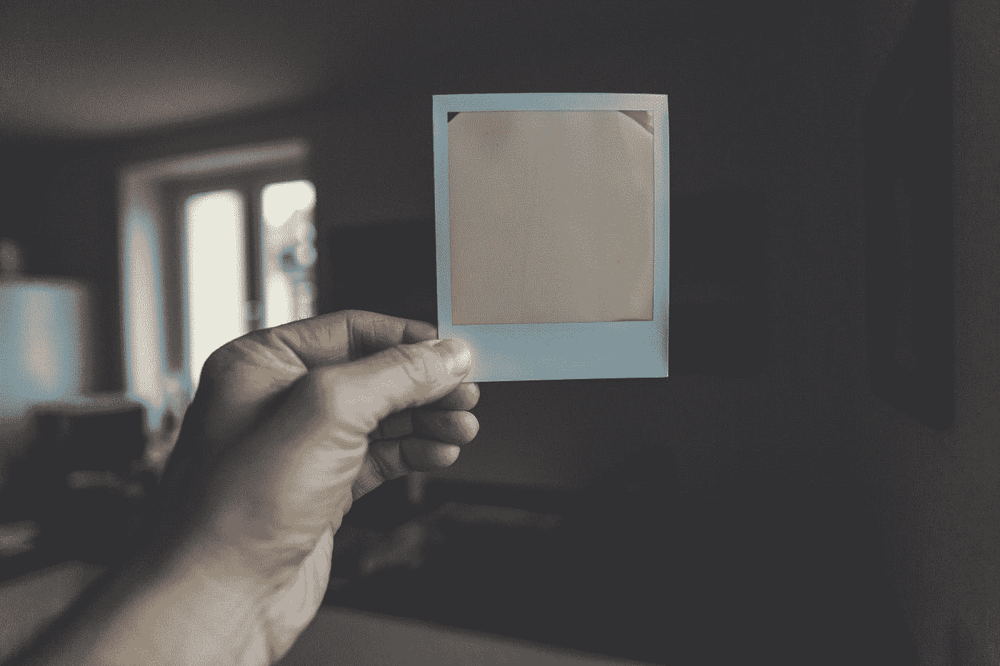
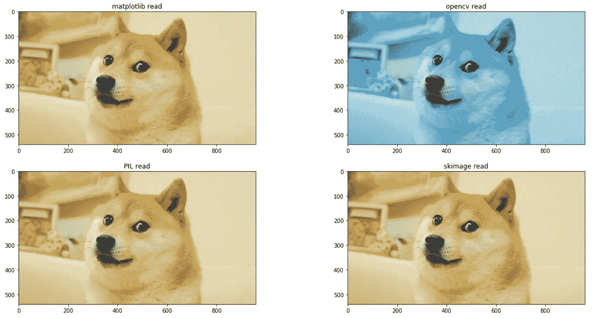
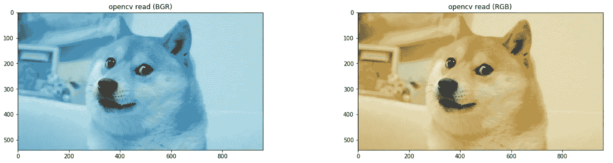

# Python 中有哪些库可以加载图像，它们有什么区别？

> 原文：<https://towardsdatascience.com/what-library-can-load-image-in-python-and-what-are-their-difference-d1628c6623ad?source=collection_archive---------2----------------------->

## 总结和比较。 **imread()**



Waiting for your polaroid to develop is like loading images via libraries — Photo credit: [Markus Spiske](https://unsplash.com/@markusspiske?utm_source=medium&utm_medium=referral)

当我们面对计算机视觉项目时，首先需要在任何预处理之前加载图像。

有各种各样的库可以执行`imread()`。在这里，我想巩固加载图像的流行库和它们的区别。这篇文章将介绍:

1.  用于加载图像的库
2.  彩色通道
3.  效率
4.  **Cheatsheet！**

# 用于加载图像的库

有四个库通常用于加载图像。

*   Matplotlib — `plt.imread()`
*   OpenCV — `cv2.imread()`
*   枕头— `Image.open()`
*   scikit-image — `io.imread()`


```
import matplotlib.pyplot as pltimg = plt.imread(img_dir)
```


```
import cv2img = cv2.imread(img_dir) 
```


```
from PIL import Imageimg = Image.open(img_dir) 
```


```
from skimage import ioimg = io.imread(img_dir) 
```

# 彩色通道

加载图像后，通常会使用`plt.imshow(img)`来绘制图像。让我们来策划一些 [doge](https://knowyourmeme.com/memes/doge) ！



您可能会发现上面的 OpenCV 图像看起来很奇怪。是因为 matplotlib、PIL 和 skimage 是按照 **RGB** (红、绿、蓝)顺序表示图像的，而 **OpenCV 是相反的顺序**！( **BGR** —蓝色、绿色、红色)

## 容易解决

在使用`plt.imshow()`绘图之前，只需使用`cv2.cvtColor(img, cv2.COLOR_BGR2RGB)`将图像从 BGR 转换成 RGB。



From blue to yellow doge

```
new_img = cv2.cvtColor(img, cv2.COLOR_BGR2RGB)plt.imshow(new_img)
```

# 效率

所以，你可能会问哪一个是加载图像最有效的库。这里定义了一个函数来跟踪时间:

```
**import** **time**
**def** test_read_image(imgfile, func):
    t0 = time.time()
    img = func(imgfile)
    **return** img, time.time() - t0
```

结果如下:

```
+------------+--------------+---------+
|  Library   |   Function   |  Time   |
+------------+--------------+---------+
| matplotlib | plt.imread() | 0.02254 |
| OpenCV     | cv2.imread() | 0.01096 |
| Pillow     | Image.Open() | 0.00166 |
| Skimage    | io.imread()  | 0.01463 |
+------------+--------------+---------+
```

枕头— `Image.Open()`根据结果，似乎是最有效的。为了更深入的研究，我们可能会回到源代码中找出更多的不同之处！

# 备忘单

我已将以上信息组合成一个 Jupyter 笔记本。请随意下载 cheatsheet 和快乐编码！

*来源:*

[*https://blog.csdn.net/renelian1572/article/details/78761278*](https://blog.csdn.net/renelian1572/article/details/78761278)

[*https://github . com/Zhang xinnan/learn practice/blob/master/cv/opencv/test _ cvlib . py*](https://github.com/ZhangXinNan/LearnPractice/blob/master/cv/opencv/test_cvlib.py)