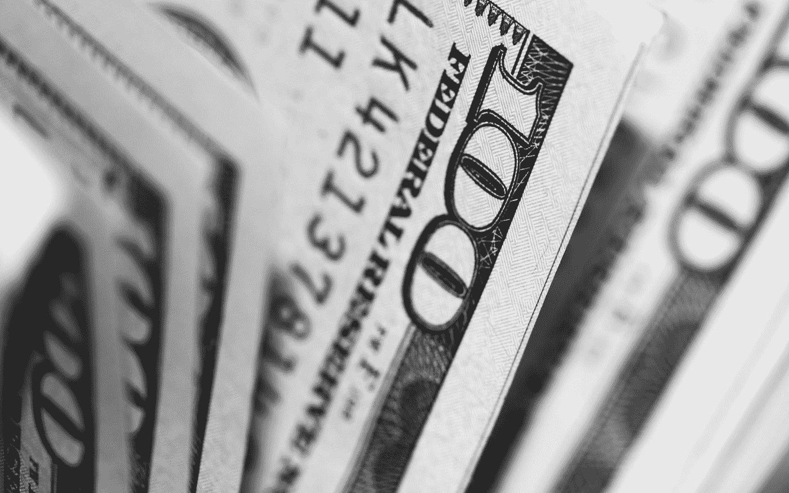

# 是什么让我意识到 UBI 是一个好主意

> 原文：<https://towardsdatascience.com/what-made-me-realize-ubi-is-a-good-idea-cf785683c235?source=collection_archive---------43----------------------->

## 为什么 UBI 是每个社会的未来

UBI = Universal Basic Income = a policy where everyone gets a certain amount of money every month

几周前，我在考虑 UBI，当时我不确定这是不是一个好主意。但是现在我知道了，它确实是。

我通过反思自己的经历认识到了这一点。

所以，大约两年半前，我开始全职做优步。那时候，就在我离开前一份工作后，压力真的很大。

我每个月挣 500-600 美元，这肯定比我的花费要少。每个月，我银行账户里的钱都会变少。那是相当伤脑筋的。

但是过了一段时间，我开始每个月都能赚很多钱，而且每个月也能存一点。

当这种情况发生时，我有了更多的精神空间来关注其他事情——我的人际关系、旅行、听音乐，以及探索我的不同兴趣。

我最近开始主持一个播客，我开始从我的常规视频制作不同种类的视频，我甚至开始考虑制作音乐。

基本上，我变得更有创造力，因为我不再需要太担心我的收入了。

I’m thinking of learning to play guitar, too

然后我想，如果每个人都有一样的东西呢？

如果每个人都得到保证，比如说每月 3000 美元，会怎么样？

然后，我认为我们都能够花更多的时间做我们喜欢的事情——比如花更多的时间与朋友和家人在一起，看电影，听音乐，等等。我相信这不仅会带来更健康的生活方式，还会带来更多的创造力。

在那样的社会里，没有人会被困在自己讨厌的工作中。

没有人会为了收支平衡而被迫每周工作 80 小时。

现在一个月 3000 美元可能太贵了，但最终不会贵的。

这是因为随着人工智能和自动化变得越来越先进，每个选择工作的人将能够用更少的时间生产更多的东西。

经过足够的技术发展后，每个人每月 3000 美元应该是任何发达国家都能负担得起的。

正如我之前所说的，现在每月 3000 美元可能太贵了，但我认为即使每月 500 美元或 1000 美元也能帮助很多人。

Do you think most people struggle financially just because they are lazy? I don’t think so.

当然，仍然有这样的问题:

*   UBI 是否优于类似的建议，如负所得税？
*   最好的资助方式是什么？
*   UBI 应该优先于其他社会项目吗？

但是，我相信 UBI 将是未来显而易见的发展方向。

让人们摆脱贫困，让人们拥有更健康的生活方式，创造一个更具创造力的社会。谁不想这样呢？