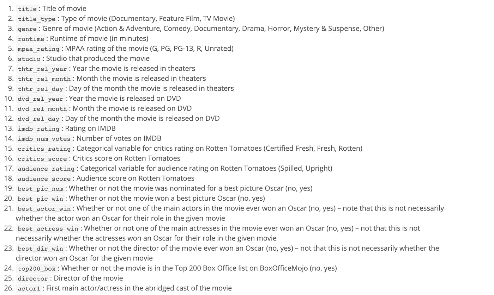
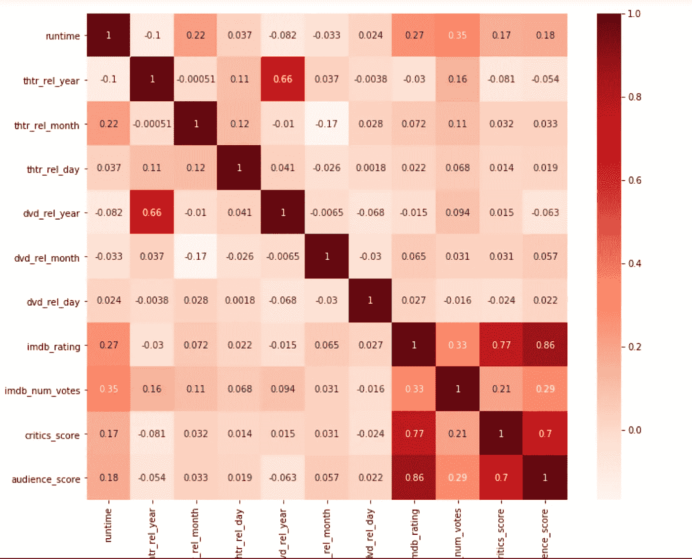

# 是什么让一部电影一炮而红？用多元线性回归从数据中学习

> 原文：<https://towardsdatascience.com/what-makes-a-movie-hit-a-jackpot-learning-from-data-with-multiple-linear-regression-339f6c1a7022?source=collection_archive---------14----------------------->

Photo by [Denise Jans](https://unsplash.com/@dmjdenise?utm_source=medium&utm_medium=referral) on [Unsplash](https://unsplash.com?utm_source=medium&utm_medium=referral)

我必须提到的第一件也是最重要的事情是——这篇文章是为那些愿意踏上数据分析之路并想知道为什么终极指南不能以正确的方式工作的完全初学者写的。通过一些小的调整，我将展示如何创建具有大量独立变量的多重线性模型，并指出您可能会遇到的一系列错误。

这是我们的计划——如果你觉得熟悉，你可以跳过:

*   多元线性回归的一些背景；
*   阅读。RData 文件并将其转换为 DataFrame
*   快速解释性数据分析；
*   寻找缺失的价值；
*   处理分类变量；
*   建立回归模型；
*   可能影响模型预测的因素；
*   可能有用的 r 代码。

# **一些背景**

在开始之前，我想回顾一下关于多元线性回归概念的重要细节。我们使用多个独立预测器(表示为 x1、x2、x3、…)来预测因变量 y 的值。通过分析，MLR 找到了最“符合”数据的直线。残差是观测值和预测值之间的差值，因此残差平方和越小，模型就越精确。

为什么我们要考虑残差平方和？答案很简单:通过**平方剩余值**，我们以同样的方式处理正负差异。

## 有两件重要的事情你必须牢记在心:

1.  **共线性**:当两个预测变量彼此相关时，称它们共线。记住，预测器也叫自变量，所以应该是相互独立的。包含共线预测因子使模型估计变得复杂。记住:独立很重要！
2.  **简约**:避免添加相互关联的预测值，因为添加此类变量通常不会给表格带来新内容。简单地记住**奥卡姆剃刀原理**:在同样好的模型中，我们想要选择具有更少变量的模型。

# **关于数据集**

对于这个 MLR，我将使用数据集，其中包括 2016 年之前制作和发行的 651 部随机抽样电影的信息，这些信息取自[烂番茄](http://www.rottentomatoes.com/)和 [IMDB](http://www.imdb.com/) 。我的数据集进来了。RData 文件格式—要打开数据，我们首先需要将其转换成 Pandas 数据帧。为此，“pyreadr”库就派上了用场。

***提示*** :当“将 stats models.api 导入为 sm”时，您可能会遇到“*导入错误:无法导入带有 pip 安装包的名称‘factorial’*”的问题。它必须对最新版本的统计模型做一些事情——要解决这个问题，您需要将当前版本的 scipy 降级。

**可以通过键入: *python3.6 -m pip 安装 scipy==1.2 —在您的终端中升级*** 或者如果您使用的是 Jupiter 笔记本，请将***“conda”而不是 pip。***

# **解释性数据分析:特征选择**

显然，我们不必为您的模型考虑 32 个变量中的每个变量——将它们包括在统计分析中没有任何意义，因为它们是出于信息目的而给出的。正确的问题是:**我的模型应该考虑哪些变量？**

首先，让我们看看我们的数据集。

Codebook for Movies dataset

乍一看，数据似乎包含许多高度相关的因变量。如果我们看到变量之间高度相关，我们就选择一个，舍弃其他的。为了找到相关性，我们使用皮尔逊相关:

从上面的热图中，我们看到有两组变量彼此高度相关:

1.  ['imdb_rating']，['critics_score']，['audience_score']
2.  ['dvd_rel_year']，['thtr_rel_year']

请记住，MLR 声明我们*确实需要独立变量，因此我们需要保留每个组中的一个变量，去掉其他变量。*

从我个人的观点来看，我会继续留在['imdb_rating']。我们会放弃什么？

**注意**，我必须删除所有三个时间序列变量(['thtr_rel_year '，' thtr_rel_month '，' thtr_rel_day'])，因为这违反了误差相互独立的经典假设。换句话说，年、月和日是高度共线的——这将导致不好的影响。请记住，我们需要注意，我们所有的变量都是独立的，而不是高度相关的！这些是连续变量，在这个问题上，我们应该用更先进的统计方法来处理它们。你可以在我在 StackExchange 上创建的[标签](https://stats.stackexchange.com/questions/411128/how-time-series-structure-can-affect-the-independence-of-residuals-condition-for)中详细了解这一点。

鉴于这种假设，我将提出几个变量，并放弃其他变量。对于我未来的模型，我选择了:

特征矩阵:

1.  title_type —(作为影片的 id)；
2.  流派；
3.  运行时；
4.  best_pic_nom(作为优秀的资源它可以带来新的观众)；
5.  top200 _ box
6.  导演；
7.  actor1

因变量:['imdb_rating']。

对于这一步，我为两者——特征矩阵和因变量——创建一个数据框架,除非我处理缺失值。原因是，在处理缺失值时，我们必须删除每个列的**中的所有行，以保持我们未来的两个数据帧(特征矩阵和因变量)具有相同的形状。**

因此，当我们开始处理数据框架并删除那些我们在模型中不会考虑的变量时，我们就到了这一点。

**从熊猫库中选择特征有两种方法**:

1.  Data.iloc[ <row selection="">， <column selection="">] —如果您知道变量的索引(注意。当选择一行时，iloc 返回 Pandas 系列，当选择多行时，或者如果选择任何完整的列，则返回 Pandas 数据帧。)</column></row>
2.  Data.loc[ <row selection="">，<column selection="">]-使用按行/列名称标记的数据</column></row>

# **寻找缺失值**

因为如果我们要求基于包含 nan 的数据构建回归模型，回归函数将简单地引发 MissingValueError，所以我们必须提前关注它们。

从给定的结果中，我们看到(总计)我们有 5 个缺失值，分布如下:一个在['运行时']，两个分别在['导演']和['演员']。

正如算法所建议的，我们简单地用下面的函数删除它们。关键是:由于我们有足够多的观察值，丢失的值不会对整个范围产生太大影响，因此我们可以删除它们。

**注意**，指定 **' inplace=True '参数**非常重要，如果不这样做，什么都不会发生，您将会得到与之前相同数量的缺失值。

# **将分类变量视为虚拟变量**

现在是时候把我们的数据集一分为二了:特征矩阵和因变量。特征矩阵仅包含用于建模的变量，而因变量是我们试图预测的变量。

有两种方法可以执行从分类变量到哑变量的转换。一种是使用 pandas.get_dummies()函数——但是，它增加了数据的可变性，并且纯粹通过 scikit-learn 执行(注意，我并不是说我不工作，您只是最终得到了更高的均方误差)。为此，我使用了 scikit-learn 库中提供的另外两种方法。

## 第一步。标签编码

第一步是标记 1 分类变量的所有级别—labelencorder()用 0 和 n_classes-1 之间的值对标签进行编码。这仅仅意味着:具有 10 个级别的分类变量(“戏剧”、“喜剧”等)。)将被标记为从 0 到 9。

**提示，**你可以用这个方法一次迭代一列**！**

**开始吧，我们不再有任何词语，只有**数字**。你可能会问:“为什么我们不继续使用标签编码变量呢？”**

**答案是，对于任何统计测量，那些具有更高标签(比如 9 代表悲剧)的变量将会有更高的结果——这对你的回归分析来说将是一场灾难。**

## **第二步。一键编码**

**作为推论，**下一步**是使用一个热编码器来执行类别的“二进制化”，并将其作为训练模型的特征。使用这段代码，您最终会得到一个包含 0 和 1 值的列的花名册。**

## **第三步。标准化**

**最后，我们完成了分类特征。现在，在我们将所有东西插入模型之前，还有最后一步。来处理一个连续变量(['runtime'])。为了使它标准化，我们将使用 StandardScaler()方法。**

****换句话说，标准化以标准差的形式告诉我们每个值离平均值有多远。****

****这里有一个重要的提示:**如果你用*结束你的最后一行代码。fit_transform(这里什么都没有)*。您会得到一个错误—所有的值现在都变成了零！直观上，这没有错，但背后有一个问题——对于从数组中减去的每个数字，都是这个数字的平均值，它等于数字并除以这个数字的标准偏差。为了克服这一点，你需要把它从(1，n)转换成(n，1)。**

**毕竟，您需要将所有特性连接在一起(就像在 SQL 中一样):**

## **最后，你的回归模型来了:**

****提示**:当使用 pandas 编码时，有一个**经验法则**删除一个变量——很简单，因为你的一个变量变成了一个参考级别。在跟随过程中，您可能会注意到我们没有这样做，因此我们将 fit_intercept 设置为 False。如果是熊猫编码，你应该把它改成“真”。更多详情在此。**

**为了测试我们的模型的性能，我们将预测值与观察值进行比较:**

**在我们的例子中，MSE = 1.20 。一种可能的解释是，我用≈ 1 的误差来估计电影的 imdb 评级。Mhh，有意思！我们该如何解释呢？换句话说，正如我们从 basis STAT-101 课程中所知，均值对异常值过于敏感。这意味着在我们的例子中，观众评分较低的电影在数据上有更多的可变性，导致纯粹的预测值。为此，我们计算中值平方误差。正如您可能检查的那样，在我们的例子中，它小于 0.4。这意味着我们的模型表现很好，可以随着更多的数据进入模型而得到改进。**

# **可能导致模型不准确的因素**

****需要更多的数据**:我们需要包括更多的变量，以获得最佳的预测(例如，我们可以包括时间序列变量，但是——我们知道相关性很低——它不会对我们的模型产生太大影响)。**

****糟糕的假设**:为了检查我们所有的变量是否不共线，我们可以执行 MLR 诊断(有一个强烈推荐的[视频](https://www.coursera.org/lecture/linear-regression-model/diagnostics-for-mlr-quxtC)将引导你通过)&去掉那些没有给模型带来新东西的变量**

****缺少特征**:我们使用的特征与因变量的相关性不是最高的。有两种可能的解决方案:我们可以在网上寻找更全面的数据集，或者我们可以建立一个 web scraper:)**

**对于那些更熟悉 R 编码的人，我使用 R studio 做了更详细的分析。你可以点击[链接](https://www.dropbox.com/s/inls77pasi0ut6f/Reg_Model_project.html?dl=0)查看。**

**数据集可以在[这里](https://www.dropbox.com/s/pwda4qbm2cm6u5x/Movies.RData?dl=0)找到。**