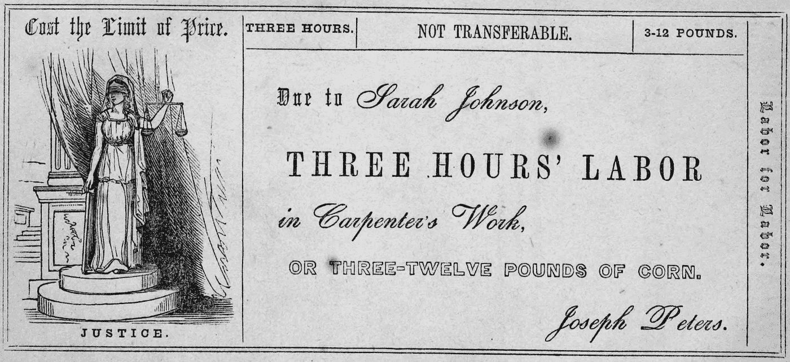
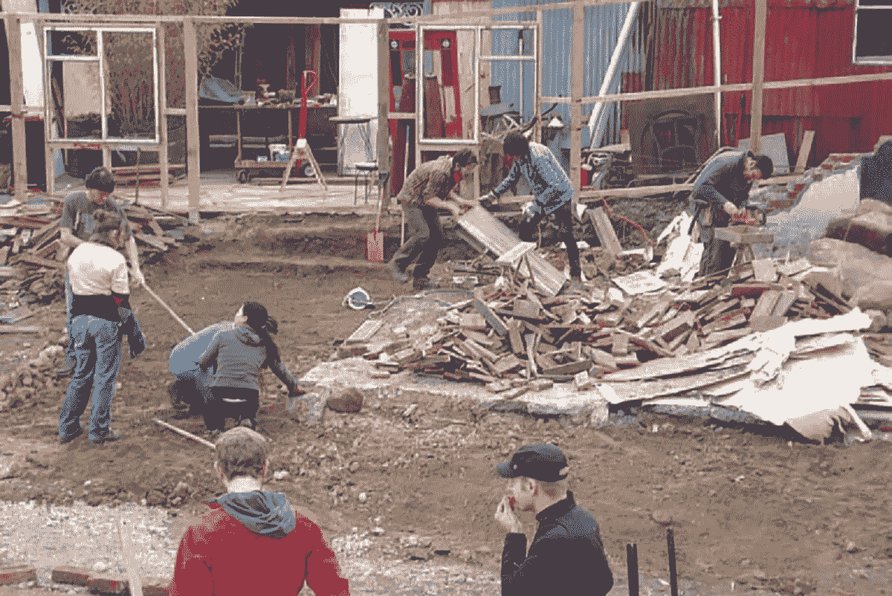
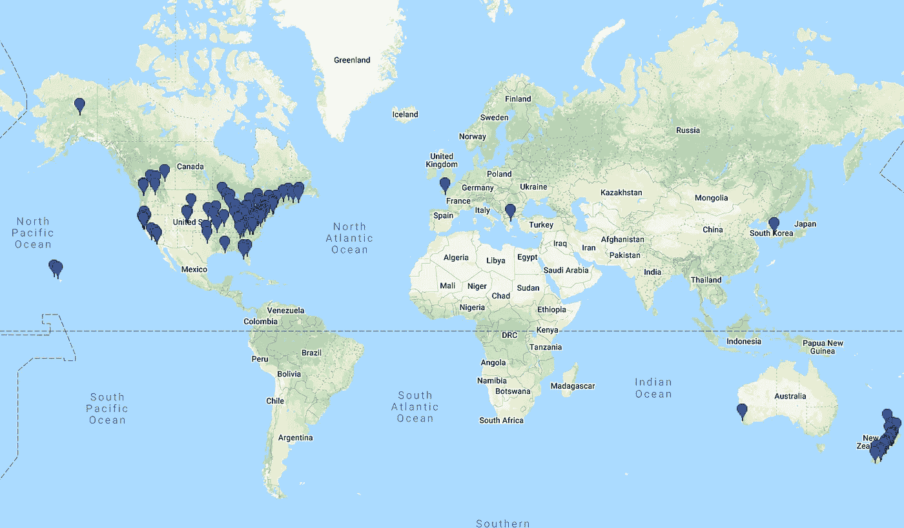
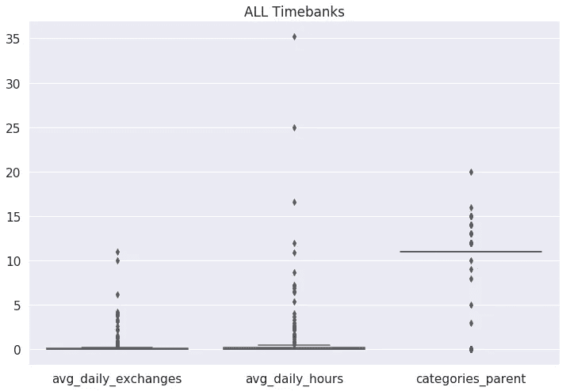
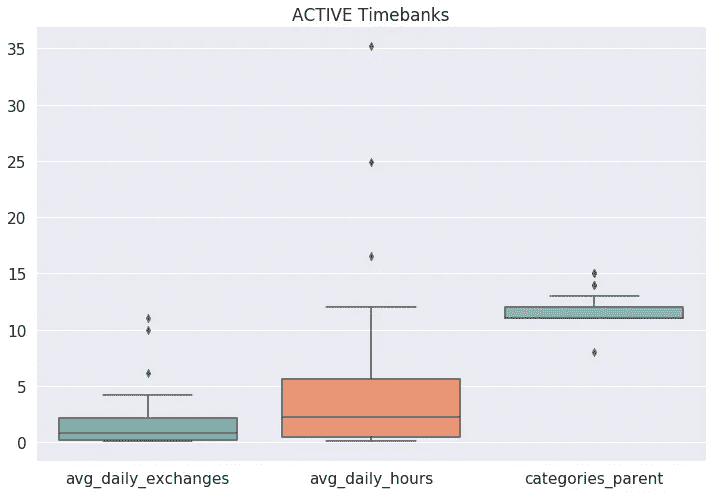
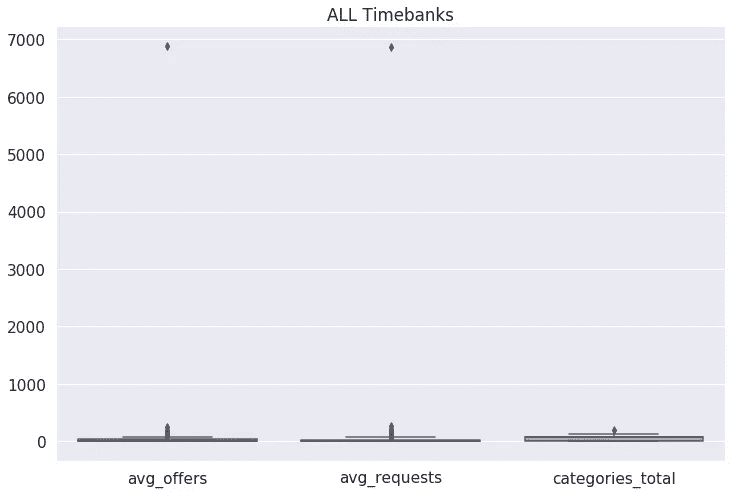
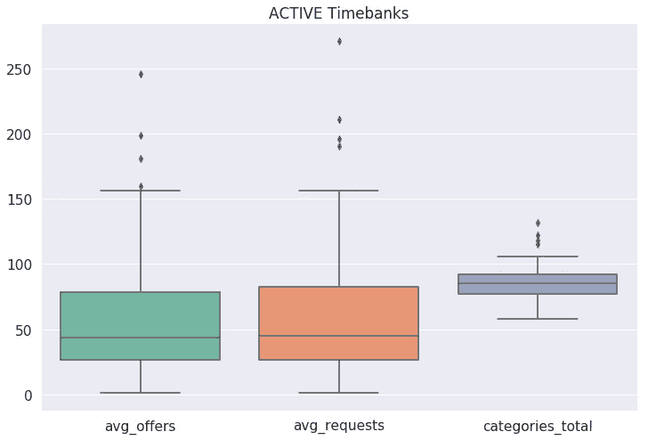

# 什么构成了一个活跃的时间银行？

> 原文：<https://towardsdatascience.com/what-makes-an-active-timebank-49a98eba8502?source=collection_archive---------21----------------------->

## 使用线性回归识别活动时间库的预测值

(Source: [DC TimeBank Facebook page](https://www.facebook.com/dctimebank/photos/a.886039424758064/1717646848263980/?type=3&theater))

在这篇文章中，我解释了我收集数据的过程，特征工程，以及使用线性回归来识别活动时间银行的预测器。但是首先…

# 什么是时间银行？

毫无疑问，当我说我正在做一个关于时间银行的项目时，有人问的第一个问题是，“什么是时间银行？”

如美国时间银行网站所述:

> “时间银行是一种基于时间的货币。给别人一个小时的服务，得到一次积分。”

你以前可能听说过时间银行或类似的系统，与互助网络、技能共享、本地交换交易系统(let)或共享经济等术语相关联。

辛辛那提时间商店是一家从 1827 年到 1830 年经营的实验性零售店。它使用“劳动纸币”作为货币，被认为是其他 let 的前身，包括时间银行和现代加密货币。

(Source: [“Cincinnati Time Store”, Wikipedia](https://en.wikipedia.org/wiki/Cincinnati_Time_Store))

20 世纪 90 年代，Edgar Cahn 注册了“时间银行”一词，并成立了美国时间银行，推动了美国的这一运动。他在*人们修复世界*播客的“[按时运行而不是按钱运行的银行](https://www.bbc.co.uk/programmes/p06s83lp)”一集中解释了他的动机。在经历了一次限制他工作能力的心脏病发作后，他反思了资本主义:“一种珍视稀缺资源、贬低更丰富资源、将真正丰富的资源视为一文不值的货币体系。我突然意识到，这意味着它贬低了作为一个人的价值，因为我们并不稀缺。也许我们需要一种重视作为一个人意味着什么的钱。”

Cahn 确定了时间银行的五大核心价值:

*   资产:我们每个人都有一些有价值的东西可以与他人分享。
*   **重新定义工作**:有些形式的工作是不容易用金钱来支付的，比如建立强大的家庭、振兴邻里关系、让民主发挥作用、推进社会公正。时间积分是用来奖励、认可和表彰这项工作的。
*   互惠:问题:“我能为你做些什么？”需要改变，所以我们问:“你也会帮助别人吗？”向前付出可以确保我们共同帮助彼此建设我们共同生活的世界。
*   **社区/社交网络**:互相帮助，我们重新编织支持、力量和信任的社区。社区是通过扎根、建立信任、创建网络来建立的。
*   尊重:民主的核心和灵魂在于尊重他人。我们努力尊重人们此刻所处的位置，而不是我们希望他们在未来某个时刻所处的位置。

# 我们为什么要关心？

目前在美国，许多人担心社会和政治分化似乎在加剧。与此同时，人们仍在应对美国历史上时间最长的政府关闭的影响，未来还有另一次可能的关闭。时间银行提供了在社区内加强联系，(重新)建立信任和关系，以及创建支持系统来帮助满足日常需求和从危机(政治、自然或其他)中恢复的可能性——而不依赖于金钱、市场或国家。

1995 年芝加哥热浪夺去了数百人的生命，随后，埃里克·克兰伯格研究了 T2 不同社区之间的死亡率差异。Little Village 是该市死亡率最低的城市之一，每 10 万居民中有 4 人死于高温。与此同时，紧邻的北劳恩代尔区是死亡率最高的地区之一，每 10 万居民中有 40 人死亡。

克兰伯格[将这种差异归因于社会和空间环境的差异:](https://www.press.uchicago.edu/Misc/Chicago/443213in.html)

> 近几十年来，大多数热浪死亡率高的非裔美国人社区都被雇主、商店和居民抛弃了。抛弃、分散和衰退的社会生态使得社会支持系统极难维持。
> 
> 自然的力量当然发挥了主要作用。但是这些死亡不是上帝的行为。数百名芝加哥居民*孤独地死去，*躲在锁着的门和密封的窗户后面，与朋友、家人和邻居失去联系，没有公共机构或社区团体的帮助。这一点都不自然。

时间银行的核心是建立强大的支持系统。在 2010 年和 2011 年坎特伯雷地震之前，[利特尔顿时间银行](https://canterbury.ac.nz/news/2013/lyttelton-time-bank-built-and-mobilised-resources.html)已经组织了该镇 10%的居民和 18 个组织。由于已经开发的网络，时间银行能够在地震发生时迅速动员社区成员。他们已经知道该检查谁，以及如何最好地利用人们的技能。值得注意的是，时间银行还在急救人员离开后很长一段时间内实现了持续的支持和恢复。

*Community members organize using resources provided by the Lyttelton Time Bank after the Canterbury earthquakes in New Zealand (Source:* [*Developing Local Partners in Emergency Planning and Management*](https://ir.canterbury.ac.nz/handle/10092/8208)*)*

虽然我们不知道芝加哥热浪在时间银行或类似系统存在的情况下会有不同的结果，但利特尔顿的例子表明时间银行可以成为社区安全、弹性和恢复的强大贡献者。

Cahn 分享了时间银行的其他成功案例:

> 在芝加哥，127 所学校让五年级学生帮助三年级学生学习字母表，几乎消除了特殊教育。
> 
> 在华盛顿特区青少年法庭陪审团任职的青少年有助于减少累犯。该计划将再次逮捕率从 34%降至 6%。

美国时间银行最近[也与 Seva Exchange 正式建立了合作关系](https://fi.co/insight/seva-exchange-is-the-blockchain-and-a-i-platform-reinventing-timebanking-for-volunteerism-in-the-digital-economy),“这是一个利用人工智能和区块链技术的平台，通过为现代数字经济重塑时间银行服务来激励全球志愿服务。”Seva Exchange 正在研究基于时间的加密货币如何提供一种普遍的基本收入形式，与国家福利体系分开运营。

# 是什么造就了一个活跃的时间银行？

现在我们已经了解了一些背景信息，让我们开始研究我的项目吧。

## 数据收集

这个项目主要关注美国时间银行的数据。虽然有其他平台列出了更多的时间银行(如 [hOurworld](http://hourworld.org/) 和 [Community Exchange System](https://www.community-exchange.org/) )，但它们没有那么多关于单个时间银行的集中和公开信息。

我首先翻阅了 TimeBanks.org 目录的所有页面，得到了平台上所有时间银行的初始列表。然后，我创建了一个每日刮刀，在每天开始时获取以下内容的更新:

*   交易数量、时间、会员、报价、请求、最后一次交易
*   按类别列出的聘用、请求和人才
*   所有出价和请求列表

我手动收集了时间银行页面上脸书和推特账户的数据。这一决定最初是由脸书对自动数据收集的限制促成的。然而，这成为了一个了解更多不同时间银行的机会，考虑到拥有社交媒体账户的时间银行数量相对较少，这是可行的。

美国时间银行的地理定位和人口普查数据是使用[geo codeo](https://www.geocod.io/)编制的。我从新西兰统计局收集了新西兰的人口估计。这些将用于项目的未来开发。

*Map of timebanks on TimeBanks USA (Source:* [*TimeBanks USA Directory*](http://community.timebanks.org/)*)*

## 加工和特征工程

详见[清洁&特征工程笔记本](https://github.com/dawngraham/timebanks/blob/master/notebooks/03_tb_cleaning_engineering.ipynb)。在这个笔记本中，我生成新的特征并将收集的数据合并到一个文件中用于建模。

我得到了复合情绪得分(使用 VADER 的`SentimentIntensityAnalyzer`)和每个 timebank 的使命陈述和笔记的字数。虚拟变量表示每个时间银行是否列出了电话号码、赞助商、二级网站、脸书账户或 Twitter 账户。我还计算了每日交流次数的平均值、每天交流的小时数、每次交流的小时数、出价数、请求数、出价与请求的比率以及每天新会员的数量。其他功能包括每个 timebank 的父类别数、总类别数(父类别和子类别)、包含聘用和请求的类别百分比，以及每个成员每个父类别的总人才数。

## 探索性数据分析

这个项目的工作是一个高度迭代的过程。我在数据收集、处理、特征工程等过程中使用了探索性数据分析。 [EDA 笔记本](https://github.com/dawngraham/timebanks/blob/master/notebooks/04_tb_eda.ipynb)包含将用于建模的组合数据的分析和可视化。这包括将所有时间库的数据与非活动和活动时间库进行比较。由此，我预计为所有时间银行和活动时间银行创建单独的模型将提供有用的见解。

A comparison of some features for ALL timebanks (left) vs ACTIVE timebanks only (right). Note the difference in scale between the bottom boxplots.

## 建模

我为所有时间银行和活动时间银行创建了单独的模型。使用`GridSearchCV`找到最佳参数，我尝试了使用`LinearRegression`、`RidgeCV`、`LassoCV`、`ElasticNetCV`和`DecisionTreeRegressor`的模型。最终，我选择了向后特征选择的线性回归作为两者的最佳模型。

相对于没有预测因素的模型，所有时间库的最佳模型解释了数据中 54.3%的可变性。该模型预测平均每日交易次数将随着以下因素而增加:

*   更多请求
*   报价减少
*   每次交换的时间更长
*   一个被列出的电话号码
*   笔记字数更多

相对于没有预测器的模型，**活动时间库**的最佳模型解释了数据中 39.8%的可变性。该模型预测平均每日交易次数将随着以下因素而增加:

*   脸书喜欢的人更少
*   更多的脸书追随者
*   更多请求
*   报价减少
*   被列名的赞助商

## 摘要

考虑到这个数据集中相对较少的时间库(总共 156 个，48 个活动的)以及它们彼此之间的差异，我并不期望得到非常健壮的模型。然而，它们仍然为活跃和不活跃时间库之间的差异提供了有用的见解，以及活跃时间库之间更多交换的潜在预测因素。我希望，增加时间银行所在社区的数据将会加强模型，并为活跃的时间银行的构成提供更多的见解。

查看[流程日志](https://github.com/dawngraham/timebanks/blob/master/process_log.md)，了解我的流程、挑战、问题、想法和参考资料的其他文档。

## 未来发展

这个项目在很大程度上是一项正在进行的工作。未来的发展包括:

*   定期收集更新的目录信息以收集新的 timebank 信息。
*   一旦收集了更长时间内的更多数据，就对列表进行时间序列分析。
*   使用自然语言处理来深入了解交换了哪些请求和提议，哪些没有得到满足，以及其他模式。
*   深入研究任务陈述和其他时间银行信息中的语言使用、框架、描述性和主动/被动语态。
*   调查附近有更多时间库的区域是否也有更多活动。
*   查看与时间银行位置相关的人口统计信息，包括人口规模和密度、失业率、房屋所有权等。
*   设置每日刮刀通过 AWS 自动运行。

# 邀请

我正在积极参与这个项目，并希望随着它的进展在这里提供更新。张开双臂欢迎建设性的批评、建议和思想伙伴。请随时联系。在 [dawngraham.github.io](https://dawngraham.github.io/) 获取最新联系方式。你也可以查看这个项目的 [GitHub repo。](https://github.com/dawngraham/timebanks)

*感谢阅读！想法、问题和反馈总是很受欢迎。*