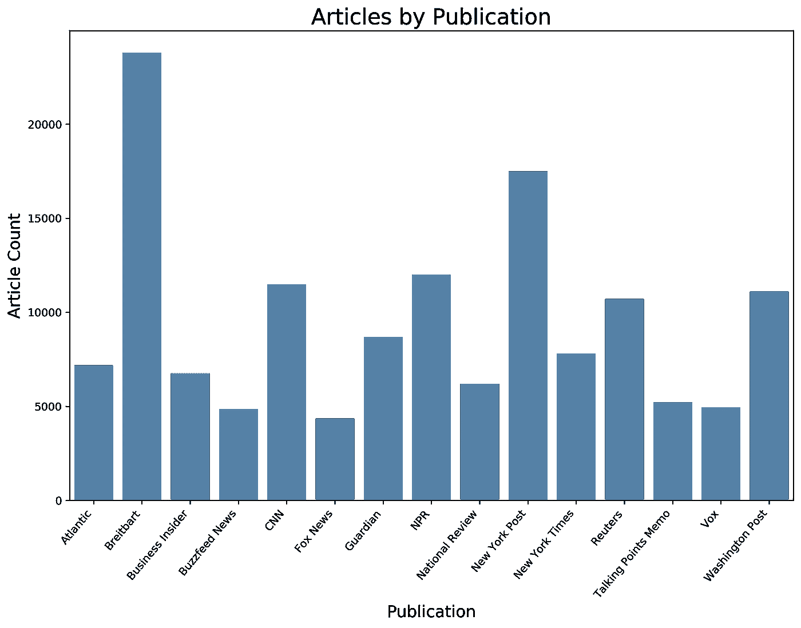
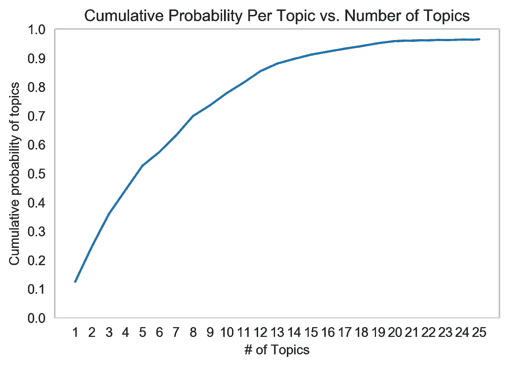
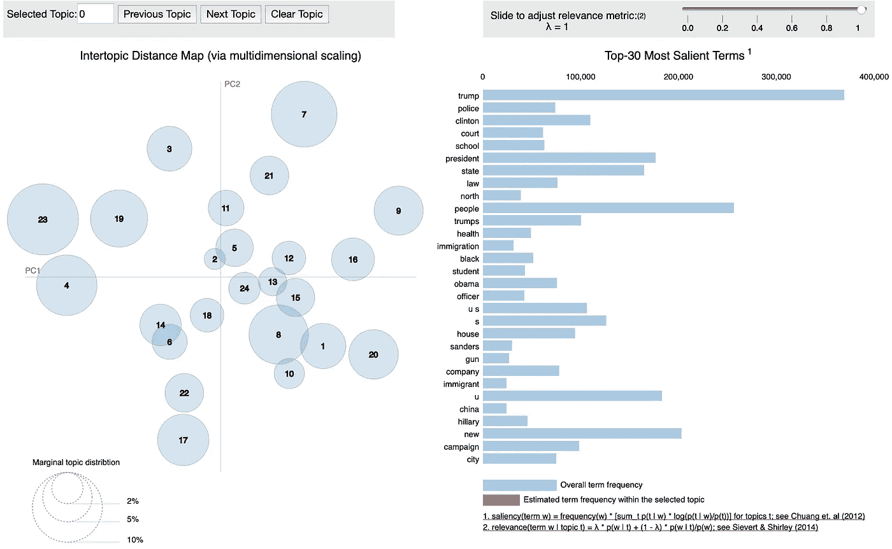
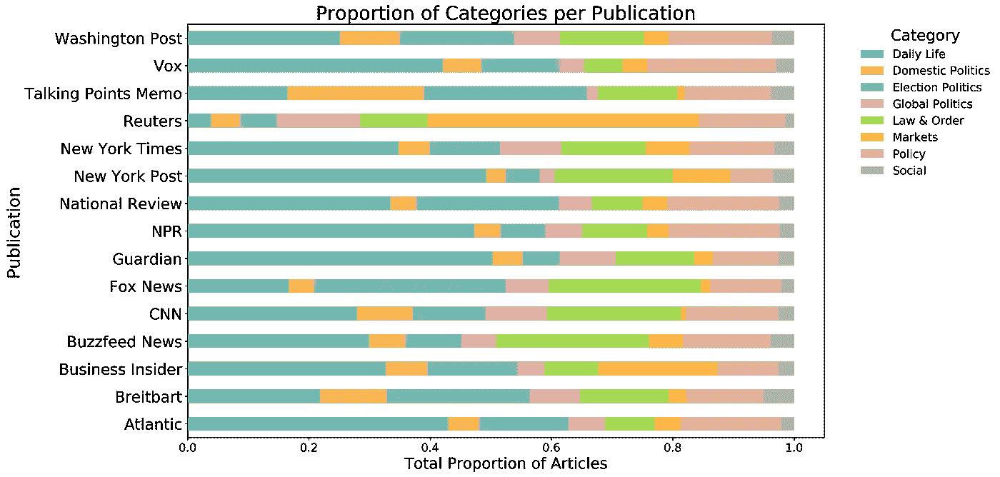
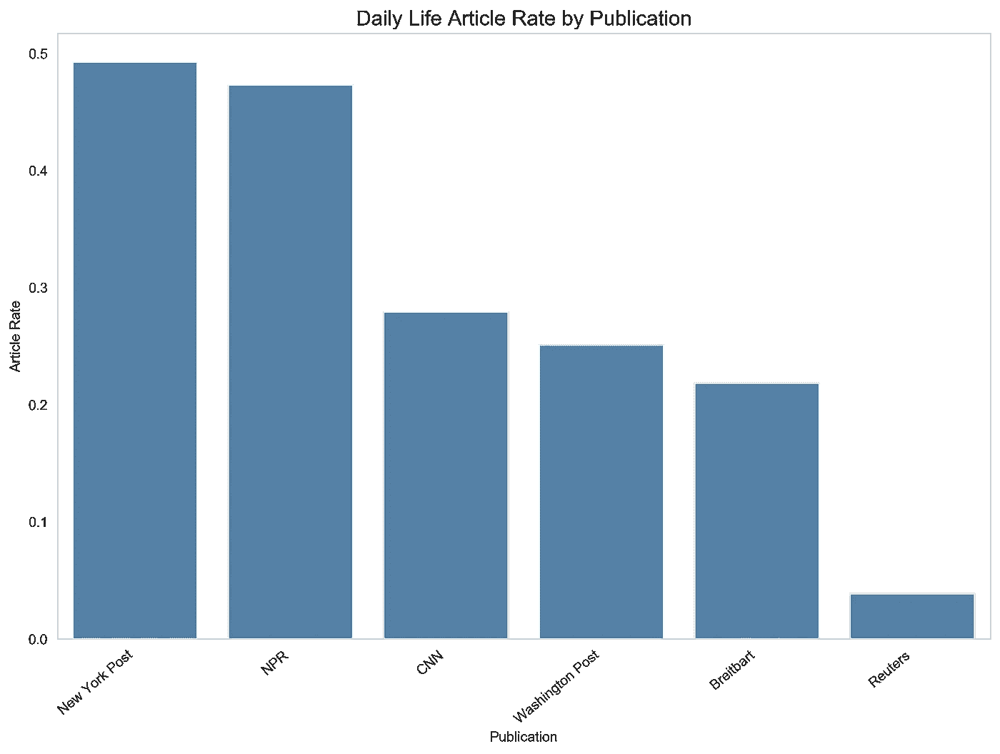
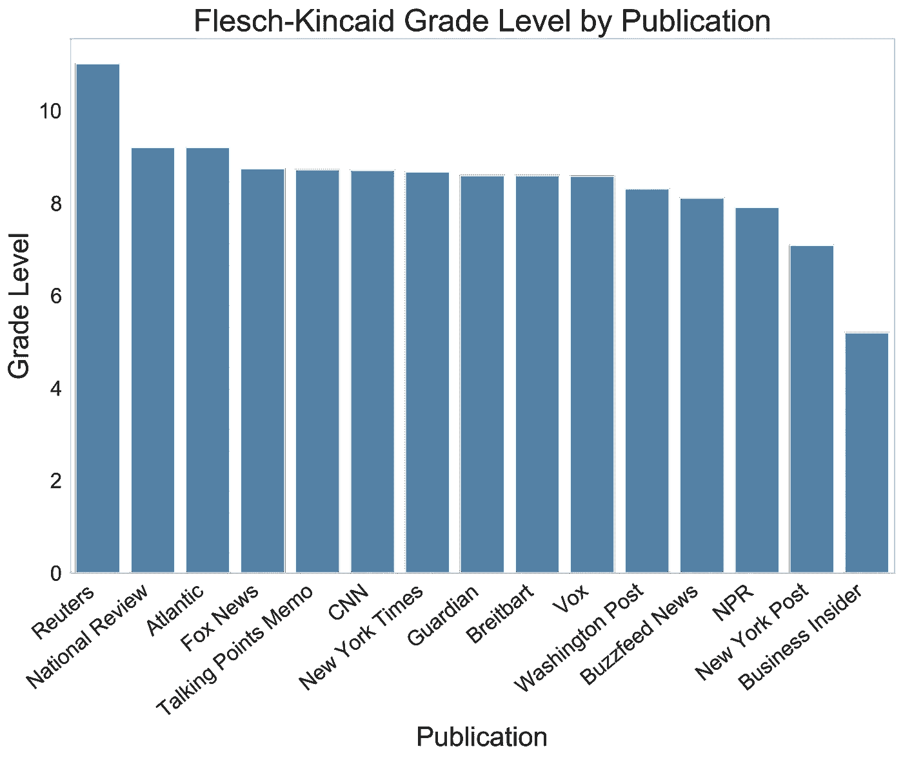
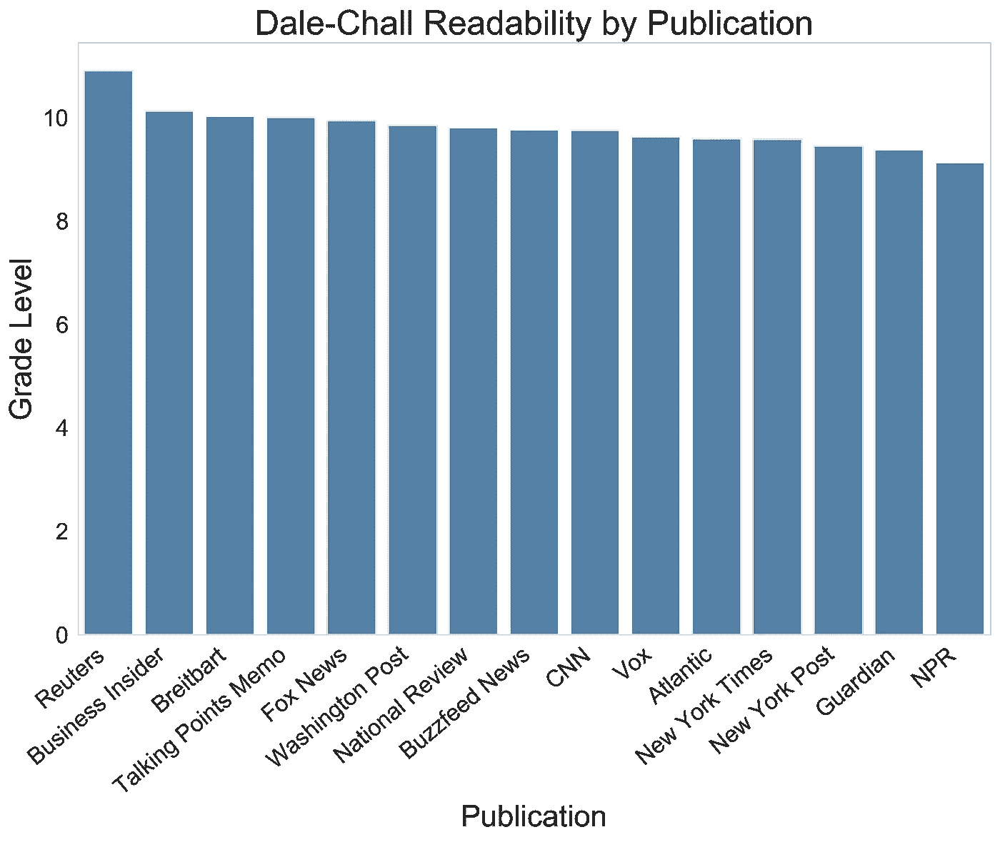
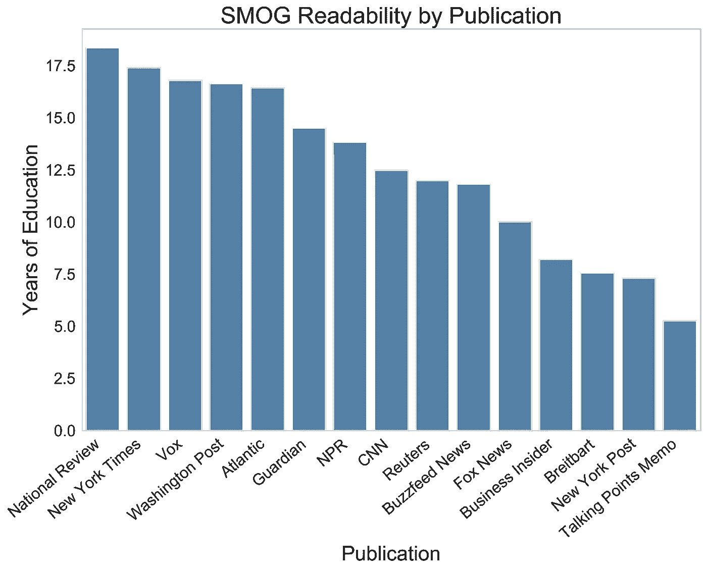

# 什么是新闻？

> 原文：<https://towardsdatascience.com/what-makes-the-news-6b05507724f2?source=collection_archive---------21----------------------->

Photo by [AbsolutVision](https://unsplash.com/@freegraphictoday?utm_source=medium&utm_medium=referral) on [Unsplash](https://unsplash.com?utm_source=medium&utm_medium=referral)

随着智能手机和社交媒体的兴起，几乎可以在任何平台和设备上即时获得新闻。大量的新信息来源对传统新闻媒体造成了重大的负面影响；皮尤研究中心指出，自 2008 年以来，新闻编辑室的工作岗位减少了 25%。考虑到这一点，我想了解一下主要新闻媒体都写了些什么。他们写的都是同一个话题吗？如果是的话，他们是用同样的方式写的吗？如果没有，也许他们有机会扩展到新的写作主题或风格。

# 数据

我从 Kaggle 上的[All News dataset](https://www.kaggle.com/snapcrack/all-the-news)中获得了这个项目的数据，其中包含了来自 15 个主要出版物的超过 14 万篇文章的全文。这些文章主要写于 2016 年和 2017 年，来源于各自出版物网站上的在线文章。文章分发的摘要可以在下面看到:

虽然从文章的最初部分来看，文本相当清晰，但我仍然需要解决几个在使用 unigrams 和 bigrams 进行 LDA 主题建模时可能导致潜在问题的特性。我删除了非 ASCII 字符和标点符号，以确保在后续步骤中只包含有效的单词:

# 主题建模

在尝试建模之前，我使用 NLTK 的 WordNet Lemmatizer 对数据进行了预处理，将单词简化为它们的基本形式。然后，我使用 scikit-learn 的 CountVectorizer 对数据进行了标记，该工具以单词袋方法生成文本中的基本单词数。这种方法创建了大约 4600 个一元和二元模型的稀疏矩阵。

我修改的一些关键参数包括 min_df、max_df 和停用词列表。我将 min_df 设置为 0.01，max_df 设置为 0.99，分别排除不到 1%和超过 99%的文档中的术语。这有助于通过消除过于具体或过于宽泛的术语(导致相同的通用术语出现在几乎每个主题中)来防止在建模中添加噪声。我进一步修改了英语停用词的基本列表，以包括媒体中常用的词，如出版物本身的名称。请参见下面的相关代码:

完成上面的预处理后，我使用了多种方法来确定哪种建模方法会产生最易解释的主题以供进一步分析。我从潜在语义分析(LSA)建模开始(参见本文对 LSA 方法的概述)，它要求用户输入固定数量的主题。虽然实现起来很简单，但我发现来自 LSA 的主题不容易区分，因为相同的关键字出现在多个主题中。

然后，我尝试了一个分级狄利克雷过程(HDP)模型，看看我是否能获得更好的结果。HDP 是潜在狄利克雷分配(LDA)的扩展，旨在解决主题数量未知的情况(参见[本文档](https://radimrehurek.com/gensim/models/hdpmodel.html)了解更多信息)。它推断数据中的主题数量，而不是要求预先输入，并返回每个主题的概率。通过绘制 HDP 模型的累积结果，它返回每个主题的概率，我可以观察额外的主题是否潜在地提供了价值:

根据上面的图表，每个主题的附加值在 20 个主题后急剧下降，这似乎是一个值得研究的主题数量。然而，通读了生成的主题后，我遇到了与 LSA 相同的问题；这些话题不容易解释，而且似乎相互交融。

我通过流行的 gensim Python 包转向了 LDA 建模。根据上面的分析，我将最初的主题数量设置为 20 个，在多次调整我定制的停用词后，结果看起来很有希望。我重新运行了这个模型，增加了主题的数量，直到达到 40 个，然后检查结果，看看什么最有意义。我确定了 24 个最合理的主题，并使用 pyLDAvis 模块将它们可视化:

上面的可视化显示了每个主题的距离图，理想情况下，圆圈应该很大，并且重叠最小，以便区分。由于这些主题既有意义，又从视觉上看起来很强大，我继续解释和测试我的结果。

# 主题可视化

为了使解释和分析更加简单，我将上面的 24 个主题分成了 8 个主要类别(具体请参见我的 [Github](https://github.com/mlan93/what-makes-the-news) )。下面是每个出版物的每个类别中的文章分布图:

仅从视觉上看分布，我们可以看到出版物可能侧重于不同的类别。例如，路透社关于市场的文章比例似乎最高，而福克斯新闻频道倾向于支持选举政治。

虽然看图表足以进行粗略的分析，但我想通过多重假设 A/B 测试对出版物之间的差异进行更技术性的分析。

# 多重假设 A/B 检验

A/B 测试最基本的场景是在两个变量(A 和 B)之间进行随机实验，并确定它们之间的差异是否具有统计学意义。在我的例子中，我想比较来自多个出版物的每个类别的文章比率，并假设所有出版物都有相同的分布。因此，我需要同时进行多重比较，对每份出版物中足够数量的文章进行检查。

为此，我决定只测试文章数量排名前 6 位的出版物(布莱巴特、CNN、NPR、纽约邮报、路透社和华盛顿邮报)。我用 Python 创建了几个自定义函数来计算每次比较的 p 值:

然而，为了确定这些 p 值是否具有统计学意义，我需要解决多重比较产生的多重性问题。如本文的[中所述，如果不正确调整所需的显著性α，A/B 测试中的每一次额外比较都会增加 I 型错误的几率。我将自定义函数与 statsmodels 的 multitest 模块相结合，对我的 alpha 进行了](/the-multiple-comparisons-problem-e5573e8b9578) [Holm-Bonferroni](https://en.wikipedia.org/wiki/Holm%E2%80%93Bonferroni_method) 校正，以便进行分析:

测试结果确定了 6 种出版物之间日常生活文章比率的统计差异；没有发现任何其他类别的显著差异。日常生活用品的不同费率如下所示:

区别很明显，路透社很少报道日常生活，而《纽约邮报》和《NPR》则重点报道日常生活。

# 可读性级别

作为检查各种出版物的最后一步，我决定看看每种出版物的可读性水平。使用 SpaCy-readability 模块，我确定了基于出版物的 3 个指标的平均可读性:

[Flesch-Kincaid 等级级别](https://en.wikipedia.org/wiki/Flesch%E2%80%93Kincaid_readability_tests)是一种常用的度量标准，通过每句话的字数和每个单词的音节数来确定可读性；更多的单词和音节意味着需要更高的教育水平。按照这个标准，路透社是最难阅读的，需要十年级以上的教育，而商业内幕是最容易的。

[戴尔-查尔可读性](https://en.wikipedia.org/wiki/Dale%E2%80%93Chall_readability_formula)指标也使用每句话的字数，但将这个比率乘以“难词”的比率(基于美国四年级学生容易理解的 3000 个单词的列表)。路透社仍然是最难的，而商业内幕现在排名第二。《NPR》现在是最容易阅读的，可能是因为单词的用法。

[烟雾可读性](https://en.wikipedia.org/wiki/SMOG)指标提供了一种替代 Flesch-Kincaid 的测量方法，使用了一种基于文本中句子样本内多音节的公式。SMOG 通常更严格，可能会在某些类型的文本中提供更高的难度，如[医疗保健材料](https://www.ncbi.nlm.nih.gov/pmc/articles/PMC3049622/)。在这种标准下,《国家评论》变得最难阅读，而《谈话要点备忘录》的短文被认为非常直截了当。

这项研究的目的是看一看一组出版物的主题和可读性，并注意它们之间的差异。这为媒体公司或其他感兴趣的研究人员提供了一个机会，来研究这些趋势，看看这些出版物在未来是否有扩展的领域(例如，路透社可以考虑以更简单的格式提供日常生活文章的独立出版物或博客，这不会与主要出版物直接竞争)。有了更多的时间，我想扩大出版物的数量，并获得更多的文章，看看这些结果是否随着时间的推移在更大的媒体景观中成立。

对基础代码感兴趣的，请看[我的 Github](https://github.com/mlan93/what-makes-the-news) 。