# 是什么推动了比特币？

> 原文：<https://towardsdatascience.com/what-moves-bitcoin-c06f7b46d2e4?source=collection_archive---------15----------------------->

## 通过**新闻**头条预测比特币。

*由* [*巴勃罗*](https://www.linkedin.com/in/pablo-garza-moreno-828298166/) *和* [*杰罗姆*](https://twitter.com/jeroaranda) *。*

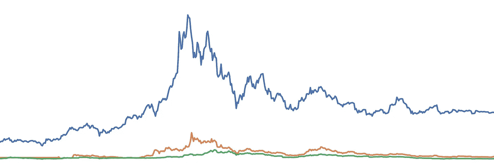

*   替代数据探索( **NLP** )
*   预测模型
*   投资组合模拟( **30%收益率**
*   结论
*   **端**的 Jupyter 笔记本代码参考

# 介绍

比特币是一种去中心化的加密货币，没有管理人或央行。它是由一个名叫“*”的不知名用户在 **2008** 年创建的。比特币可以通过**挖掘**或通过用户之间的直接**出售**获得，但价格并不取决于一个潜在的或某种内在的价值，价格由**供给**和**需求**决定。*

*挖掘一枚比特币的过程需要两步:*

1.  *验证 1 MB 事务的信息是否**有效**，这可以是一个事务或数千个事务，取决于每个事务的信息。这部分相对较快，一旦**步骤二**完成，这个 1 MB 的块将被添加到事务的公共信息中。*
2.  *一旦交易信息得到验证，挖掘比特币的用户就有资格赢得比特币，但为了保持添加到“区块链”的区块数量随着时间的推移保持恒定，需要执行一个名为“**工作证明**的过程。在这个过程中，试图挖掘的用户需要找到一个“**哈希**”，一个满足**程序**建立的要求的 64 位六进制数。找到这个数的概率是 13 万亿分之一，所以要找到它需要很大的计算能力和资源。一旦找到“**目标哈希**”，新的块将被接受，找到哈希的用户将获得比特币奖励。*

*通过这种方式，**挖掘**比特币的用户保持交易**有效**，因此，由于能够比其他人更快地找到目标哈希所需的资源量和计算能力，欺诈变得不可行。*

***开采**获得的奖金，每增加 21 万块就平分一半，大概需要 4 年时间。这样做的目的是比特币因其短缺而增值，在某种程度上，有限数量的比特币将存在，而**不可能开采更多的**，但为了保持对矿工的激励和保持交易过程的安全，矿工将获得佣金，佣金随着开采奖金的减少而增加。*

*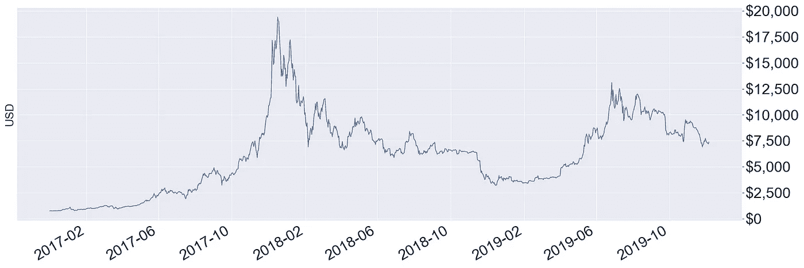*

***Figure 0\.** Bitcoin price through time.*

*另一方面，随着时间的推移，比特币的走势一直非常**波动**。不到三年前，比特币的价格约为**1000 美元**，而截至 2019 年 12 月 1 日的价格约为**7400 美元**，升值 640%，但不仅如此，价格在不到 2 天内下跌 25%之前达到了近 19000 美元的水平。因此，比特币一直受到价格大幅变化的影响，这种波动性使得投资这种加密货币**风险非常大，对寻求风险可控**回报更适中的投资者**来说没有吸引力。***

*这就是我们如何得出我们的工作假设的:*

> ***有没有可能通过新闻分析预测比特币的走势？***

*这篇文章的目的是通过统计模型实现不同的**预测**，尝试看看**新闻**中出现的词语与比特币走势之间是否存在联系。此外，我们试图看看它是否能帮助我们**预测**加密货币**的未来走势**，并通过**投资组合**将这些预测货币化。利用市场的流动性，我们将观察一笔**100，000** 美元的资本在比特币动态头寸中的演变。*

# *探索性数据分析*

*需要特别提到的是，比特币不是在受监管的交易所进行交易，而是直接在用户之间进行交易，“**点对点**”，其中绝大多数是钱包用户。由于这个原因，比特币总是可以在一天的任何时间进行交易，为了衡量每日变化，采用了传统市场的开盘(**开盘**)和收盘价(**价格)**方法。*

*请记住，我们的目标变量是**开仓**对**价格的变化，**是**分类**变量。伴随这一变量的，还有其他定义每天比特币市场的变量。其中有**高、** **低**等。然而，这些变量并不真正与我们的目标变量相关，显然**时间序列**模型可以更好地解释这些变量，然而，这不是本项目的重点。*

*自然语言处理( **NLP** )的概念就是在这里产生的。我们的模型将用于预测我们的**开盘价**对**价格**目标变量的信息来自引言中提到的报纸标题。谨慎的做法是在这里提出两个新概念。**文本矢量器**和 **N 元语法**。*

*文本矢量化工具只不过是一种矢量化文本的方法，值得冗余，也就是说，在某个空间中给每个单词或文本分配一个矢量。有很多方法可以做到这一点，一些技术为你的词汇表中的每个单词分配一个独一无二的向量，为你的语料库中的所有单词分配一个有趣的名字。这是一个由 0 和一个 1 组成的向量，位于你的词汇表中单词索引的相应位置。*

*对文本进行矢量化的一些其他方式为每个单词分配一个向量，该向量在多维空间的特定几何结构中对上下文进行编码，例如 **Word2Vec** 空间。在我们的特定案例中，在比特币市场开盘之前，使用了一个矢量器来计算新闻中每个词和每两个词在一天 12 个小时中的出现次数。*

*为了更好地理解一个单词和两个单词，我们可以检查一下 **N-grams** 的概念。让我们看一个下一句的例子:*

# ***“比特币是一个非常不稳定但非常有效的市场，比特币万岁”***

*在前一句话中，所有的 **1-grams** 将组成列表:*

*   *比特币*
*   *是*
*   *a*
*   *很*
*   *有效的*
*   *等等。*

*每个单词一个条目。**两个单词的列表**或我们提到的两个单词将是:*

*   *比特币是*
*   *是一个*
*   *非常...的*
*   *非常不稳定*
*   *等等。*

*这些**双词**用于从经常出现的成对单词中提取信息，例如 **New York。现在我们明白了，假设之前写的句子是 12 小时内唯一的标题。到此观察连同**的价格打开，**的价格**和**的价格成为我们的客观变量。将添加一个向量，其中计数每个 1 字和 2 字的出现。也就是说，在列`mercado`的相应单元格中，它的值为 1，因为它只被提及一次，而在`bitcoin` 和`very`列中，它的值为 2，因为它们被提及两次，因此对于词汇表中的所有 n 元文法计数都是如此。***

*为了更好地理解我们的**数据**，让我们来看看下面的 2 轴曲线图:*

*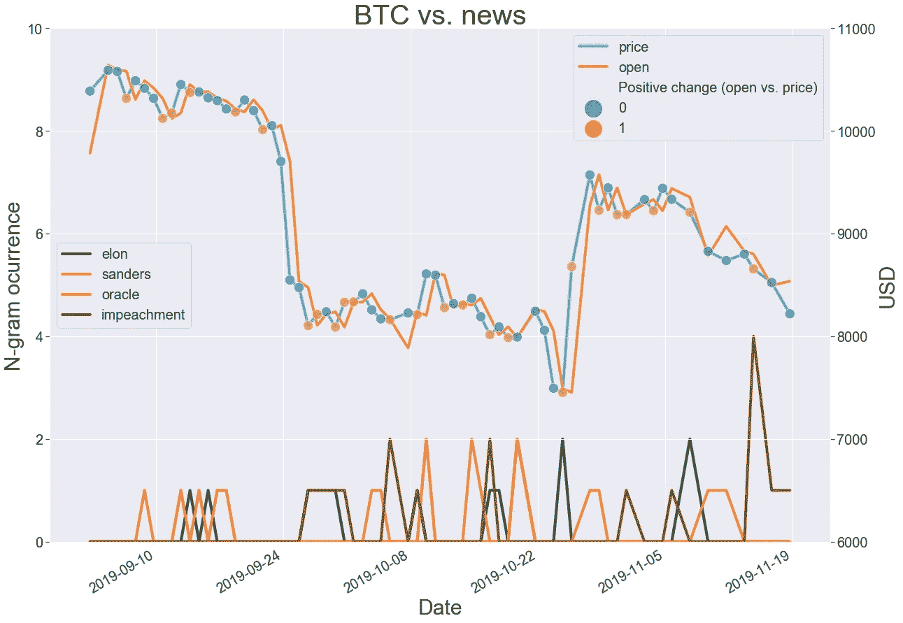*

***Figure 1.** Interesting words, open, price and our target variable.*

*如图 1 所示，在对比特币市场价值进行观察的每一天，也会出现像 **elon** 等词的数量。换句话说，这个词在观察每个**打开**值之前的 12 小时的标题中出现了多少次。除了我们的数据集出现了 **2960** 个单词和 2 个单词之外，很难仅从该图中提取信息！*

*值得一提的是，提取这样一个**干净的**数据集所做的预处理并不简单，幸运的是有像[**open blender**](https://www.openblender.io/)**这样的工具来促进所有这些工作。通过对其 **API** 的一次调用，可以从其他新闻来源**获得一组标题数据，这些数据与来自更多市场的数值**混合，并具有 12 小时窗口或其他配置，该调用旨在用于 **R** 和 **Python** 用户，以便他们能够以非常流畅的方式训练 **NLP** 模型或其他**机器学习者**。***

***数据和**目标**变量直接到你的`DataFrame`本例中融合了 [**BTC 到**美元和](https://www.openblender.io/#/dataset/explore/5d4c3b789516290b02fe3e24)消息。***

***让我们看看 **API** 调用:***

```
***import **OpenBlender**
import pandas as pd
import json
action = 'API_createTextVectorizer'vectorizer_parameters = {
    'token' : 'your_token',
    'id_user' : 'your_id_user',
    'name' : 'News Headlines',
    '**anchor**':{'id_dataset' : '5d571f9e9516293a12ad4f6d', 'include_features' : ['title']},
    '**ngram_range**' : {'min' : 1, 'max' : 2},
    'language' : 'en',
    '**remove_stop_words**' : 'on',
    'min_count_limit' : 2
}
res = OpenBlender.call(action, vectorizer_parameters)***
```

***这个调用从新闻标题创建了**文本矢量器**，稍后将与比特币市场数据混合，让我们看看它最重要的参数:***

*   *****锚**:新闻数据集的 id 和要作为源包含的特征的名称(在本例中只有' **title 【T7 ')*****
*   *****ngram_range** :将被标记的单词集的最小和最大长度***
*   *****remove_stop_words** :这样就从源头上消除了停用词***

***接下来， **API** 调用用`**pullObservationsToDF()**` 函数将融入比特币行情的头条信息直接带入`DataFrame`:***

```
***parameters = { 
 ‘token’:’your_token’,
 ‘id_user’:’your_user_id',
 ‘id_dataset’:’5d4c3af79516290b01c83f51',
 ‘**target_threshold**’ : {‘feature’:’change’,’success_thr_over’:0},
 ‘**lag_target_feature**’ : {‘feature’:’change_over_0', ‘periods’:1},
 ‘blends’:[{‘id_blend’:’5de020789516293a833f5818',
 ‘**blend_type**’ : ‘text_ts’,
 ‘restriction’ : ‘predictive’,
 ‘blend_class’ : ‘closest_observation’, 
 ‘specifications’:{‘time_interval_size’ : 3600*12 }}],
 ‘date_filter’:{‘start_date’:’2019–08–20T16:59:35.825Z’,
 ‘end_date’:’2019–11–04T17:59:35.825Z’},
 ‘drop_non_numeric’ : 1
}
def **pullObservationsToDF**(parameters):
    action = 'API_getObservationsFromDataset'
    df = pd.read_json(json.dumps(OpenBlender.call(action,parameters)['sample'])              ,convert_dates=False,convert_axes=False).sort_values('timestamp', ascending=False)
    df.reset_index(drop=True, inplace=True)
    return df
df = pullObservationsToDF(parameters)***
```

***这个神奇的调用正在准备 **target_threshold** 字典键中的目标变量，而 **lag_target_feature** 比它滞后了一天，让我们看看其他有趣的参数:***

*   ***id _ blend:text vector 的 id，它是第一个 API 调用的输出。***
*   *****blend _ type**:‘text _ ts’所以它知道这是文本和时间戳的混合。***
*   *****规格**:过去的最大时间，以秒为单位，在本例中为 12 小时(3600*12)。这只意味着每一次比特币价格观察都会用过去 12 小时的新闻来预测。***

***[**OpenBlender**](http://OpenBlender.io) 的灵活性允许你从大量的报纸、股票市场以及其他**空间**或**时间序列**数据集中进行这种**混合**。***

***为了继续探索我们的数据，让我们通过显示在我们所有的 **68** 观察中出现**更多**的词语来看看我们的标题在谈论什么:***

***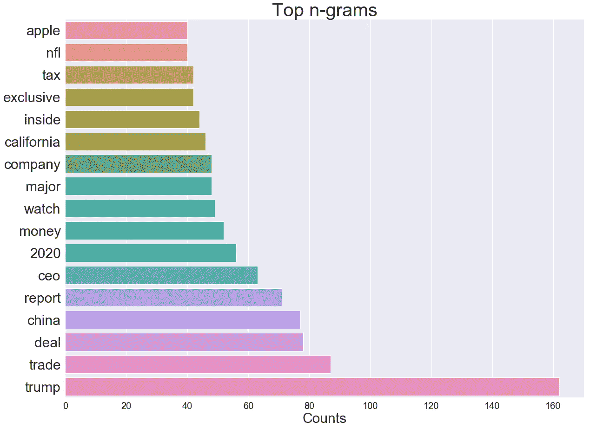***

*****Figure 2.** Most mentioned words and 2-words throughout our sample.***

***很明显，我们的数据集在谈论`trump`、`china`和其他**当前**的热门问题，然而，这并不能很好地说明它们如何影响比特币市场。为了获得更好的**洞察力，**让我们看看 **n 元图**与我们的目标变量最相关和最不相关的**。*****

***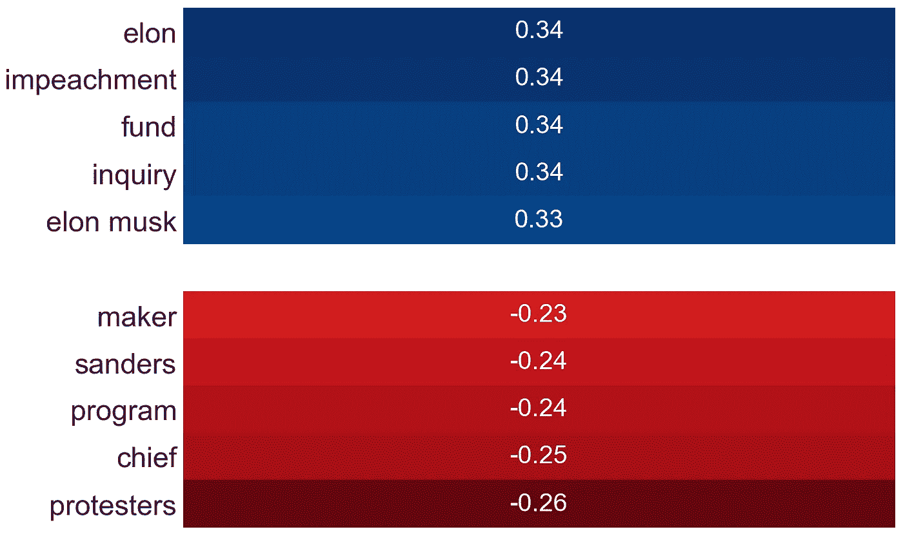***

*****Figure 3.** N-grams most and least correlated with the positive change between the opening and closing of bitcoin.***

*   *****弹劾**能否影响美元价格从而鼓励购买比特币？***
*   *****埃隆·马斯克**在比特币上有大笔投资，他的项目**的成败会影响**比特币吗？***

***这些和其他叙述可以从更深入的 **NLP** 分析中产生，超出了本文的范围，我们将继续通过主成分分析( **PCA)** 来改善我们对数据的理解，主成分分析将我们观察到的 2900 多个变量的维度减少到 2，将它们投影到可能是我们观察到的*最佳照片*中。或者用另一种方式解释，最大化数据总方差的 2 个正交轴:***

***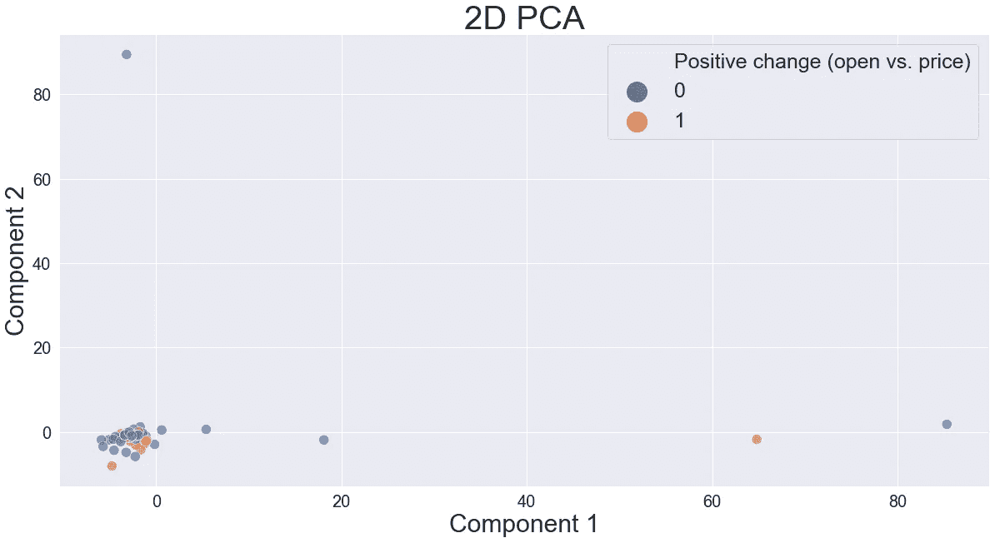***

*****Figure 4.** Our database in its first 2 main components.***

***在这个**预测**中，找到一些允许我们分割我们的观测值以生成我们的目标变量的适当预测的截点似乎很复杂，但是，这两个主要成分甚至不能解释我们观测值总方差的 **10%** ，特别是因为每个观测值的**高维度**。幸运的是，我们在图 3 中的相关性让我们充满热情，我们将能够从标题中提取信息，以开发一个良好的预测。***

# ***预测模型***

***请记住，我们有兴趣预测的变量是**正变化(开盘价与价格)，**即 2 类:***

*   *****1** 如果价格和开盘价之差为**正值。*****
*   *****0** 如果是**阴性。*****

***这个二元分类问题是用以下模型解决的:***

*   *****LDA*****
*   *****QDA*****
*   *****逻辑回归*****
*   *****随机森林*****

***这些模型使用第一个 **70%** 的数据进行训练，最后一个 **30%** 的数据按日期顺序进行测试。***

***上述模型中， **LDA** 和 **Logistic 回归**是线性模型，而 **QDA** 和**随机森林**不是。 **LDA** 和 **QDA** 分别指线性和二次判别分析。这两个模型试图找到一个线性或二次函数，使目标变量生成的组之间的距离最大化，同时使每个组中的密度最小化。***

***其中一些模型的问题是在解释它们生成的结果时存在困难，特别是在**逻辑回归**和**随机森林**的情况下。例如，随机森林是一种生成随机决策树的模型，这些决策树以这样一种方式进行调整，即它们**最大化**预测结果。***

***评估了所有这些模型，令人惊讶的是，所有模型中最简单的模型 **LDA、**被证明是预测我们的目标变量的最佳模型，准确率为 **63%** 。值得一提的是，其余的模型生成的精度较低，但都比**随机**要好。足够的证据支持我们的工作假说。现在让我们看看线性判别函数的投影观测值和 n 元图之间最重要的**相关性**:***

***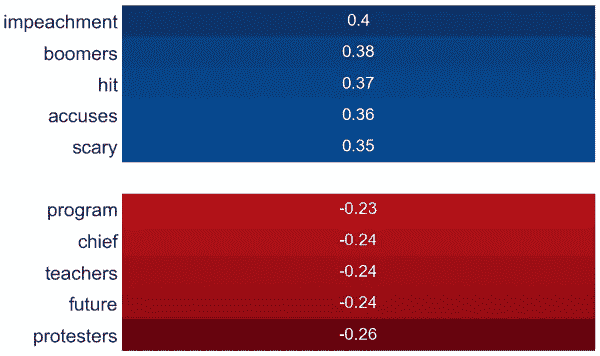***

*****Figure 5.** Correlations between n-grams and the projected observations in the discriminant function.***

***这些相关性可以解释如下，高**相关性增加判别函数中的值，低**相关性减少该值。*******

***该判别函数旨在将目标变量给定的标签用一个**切割点**分开，也就是说，如果 12 小时的新闻落在判别函数的顶部，我们预测价格和开盘价之间的变化将为正，而如果该值比切割点小**，我们将预测变化为负。*****

***为了更好地理解这一预测，让我们来看看下面的区域地图，在这里我们可以直观地看到这一行为:***

***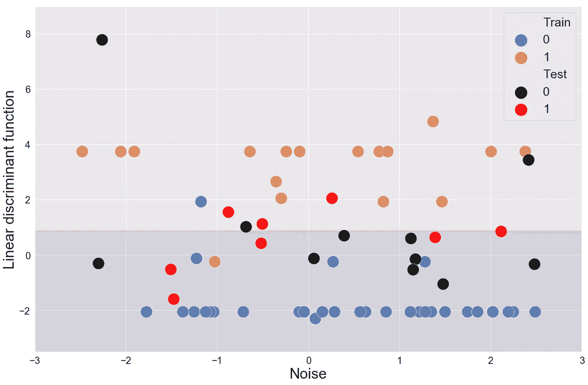***

*****Figure 6.** Territorial map generated from the fitted LDA model.***

***每个观察值，即在 12 小时的航向中出现的 **N 元图**被投影到在垂直轴上定义的判别函数。划分区域的**切割点**允许我们生成预测，即**底部**区域将预测变化为负，而**顶部**则相反。 **100%** 精度是所有蓝色和黑色的观察值落在较低的区域，橙色和红色的观察值落在较高的区域。尽管我们的预测有误差，但它仍然比掷硬币给出的结果好得多，参见我们的模型输出的**混淆矩阵**:***

***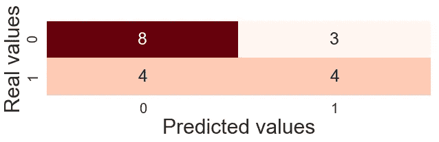***

*****Figure 7.** Confusion matrix generated from the predictions obtained by the LDA model.***

***该图显示了我们的模型在预测中的成功和错误，在 **4 种情况下**该模型预测上升，事实上，它没有发生，在 **3 种情况下**我们未能预测下降。8 次 **8 次**有人预测价格会下跌，事实上它下跌了，而 **4 次**有人预测价格会上涨，而且上涨了。这 12 次成功，与矩阵的**轨迹**重合，给出了 **63%** 的准确度。***

# ***投资组合模拟***

***作为第一步，我们观察比特币的价格是否会在第二天上涨和下跌，此外，我们还观察初始资本为**100，000 美元**的投资组合的演变。为了确定这种演变，我们依赖于一个**动态投资组合**，也就是说，这个投资组合每天都在改变头寸，因为在开市前对比特币走势的预测会更新。***

***我们的**动态投资组合**工作如下。位置**长**或**短**定义如下:***

***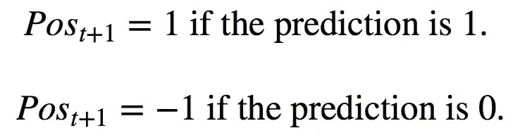***

***其中 1 的仓位代表比特币的**多头**仓位，也就是我们买入比特币是为了以收盘价卖出。如果我们的预测是正确的，比特币的价格上涨，这对投资者来说意味着**收益**，因为它将以高于购买价格的价格出售。另一方面，头寸-1 代表比特币的**空头**头寸，即我们借入比特币并在此刻卖出，这是我们欠另一个投资者的比特币。在一天结束时，在传统市场收盘时，我们必须购买比特币，以将它们归还给原始所有者，因此，如果我们的预测是正确的，那么这代表着一种收益，因为我们以高于回购价格的价格出售。***

***让我们也看到，对于资本的**演变**来说，重要的是预测是正确的，并且在**第一类**和**第二类**错误之间没有区别，比如假阳性和假阴性，因为在这两种情况下，我们都会损失金钱，并且在问题的背景下，没有一个比另一个更糟。***

***现在，资本的**演变**将发生如下变化:***

***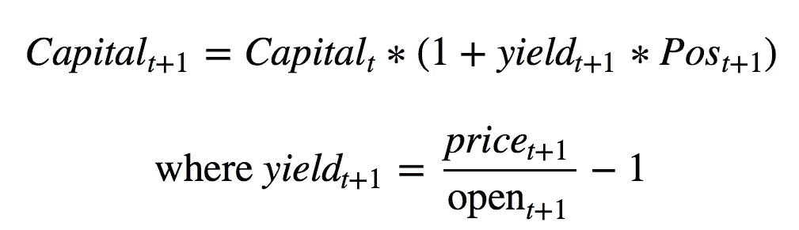***

***如果**收益**为负，并且我们的预测是正确的，那么我们在行动中持有**空头**头寸，这代表资本收益。让我们看到，我们资本损失的唯一方式是我们的预测是不正确的，因为这样,**收益**和**位置**相乘具有相反的符号，因此我们有完全负的表现。这里我们看到**产量**是分析的主要部分。如果我们正确地预测了价格低波动的日子，即**低**收益的日子，而错误地预测了价格**高**波动的日子，即**收益**绝对值高的日子，即使模型的**精度水平**大于 50%，我们也会遭受巨大的损失。***

***此外，重要的是要看到我们采取什么样的假设才能**模拟**投资组合。回想一下，该模型是用 70 %的数据来训练的，并且该相同的模型在 30 %的剩余数据中预测每个观察值。这些假设如下:***

1.  *****完美市场**:市场反映的价格拥有所有的公开信息，也就是说，没有投资者拥有可以代表非正常利润的特权信息。此外，由于总是有供应商和索赔者，市场具有**流动性**。这一假设很重要，因为模拟考虑到在市场开放时，总有人想要**卖出**和**买入**，我们每天都会改变我们的**头寸**。***
2.  *****空头头寸可以不受限制**:空头头寸受到两个因素的限制，首先是能否找到拥有比特币并愿意借给投资者的人。***
3.  *****零交易成本**:在现实生活中，如上所述，当兑换比特币时，投资者必须**支付**交易佣金。***
4.  *****两个头寸的杠杆率均为 1**:为了能够进行空头交易，投资者需要一定的杠杆率，这被定义为其拥有的每单位资本中以比特币借出的美元数量。对于这个模型，我们认为杠杆水平为 1，这不是对空头头寸的限制，补充了假设 2。***

***在下图中想象我们投资组合的**表现**:***

***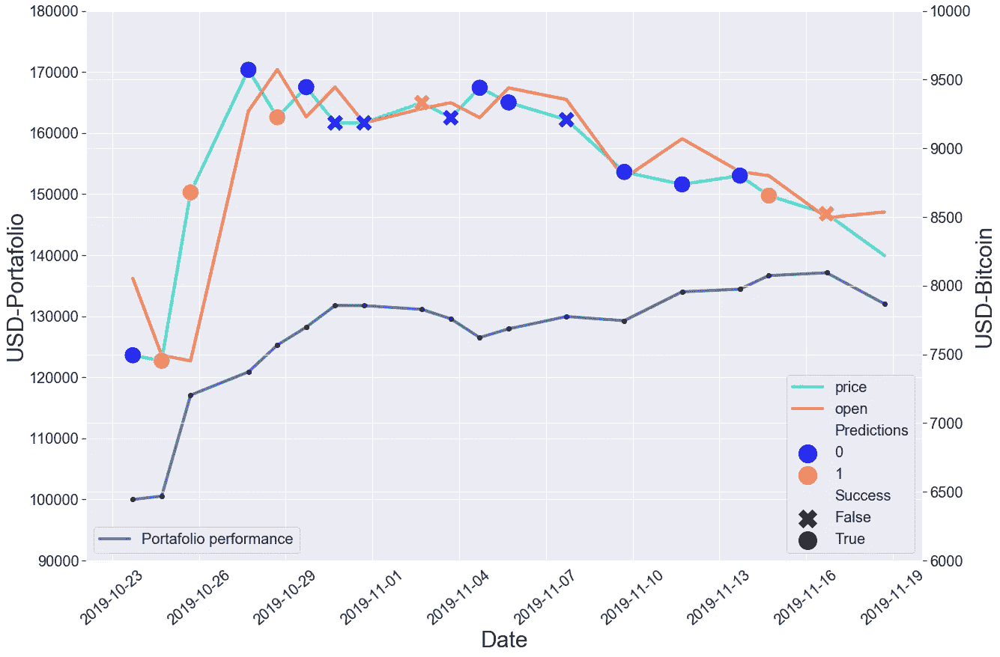***

*****Figure 8.** Evolution of our portfolio together with the bitcoin market and our predictions.***

***我们看到资本的演变是**增加**，尽管我们对资本流失的节点有不正确的预测。在代表几乎一个日历月的 **18** 预测观察之后，投资组合的年化收益率约为 **30 %** 。我们之前看到，就预测而言，最好的模型是 **LDA** ，其准确度为 **63** %。先前的模型预测了超过 50%的测试观测值，然而，这并不意味着我们可以**确保**的正回报。请记住，资本的演变取决于**正确的**预测和每日**收益率**，如果预测数量增加，但在收益率绝对值更大时产生误差，那么资本的演变可能会变得递减，也就是说，具有负的月度和年度回报。***

# ***后续步骤***

***我们认为，试图衡量这种**高波动性**加密货币的走势与媒体公开信息之间的关系是可以改进的。因此，我们建议**遵循**的这些可能步骤:***

1.  ***通过添加其他媒体如**、**等来包含更多的**信息**。这样做的目的是包括不一定是商业的手段，并获得具有更多更好信息的预测模型，以更好地**拟合**预测模型。***
2.  *****通过使用时间序列来微调**模型。时间序列对于预测不同金融资产的收益有很大的帮助，例如， **ARMA** 模型可以提高**精度水平**。***
3.  *****动态算法**，每天用更多信息重新训练，可以实时**做出投资决策**。随着新信息的出现，对模型进行重新训练是很重要的，这样预测模型就可以每天提高其准确性**。此外，**实时决策**可以帮助该模型在投资组合**收益率**方面变得更好，因为如果在某个时候发布了一个包含与比特币价格相关的词语的故事，就可以立即建仓。*****
4.  *******带风险分析的动态投资组合。**最后，为了降低动态投资组合的**风险**，考虑预测的**风险**是很重要的。为此，有必要继续研究一个**概率**函数，以了解我们的预测有多安全，实施资本的动态分配涵盖了投资者的巨大的不利回报。*****

# *****结论*****

*****让我们回顾一下我们之前通过研究看到的内容。首先，我们得出结论，我们的工作**假设**得到了证实，因为在**标题**和**比特币**运动中出现的词语之间存在联系。这种关系存在并允许**预测**具有有限的确定性。我们还注意到，有一些词与比特币的走势更相关，在某些情况下，它们有一个**金融解释**，关于为什么它们的相关性有一个**特定的符号。*******

*****最佳模型是线性判别分析或 **LDA** 模型，其准确度水平为 **63 %** 。此外，我们尝试了其他预测模型，其中第一个是通过使用主成分分析或 **PCA** ，但团队认为该模型的结果并不重要，因为前两个主成分几乎不能解释数据可变性的 **10.5 %** 。*****

*****最后，我们看到，使用这些预测，我们可以看到资本为**100，000 美元**的投资组合的演变，并且在预测的日历月中其收益率为 **30 %** 。以上谈到了预测模型在**金融**中的可能应用，以及这些变量之间的关系可以**货币化**。*****

********来自《走向数据科学》编辑的提示:*** *虽然我们允许独立作者根据我们的* [*规则和指导方针*](/questions-96667b06af5) *发表文章，但我们并不认可每个作者的贡献。你不应该在没有寻求专业建议的情况下依赖一个作者的作品。详见我们的* [*读者术语*](/readers-terms-b5d780a700a4) *。******

> *****感谢[费德里科·里弗罗尔](https://medium.com/u/b6be3377832b?source=post_page-----c06f7b46d2e4--------------------------------)，因为这项研究是基于他的[教程](https://medium.com/@federicoriveroll/predicting-bitcoin-price-with-business-news-python-f3bcf60f5818)中的想法，在这里找到代码为[的 Jupyter 笔记本。](https://github.com/jeroaranda/jeroaranda.github.io/blob/master/bitcoin_predictor_entregable.ipynb)*****

*****[](https://coincodecap.com)*****