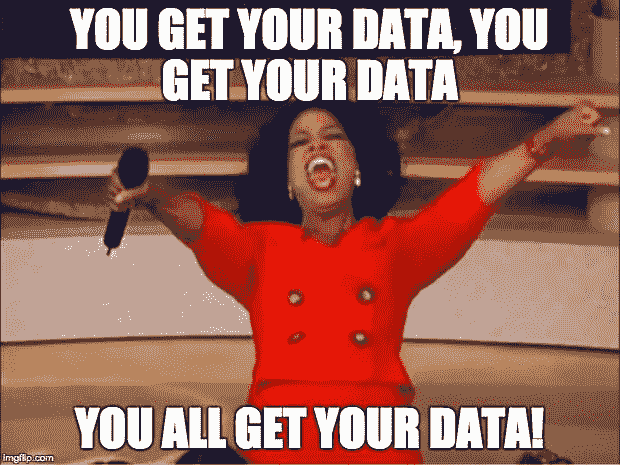
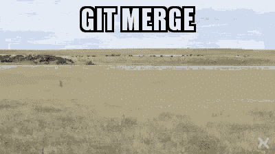

# 我的数据科学学位没有教会我什么—第 1 部分

> 原文：<https://towardsdatascience.com/what-my-data-science-degree-did-not-teach-me-part-1-3d7ff23875e5?source=collection_archive---------5----------------------->

## &在开始我的数据科学职业生涯之前，我想知道些什么。

Photo by [Nathan Dumlao](https://unsplash.com/@nate_dumlao?utm_source=medium&utm_medium=referral) on [Unsplash](https://unsplash.com?utm_source=medium&utm_medium=referral)

  T 三年前，我从数据科学硕士毕业，满脑子都是 AI 梦想和疯狂的野心。这个学位给了我进入这个领域的知识、信心和动力，我坚信如果没有这个学位，我永远不会成为一名数据科学家。我最近写了一篇文章，讲述了我从销售工作到成为一名数据科学家的不寻常的道路，其中我也提到了我的学位以及在此期间我所面临的挣扎。

当我回首往事时，我当然看到我的主人给了我巨大的帮助，让我有了一个开始。然而，**有许多相关的要点，我的学术训练并没有解决**。不要误解我，我不怪大学也不怪学术团队。数据科学和人工智能领域目前的扩张速度仍然太高，学术机构无法以同样的速度适应。此外，硕士学位的时间和资源限制限制了可以教授的内容。然而，当我进入这个领域时，这份工作的许多困难或基本方面我都不知道。本文涵盖了我在数据科学领域 3 年职业生涯中发现的第一部分。

编者按:这些发现大部分是由我自己的专业经验决定的，部分来自我以前和现在的同事的经验。其他数据科学家可能经历了完全不同的问题。

# 访问数据有时感觉像是不可能完成的任务

访问数据是我在作为数据科学家的职业生涯中遇到的最大挑战之一，这是我在接受学术培训后从未想到的。这听起来可能有点荒谬和天真，但我相信我的利益相关者会准备好建立数据连接，让我这个数据科学家分析他们的数据集。我很快意识到我错了。关于数据可访问性或数据提取的问题通常发生在充满复杂流程和法规遵从性的大公司中。然而，不可否认的是，较小的组织也会遇到类似的问题。

The Data Scientist Utopia where Data connections are ready and data is easily accessible.

在大多数情况下，利益相关者确实希望他们的数据科学家来分析数据。**他们经常** **根本不知道它在哪个系统中，也不知道谁有提取和共享数据的权限**。一些过时的系统可能没有可用的直接连接，因此您无法从您的脚本中查询它，必须有人手动下载 Excel 格式的数据。有时，您可能需要依赖另一个团队来为您建立数据连接。如果数据必须来自三个不同的部门，而数据库不能在部门之外访问，该怎么办？此外，出于安全目的或出于没有人愿意参与的政治事务，一个数据所有者可能不希望这些数据库被部门外的人访问。

最终，您可能会意识到，获取数据集的唯一选择是等待市场部的 Angela 通过电子邮件将数据以. csv 格式发送给您。不幸的是，安吉拉可能会休假三周，像安吉拉这样的人似乎总是很忙。过一会儿，发送礼貌的提醒可能会成为你最有价值的技能！

# 版本控制的重要性

Gif from [Tenor.com](https://tenor.com/7CHo.gif)

我毕业时对 Git 和版本控制了解不多。当我回顾我是如何处理论文版本的时候，我甚至感到有点惭愧。公平地说，有一次，一些客座讲师确实试图在那场似乎是有史以来最糟糕的讲座中教我们一些东西。这是我们第一次听说，没有人主要解释版本控制的重要性。后来我被告知，这位曾经的讲师承认了他的失败，并且那天实际上有很大的宿醉(作为学生，如果他诚实的话，我们可能会同情)，这部分证明了他所做的超级混乱的讲座。

正如我在[关于 PyCharm](/4-tips-to-get-the-best-out-of-pycharm-99dd5d01932d) ，**的文章中所说，理解版本控制伴随着使用版本控制**！在我的第一个人工智能项目中，我在一个小组中学习了如何正确处理版本控制。我向更资深的队友承认，我不知道 Git 的细节，我在第一次提交和第一次合并冲突时得到了帮助。

> 任何学习或开始学习数据科学的人都可以从 Git 和版本控制中受益，即使是对于个别项目。如果你有机会在一个小组工作，吞下你的骄傲，寻求帮助！

# **拥有数据工程知识至关重要。**

从来没有人提出如果我想让我的项目顺利进行，我需要做多少工程。没有人提到 **Linux** ，也没有人提到如何查询一个 **API** 。数据科学家在云平台(如微软 Azure、AWS)上工作并使用 Apache Spark 等工具也很常见。我最近写了一篇关于数据科学家需要知道的数据工程技能的文章，因为完全诚实地说，我非常惊讶于我需要多少工程技术以及这些技能在日常生活中的帮助。

 [## 一个数据科学家需要了解多少数据工程？

### &他/她不需要知道多少。

towardsdatascience.com](/how-much-data-engineering-does-a-data-scientist-need-to-know-93afe7fab40c) 

# 你的团队是你成长的最佳工具！

对我来说，数据科学是一项团队事业。我在以前的文章中已经提到，我非常重视数据科学的不同背景以及集体寻找解决方案所涉及的创造力。

这是一个极其广阔的领域，不断在运动，没有一个数据科学家能够知道一切。许多专业人士甚至建议专攻一个数据科学领域(例如 NLP、深度学习)，因为这将极大地帮助你在该领域脱颖而出。拥有一个在几个领域都有专业知识的多元化团队比拥有一个什么都能做的聪明人能带来更好的结果。

> 雇佣一名数据科学家本身并不能带来团队的力量。头脑风暴可以带来黄金。

# 数据科学部分是编程，部分是讲故事

Photo by [Thomas Kelley](https://unsplash.com/@thkelley?utm_source=medium&utm_medium=referral) on [Unsplash](https://unsplash.com?utm_source=medium&utm_medium=referral)

虽然我不得不在毕业典礼上讲故事来解释我的硕士论文，但我没有想到这种类型的故事会如此复杂、频繁和严肃。我没有意识到可能要由我来说服销售专家，让他们相信我的项目值得他们和他们客户的时间。我也没有预料到可视化在某些数据科学项目中会有多大的分量，即使你的 Powerpoint 演示非常糟糕，你的模型结果也无关紧要。我也明白了，它不再是最低生存产品，它是*最低可爱产品*。

我的一个同事总是说“**在开始造飞机之前，让我们先造一个可以工作的滑板吧**”。然而，滑板应该非常闪亮，并有一个选项，说明“我可以在某些条件下飞行”，即使它还不能。这是概念原理的证明。它需要展示目前还没有的潜在功能。

# 代码效率在数据科学中也很重要！

关于代码效率，我刚毕业时的知识仅限于“因为循环是不可避免的罪恶”。我知道训练神经网络和某些机器学习模型可能需要一段时间，但除了选择功能、减少数据量和要求更好的笔记本电脑，我唯一的武器是耐心。

首先，在我攻读学位期间分析的大多数数据集并不能代表大多数行业中杂乱数据集的准确情况。它们通常最多来自一两个来源，不需要大量的准备和清洗。在商业案例中，数据通常分散在各处，需要多次合并、查找、过滤、清理、特征工程。

> 特别是在大型复杂的项目中，如果代码没有被有效地编写，数据准备有时会花费与预测一样长的时间。

虽然我已经知道 for 循环有多邪恶，但我也学到了几个基本的 Python“技巧”,我认为这些技巧应该在任何面向数据科学的编程课程中分享。例如，使用*列表理解*代替普通的 For 循环，使用*集合*代替查找列表，可以显著减少代码的计算时间！Python 也有很棒的包，可以让你**找到代码中的瓶颈**(例如 cProfile)或者简单地计时你的不同解决方案，找到更快的解决方案(例如 Timeit)。

我可能只在这个领域工作了几年，但我有太多的东西要写，无法在一篇文章中收集所有内容。**本文第二部分将于下周发布！**

**在** [**中**](https://medium.com/@julia.d.russo) **或** [**推特**](https://twitter.com/DIRUSSOJulia) **上关注我，以便在第二部分发布时获得通知！**

**2019 年 10 月 17 日更新:第 2 部分现已推出！**

 [## 我的数据科学硕士没有教给我的东西—第 2 部分

### &在我的数据科学职业生涯之初，我本可以做些什么不同的事情。

towardsdatascience.com](/what-my-data-science-master-did-not-teach-me-part-2-ce56791fe2e9)