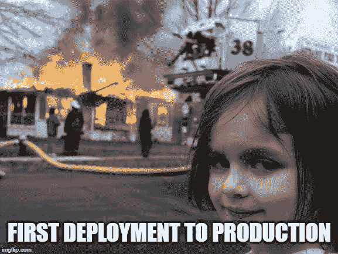

# 我的数据科学学位没有教会我什么—第 2 部分

> 原文：<https://towardsdatascience.com/what-my-data-science-master-did-not-teach-me-part-2-ce56791fe2e9?source=collection_archive---------15----------------------->

&在我的数据科学职业生涯之初，我本可以做些什么不同的事情。

Photo by [Isaac Smith](https://unsplash.com/@isaacmsmith?utm_source=medium&utm_medium=referral) on [Unsplash](https://unsplash.com?utm_source=medium&utm_medium=referral)

*重要:本文是* [*我的数据科学硕士没有教给我的东西—第一部分*](/what-my-data-science-degree-did-not-teach-me-part-1-3d7ff23875e5) *的续篇！感谢每一个阅读第一部分并为之鼓掌的人！*

# 投资领域知识

作为一名数据科学家，我多少知道我必须投资领域知识。然而，在我攻读学位期间，没有人足够强调为了理解数据，应该花多少时间去理解数据之外的东西。数据集并不总是附带扩展文档，并且通常没有明确的列名，也没有预先选择的标签列。每个行业都有自己的首字母缩写词和简称，对于一个“局外人”来说基本上是不可读的。我最近才意识到，需要花费大量的时间与我的利益相关者和领域专家保持持续的沟通。

从学术角度来看，似乎“数据就是数据”，机器学习或数据分析在所有行业中都可以采用相同的方式。然而，现实要复杂得多。例如，数据相关性可能因字段而异。例如，如果您使用的是交易数据，那么 3 个月前的数据集就已经是“旧的”了，需要与最近的数据相结合才能生成准确的建议。然而，如果您正在为一年到头以相同频率使用的机器进行预测性维护，3 个月的旧数据集是完全相关的，并且对于准确的预测模型来说可能是足够的。类似地，虽然实时预测可以成为在线零售等特定行业的巨大游戏规则改变者，但它们也可能是其他行业的资源浪费。

# 不要认为计算资源是理所当然的。

借助 Azure、谷歌云和亚马逊网络服务等云平台，计算资源变得相当容易获得。他们甚至有一个免费层供你试验。然而，大多数大公司在如何获得或证明计算资源方面都有严格的流程，并且通常只支持有限范围的选项。使用云平台、虚拟机或服务器可能会带来法律后果，尤其是当**高度敏感的数据必须在外部托管的云上共享时**。作为一名处理敏感数据的数据科学家，我必须考虑到，由于数据保护要求，我对共享数据或上传数据的位置有非常严格的限制。

此外，强大的计算资源可能会变得非常昂贵，利益相关者需要确信**您的模型的价值值得投资**。这代表了另一种需要讲故事的情况，正如我在本文的[第一部分](/what-my-data-science-degree-did-not-teach-me-part-1-3d7ff23875e5)中已经提到的。

这些管理限制有时意味着我只能在本地使用笔记本电脑工作。因为我不知道有多少计算能力可供我使用，也不知道我还要在我的笔记本电脑上开发多长时间，代码效率(也在[第一部分](/what-my-data-science-degree-did-not-teach-me-part-1-3d7ff23875e5)中讨论)仍然至关重要。即使在拥有大量财务资源的大公司中，将计算资源视为理所当然也可能不是正确的方法，尤其是在模型的价值可能不值得强大虚拟机的成本的情况下。尽管可能会令人沮丧，但我已经学会了努力充分利用我已经拥有的计算资源。

# 部署模型

这听起来可能非常愚蠢和天真，但在我攻读硕士学位期间，没有人告诉我，在任何东西投入生产之前，我需要一个开发环境，或者测试环境或验收环境。他们也从来没有告诉我，将模型投入生产的道路可能充满障碍、过程、政治问题和沮丧的人。我也完全不知道开发和生产环境之间到底有什么区别。

由于[我不是来自 ICT 背景](/from-being-a-sales-rep-to-being-a-data-scientist-4bb1da79ba3f)，我从未听说过分离环境和过程来将软件从开发带到“外面”可用。后来，我在 AWS 的一个项目中意识到，一个好的 [CI/CD](/devops-for-data-scientists-taming-the-unicorn-6410843990de) 管道是多么重要、有用和省时。我鼓励任何在该领域起步的数据科学家阅读它，并可能使用其中一个云平台的免费层来探索 CI/CD 管道的组件(例如 AWS CodeBuild、CodePipeline 或 CodeDeploy)。

# 你选择的应用领域真的很重要。

作为一名数据科学家、数据分析师或任何数据人员，我的工作职位和描述已经变得非常不同，这取决于我工作的领域。虽然公司的规模也是另一个需要考虑的变量，但我认为这并不比考虑你将从事的领域的目的更重要。**记住，数据几乎就是你每天、每天都要处理的所有东西**。我曾经不得不在很短的时间内处理涉及动物试验的临床试验数据。我对此深恶痛绝，并认定临床试验数据不是我想要定期处理的数据的一部分。

我所在公司的真正目标、道德或客户价值极大地影响了我对自己日常工作的感受。我知道大多数模型都包含某种商业优势或利润。然而，与建立物体检测系统以改善道路安全相比，建立推荐系统以增加销售收入的感觉是不同的。我努力寻找最能激励我的东西，或者让我深深感兴趣的东西。许多新手只是想“我会去有大量数据要分析的地方”，但是**丰富并不总是意味着有趣**！

正如我在本文开头提到的，数据科学家必须花很多时间去理解他们工作的领域，所以我建议找一个你喜欢的领域。**询问和联系已经在你考虑的领域或公司工作的数据科学家总是值得的。**

# 关于我自己的数据科学职业生涯开始的一些最终想法

> 我的数据科学硕士给了我一个很好的开端，但我应该在跳入水中之前更多地关注领域知识，以填补空白。

这绝对是我在完成学位后失败的事情。我完成了毕业实习，觉得自己懂得够多了，或者说懂得更多了。我没有真正尝试与其他数据科学家或数据分析师(除了我的同学)联系，以了解他们工作的领域和他们面临的日常挑战。我通过艰难的方式学到了很多东西，而一次简单的谈话可以教会我同样的东西。

我注意到我在毕业实习期间学到了很多有价值的行业知识，因为我有机会与大学的外部合作伙伴一起做这件事。我也相信实习和培训有助于填补空白，并对某个领域有所了解。

然而，如果你对这个领域或公司有疑问，我建议在签署一份 1/2/3 年的实习合同之前仔细考虑你的选择。职业生涯的最初几年会带来大量知识，并帮助你确定自己在数据世界中的发展方向。记得我毕业后，在商业智能和纯数据科学之间犹豫了很多。我现在非常清楚地知道，我不太喜欢将 BI 作为日常任务，但我喜欢我项目的 Python 开发部分。在我看来，将职业生涯推向错误的方向比花时间找出正确的道路更糟糕。

*正如我在最近的几篇文章中所说，数据科学家永远不会停止学习，这也包括我。尽管这篇由 2 部分组成的文章已经完成，但我还有很多内容要写，包括数据科学领域目前教给我的东西，以及如何应对数据科学家可能面临的日常挑战。在* [*中*](https://medium.com/@julia.d.russo) *上关注我，获取我未来文章的通知！也可以在*[*Twitter*](https://twitter.com/DIRUSSOJulia)*或者*[*LinkedIn*](https://www.linkedin.com/in/julia-di-russo-28b40198/)*上找到我。*

 [## 向你的祖母解释数据科学

### 或者如何向你的家人或任何与技术世界脱节的人解释数据科学。

towardsdatascience.com](/explaining-data-science-to-your-grandma-f8345621483d)