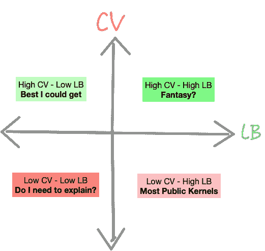
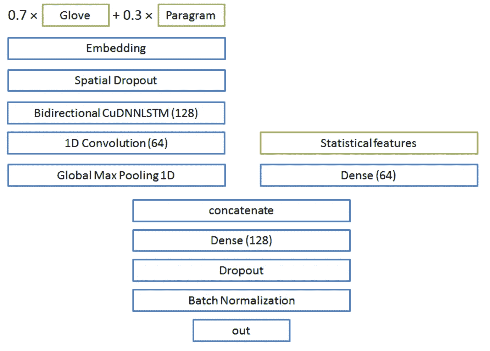

# 关于文本分类和 Kaggle，我的第一枚银牌教会了我什么？

> 原文：<https://towardsdatascience.com/what-my-first-silver-medal-taught-me-about-text-classification-and-kaggle-in-general-ebae0df16278?source=collection_archive---------11----------------------->

## 穿越卡格尔的世界


卡格尔是一个学习的好地方。我从最近结束的关于 **Quora 不真诚问题分类**的比赛中学到了很多东西，在这篇文章中，我得到了一个`**182/4037**`的排名，我将尝试提供一个我尝试过的事情的总结。我还会试着总结一下我错过的但却是其他成功解决方案的一部分的想法。

**作为旁注**:如果你想了解更多关于 NLP 的知识，我想**推荐[高级机器学习专精](https://bit.ly/2GCXYnt)中关于[自然语言处理](https://bit.ly/2UZNv8u)的这门优秀课程**。您可以免费开始 7 天的免费试用。本课程涵盖了自然语言处理中从基础到高级的各种任务:情感分析、摘要、对话状态跟踪等等。您可以免费开始 7 天的免费试用。

所以首先给外行人一点关于竞争的总结。在这场比赛中，我们必须开发出识别和标记虚假问题的模型。这个挑战不仅是对性能的测试，也是对高效代码编写技巧的测试。 由于这是一场外部数据选项有限的核心竞赛，参赛者只能使用竞赛组织者提供的单词 embeddings。这意味着我们不允许使用像伯特这样的艺术模型。我们也受到限制，我们所有的模型都应该在 2 小时内运行。因此，对堆栈和怪物集合说再见吧，尽管一些解决方案通过使它们的代码超高效来做到这一点。稍后将详细介绍。

# 一些小知识:

在开始讨论我的最终解决方案之前，我想分享一下关于 kaggle 的一些经验:

# 1.永远相信你的简历



这场竞赛中真正让许多人困惑的一件事是，好的简历分数不一定能转化为好的 LB 分数。其主要原因是第一阶段的**小测试数据集**(只有 65k 行)(大约占总测试数据的 15%)。

论坛上的一个常见主题是关注我们应该选择哪些提交内容作为最终提交内容:

*   本地履历最好的那个？或者
*   磅数最高的那个？

虽然说信任你的简历似乎很简单，但当你看到你的 LB 分数下降或保持不变时，无论你当地的 CV 分数何时增加，常识都会发生变化。

幸运的是，我没有犯下不信任我的简历分数的错误。由于 Kaggle 讨论板上有很多优秀的帖子， ***我选择了一个公开 LB 分数为 0.697，本地 CV 为 0.701 的内核，截至最终提交时，它在公开 LB 上的排名大约为> 1200。它取得了 0.702 的分数，在私人 LB 排名 182。***

虽然这看起来像是一个简单的事后选择，但当您拥有一些公共 LB 分数> = 0.70 的公共内核时，这是一个很难做出的决定

# 2.使用来自公共内核的代码，但是检查错误

[Benjamin Minixhofer 的这个](https://www.kaggle.com/bminixhofer/deterministic-neural-networks-using-pytorch) Pytorch 内核太棒了。它是我为这次比赛提交的许多作品的基础。但是这个内核有一个错误。它没有以正确的方式实现空间丢失。你可以在我的帖子[这里](https://mlwhiz.com/blog/2019/01/06/pytorch_keras_conversion/)或者在我的[内核](https://www.kaggle.com/mlwhiz/third-place-model-for-toxic-spatial-dropout)上找到空间丢失的正确实现。以正确的方式实现空间下降使局部 CV 增加了大约 0.004。

尽管如此，我还是用这个内核学会了 pytorch，我也同样感谢他。

# 3.不要相信论坛上的一切


我将在这里谈两件事:

*   **种子调整**:在比赛进行到一半的时候，每个人都试图在公众 LB 上获得尽可能好的排名。这只是人的本性。很多讨论都是围绕神经网络初始化的好种子和坏种子。虽然第一眼看上去没什么问题，但是对话更进一步，人们开始在内核中调整种子作为一个超级参数。一些讨论甚至继续说这是一个有效的策略。这就是大量过度适应公共 LB 开始发生的地方。仅仅通过改变种子，相同的提交将从 0.699 得到 0.704。作为参考，这意味着你可以从接近 400-500 的排名上升到前 50 名，只要在一个公共内核中改变种子。这意味着灾难。有些人就是这样做的。他们上了公共图书馆。在私人舞台上爆发了。
*   在论坛上公开简历分数:我们总是试图用他人来衡量自己的表现。在许多讨论中，人们提供了他们的简历分数和相应的公开 LB 分数。由于不同的 CV 方案、CV 中的折叠数、报告的度量、过度拟合或交叉验证的简单错误实施，分数到处都是，没有可比性。但是他们最终影响了很多新手和新人。

# 4.在这一点上，活跃在论坛上，并定期检查公共内核

你可以通过参与论坛和关注公共内核学到很多东西。本次大赛有很多优秀的公有内核，分别是 [SRK](https://www.kaggle.com/sudalairajkumar/a-look-at-different-embeddings) 的嵌入、[舒剑](https://www.kaggle.com/shujian/mix-of-nn-models-based-on-meta-embedding)的模型、[西奥维尔](https://www.kaggle.com/theoviel/improve-your-score-with-text-preprocessing-v2)的预处理，给了大家一个先机。随着比赛的进行，讨论也在发展。有关于加速代码、工作方法、F1 阈值查找器和其他令人兴奋的主题的讨论，让我忙于新的想法和改进。

即使在结束后，在阅读关于解决方案概述的讨论时，我也学到了很多。我要说的是，找出获胜的解决方案是非常重要的。

分享是 Kaggle 的一切。人们在比赛时以及比赛结束后分享他们的代码和想法。只有团结一致，我们才能前进。我喜欢写博客，所以我通过一系列关于文本分类的博客帖子来分享这方面的知识。第一篇[帖子](https://mlwhiz.com/blog/2019/01/17/deeplearning_nlp_preprocess/)谈到了不同的**预处理技术，用于深度学习模型**和**增加嵌入覆盖**。在[第二篇](https://mlwhiz.com/blog/2019/02/08/deeplearning_nlp_conventional_methods/)中，我讲述了一些**基本的常规模型**，如 TFIDF、计数矢量器、哈希等。已经被用于文本分类并试图评估它们的性能来创建基线。在第三篇文章中，我将深入研究**深度学习模型和我们可以用来解决文本分类问题的各种架构**。为了使这个帖子平台通用，我将尝试用 Keras 和 Pytorch 编写代码。我们将尝试使用我们在本次比赛中未能使用的各种其他模型，如本系列第四篇文章中的 **ULMFit 迁移学习**方法。

我可能需要一点时间来写完整个系列。在此之前，你也可以看看我的其他帖子:[kaggler 正在使用什么进行文本分类](https://mlwhiz.com/blog/2018/12/17/text_classification/)，其中讨论了 NLP 中使用的各种深度学习模型以及[如何从 Keras 切换到 Pytorch](https://mlwhiz.com/blog/2019/01/06/pytorch_keras_conversion/) 。

# 6.小心巨魔:)

离比赛结束还有两周的时候，我们正愉快地进行着。分数增长缓慢。顶尖选手有些停滞不前。 ***然后是公开 LB 分 0.782 的帕维尔和团队。下一组的 LB 分数是 0.713。如此巨大的差异。我确信数据中有一些漏洞，除了帕维尔，还没有人发现。我花了将近半天的时间又做了一遍 EDA。***

最后发现他们做的是[刮](https://www.kaggle.com/c/quora-insincere-questions-classification/discussion/80665)——打得好！

他们也有一些非常棒的想法，包括额外的数据，这些本来可以在这次比赛中发挥作用，但没有发挥作用。

# 我的最终解决方案:


我的主要关注点是*元特征工程*和*增加嵌入覆盖率和质量*。这意味着我没有怎么接触过各种神经网络架构。以下是我在最终提交的材料中包含的内容:

*   我注意到手套嵌入在局部 CV 上表现良好，但在 LB 上表现不佳，而元嵌入(手套和 paragram 的平均值)在 LB 上表现良好，但在 CV 上表现不佳。我采用了一种混合的方法，所以我的一些模型只训练了手套嵌入，一些模型训练了元嵌入。
*   **在嵌入**中增加了四个特性。因此我的嵌入是一个 304 维的向量。这四个新值对应于标题大小写标志、大写标志、文本点单词极性、文本点单词主观性
*   使用 spacy 从整个训练和测试数据中找出 **NER 代币，并将代币和实体保存在字典中。我用这个字典来创建额外的特性，比如`GPE`、`PERSON`、`ORG`、`NORP`、`WORK_OF_ART`的计数。增加了一些价值，并且与目标高度相关。**
*   我使用的其他功能包括`total_length`、`capitals`、`words_vs_unique`以及一些工程化的功能，如`sum_feat`(脏话的总和)、`question_start_with_why`、`question_start_with_how_or_what`、`question_start_with_do_or_are`。可能没有增加多少价值，但仍然保留它们。
*   我最终的解决方案是由四个型号的**堆叠组合而成。我使用逻辑回归(具有正权重和 0 截距)堆叠了四个模型，并在最终的内核中给出了权重列表。**

你可以在这里找到我最终提交的内核。

# 其他解决方案中使用的提示和技巧:

# 1.增加嵌入覆盖范围:

在第三个解决方案[内核](https://www.kaggle.com/wowfattie/3rd-place)中，wowfattie 使用词干化、词汇化、大写、小写、大写，以及使用拼写检查器嵌入最近的单词，以获得其 vocab 中所有单词的嵌入。真是个好主意。我最喜欢这个解决方案，因为它能做我想做的事情，而且完成得很好。还有，代码非常干净。

# 2.检查点集合:

**免费获得大量模型**。大多数成功的解决方案都有某种版本的检查点集成。对于第三位解决方案，预测是第 4 个时段之后的预测和第 5 个时段之后的预测的加权平均。我得到了这个想法，但是忘了在我的基于系综的内核提交中实现它。

# 3.元嵌入:

许多获胜的解决方案最终都使用了**加权元嵌入**，它们为手套嵌入提供了更高的权重。一些解决方案也使用了**级联嵌入**。

# 4.模型架构:

我看到人们做的一件令人惊讶的事情是在双向层之后使用了 **1Dconv 层。例如，这是比赛中排名第一的团队使用的[架构](https://www.kaggle.com/c/quora-insincere-questions-classification/discussion/80568)。**



# 5.分桶/可变序列长度和增加的隐藏单元:

我注意到的另一件事是，与许多公共内核相比，隐藏单元的数量增加了。由于时间限制，大多数公共内核使用 60 的隐藏单元大小。我用了 80 个单位，代价是少训练一个网络。由于可变序列长度思想或分桶，许多高分内核能够使用更多的隐藏单元。从第一位内核讨论:

> *我们不会基于整个数据将序列填充到相同的长度，而只是在批处理级别。也就是说，我们在数据生成器级别对每一批分别进行* ***填充和截断*** *，这样一批中的句子长度就可以有所不同。此外，我们进一步改进了这一点，不是根据批次中最长序列的长度进行截断，而是根据序列中 95%的长度进行截断。这极大地改进了运行时间，并在单个模型水平上保持了相当稳健的准确性，并通过能够平均更多的模型来改进它。*

也从第 7 名[讨论](https://www.kaggle.com/c/quora-insincere-questions-classification/discussion/80561):

> *分桶是将具有相似长度的实例制成一个小批量，以减少填充成本。这使得训练速度比* ***快了 3 倍，因此我可以为每一次 5 折的分割运行 9 个纪元。***

因此，这种技术的使用也允许一些竞争者在更短的时间内适应更多的时代，同时运行更多的模型。相当整洁！

# 6.对于那些没有使用 bucketing 的赢家，Maxlen = 72 太大了:

我们大多数人看到了问题长度的分布，并将完全覆盖最多问题的长度作为 maxlen 参数。我从来没有试图调整它，但它似乎可以调整。其中一个技巧是使用 35 到 60 的 maxlen。这使得内核运行得更快了。

# 7.耗时模型/复杂架构(如 Capsule)大多未被使用:

大多数获胜的解决方案没有使用胶囊网络，因为它们需要大量的时间来训练。

# 8.最近几个时期嵌入权重的反向投影误差:

我看到的另一件事是在使用单一模型的[第 18 位内核](https://www.kaggle.com/kentaronakanishi/18th-place-solution)

```
if epoch >= 3: 
    model.embedding.embeddings.weight.requires_grad = True
```

# 结论:

这是一场精彩而漫长的 2 个月的比赛，在这段时间里，我学到了很多关于文本和 [NLP](https://amzn.to/2XSZBWV) 的知识。我想在这里强调的是**在达成我的最终解决方案**之前，我最终尝试了很多没有成功的东西。有时这有点令人沮丧，但最终，我很高兴我最终获得了最佳数据科学实践。

我还要感谢 Kaggle 大师 Kazanova，他和他的一些朋友一起发布了[“如何赢得数据科学竞赛”](https://bit.ly/2IlOqP7) Coursera 课程。我从这门课中学到了很多。

如果你认为有什么遗漏/错误，或者我可以为这个比赛添加更多的提示/技巧，请在评论中告诉我。或者也许你有什么想法，你会怎么做。

请随时在 [LinkedIn](https://www.linkedin.com/in/rahulagwl/) 上与我联系，在[Twitter](https://twitter.com/MLWhiz)/[Medium](https://medium.com/@rahul_agarwal)上关注我，或给我发消息征求意见。继续收听，继续学习。

*原载于 2019 年 2 月 19 日*[*mlwhiz.com*](https://mlwhiz.com/blog/2019/02/19/siver_medal_kaggle_learnings/)*。*