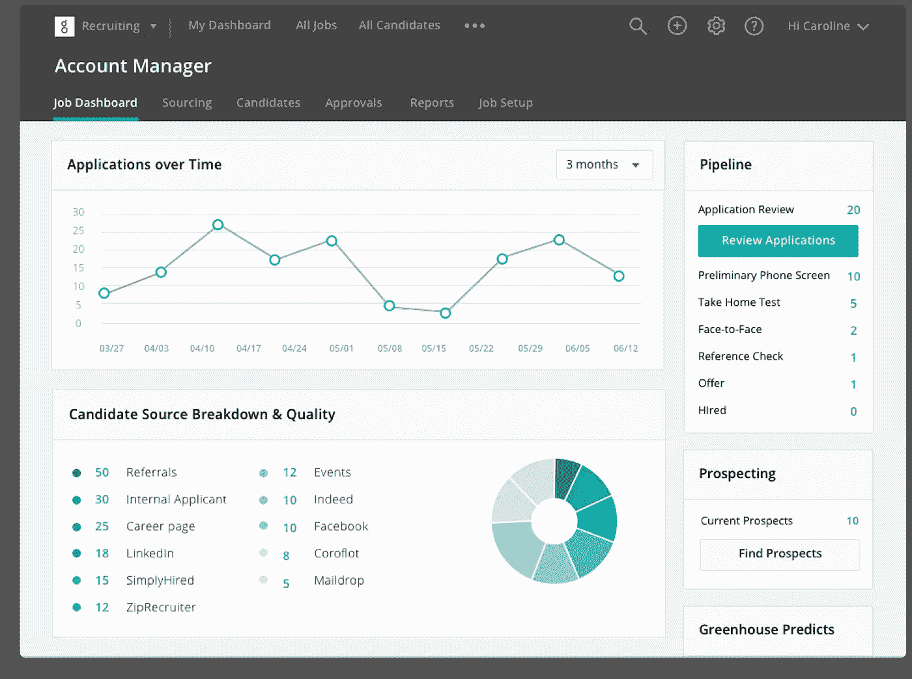
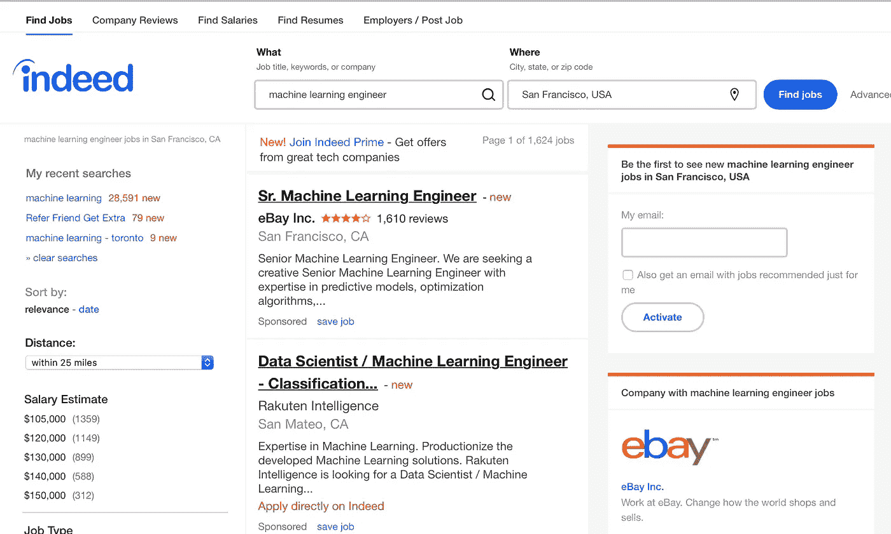

# 关于数据科学工作申请，没人会告诉你什么

> 原文：<https://towardsdatascience.com/what-no-one-will-tell-you-about-data-science-job-applications-bff2d4b5e983?source=collection_archive---------5----------------------->

我是一名物理学家，在 YC 的一家初创公司工作。由于我们公司的工作，我收到了许多电子邮件，询问我关于数据科学职业的建议。

许多电子邮件问我非常相似的问题。随着时间的推移，我对自己经常遇到的问题有了一些常见的回答。

几天前，我收到了一封电子邮件，其中问了我通常在一封邮件中会遇到的大多数问题。我写了一个答案，并将其寄回，但后来我意识到这是一个扩展我的答案的好机会，并将其公布于众，供那些在寻找数据科学工作方面有困难，但不知道为什么的人使用。

每有一个人有一个问题，并问它，就有十个人有同样的问题，但不要问它。如果你是这十个人中的一个，那么这篇文章就适合你。希望你会觉得有帮助。

以下是我收到的电子邮件，根据长度进行了编辑:

## 电子邮件

> 出发地:朗尼[姓名已更改]
> 
> 主题:试图在数据科学领域找到一份工作
> 
> 我是一名大学辍学生(我这样说是因为很明显，如果你出生时没有理论物理学博士学位和 15 年的数据科学经验，那一定是出生时出了什么问题)。[……]当我在市场营销中漫游时，我发现我最喜欢数据部分。我最初熟练掌握了 A/B 测试，并在谷歌分析中获得了认证&通过优化他们的测试平台。然后从那里我进入了 Python，SQL 等等。我刚刚从[知名数据科学训练营]毕业，我甚至在努力争取面试机会。我已经发出了 100 多份申请(甚至在其他城市),却很少有面试。
> 
> 为了继续“提高技能”，我正在攻读 Udacity 纳米学位& Dataquest.io
> 
> 这是我的 LinkedIn，如果你想看的话。这不是真正的技能(虽然他们真的需要大量的工作，我正在做)。我甚至没有得到展示我技能的面试机会，所以我才这么说。
> 
> 我和【BigCo】进行了一次面对面的交流，这是我第一次面对面地写代码或写白板，所以进行得并不顺利。
> 我有一份来自[大型创业公司]的生存分析报告，但我从未研究过，所以进展不顺利
> 我有一份来自[BigCo]的报告，它让我获得了面试机会，他们通过了，因为我的学历(这很愚蠢，因为他们已经有了我的简历)。
> 
> 除此之外:一无所获

[1]

## 我的回答

你好，朗尼——谢谢你伸出援手。

事实是:根据你提交工作申请的地点，2-3%的面试率可能是正常的。有两个原因，但你都不知道。

## 迷失在人群中

第一个原因是大多数招聘团队使用一种叫做*申请人跟踪系统*的东西来告诉他们最好的候选人来自哪里。如果你通过一个过去给他们不好的结果的渠道申请，他们会花更少的时间看你。[2]

Your job application will most likely be processed by an applicant tracking system like this.

例如，如果你申请一份技术工作，你不太可能有任何进展。事实上每个人都知道，并且很容易应用。这意味着申请工作的普通人实际上很可能是个普通人。因此，招聘经理会花更少的时间看一份来自“真实”的简历，因为她认为它很一般。

你可以通过在大多数人还不知道的网站上申请来解决这个问题。[关键值](https://www.keyvalues.com)和 Y Combinator 的[在创业公司的工作](https://www.workatastartup.com)工作页面是很好的起点。[3]通过使用大多数人还不知道的网站，你将自己标记为一个有意寻找机会的人。在这些网站上申请工作的普通人很有可能超过平均水平。这就是为什么公司更关注通过不太为人知的渠道申请的申请者。

## 办公室政治

申请普通职位不太管用还有第二个原因。你可能很难相信这一点，但是很多公司(尤其是大公司)在招聘栏上发布招聘信息并不是为了找到他们想要雇佣的人。[4]

If you’re searching for a technical position on Indeed, you’re doing it wrong. Sorry, Indeed.

这听起来很疯狂:那么，他们到底为什么要在招聘栏上发帖呢？你需要明白的是，在大多数大公司，人力资源团队(HR)和工程师之间有着明显的区别。事实上，人力资源团队通常是发布工作的团队。

不幸的是，人力资源部没有工程师，所以他们不能真正区分哪些候选人是真正有才华的，哪些不是。HR 只知道如何筛选证书，这意味着检查你是否去了一个好学校(斯坦福认为你足够好可以进去吗？)或者在一家不错的公司工作过(谷歌认为你足够优秀到可以在那里工作吗？).

所以这就是为什么你的命中率只有 2-3%的黑暗真相:HR 无法区分好的训练营和差的训练营。所以他们不得不默认说“不”，因为他们不想浪费工程团队的时间去关注那些可能并不优秀的新兵训练营毕业生。这种情况我见过几百次了。

幸运的是，有好消息:大多数工程团队明白他们的人力资源不能筛选人才。因此，最好的工程团队通过网络和后台渠道招聘，而不是通过招聘广告。因此，我给你的最好建议是:**开始把自己嵌入到工程师驱动的机器学习聚会中**。这里没有魔法:只要去 meetup.com 的[，找到看起来相关的聚会，然后开始去参加。](https://www.meetup.com)

你会很快发现哪些是有价值的，哪些是没有价值的。人际关系网有很多好处，所以问一些聪明的问题，尝试进行有益的对话，当人们自我介绍时，倾听不可避免的“我们正在招聘”的公告。

## 面试

简单说一下:工作面试是一种黑暗、神秘的仪式。每个公司的流程都是不同的，每个公司都认为自己的面试是真正的面试。

提高面试水平有很多方法，但最好的方法是多做。所以我关于参加聚会的建议在这里也会对你有所帮助:你面试得越多，你就越擅长。即使你搞砸了你的第一次，这也是一项技能，就像其他任何事情一样，你会在进行中学会它。

最后，我很抱歉这个系统被严重破坏了。我知道这对初学者来说特别难。这不公平，但隧道的尽头有光明:在你有了 1-2 年的经验后，公司会开始追逐你。回报是值得努力的。

如果你有问题没有看到我在这里回答，你可以在推特上问: [@_edouardharris](https://twitter.com/_edouardharris) 。我的 DMs 是开放的——不要害羞！

**********************************************************

[1]在随后的一封电子邮件中，朗尼告诉我，他并不认为他的训练营是他遇到麻烦的原因，而是问题在于他没有受过多少正规教育。

[2]求职者跟踪系统还可以根据关键词自动筛选出简历。但是我发现大多数人已经知道在简历中包含正确的关键词，所以我不会在这里详述。

[3]我知道，通过在这里张贴这些求职公告板的链接，我保证会有更多的人知道它们。但在不久的将来，这两者都不太可能像现在这样大。

[4]当然，有些人会这样做，当然，即使那些不这样做的人有时也会意外地找到好的候选人。但是如果你正在找工作，就把这些公司当成一个惊喜吧。