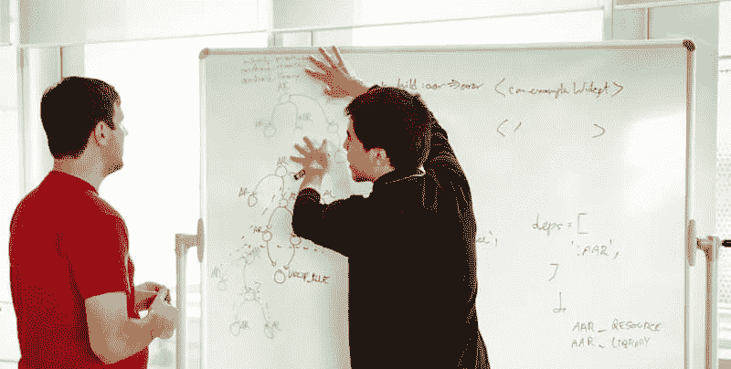

# 在技术面试中不要做什么

> 原文：<https://towardsdatascience.com/what-not-to-do-during-a-technical-interview-b2f35d62b963?source=collection_archive---------24----------------------->

## 面试中需要注意的 6 个危险信号

今天我们将关注招聘过程中最重要的部分之一，也可能是最令人害怕的部分:技术面试。你的第一次面试(除了与招聘人员的筛选电话)通常是技术性面试，有时会通过电话进行，并有屏幕截图。如果你在那里做得很好，那么你经常会被邀请参加第二轮，这可能包括多次技术筛选。面试过程中有很多成功的小技巧，其实我们之前也写过面试准备指南。在此查看一个[。也就是说，你经常紧张，流汗，思维混乱。](/a-step-by-step-approach-to-answering-any-question-in-a-technical-interview-99bc4183265b)

> 重要的是，不仅要知道该做什么，还要知道不该做什么(有点像你在车管所参加驾照考试——你可以做好每件事，但有些事情会让你自动失败，比如撞到路边)。

在这里，我们会给你六个技巧，告诉你在技术面试中不要做什么。我们开始吧！

# 1.不要立即开始编码

需要马上注意的一件大事是，分析性面试不仅仅是寻找正确的答案。面试官在测试你解决问题的能力，包括你提问和运用解决问题的技巧来理解问题或问题背后的问题的能力。为了展示这种技能，你不能在面试中一收到问题或编码挑战就开始编码。首先，你应该问一些澄清性的问题并陈述假设，以证明你完全理解如何解决这个问题。面试官希望看到你的过程，以确保你理解处理问题的最佳方式。

即使你对这个问题很有信心，没有任何问题，你也应该和面试官交流。他们希望在开始编码之前，有人对他们对问题的理解有信心。

> 所以，不要马上开始编码——停下来，问问题，展示你的理解。

# 2.不要无视面试官的暗示

通常，面试官会轻轻地把你推向正确的方向。最终，他们希望你成功，所以他们可能会给你暗示或问一些问题来引导你找到解决方案。这就是为什么考虑面试官在面试中说的每一句话，而不是忽视或掩饰他们的评论是如此重要。

如果他们问“比率中的分母是多少？”或者“你看了这个指标吗？”，那么你需要思考并应用它。可能在所有情况下，如果不相关，他们都不会说。

# 3.不要太固执己见

面试官想要的最高技能之一是适应能力。不要做一个固执己见又不愿让步的人。当出现新信息时，你应该表现出考虑不同选择和调整方法的能力。

要知道，工作面试的问题可能就是为了测试这一点而设计的。通过提供新的信息，面试官会检查你是否能反思你所做的事情，认识到任何错误，并适应。通常，这项技能与找到正确答案同样重要，因为它代表了你不断努力达到正确答案的能力。

不要太固执己见。带着灵活开放的心态去参加面试。

# 4.不要接受最明显的答案

分析工作面试应该淘汰一定比例的面试官。如果他们把事情做得太简单，他们就不会找到最合适的人来做这项工作。这通常意味着技术问题的答案不会是最直接、最明显的。毕竟这些题是来考验你的技术的。

> 面试官在寻找的是一个能够仔细检查问题，考虑所有可能的选择，并且懂得取舍的人。

这对你意味着什么？你应该让他们了解你的决策过程。告诉他们你正在考虑每一个选项，并考虑每个变量会如何影响你的答案。这样，即使你没有得出正确的答案，他们也能看到你的决策过程是合理的。

不接受最明显的答案。通常，答案看起来很明显是为了欺骗你。如果你没有适当考虑每个选项，面试官不会满意的。

# 5.不要谈论你如何不合格，因为你没有在技术领域受过正规教育

事实是，并非所有从事分析工作的人都有技术背景。有许多不需要正规教育就可以学习分析技能的方法。许多从事分析工作的人没有技术背景，但通过努力工作和奉献，他们已经获得了做好这些工作所必需的技能。

也就是说，如果这适用于你，你不应该注意这个事实——它是不相关的。你在那里，你有做这份工作所需要的技能，所以让别人注意到你可能不如受过正规教育的人这一事实不会帮助你得到这份工作。

> 在面试中，你只需要提出一些与你胜任该职位的能力相关的问题。

如果你被问到你的正规教育，不要隐瞒细节，但是如果你没有被要求，也没有必要说出来。

# 6.不要谈论你如何合格，因为你确实在技术领域受过正规教育

另一方面，不要谈论你有多么合格，因为你受过正规的分析教育。很可能，面试官已经从你的简历中知道了这一点，一次又一次地提到它，会让人觉得你在吹牛。说到底，面试官并不关心你的正规教育，他们只是想看看你是否有做好工作所必需的技能。

毕竟，这次面试是为了测试你的技能，而不是检查你的正规教育。专注于向他们展示你的能力，而不是谈论你的学位。

# 结论

做好准备总是一个好主意，但知道在某些情况下什么不该做同样重要。我们希望我们的建议对你准备技术面试有所帮助。

> 如果你从这个列表中选择一样东西，记住这些面试是关于过程和方法的。

即使你认为你不能得到正确的答案，也要让他们了解你的决策过程，向他们表明你愿意接受所有的选择。一个这样对待工作的人，最终一定会得到正确的答案，这是他们真正想看到的。

如果你对实践技术问题感兴趣，并想看看其他人是如何解决这些问题的，可以看看这个平台，在 [Strata Scratch](https://platform.stratascratch.com) 。

*最初发表于*[T5【https://www.stratascratch.com】](https://www.stratascratch.com/blog_feed/what-not-to-do-during-a-technical-interview)*。*