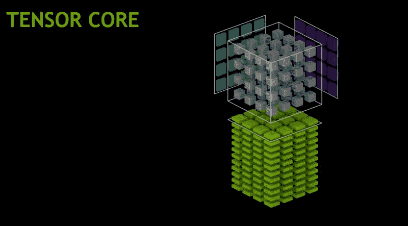
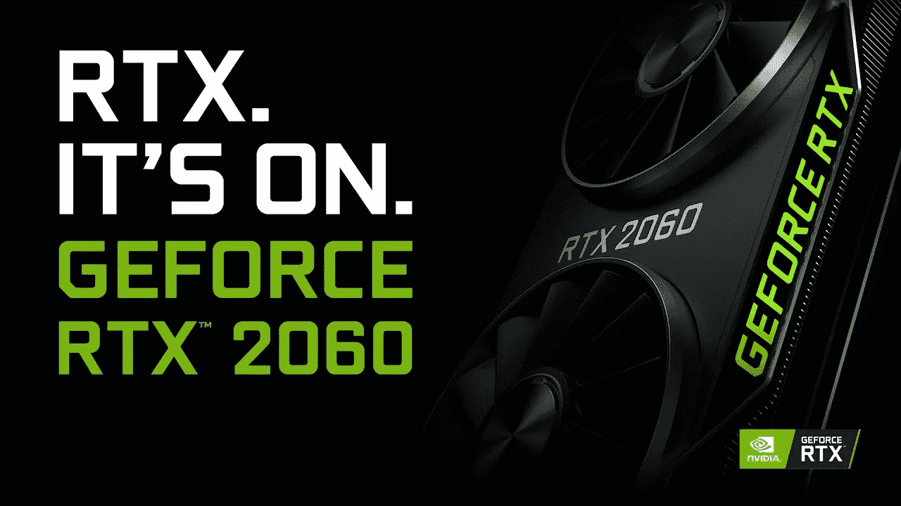
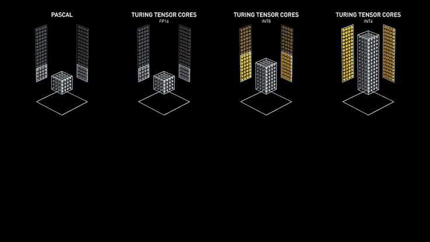
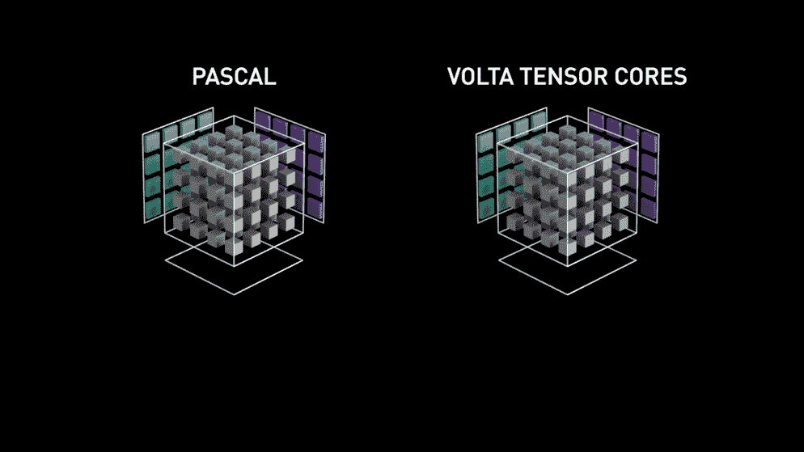
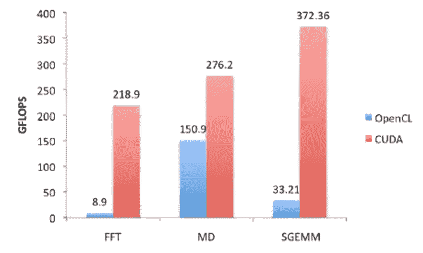

# 张量核到底是什么？

> 原文：<https://towardsdatascience.com/what-on-earth-is-a-tensorcore-bad6208a3c62?source=collection_archive---------1----------------------->

除了对数据和机器学习的痴迷，我还对计算机硬件有一种不健康的痴迷。有了像“[这样的精彩宝石，强大的图形对数据科学有多重要？很明显，基于图形的机器学习是我最感兴趣的。每当数据科学和计算机硬件以惊人的方式重叠时，它真的让我兴奋。](/how-vital-are-powerful-graphics-for-data-science-5ead7a54d50c)

随着 Nvidia 架构 VOLTA 的发布，这些已知的东西被 Nvidia 称为“张量核心”但是究竟什么是“张量核”，一个张量核真的值得仅仅为了一个显卡而花费一千美元吗？

如果你对基于图形的机器学习感兴趣，很可能你熟悉 CUDA 技术和 CUDA 内核。CUDA 是一个并行计算平台，允许图形卡加速中央处理器的性能，创建一个 GPU 加速计算，比在 CPU 上进行传统处理运行得更快。

不用说，

> CUDA 太牛了

远远超过像 OpenCL 这样的公司。考虑到这一点，CUDA 内核和张量内核之间到底有什么区别呢？

CUDA 内核以每次计算为基础运行，每个单独的 CUDA 内核可以在 GPU 每次旋转时执行一次精确的计算。因此，时钟速度以及卡上可用的 CUDA 内核数量对 CUDA 的性能起着重要作用。另一方面，张量核可以通过每个时钟计算整个 4×4 矩阵运算来进行计算。

张量核能够将两个 fp16 矩阵 4x4 相乘，并将乘积 fp32 矩阵(大小:4x4)添加到累加器(也是 fp32 4x4 矩阵)。这又是一个混合累加过程，因为累加器取 fp16 并返回 fp32。

通常，CUDA 内核速度较慢，但精度更高。而张量核的速度快如闪电，但是会损失一些精度。

然而，我没有提到的是图灵张量核。图灵张量核明显更令人兴奋，因为虽然它们拥有与典型的 VOLTA 张量核相同的属性，但它们也有显著的改进，相比之下，CUDA 就像风中的灰尘一样。

图灵张量核心设计增加了 INT8 和 INT4 精确模式，用于支持量化的推理工作负载。FP16 也完全支持要求更高精度的工作负载。在基于图灵的 GeForce 游戏 GPU 中引入张量核，使得首次将实时深度学习引入游戏应用成为可能。图灵张量内核加速了 NVIDIA NGX 神经服务基于人工智能的功能，这些功能增强了图形、渲染和其他类型的客户端应用程序。不需要使用许多 CUDA 核心和更多时钟来完成相同的任务，它可以在单个时钟周期内完成，从而大大加快了机器学习应用的速度。不用说，数据科学家非常欣赏 Volta 所提供的一切。

根据 Nvidia 的说法，VOLTA 张量核心计算大约是以前架构 Pascal CUDA 计算的 12 倍。所以对于深度学习来说，这个速度当然不是空穴来风，张量核当然是英伟达做出的惊人壮举。

# 他们值得吗？

随着 AMD 大幅削减同等 GPU 的价格，这些 GPU 是…嗯，没有所有花哨的光线跟踪和张量核心的普通 GPU，对于某个品牌的人来说，红色团队肯定有购买力。记住这一点，有不同类型的买家，不同类型的买家有不同的需求。如果你想在你的 GPU 上玩游戏，你不介意没有所有的光线跟踪，并希望坚持常规照明，AMD 肯定是一条路要走。对于纯帧到美元的性能，AMD 几乎在现代 GPU 的每个方面都独占鳌头。

但如果你追求的是使用你的 GPU 进行机器学习和矩阵运算，Nvidia 基本上是你在 2019 年唯一的选择。这个故事也不是什么新鲜事，因为 AMD 在为开发人员开发 GPU 技术方面一直落后于潮流。如果 AMD 用户想用 GPU 进行任何计算，他们仍然依赖 OpenCL，我将让图表来说明这一点！

至于最高线，RTX 肯定是 2019 年最有效的选择。Nvidia 目前处于领先地位，但 AMD 也承诺在未来的 GPU 上进行坚定的构建，类似于他们给锐龙的待遇。我们只能希望他们尽早决定迎合图形加速编程。

我仍然记得我第一次安装 CUDA 驱动程序时，在一个绝对不可思议的时间内，对超过 50 个模型进行了拟合和预测。我对基于张量核的计算以及其他利用显卡的技术的未来感到非常兴奋。像 GPU 这样的东西上的统计计算确实是令人敬畏的。Nvidia 在这方面肯定领先于 AMD，这让我真的很感激他们在帮助开发者方面的投资。基于 GPU 的机器学习有很大的潜力来驱动我们的世界，数据科学的未来很有可能由英伟达的张量核心来驱动。我只能希望红队会拿出一些有说服力的东西来骗过 Nvidia 的眼睛，并像他们通常做的那样降低一些价格。