# 机器学习中的什么或为什么

> 原文：<https://towardsdatascience.com/what-or-why-in-machine-learning-e2a73da528c8?source=collection_archive---------30----------------------->

## 使用 Python 解释模型的综合指南

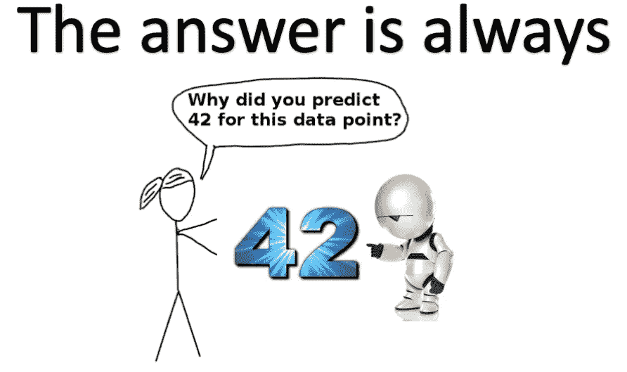

使用大数据的机器学习在商界风靡一时。这些短语给了“协同办公室用语”一个机会。在这些流行语的背后，过去十年来机器学习技术和实现这些技术的机器的发展确实令人瞩目。模型越来越复杂，使得机器能够更好地分类、标注和预测连续值。然而，随着模型变得越来越复杂，我们如何确定模型没有利用训练偏差或预测背景噪声的细微变化。机器犯错误的方式与人类不同。(参见示例[这里](https://www.theverge.com/2017/11/2/16597276/google-ai-image-attacks-adversarial-turtle-rifle-3d-printed)、[这里](https://cyber.harvard.edu/story/2019-03/adversarial-attacks-medical-ai-health-policy-challenge)和[这里](https://www.washingtonpost.com/local/education/creative--motivating-and-fired/2012/02/04/gIQAwzZpvR_story.html) ) 使用 python 库 [ELI5](https://eli5.readthedocs.io/en/latest/overview.html) 、 [PDPbox](/introducing-pdpbox-2aa820afd312) 、 [Lime](https://github.com/marcotcr/lime) 和 [SHAP](https://github.com/slundberg/shap) ，我们可以直观地看到一个模型如何预测一个结果、衡量特征的重要性，或者区分图像中的边界。事不宜迟，让我们透过黑盒模型的帷幕来看看我们的模型表现如何。代码和图像可在 [GitHub](https://github.com/Datadolittle/modelinterpretability) 上找到。

[**点击这里帮助设置环境**](https://github.com/Datadolittle/modelinterpretability)

当训练分类模型时，我们试图最小化单独测试集的错误分类。使用威斯康星乳腺癌数据集，我们试图根据肿瘤特征对肿瘤进行恶性或良性分类。为了训练我们的模型，我们将使用一个随机森林，并按 85/15 的比例分割数据。根据我们的测试集预测，我们会得到以下混淆矩阵:

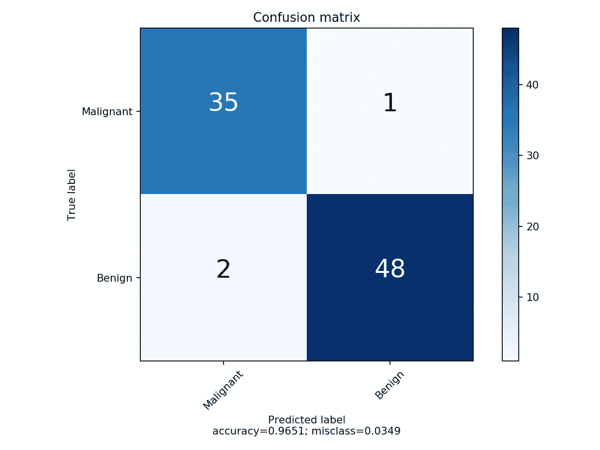

Code for confusion matrix is adapted from [Calvin Duy Canh Tran](https://stackoverflow.com/questions/19233771/sklearn-plot-confusion-matrix-with-labels)

# 误差分析

探索模型中的错误是了解某些要素是否驱动模型预测的好方法。我们开发了一种方法来输出测试集中的假阳性(FP)和假阴性(FN)观察值的指数。我们使用 ELI5 研究特性对错误(本文中的 FP)的影响。

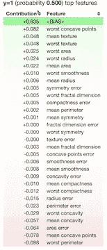

Contribution to probability of class by features. A negative value indicates a weight on the support for a malignant tumor in this example.

我们也可以用石灰来探索这个棘手的问题。

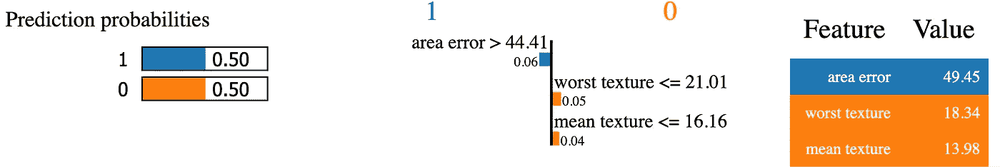

Lime output displays the value of the top feature contributors to a particular class.

或者 SHAP。

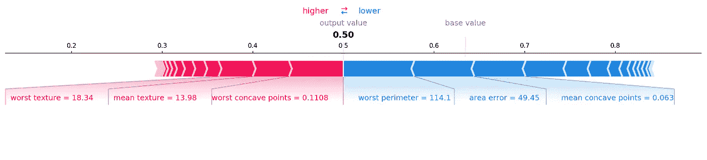

SHAP values also explain the contributions to a particular class.

上面的图片都探索了单一测试用例的完整特性集的贡献。SHAP、ELI5 和 PDPbox 可以解释所有测试数据中最重要的特性。这对于减少特征的数量和为将来的数据收集协议获取知识是有用的。

# 特征选择

由于我们使用的是随机森林模型，我们可以直接从 sklearn 收集特性重要性。

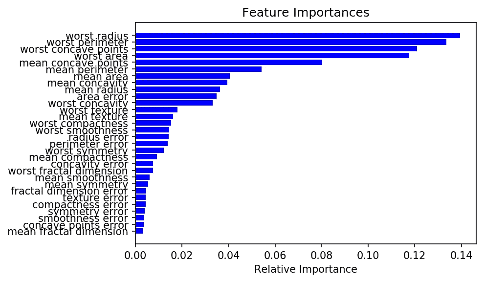

ELI5 的排列重要性函数测量移除一个特征时精度的下降。这种去除是通过打乱特征值从而产生噪声来实现的。

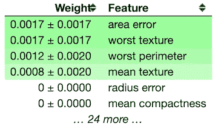

The permutation importance is weighting some features higher than the standard feature importance.

在探索特性重要性方面，我个人最喜欢 SHAP。汇总图如下所示。

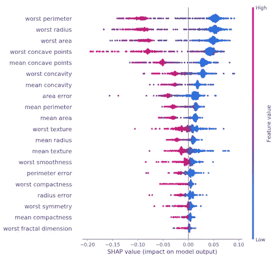

我们可以看到最差半径和最差周长的值是非常重要的特征。他们主要测量肿瘤的大小。最差凹点是另一个很有分量的特征，与前两个不同。最差凹点和最差周长是如何关联的？我们可以使用 PDP 独立探索功能:

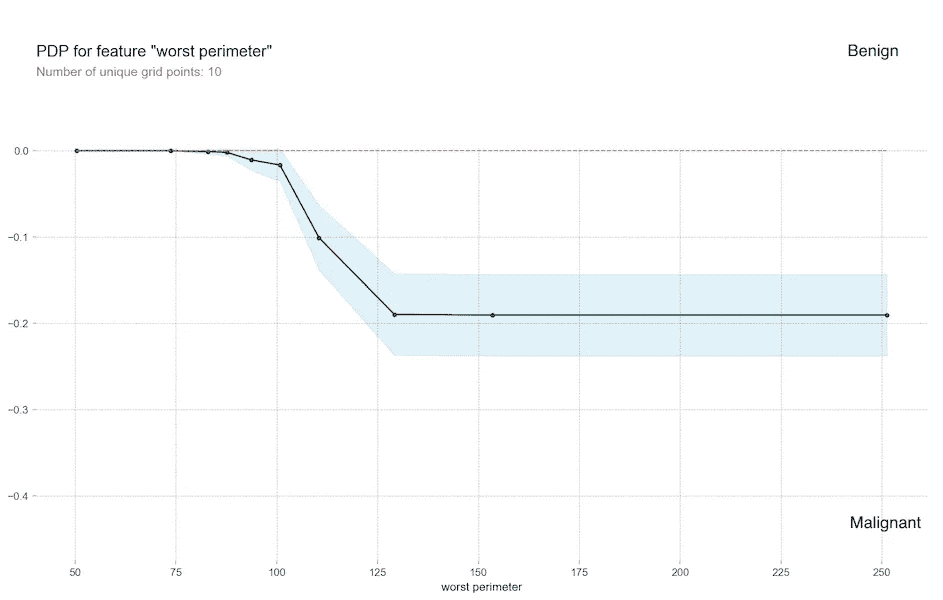

或者我们可以一起探索它们:

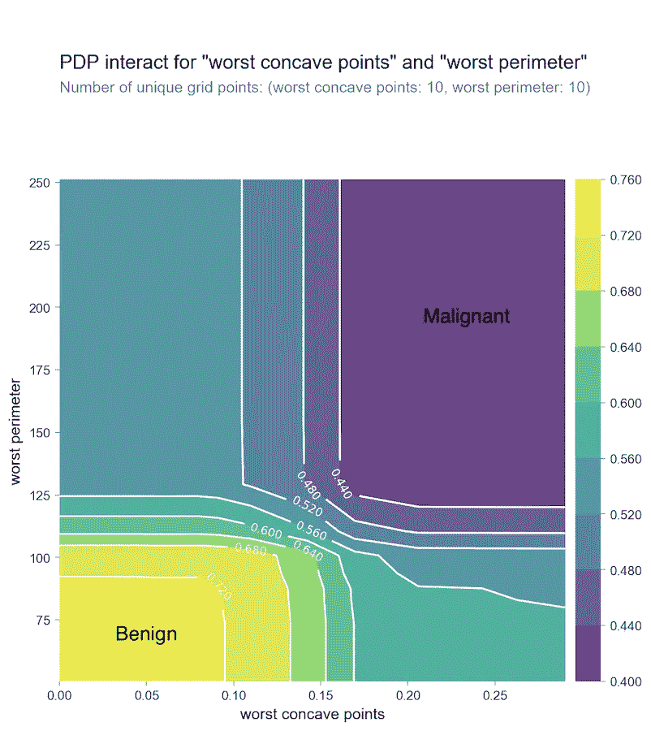

SHAP 也可以对由 SHAP 值着色的 PDP 执行类似的分析。

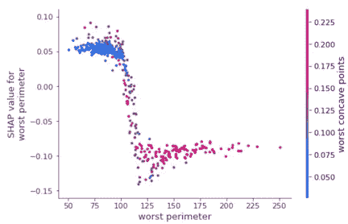

此外，我们还可以使用 [sklearn](https://scikit-learn.org/stable/modules/feature_selection.html) 进行特征选择。

# 映象分析

对于这一部分，我们正在使用深度学习进行图像识别。传统上被认为是一个黑箱，我们使用石灰来掩盖图像分类中的重要特征。我使用的是来自 [Marcotcr](https://marcotcr.github.io/lime/tutorials/Tutorial%20-%20images.html) 的预建神经网络。网络偏向狗分类，有一些贬低的方法。随意选择自己的图像分类网络。给定一只鹅和一只边境牧羊犬的图像，模型的性能如下:

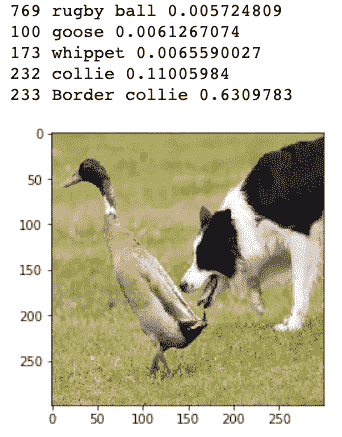

The scores are printed in reverse order with the highest confidences printed last

我们的模型正确地识别了边境牧羊犬和鹅。柯利牧羊犬和 whippet 是相似类型的狗。我们来看看网络是怎么做这些鉴定的。

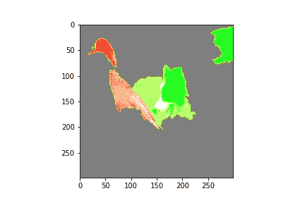

Border collie label is called using the information from the locations in green. The areas in red is identified as not a border collie by the neural network.

除了正确地呼叫一只鹅和各种狗之外，我们的算法认为在这个图像中有一个橄榄球。我想知道为什么？

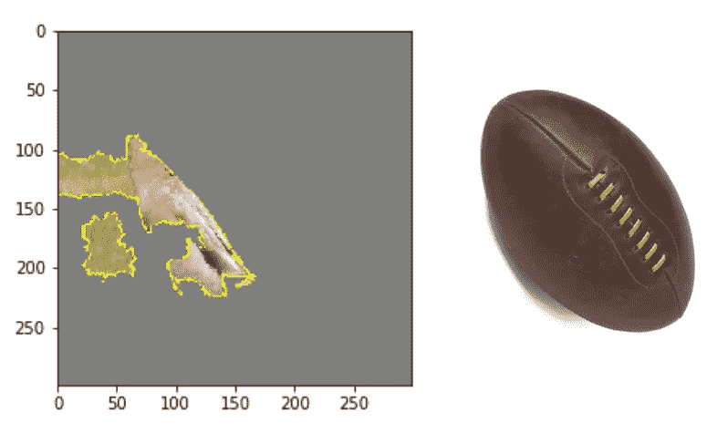

I can kinda see it

你有它！python 中异常值的要素贡献、要素重要性可视化和图像识别要素的概述。为这篇文章鼓掌，关注我，一定要看看我的个人 [LinkedIn](https://www.linkedin.com/in/codyglickman/) 。本文的所有代码和数据都可以在 [Github](https://github.com/Datadolittle/modelinterpretability) 上找到。使用这些工具来解释模型将允许您检测偏差、调试、指导未来的数据收集，并以更高的透明度建立信任。