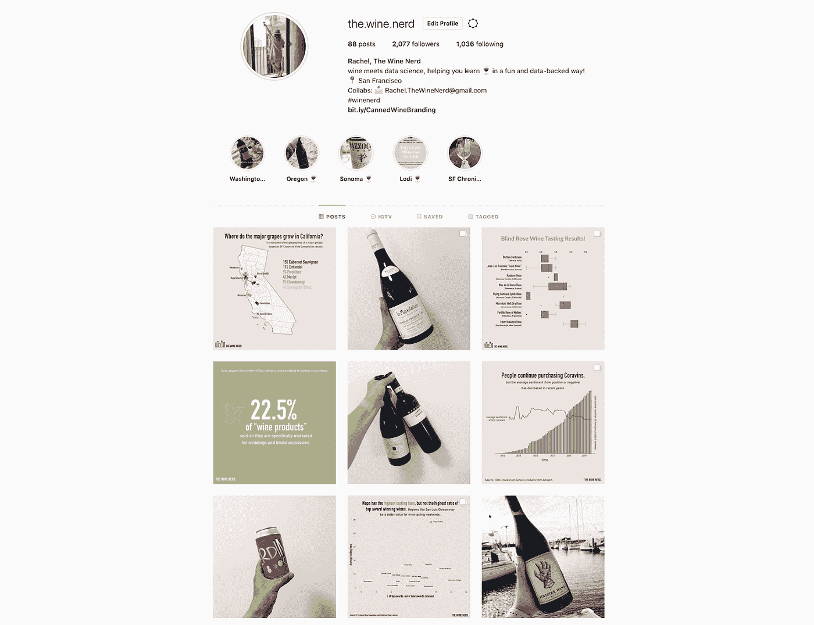
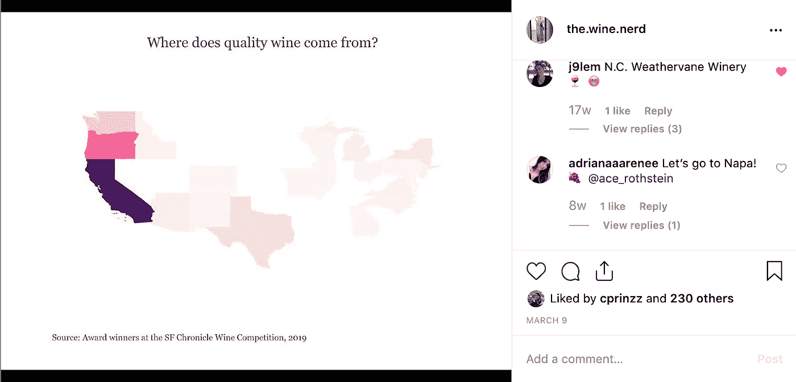
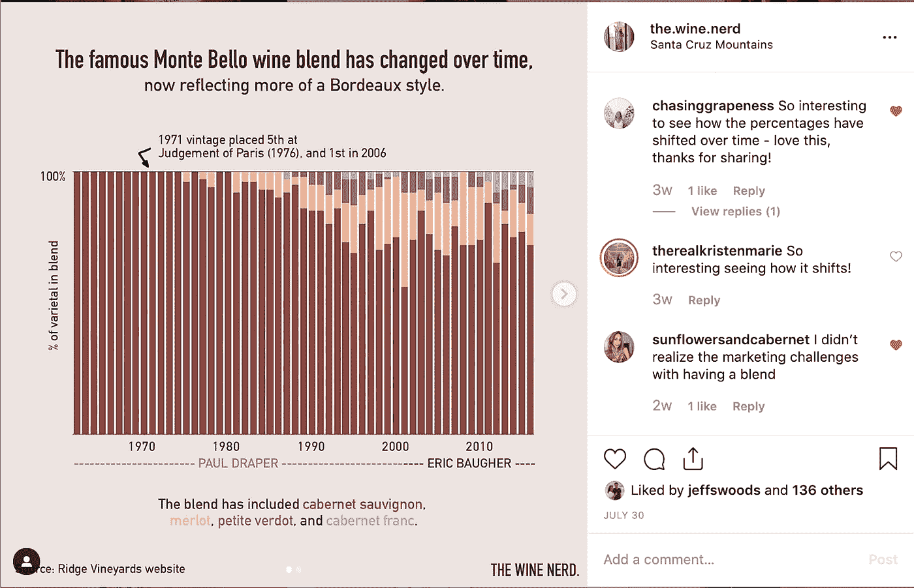
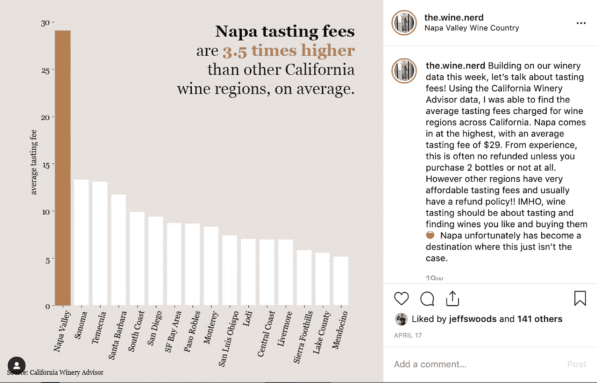
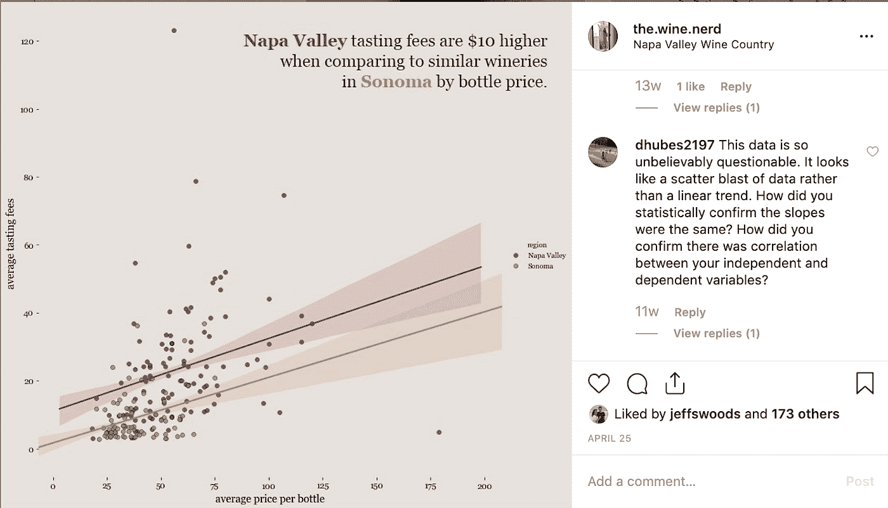
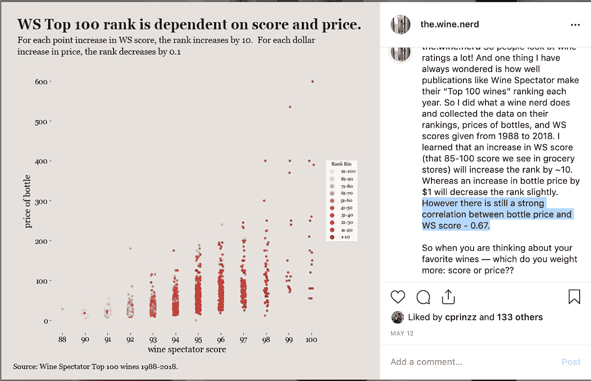
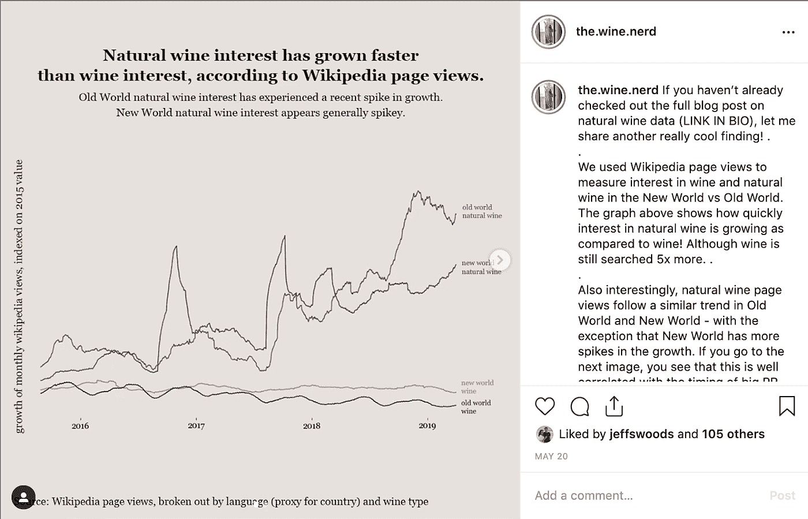
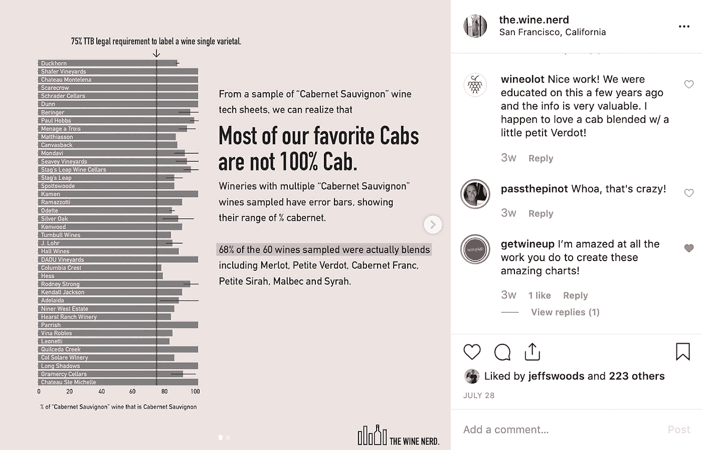
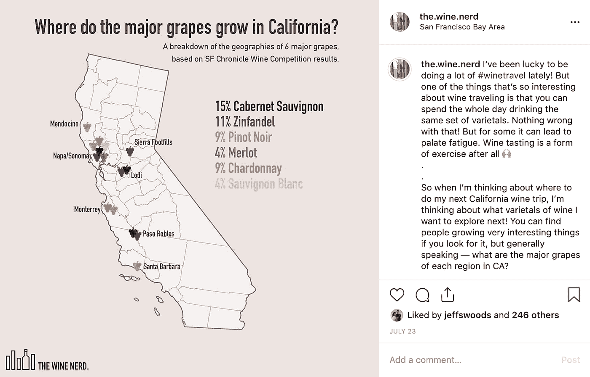

# 关于数据科学，在 Instagram 上放图表教会了我什么

> 原文：<https://towardsdatascience.com/what-putting-graphs-on-instagram-has-taught-me-about-data-science-1cb5d7145606?source=collection_archive---------9----------------------->

Some recent content [@the.wine.nerd](https://www.instagram.com/the.wine.nerd/)

> 今年早些时候，我创建了一个关于葡萄酒数据的 Instagram。

**我很快意识到人们不会真的那样做。**我的意思是，如果你快速浏览 Instagram 上的标签[#数据科学](https://www.instagram.com/explore/tags/datascience/)，你会看到很多教育数据科学的内容，一些人在做分析，一些人在做讲座等等。有一些很棒的账号(我现在已经和他们建立了联系并定期给他们发消息)是非常有趣的事情: [@datavizzy](https://www.instagram.com/datavizzy/) ， [@basic_muse](https://www.instagram.com/basic_muse/) ， [@thedatavizwiz](https://www.instagram.com/thedatavizwiz/) 。但总的来说，Instagram 不是 Medium 那样的数据科学世界。

[**@ the . wine . nerd**](https://www.instagram.com/the.wine.nerd/)开始是作为我新兴的葡萄酒知识的一个创造性的出口，真的只是包括关于葡萄酒的照片和有趣的事实。2019 年 2 月，我开始向我的一些朋友提出做“葡萄酒数据分析”的想法，并在 2019 年 3 月发表了决定性的第一篇帖子(见下文)。

现在，在过去的几个月里，我和这位葡萄酒爱好者一起走过了漫长的道路，我对成为一名高效的数据科学家意味着什么有了惊人的了解。这篇文章的其余部分将重点分享一些经验。

# 有时，在你的视觉化图像中设置背景会有所帮助，就像你不在那里解释它一样。

我的意思是，我的博客就是这种情况——在 Instagram 帖子的评论中，你只能强调和回复这么多。相反，我学会了设置背景，将注意力吸引到故事的重要部分，并使用视觉线索来帮助读者理解我的观点。这方面的一些技术包括:

*   标题作为结论，而不是标题作为图表的主题。
*   注释和比较线来设置基线。
*   颜色来区分和建立微妙(甚至不那么微妙)的背景。

# 其他时候，玛丽·近藤那张图表。

我在最近参加的一次会议上听到了这个短语；我都笑了，非常同意。**不需要复杂的就不要复杂。简单，挑选一个关键的要点，不强调其余的数据，这样人们就能很快理解你想表达的意思。如果人们想花更多的时间看图表，更好地理解数据，他们会的。**

这里有一个葡萄酒爱好者的帖子，展示了加州每个葡萄酒产区的平均品酒费。我想传达的关键信息是，纳帕的品尝费高得离谱。为此，我只保留了顶部区域，并且只保留了一个关键点。然而，通过将其余地区分离出来(而不是将数据分为“纳帕”和“非纳帕”)，人们还可以对他们感兴趣的特定地区的品尝费用进行评论，如下所示。

# 为最小公分母而创造和交流。

我认为对数据科学家来说，最好的面试问题之一是以“把我当成五年级学生来解释”开始。作为数据科学家，我们应该能够清楚地表达我们的分析和使用的技术。

一个例子是，我在分析中大量使用箱线图，因为我认为它们是可视化不同类别分布的非常有效的方法。当有人问你如何解读你的情节时，你能解释清楚吗？更好的是，你能帮忙添加上下文吗，这样他们就不用问了？现在我试着在评论和标题中这样做——记住，每一个大胆的人问，10 个可能没有。

# 但是不要忘记房间里的技术人员的细节。

另一方面，作为数据科学家的一些最佳时刻是当人们挖掘你的结论或方法背后的基本原理时。我们终究是这样变好的！例如，上次有人质疑你在散点图中使用最佳拟合线是什么时候？

yes, I did respond to him with the r squared and slopes

现在，每当我分享图表时，我都会后退一步，思考“我遗漏了什么信息”，并确保我手头有这些信息，或者我将它们包含在图表的脚注中。下面是我下周分享的一个例子，包括相关系数:)

# 在格式化上花时间会增加可信度。

如果你习惯于向普通观众展示可视化效果，那么你通常不会在美化可视化效果的过程中投入太多时间。如果你看看那些利用数据的流行博客，比如 FiveThirtyEight 或纽约时报，你会注意到它们看起来很专业，而且整合得很好。基本的东西，如字体大小，删除框，样式颜色，添加图例，标签轴等。帮助你的观众不仅理解而且信任你的数据。

# 对一个问题的清晰阐述确实能引发讨论。

迄今为止，我发现的最令人惊讶的见解之一是我的[葡萄酒混合分析](https://medium.com/the-wine-nerd/wine-blends-part-1-the-law-and-cabernet-e1bf5dfcc3d9)。这里真正的发现是，大多数葡萄酒并不是 100%像它们所标注的那样，其中一些勉强符合葡萄酒的法律要求(如果你想了解更多关于分析本身的信息，请阅读我链接的帖子)。

但在试图传达这一发现时，我想要一个引人入胜的可视化效果，并真正触及这一点。我觉得关键是我想让人们清楚地了解两件事:百分比因酿酒商而异，其中一些非常低，接近法律要求。说实话，我觉得“大多数我们喜欢的出租车都不是 100%的出租车”确实引起了人们的注意，人们可以立即理解我在说什么。

# 有时候数据实际上并不需要图表。

作为一个明显喜欢可视化数据的人，这可能是最难承认的事情之一，但有时你真的不需要那些花哨的分布、绘图和图表。你真正需要的是给别人一种视觉上有趣的方式来消化你试图分享的信息。下面是一个例子，是我在迭代了大概 5 种其他方法后创建的，用来可视化每种葡萄酒在加州的生长地点和数量。最后，我决定将这些信息分开:一个地图显示地点的上下文，一个列表显示葡萄的百分比。

# 归根结底，学习是一个终生的过程。

你在做什么来获得你的 10，000 小时？作为一名数据科学家，创办 Wine Nerd 是提高我技能的最好方式之一。

p.s .不要脸的塞在 Instagram 上关注我 [@the.wine.nerd](https://www.instagram.com/the.wine.nerd/) 还有我很想在评论里听听你们是怎么练技术的！