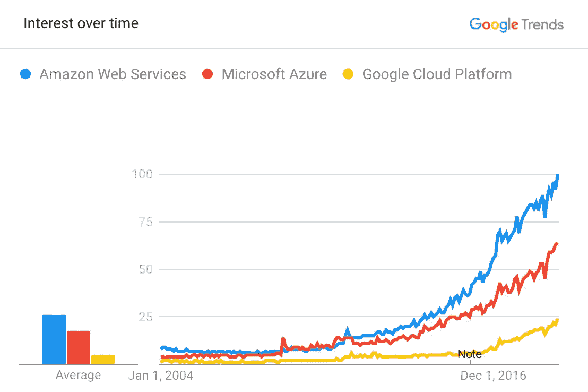

# 优秀的数据科学家和伟大的数据科学家之间的区别是什么？

> 原文：<https://towardsdatascience.com/what-separates-good-from-great-data-scientists-2906431455fd?source=collection_archive---------4----------------------->

## 不断发展的领域中最有价值的技能

数据科学就业市场正在快速变化。能够建立机器学习模型曾经是只有少数杰出科学家拥有的精英技能。但是现在，任何有基本编码经验的人都可以按照步骤训练一个简单的 *scikit-learn* 或 *keras* 模型。招聘人员收到了大量的申请，因为在工具变得更容易使用的同时，围绕“世纪最性感工作”的宣传几乎没有放缓。对数据科学家应该带来什么的期望已经改变，公司开始理解训练机器学习模型只是在数据科学中取得成功的一小部分。

以下是将最优秀的数据科学家区分开来的四个最有价值的品质。

## 1.强烈关注业务影响

对数据科学家来说，最常见的激励因素之一是寻找数据模式的天然好奇心。深入探索数据集、试验该领域的最新技术、系统地测试其效果并发现新东西的探测工作可能会令人兴奋。这种类型的科学动机是数据科学家应该具备的。但是如果这是 T4 唯一的动力，那就成问题了。在这种情况下，它会导致人们在孤立的泡沫中思考，迷失在统计细节中，而不考虑他们工作的具体应用和公司的大环境。

最优秀的数据科学家了解他们的工作如何融入公司整体，并有交付商业价值的内在动力。当简单的解决方案足够好的时候，他们不会在复杂的技术上浪费时间。他们询问项目的更大目标，并在找到解决方案之前挑战核心假设。他们关注整个团队的影响，并主动与利益相关者沟通。他们对新项目充满了想法，并且不怕跳出框框思考。他们引以为豪的是他们帮助了多少人，而不是他们使用的技术有多先进。

数据科学在很大程度上仍然是一个未标准化的领域，数据科学训练营教授的内容与企业实际需要的内容之间存在巨大差距。最优秀的数据科学家不怕走出他们的舒适区，去解决紧迫的问题，并最大限度地发挥他们的影响。

## 2.扎实的软件工程技能

当人们想到理想的数据科学家时，他们脑海中通常会出现来自名牌大学的知名人工智能教授。当公司在竞争中建立尽可能精确的机器学习模型时，为这样的档案招聘人才是有意义的。当必须通过任何必要的手段挤出最后的准确度百分比时，那么您需要关注数学细节，测试最复杂的方法，甚至发明专门针对特定用例优化的新统计技术。

但这在现实世界中很少是必要的。对于大多数公司来说，精确度不错的标准模型已经足够好了，不值得投入时间和资源来将不错的模型变成世界上最好的模型。更重要的是快速建立具有可接受精度的模型，并尽早建立反馈周期，这样您就可以开始迭代并加速识别最有价值用例的过程。准确性的微小差异通常不是数据科学项目成功或失败的原因，这就是为什么软件工程技能在商业世界中胜过科学技能。

数据团队的典型工作流程通常是这样的:数据科学家用试错法和意大利面条式代码构建一些解决方案的原型。一旦结果开始看起来有希望，他们就把它们交给软件工程师，然后他们必须从头重写一切，以使解决方案可伸缩、高效和可维护。不能期望数据科学家交付全职软件工程师级别的产品代码，但是如果数据科学家更熟悉软件工程原则，并且对可能发生的架构问题有所认识，那么整个过程会更加顺利和快速。

随着越来越多的数据科学工作流程被新的软件框架所取代，扎实的工程技能是数据科学家最重要的技能之一。

## 3.谨慎的期望管理

从外部来看，数据科学可能是一个非常模糊和令人困惑的领域。这只是一场炒作还是这个世界真的正在经历一场革命性的转变？是不是每个数据科学项目都是机器学习项目？这些人是科学家、工程师还是统计学家？他们的主要输出是软件还是仪表盘和可视化？为什么这个模型向我显示了一个错误的预测，有人可以修复这个错误吗？如果他们现在只有这几行代码，那么过去一个月他们在做什么呢？

有很多事情可能是不清楚的，对数据科学家应该做什么的期望在公司的不同人之间可能有很大差异。

> 对于数据科学家来说，主动、持续地与利益相关方沟通以设定明确的预期、尽早发现误解并让所有人达成共识至关重要。

最好的数据科学家了解其他团队的不同背景和议程如何影响他们的期望，并仔细调整他们的沟通方式。他们能够以简单的方式解释复杂的方法，让非技术涉众更好地理解目标。他们知道何时抑制过于乐观的期望，何时说服过于悲观的同事。最重要的是，他们强调数据科学固有的实验性质，并且不会在项目成功与否尚不明朗时做出过度承诺。

## 4.适应云服务

云计算是数据科学工具包的核心部分。在本地机器上摆弄 Jupyter 笔记本达到极限，不足以完成工作的情况太多了。例如，当您需要在强大的 GPU 上训练机器学习模型、在分布式集群上并行化数据预处理、部署 REST APIs 以公开机器学习模型、管理和共享数据集或查询数据库以进行可扩展分析时，云服务尤其有用。

最大的提供商是*亚马逊网络服务*(AWS)*微软 Azure* 和*谷歌云平台* (GCP) *。*

考虑到大量的服务和平台之间的差异，几乎不可能胜任云提供商提供的所有服务。但是，对云计算有一个基本的了解是很重要的，这样才能浏览文档，并在需要时了解这些特性是如何工作的。至少，这允许您向友好的邻居数据工程师提出更好的问题和更具体的要求。

所以你有它。对于希望[从零开始组建数据科学团队的公司](https://techblog.commercetools.com/building-up-a-data-science-team-from-scratch-7a7b24ba9f2d)，我建议寻找务实的问题解决者，他们拥有强大的工程技能和对商业价值的敏锐感知。卓越的统计可以带来很多价值，但是对于大多数用例来说，它变得不那么重要了，尤其是在早期团队中。

到目前为止，大多数公司都倾向于雇佣具有强大学术背景的数据科学家，比如数学或物理博士。鉴于该行业近年来的发展，看看未来是否会有更大比例的软件工程师或技术产品经理转变为数据科学角色将是一件有趣的事情。