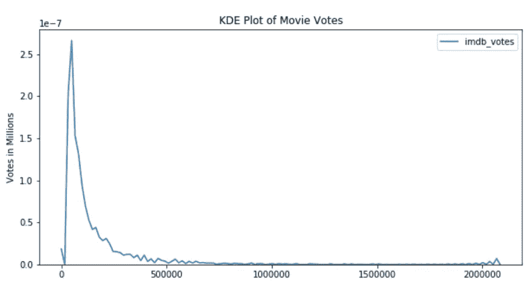
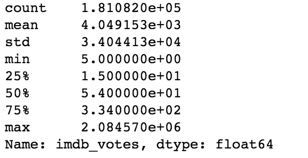
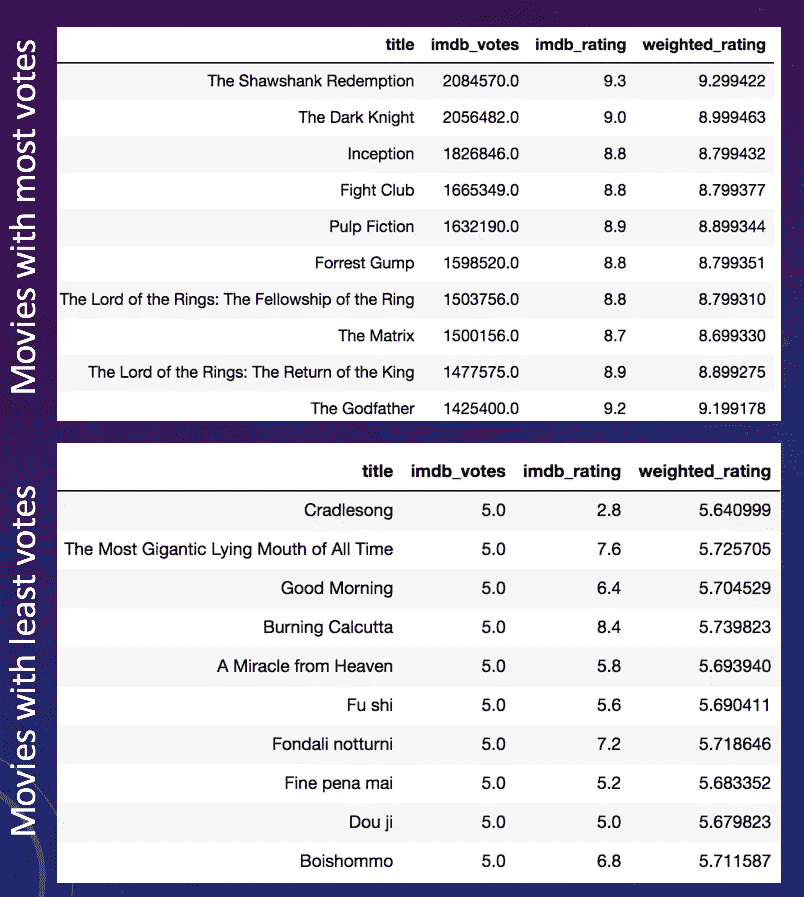
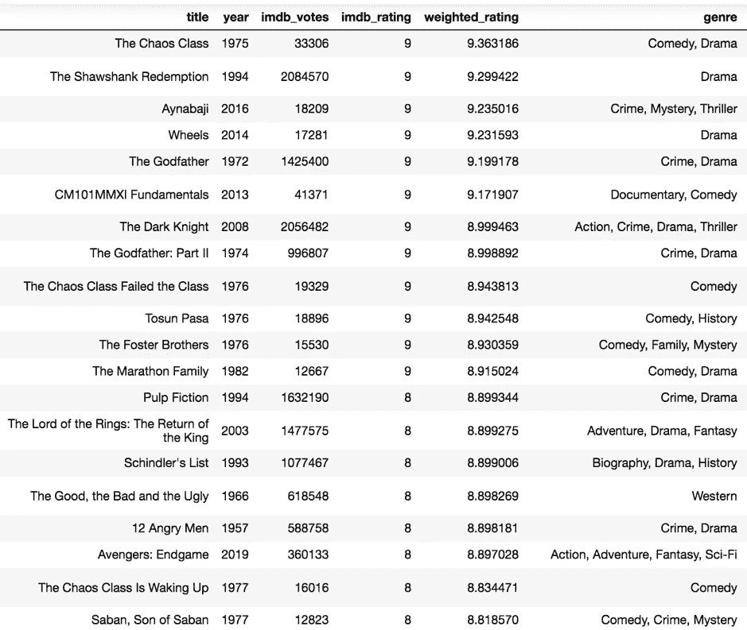
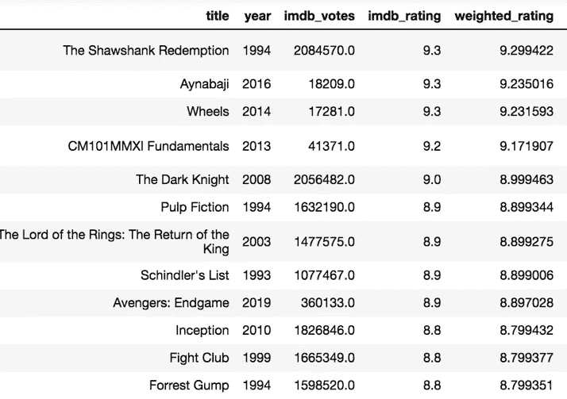
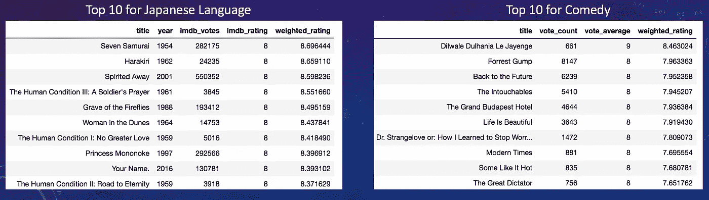

# “接下来该看什么？”—探索电影推荐系统，第 1 部分:受欢迎程度

> 原文：<https://towardsdatascience.com/what-should-i-watch-next-exploring-movie-recommender-systems-part-1-popularity-48a5e3c7d8e1?source=collection_archive---------36----------------------->

推荐系统。它们是什么，你为什么要关心？

事实证明，如今*到处都在使用推荐系统。《纽约时报》、Reddit、YouTube 和亚马逊(仅举几个例子)都以各种方式利用这些系统来推动流量和销售，并为用户带来你正在寻找的东西。*

当人们想到电影推荐者时，他们最经常想到的是网飞，他的算法是让用户一次又一次地回来观看新的和令人兴奋的东西。

我决定自己做一个推荐系统，这样我就可以给自己推荐新电影看了。我创建了四个不同的系统，从简单到复杂:流行度过滤器、基于内容的推荐器、使用 SVD 矩阵分解的协同推荐器以及协同和基于内容的混合推荐器。

在本系列的第一篇文章中，我将讨论数据处理过程，并探索我是如何制作流行度过滤器的。

# 决定数据

有几个现成的电影数据集。最著名的可能是 MovieLens 数据集。如果你有一个像网飞一样的自己的网站，你可以使用来自用户的内部明确数据来帮助推荐电影。例如，Youtube 在其算法中使用平均观看时长(你的视频平均被观看了多少分钟)。Reddit 使用加权用户投票将热门帖子放在他们的“首页”。Instagram 会查看你点击了哪些广告，以及你如何在整个万维网上导航(显然这与你是否登录了你的脸书账户有关，因为脸书拥有 Instagram)。如果你已经找到了自己的路，你可能已经知道:数据是有价值的。

当然，我无法访问内部指标，如收视率、人口统计或其他任何东西，因为我没有实际推荐电影的应用程序或网站。因此，对于我的推荐系统的这一部分，我决定使用 GroupLens 的 [MovieLens 20M 数据集](https://grouplens.org/datasets/movielens/20m/)。这给了我 138，000 个用户对 27，000 部电影的 2，000 万个评分(138，001，因为我添加了自己的评分)。一个很好的开始，当然！

然而，它缺少了一些关键的特性，而这些特性正是我真正想在基于内容的推荐系统中使用的。第一，我不想只用 27000 部电影。我想要一个电影推荐者，他可以深入电影记录的深渊，找出电影中一些尘封的钻石，甚至可以安抚最挑剔的批评家(想想皮克斯 2007 年电影《料理鼠王》中的柯博先生)。因此，为了我的受欢迎程度和基于内容的推荐者，我使用 [IMDB 的可用数据集](https://www.imdb.com/interfaces/)从 IMDB 收集我自己的数据来收集电影 id，然后使用 [OMDBAPI](http://www.omdbapi.com/) 从 265，000 部电影中收集元数据。

在推荐系统方面，我想关注四个指标:**多样性**、**覆盖面**、**意外收获、**和**新奇度**。虽然我不会在这篇文章中谈论如何从数学上探索这些指标，但我会在下面快速定义它们。

**多样性**衡量推荐项目之间的不同程度。我是放*钢铁侠*回来*钢铁侠 2，钢铁侠 3，复仇者联盟，复仇者联盟:奥创时代，复仇者联盟 3：无限战争*等等？或者我会得到一些奇怪的，主题相关的电影，关于一个古怪的富有单身汉陷入困境，就像海底两万里？

不过，也考虑一下，100%的多样性可能看起来就像随机挑选电影，然后把它们扔回去。这不是一个很好的推荐系统。

C **超龄**说明你的目录有多少被实际使用和推荐。例如，一般来说，大多数人的行为都遵循长尾帕累托分布，也就是 20-80 法则。MovieLens 20M 米评分数据集遵循这种长尾分布，我收集的数据也是如此。然而，对于我收集的电影数据集，包含 265，417 部电影，总投票数为 733，228，772，所有投票的 79.57%仅由列表中 1.5%的电影占据。当我们的投票数达到数据集的前 20%时，我们已经占了总投票数的 99.16%。

The KDE of movie votes from IMDB that shows the majority of the votes going to a few of the movies. This kind of distribution is widely explanatory of human behavior and aspects of societal life like wealth

Serendipity 是衡量返回的推荐有多令人惊讶和相关的指标。

**新奇度**决定了推荐的商品对一个用户来说有多不知名。这是没有严格“相关性”的“惊喜”，很难定量评估。

# 建议。系统 1:受欢迎程度

Image from [Pexels](https://www.pexels.com/)

如果我创建一个理论上的网站来推荐电影，当我收集内部用户数据时，无论是显性的(投票/评级)还是隐性的(链接点击、观看时间、购买等)，我都必须有一个开始的地方。

从流行度过滤器开始。这将返回“热门话题”。在 Reddit 上，这是他们的首页。《纽约时报》包括人气过滤器，比如他们的[、【最受欢迎电子邮件】和](https://www.nytimes.com/trending/)(滚动到底部)。IMDB 有他们的“前 250 部电影”。

简单地说，流行度过滤器是这样工作的:你决定一个阈值。什么对你来说是“流行”的？前 5%？前 1%？如果您有可用的信息，您可以使用评级或投票的数量(IMDB 是如何做到的，以及我是如何做到的)来过滤这些信息。如果你是从零开始，你可以使用总销售额或票房这样的指标。一旦设置了阈值，就可以决定如何返回结果。

在我收集的数据(265，000 部)电影中，我可以看到一部电影获得了多少投票，以及这部电影在 IMDB 上的平均评分。简单来说，投票结果如下:

Votes a movie had received on IMDB. The average number of votes was 4,049\. The fewest votes an individual movie had received was 5, the most votes an individual movie had received was 2,084,570

我决定看 95%以上的电影。这给了我 7691 票的初始门槛。我还决定看看那些在 IMDB 上的平均未加权评分在平均值或以上的电影。在这种情况下，未加权评分等于或高于 6.14。

但是，我们如何决定放映哪部电影呢？一般来说，这些电影会有相当稳定的平均收视率。但另一种方法是创建一个加权评级，考虑到这样一个事实，即如果我们在某个时候决定对我们的前 250 张排行榜使用评级，我们不会希望一部 5 票 10 分的电影战胜一部 100 万票平均 8.9 分的电影。稳定在人气图表中很重要。因此，我们可以使用真实的贝叶斯估计公式将原始平均评级转换为加权评级:

(𝑊𝑅)=(𝑣÷(𝑣+𝑚))×𝑅+(𝑚÷(𝑣+𝑚))×𝐶

其中:

*R* =电影
的平均评分 v =电影
*的投票数 m* =所需的最低投票阈值
*C* =数据集中所有电影的平均评分

**如果这没有多大意义，下面是正在发生的事情:我们决定一个阈值(在我的第一个例子中是 7691 票)。对于票数超过这个门槛的电影，变化不大。然而，对于具有少得多的投票数 *x* 的电影，电影的平均评级随后被填充以剩余的阈值- *x* 投票，其中这些剩余投票中的每一个都是 C，即整个数据集的平均评级。这增加了评级的稳定性，从而增加了图表的稳定性。**

**我们稍后还将在基于内容的推荐器和我们的混合推荐器中使用加权评级。**

****

**The transformation of ratings on movies in my dataset with the most votes on IMDB vs the least votes. It’s clearly seen that the weighted rating of movies with many more votes than our threshold barely changes, whereas movies with very few votes move toward the mean of the dataset as a whole**

**根据我们的阈值(和平均未加权评分，如果你愿意的话)过滤电影后，我们剩下的是一个更小的合格电影列表。在那里，我们只需根据我们的偏好对推荐进行排序并返回。例如，以下是通过使用 265，000 部电影的整个数据集收集的合格列表中的前 20 部，按加权评分返回:**

****

**Popular movies returned**

**关于这第一个受欢迎度结果，有几件事:它包括全球所有的电影，包括 1891 年至 2019 年之间制作的电影。一个有用的列表，但是这是一个人们一进入网站就希望看到的受欢迎列表吗？大概不会。例如，许多美国用户在想到电影时可能会想到好莱坞，不想回到外国电影(《混乱阶级》是一部土耳其喜剧)，如果在*或*狮子王之后推荐一部 1891 年的无声电影，他们可能会感到困惑。****

***幸运的是，通过进一步过滤，这个问题很容易解决。例如，这是另一张流行度图表，只统计了 1990 年或以后发行的电影。请注意，因为我正在改变我的初始设置的形状，我的合格电影的阈值将会改变。在这种情况下，我的总票数门槛从 7691 票变成了 11707 票，看的是未加权平均评分 6.13 以上的电影。***

******

***Top 12 ‘popular’ movies from 1990 on***

***我们还可以选择进一步过滤，为独特的国家、导演、演员、流派、语言等创建流行度列表，确保每次都相应地更改阈值。***

***对于这些过滤器，在 python 中，由于通常你的数据帧中每个特征会有几个条目(例如:黑暗骑士把动作、犯罪、戏剧和惊悚都归为类型)，一个解决方案是使用[熊猫。DataFrame.stack](https://pandas.pydata.org/pandas-docs/stable/reference/api/pandas.DataFrame.stack.html) ，这将允许您包含所有电影，仅通过您的目标功能的一个子集进行过滤。***

******

***Top 10 movies for Japanese language and top 10 movies for Comedy***

***总的来说，人气或前 N 名名单是推荐系统的一个很好的起点，无论你是为了个人博客还是电影推荐而编辑它们，有一些要点要记住:***

***默认情况下，前 N 名列表可能不会返回您想要的指标。对于寻找下一颗未加工钻石的电影爱好者或评论家来说，人气排行榜是不够的。它返回流行的和已知的。还记得上面有长尾的核密度估计图吗？***

***考虑到我们总共 7691 张投票的门槛和 6.14 的平均未加权评分，最初的合格名单包含 6532 部电影。回想一下，整个数据集有 265，000 部电影(更准确地说，是 265，417 部)。这意味着只有 **2.46%的电影甚至被认为是这些前 N 名排行榜的**(记住，在我整个刮出的数据集中，1.5%的电影占了总票数的近 80%)。这不是我们希望的覆盖率指标。在这种情况下，其他指标看起来有点棘手:我们有多样性，因为我们寻找它。我们的第一张图表有不同的国家，年代，流派，演员。过滤掉“日本喜剧”可能会减少我们的多样性，同时也注意到这正是用户正在寻找的。***

***新鲜感，在流行图表中，也可能是缺乏的。有人可能会看着 250 部顶级电影排行榜，然后想，“哦，对了，我忘了那部电影。”但他们可能不会对看到*泰坦尼克号*或*低俗小说*感到惊讶。***

***关于人气排行榜要考虑的第二件事是，它们是 100%非个人化的。如果你在你的博客或网站上实现了一个流行度过滤器或图表，每个访问该网站的人都会看到相同的结果。看看 Reddit，网站历史上的[热门帖子都是多年前的](https://www.reddit.com/r/all/top/?sort=top&t=all)，这就是为什么当你访问他们的“热门”页面时，你不会看到那些多年前的帖子，其算法根据帖子的年龄进行计算和加权，通常只显示不到 6 小时的帖子。***

***关于人气排行榜，我们要考虑的最后一件事是，我们在假设人们喜欢什么。流行推荐背后的整个想法是，因为很多人喜欢它，一个随机的人也会喜欢它。显然，情况并不总是如此。仅仅因为 100 万人对*魔戒:指环王联盟*赞不绝口，并不能让一个不喜欢该系列的人突然喜欢上它。我不喜欢恐怖电影，任何受欢迎程度都不会让我改变主意。此外，虽然进一步过滤的图表确实解决了这个问题，但我非常怀疑一个五岁孩子的父母会看我们的第一张图表，并找到任何适合他们孩子观看的东西。***

***总的来说，流行度图表简单，易于实现，是向用户推荐产品、页面或其他服务的良好开端。人气排行榜不是:个性化的，深度潜水的，或者会向你推荐你从来不知道你需要的电影(除非那部电影是*阿凡达*)。***

***感谢阅读！在下面的评论中留下任何问题，如果你愿意，可以查看我的 python 笔记本或[我的 github repo for this project](https://github.com/ecbenezra/recommender-system) 。***

***我的下一篇文章将讨论基于内容的推荐器:使用电影元数据和标签，如流派、美国电影协会评级、情节关键词、演员和工作人员、语言等，使用 NLP 矢量化和距离函数推荐电影，同时考虑可扩展性。准备好读了吗？[点击这里](https://medium.com/@eveb.pdx/exploring-movie-recommender-systems-part-2-content-based-14916840961)。***