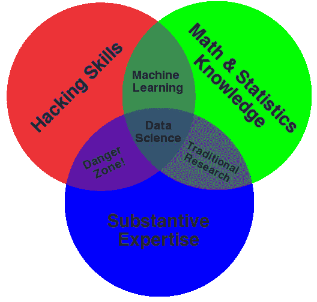
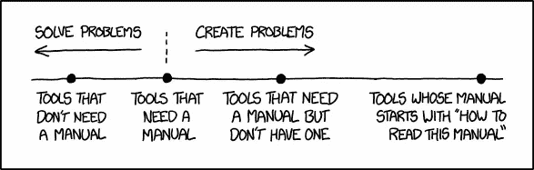

# 数据科学家的入职应该是什么样的？

> 原文：<https://towardsdatascience.com/what-should-onboarding-look-like-for-data-scientists-9d723c15908d?source=collection_archive---------11----------------------->

## 让新员工快速上手的最佳实践

Kickstarting a new journey ([source](https://blog.hubstaff.com/employee-onboarding-best-practices/))

很有可能，你以前去过那里。众所周知，入职是公司招聘流程的重要组成部分。它始终影响着新员工和团队成员，但出于某种原因，它经常被忽视。

入职不仅仅是公司给人的第一印象；它为新员工在那里的体验定下了基调。尽管在线数据科学社区产生了越来越多的内容，但与入职相关的最佳实践信息却少得惊人。

在这篇文章中，我将通过分享我的经验来解决这一需求，这些经验告诉我如何在行业中聘用新的数据科学家。

# 数据科学家需要自己的系统

我们知道数据科学本质上是一个[多学科领域](https://www.linkedin.com/pulse/one-data-science-job-doesnt-fit-all-elena-grewal/?utm_campaign=Revue%20newsletter&utm_medium=Newsletter&utm_source=The%20Data%20Science%20Roundup)，需要多样化的技能组合。作为多面手，我们需要涵盖工程、产品、报告、分析等所有领域。

然而，这也意味着新员工需要在这些领域中的每一个领域中进行适当的入职培训。这就是为什么入职数据科学家的任务比大多数人更棘手。你必须走得更远。这意味着建立几个不同领域的知识基础，而不是专注于一两个专业。

虽然不可避免，但这并不是一个巨大的障碍。这仅仅意味着我们需要以不同的方式思考数据科学家的入职问题。不是一个全面的改革，但是我们需要一个个性化的系统来适应我们将要做的工作。

Everyone’s favorite Venn diagram ([source](http://drewconway.com/zia/2013/3/26/the-data-science-venn-diagram))

# 设定期望

一旦所有人力资源方面的事情都解决了，新员工也熟悉了公司范围内的信息和流程，就该设定期望值了。

这通常采取与他们的经理进行[初次会面](https://knowyourteam.com/blog/2018/10/24/how-to-prepare-for-a-one-on-one-meeting-as-a-manager/)的形式，在会面中，他们可以分享一些信息，并进一步深入角色。在您进一步进入入职培训之前，讨论应包括以下内容:

*   职位概述
*   随之而来的期望
*   需要考虑的近期项目
*   路线图下可能的项目
*   你想制定什么政策
*   他们会经常与谁互动
*   问题的联系方式

# 了解团队

接下来，是时候见见其他队员了。这一步骤因公司而异，取决于您的数据科学团队的规模和组织结构。这里最重要的是让新员工感到舒适，并让他们了解彼此。这可以是绕着办公室跑一圈去见见每个人，或者是和团队一起坐下来吃午饭这样简单的事情。

一旦介绍完成，他们应该更好地了解每个人，并开始更多地了解团队。我最喜欢的方法是在前几个月使用脸书的职业冷启动算法。这种算法的前提是从你的经理那里得到一份你应该与之交谈的人员名单，询问他们每个人 30 分钟的时间，然后做以下事情:

> 前 25 分钟:让他们告诉你他们认为你应该知道的一切。做大量笔记。只有阻止他们问你不懂的事情。总是阻止他们问你不明白的事情。
> 
> 接下来的 3 分钟:询问团队目前面临的最大挑战。
> 
> 在最后 2 分钟:询问你还应该和谁交谈。写下他们给你的每个名字。
> 
> 对给定的每个名字重复上述过程。没有新名字之前不要停。

# 设置工具

这一点更简单，但是您的新数据科学家需要一些时间来设置他们的环境和工具。这通常意味着要跨越许多障碍，或者请求访问各种帐户和软件应用程序。

在这个过程中你能做的任何消除摩擦的事情都应该去做。我们都曾在运行某些软件或软件包时遇到过问题。我们知道这有多令人沮丧。共享适当的文档，缩短员工和服务台之间的反馈循环，以及指定团队成员联系问题，这些都是很好的举措。

# 了解客户

无论你在与什么行业和[商业模式](https://a16z.com/2014/05/13/understanding-saas-valuation-primer/)合作，数据科学家都需要了解他们的客户。领域知识对于持续推动影响力是绝对必要的。发展这种[领域知识](https://www.quora.com/Is-domain-knowledge-necessary-for-a-data-scientist)的一个强有力的初始方法是了解你的客户群和他们所属的人口统计数据。

> “我们认为数据是大规模用户的声音。”—埃琳娜·格雷瓦尔

更好的是，如果可能的话，新员工应该尝试使用该产品。你会发现，成为自己的客户这一简单的行为可以打开你在以后产生假设和从数据中获得洞察力时不知道存在的大门。

# 快速历史课

我们知道历史注定会重演，有时我们不愿承认。这就是为什么了解团队和公司内部过去的项目、计划和见解可以让数据科学家的生活更轻松。

他们应该花时间回顾与团队相关的任何过去的分析或项目。即使浏览一些材料也会让新员工对以前做过的事情有所了解，如果他们在做类似的项目，可以让他们继续跟进。他们不应该陷入困境或浪费时间重新发明轮子。

也许更重要的是，确保清楚了解公司的愿景和路线图，以及他们正在做的事情的原因。

数据科学家是思想家。与项目经理或工程师相比，我们有更多的时间[思考问题](https://youtu.be/M5v1nXiUaOI?t=301)，所以在产生影响时，对全局的深刻理解会有很大的帮助。

Double underlined for *extra* emphasis ([source](https://medium.com/conquering-corporate-america/36-signs-you-pulled-this-presentation-together-at-the-last-minute-445ea8912899))

# 第一个项目

一旦您的数据科学家设置好他们的环境，就让他们开始一个初始项目。理想情况下，你已经减少了技术和公司范围内的入职培训，足以让这个项目在一两周内开始。

这可以是一些小而具体的事情，如后续分析或利益相关者的一次性询问。如果没有产生惊天动地的结果也没关系。这个项目的目标是让员工参与进来，让他们开始做更有影响力的工作。

一旦他们在这方面取得了一些进展，给他们一些更具探索性的东西也是一个好主意。让他们稍微活动一下自己的创造性肌肉，探索数据，尝试解决一个模糊的问题。这种灵活性将大大提高他们对数据和新工作流程的适应能力。

# 准时与以防万一

现实是，没有人能马上完全跟上速度。这将是一个过程，其中优先考虑最重要的领域是关键。因此，重要的是要强调，新数据科学家在入职期间将他们的宝贵时间集中在*及时*技能和工具上，而不是在*以防万一*事情上分散精力。

更具体地说，*及时*学习的一个例子是熟悉你公司选择的数据仓库，这是他们需要尽早知道的。另一方面，学习生存分析，因为它可能是适用的，并不是入职过程中的优先事项，因此符合*以防万一*分组。

情况并不总是这样，应该有一个平衡。但这是一个更快启动事情的好方法。

# 文档和反馈

文档在这个过程中的重要性怎么强调都不为过。拥有一个[集中位置](https://github.com/basecamp/handbook)的入门知识可以让入职工作更加顺利。以正确的方式构建它可能需要一些前期时间，但从长远来看，它会得到回报。

Your manuals probably shouldn’t make things harder ([source](https://xkcd.com/1343/))

最后，收集对流程的反馈，并为团队的下一个成员进行改进。很难站在一个刚刚起步的人的角度考虑问题，所以不要依赖它。收集反馈，找出过程中的一些潜在弱点，这样你就可以集思广益，最终实现潜在的解决方案。你未来的雇员会感谢你的。

感谢阅读！请随意查看下面我的一些类似的文章，并订阅我的简讯**以接收任何新内容。**

*   **[为新的和有抱负的数据科学家汇编建议](https://www.conordewey.com/blog/compilation-of-advice-for-new-and-aspiring-data-scientists/)**
*   **[A 型数据科学家的颂歌](https://www.conordewey.com/blog/an-ode-to-the-type-a-data-scientist/)**
*   **[MVA:最低可行分析](https://www.conordewey.com/blog/mva-minimum-viable-analysis/)**

**你可以在 Medium 上关注我更多类似的帖子，也可以在 Twitter 上找到我。想了解更多关于我和我在做什么，请查看我的网站。**