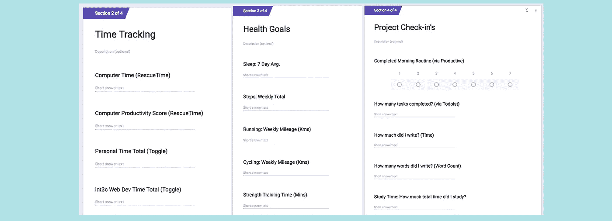
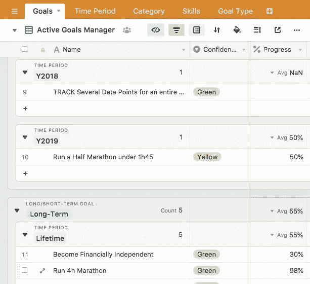

# 2019 年你应该追踪什么？

> 原文：<https://towardsdatascience.com/what-should-you-be-tracking-in-2019-a9415a700897?source=collection_archive---------13----------------------->

## 衡量生活，了解进展，检查目标

跟踪和个人数据可以也应该成为你追求目标、发展更好的自我理解和优化自我提升的一部分。

随着新的一年的到来，我们许多人经常会设定新的目标和决心。在像生日、新的一个月或新的一年这样的时间触发事件中，我们宣布我们想要改变什么，并试图建立一个新的习惯或达到一个渴望已久的目标。其中很多都会失败。据估计，超过 90%的新年决心都失败了。

我们想了很多关于我们想要达到的目标。*但是我们有多少次想到了* ***过程*** *底层* ***我们如何实现*** *甚至* ***如何衡量我们朝着那些目标前进*** *？*

虽然有很多术语被抛来抛去，但本质上自我追踪、量化自我、个人信息学或任何你称之为的东西都可以被定义为测量或记录关于你自己的某些事情的活动。反过来，我发现最好把这种跟踪框定在更好的自我理解或优化的自我提高上。因此，当谈到目标时，跟踪数据可以作为一种反馈机制，用于了解健康或生产力等特定领域，或者作为一种衡量你朝着客观目标前进的尺度。

在这篇文章中，我想分享我将在未来一年中跟踪的东西，但我也想讨论为什么我认为跟踪在今天是一项有用和有意义的活动。

在第一部分，我将分享一些为什么许多人跟踪和为什么个人数据收集在今天是如此有价值的追求的原因。言归正传，我发现跟踪有益的主要原因是，它是更好的自我理解和自我提升的促成因素。但是，如果我们不仅仅是跟踪和收集数据，而是开始处理我们的数据，跟踪才能成为一个推动者。这就是我认为数据参与如此重要的原因。你不需要成为数据科学家来使用你的数据。

在第二部分，也是最长的一部分，我会列出我在 2019 年要跟踪的内容，包括具体的领域和我使用的技术。我还将通过每周回顾、个人数据仪表板和目标检查来分享我处理跟踪数据的三种方式。

最后，我将简要分享我认为每个人都应该跟踪的四个方面，以及跟踪和个人数据如何与您的目标保持一致。

让我们开始看看你在未来的一年里可以跟踪什么！

# 为什么要追踪:追踪生活的价值

几年前，我第一次写了一篇关于[我计划追踪一整年](http://www.markwk.com/2017/01/what-I-am-tracking-in-2017.html)的文章。我最初的观点是，追踪生活比以往任何时候都容易，我分享了一个大清单，上面列有我在未来一年要追踪的事情。跟踪的简易性在今天依然如此。只需一部智能手机，几个应用程序，最好是一个可穿戴设备，你就可以生成和收集大量关于你自己的数据。

改变的是我如何定位目标跟踪。我不再只是为了追踪而追踪，而是为了让数据驱动的生活能够自我理解和自我提升。

我逐渐意识到，自我跟踪最好被认为是目标的支持结构。我们使用数据对我们的生活和追求进行一些客观的测量。然后，我们使用这些数据来了解正在发生的事情，并可视化我们的状态和进展。追踪不是重点；跟踪是一些其他追求或目标的推动者，比如了解我们的健康状况或改善我们的思考或写作方式。

**我发现跟踪有益的人类活动和追求的主要原因是，跟踪数据可以成为更好的自我理解和自我改善的强大推动力。数据帮助我们回答问题，并追求数据驱动的目标。但是，数据和跟踪成为推动者的唯一方式是我们参与并使用这些数据。我们需要超越跟踪和数据收集，开始使用我们的数据进行反馈、自我反思和数据可视化。**

简而言之，追踪可以是授权和有益的，但只有当我们使用我们的追踪数据时。这让我意识到自我跟踪应该分为两个部分:数据收集和数据参与。

1.  **数据收集**:获取我生活各方面数据的标准流程，包括健康、时间、财务、生产力、目标等。
2.  **数据参与**:从数据中学习，检查进度，获得反馈，并考虑你的方法。

让我们看看我将跟踪什么，以及我计划如何在 2019 年处理我的数据。

# 我将在 2019 年追踪什么

说到要追踪什么，最好的办法是想一两个你想要实现的目标，然后找到追踪它的方法。如果你想跑得更多，记录你的跑步。如果你有几个想养成或改掉的习惯，记录下你的习惯。如果你想更好地管理你的时间(或减少电脑或屏幕时间)，跟踪这些。

如果跟踪与你已经有的目标一致，你会取得更大的成功。反过来，通过跟踪你的目标和使用你的跟踪数据，你将能够更加专注于你试图理解或实现的任何事情。

如果你不打算使用这些东西，那么跟踪它们就没有什么意义，而且我跟踪的绝大多数东西都是为了实现我自己的目标。正如我在上一节提到的，我现在把我的跟踪工作分成两部分:1。我的实际跟踪或数据收集和 2。我的数据业务。让我们先看看我追踪的是什么。

# 我的数据收集

在过去的几年里，我已经慢慢地建立了很多跟踪自己生活的方法。我不建议刚刚开始自我跟踪的人去尝试和实施所有这些方法。

尽管有这个关于限制跟踪量的警告，我现在跟踪的大部分数据都是被动跟踪的。所以真的不需要那么多时间去做。

1.  **可穿戴** : *采集睡眠、步数、心率*。拥有一个可穿戴设备是一种收集各种健康和运动数据的简单方法。我主要使用 Apple Watch，但最近我也在测试一款 MiBand3。我发现睡眠是这里最有用的数据，因为我们睡眠的多少对我们的健康、学习和创造力有很大的影响。与此同时，了解我的运动量和心率也被证明是非常有用的。
2.  **健身/锻炼** : *集跑步、力量训练和机动性(在较小程度上，还包括游泳和骑自行车)*。几年前，我超重而且不爱运动。从那以后，我跑了多次全程和半程马拉松，感觉更好，也更有活力和创造力。我在 Apple Watch 上用 Strava 跟踪跑步，通过快速手动方法记录运动训练，并使用 Fitbod 等应用程序管理我的力量训练。
3.  **健康** : *收集补充剂、HRV、疾病状态、血液测试生物标记、血压、体重、脂肪/身体成分*。既然我已经恢复了相对较好的健康和体能，我就不会过多地关注我的健康状况。虽然我真的只服用维生素 D 和其他一些，但我确实使用药丸提醒(Round Health)来跟踪我的补充量。我喜欢用 HRV 4 训练来记录我的心脏状况、疾病、感觉等。我通过定期验血和血压检查来确保我的整体健康状况。此外，我记录我的体重，最近做了身体成分扫描，因为它可以帮助我评估我的力量和肌肉变化。
4.  **时间** : *收集花在电脑和手机上的时间以及项目时间和日历*。我一直是时间追踪的粉丝。没有比追踪时间更好的方法来了解你的时间去了哪里。我用 RescueTime 知道我在电脑上花了多少时间，我用 Toggl 跟踪我的项目时间，包括客户工作、学习和写作。去年我主动减少了我的屏幕时间，并计划继续关注苹果的屏幕时间。虽然它可能不被认为是正式的跟踪，但我发现管理你的日历提供了许多相同的好处，以及一种快速可视化一周时间块的方法。
5.  **生产力** : *收集完成的任务、习惯、目标*。我主要是“跟踪”我的任务和习惯，以获得更好的责任感，并专注于做对我来说重要的事情。与其说是跟踪，不如说是做重要的事情。我用 Todoist 来跟踪我的任务(和偶尔重复的习惯)，用 Habitica 来跟踪我的习惯。我越来越相信目标跟踪的潜力，我已经建立了一个 AirTable 目标跟踪器来处理目标设定、目标跟踪和目标管理。所有这些都为我实现目标提供了巨大的支持和力量。
6.  **财务/金钱** : *收集数字交易和每月财务状况*。我现在已经在很大程度上实现了财务系统的自动化。我使用 Mint 对我的数字交易进行分类，每个月我都会做一次财务检查，记录我在不同账户中的金额。
7.  **写作** : *收集打字字数，写笔记、草稿、发表博文的字数。关于我如何跟踪我的写作的完整解释超出了这篇文章，但总结一下，我跟踪:我现在用纯文本文件写作，所以我得到了关于我的笔记和草稿的每日变化的统计数据，我在某些应用程序中打字的字数，以及我如何创建我发布的博客。我结合使用了 Mac 版的 WordCounter 和我创建的 git 笔记和写作跟踪器。这加起来就是跟踪习惯行为(写作打字和时间)、过程(草稿和笔记)和结果(最终手稿)。我计划在接下来的一年里为更正式的数据分析和跟踪我的作品创建一些代码。*
8.  **知识** : *收集智能笔记、阅读的书籍和文章、播客和研究。*智能笔记是我新的个人知识管理系统的一部分。除了做更好的阅读笔记的目标之外，我的目标是记录我最终做了多少笔记。此外，我会继续我的传统，用 Goodreads 和 Kindle Highlights 记录我读了多少书，用 Instapaper 或 Pocket 记录我读的文章。对于播客跟踪，我继续使用 PodcastTracker.com，这是我几年前创建的。如果我有足够的时间和用户的兴趣，我计划在未来的一年里试着找时间完全重写 PodcastTracker。我也使用 Anki 进行抽认卡研究，那里有一些数据，但是还没有研究如何收集和分析。
9.  **媒体消费和其他随机跟踪** : C *收集设备拍摄的照片、音乐、电视/电影、YouTube(时间和喜欢的视频)*。我追踪的其他几个领域并不一定服务于某个特定的目的(至少现在还没有)，但是因为它们很简单，给我的生活提供了更多的背景，我喜欢它们，所以我做了它们。

*   PhotoStats.io:例如，我在 2017 年末创建了一个名为 PhotoStats.io 的照片跟踪应用程序，开发仍在继续。PhotoStats 应用程序继续作为一种方式来了解你拍了多少照片，拍了什么。
*   Last.fm:我被动地使用这项服务来跟踪我在 Spotify 上听的歌曲。
*   Trakt.tv:我尝试手动将我观看的每个节目和电影登录到这个电视和电影服务中。
*   YouTube:虽然我过去曾试图完全跟踪我在 YouTube 上观看的视频，但这太费力气了。所以我选择了一个更简单的方法来跟踪我的 YouTube 使用情况。我使用 IFTTT 集成来收集喜欢的视频，每周一次记录我在 YouTube 上的观看时间，以了解我在这项服务上花了多少时间。

今年，我跟踪了大约 20-25 个领域或指标。其中一些主要集中在确保我的健康、时间和生产力的背景统计上，而另一些则与我在写作、学习和科技产品方面试图实现的目标密切相关。我在反馈循环中使用这些重点领域来培养习惯并达到我的预期结果。

# 我的数据参与:每周回顾+个人数据仪表板

虽然很多关注点倾向于放在我们跟踪的东西上，包括可穿戴设备、验血、应用程序等，但我发现这种对个人数据收集的单一关注忽略了一个重要组成部分，即数据参与。基本上，如果你不定期处理你的跟踪数据，或者让你的数据提供反馈，那么它就不是很有用。因此，如果我必须给那些开始追踪自己生活的人提供一个建议的话:**利用你的数据！**

你不需要成为数据科学家来使用你的数据。你只需要一个活跃的好奇心和一些熟悉一些简单的工具。通常，查看电子表格应用程序中的数据就足够了。Python 的数据科学工具包、Google Data Studio 或 Tableau 等其他工具可以帮助您更进一步。

就我个人而言，我遵循几个习惯来确保我使用我跟踪的东西来更好地了解自己，并朝着我的目标做出改进。以下是我的数据参与的三个例子:

## 1.每周(或每月)做一次回顾

我坚信每周评论的力量。不管是每周一次还是每月一次，基本的想法是每周做一点组织清理和反思。想想过去的一周，计划下一周。对我来说，这是一段时间，你去“元”，并考虑什么工作和不工作在你的过程中。随着时间的推移，重复这个过程将帮助你更好地理解你的工作和生活系统，并实施改变来改善你的生活和工作。

就我个人而言，几年前我开始做每周回顾，它仍然是我最有用的生产或目标驱动的习惯之一。每周一次，我会留出大约 30 分钟来回顾过去的一周，检查关键领域，并为未来一周制定计划和目标。虽然这种形式已经经历了几次不同的迭代，但我坚持每周日都这样做，保持在 30 分钟以内，并确保至少有 10 分钟用于个人反思写作。

最初的灵感来自于把事情做好，现在我用一种[数据驱动的方法来做我的每周回顾](http://www.markwk.com/data-driven-weekly-review.html)。首先，我使用 Google Form 聚集和记录几个数据点，并将其存储到 Google Sheet 中。我还收集了一些跟踪区域的截图。其次，我做了一些小的清理，并在电子表格中运行了一些简单的比较公式。第三，我用填充的数据点生成一个模板。第四，也是最后一点，我用这个模板写下我自己的想法，反思过去的一周和未来的一周。

如果我只能推荐一个每周一次的改变给某人尝试，那就是每周评论。入门很简单，但却能产生深远的影响。

## 2.创建个人数据仪表板

无论是在公司还是仅仅为了个人需求，处理数据的最佳方式之一就是创建一个数据仪表板。

这是我的“生产力”仪表板的一个例子:

有很多工具可以用来创建个人数据仪表板。它看起来如何并不重要，因为它的主要目的是帮助您比较一段时间内的数据，并可视化各种趋势。像 Google Sheets 或 excel 这样的电子表格应用程序也可以用来可视化您的跟踪数据，而 Tableau 或 Google Data Studio 则是稍微专业一些的选项，它们可以提供一种与存储数据同步的方式。

我越来越喜欢使用 IFTTT 或 Zapier 将我的数据自动收集到 Google Sheets 中。然后，我使用一些简单的公式函数将数据处理成额外的时间维度，如日期、月、周和年，并处理成有用的指标。最后，我将这些数据链接到 Google Data Studio 来创建交互式数据可视化。

我花了几个小时构建我当前的仪表板，并随着我的目标和重点的变化，在这里和那里添加了一些调整。不可否认，使用 Google Data Studio 有一个轻微的学习曲线，但是它不应该花费超过一两个下午的时间来启动和运行。

如果你有兴趣学习如何创建你的个人数据仪表板，我目前正在准备一门关于*谷歌数据工作室个人数据分析和量化自我*的课程，将于 2019 年初发布。[注册我的时事通讯](https://int3c.us2.list-manage.com/subscribe/post?u=9678018750b254168e3a7033b&id=f4e2684697)以获得早期访问和其他好处。

## 3.研究、关键项目和实验的目标检查

Goal Tracker, built with AirTable

目标是一个复杂的主题。思考目标和目标的内容比思考能积极支持(或消极破坏)我们实现目标的系统有趣得多。我最近开始更有意识地设定和跟踪我的目标，尤其是在对目标科学[做了更多研究之后。](http://www.markwk.com/science-of-goals.html)

最终，使用目标跟踪的关键是在评估目标时使用数据和数据分析。我在一个名为 AirTable 的电子表格应用程序中保存了一个很大的目标列表。然后，我对这些目标进行分类、排序和安排。

例如，我遵循了巴菲特关于目标优先化的建议，并制定了 5 个长期目标。我额外的子目标或激励是短期目标，旨在实现那些大目标，比如财务自由或跑一场 4 小时以内的马拉松。鉴于同时致力于多个目标有多难，我按月或季度安排这些子目标。我发现这是一个很好的平衡，它帮助我将目标视为一个过程，而不是一个目标。具体来说，我能够在一个地方完成目标设定、目标跟踪和目标管理。

这被证明是相对可持续的，我使用我现有的跟踪数据和一点反思来看看我做得如何，并找出需要修复或优化的地方。目标是一个过程，跟踪帮助我优化这个过程。

# 结论:2019 年你应该跟踪什么

追踪和个人数据仍然是一个复杂和有争议的话题，我预计在未来几年内仍将如此。它仍然是一个如此热门的话题的一个重要原因是，所有这些数据的大部分利益都流向了少数几家技术公司。通过收集用户数据，谷歌、亚马逊、脸书等公司能够高度准确地知道他们的用户是谁，以及如何操纵他们。这对于数据的使用来说是不公平的，因为作为数据的创造者和所有者，我们也应该从中受益。

我的个人使命之一是帮助人们更好地理解、收集和使用他们的个人数据。在这篇文章中，我分享了为什么我认为跟踪数据是有益的，以及它如何能够促进更好的自我理解和改进我们如何改进。我还分享了一份相当长的清单，上面列有我在未来一年要追踪的事情。我不期望也不建议大多数人跟踪所有这些领域。一个原因是，设置需要一些时间，但主要是因为你跟踪的内容应该与你想做的事情一致。

**2019 年你应该追踪什么？**

我认为每个人都应该跟踪四个关键领域:健康、金钱、时间和项目(例如，任务、习惯和目标)。

**1。你的钱或财务**

除非你有幸生来富有，否则我相信大多数人都会从某种程度的财务知识、计划和设定目标中受益。金钱是最容易也是最简单的追踪方式之一。大多数银行和货币交易都是数字化的，这意味着很容易获得你的数据。财富跟踪也是一个领域，你可以很容易地自动化许多过程，从交易分类到投资扣除。像 Mint、个人资本、Spendee 或者你需要一个预算这样的工具都是很好的开始方式。就跟踪什么和如何跟踪而言，我建议跟踪三个方面:你的交易、你的财务检查(定期账户余额)和你的财务目标。

**2。你的时间(或生产力)**

时间也相对容易追踪。您可以使用被动方法或手动记录来记录您的时间使用情况。手动和被动时间跟踪以及我个人使用的混合方法都有优点，在混合方法中，你被动跟踪设备使用情况，手动跟踪项目时间。为了开始追踪时间，checkout RescueTime 可以让你追踪你的电脑时间，并分类哪些网站或应用程序是有效率的，哪些是令人分心的。在记录你的电脑使用情况一段时间后，检查你的总体数字，决定你的分配是否是你想要的，并实施改变以减少或增加某些领域的时间。

如果你更关心手机的使用，安卓和苹果都提供了应用程序来记录你的屏幕时间，并知道你在设备上花了多少时间。两者都允许你设置通知和限制。

可以说最难也是最强大的时间追踪方法是手动追踪。就我个人而言，我使用 Toggl 来记录我的时间，但大多数计时器工具也能工作。从追踪一个单一的关键领域开始，比如写作或学习，然后考虑从那里扩展。如果你想确保你为一个目标投入了时间，那就记录下来。

**3。你的生产活动=项目、任务、习惯和目标**

任何超过一步的都是项目。在“生产活动”的总称下，我包括项目、目标、习惯和任务。这是我提供一个关于跟踪和更好地管理任何多步骤计划或活动的总括短语的方式。关于生产力以及如何最好地管理生产力的书籍和文章不计其数。我在这里的主要观点是，通过跟踪，你可以创建一个“记分卡”，允许你跟踪你完成的常规步骤和总体成就。例如，你可以使用像 Todoist 这样的任务追踪器来了解你多久完成一次某个项目的任务，或者你可以使用像 Habitica 这样的习惯追踪器来了解你多久完成一个新习惯以及你目前的情况。一旦你开始记录你完成的任务，你就可以开始游戏化，确保你一天完成这么多，多少高优先级和低优先级的任务。

**4。您的健康**

在这四个项目中，健康是最难确定如何最好地衡量和量化的项目之一。在跟踪健康状况时，一个可能有用的关键区别是您是否正在测量您的健康状况(如验血、心率等)。)或跟踪某些健康承诺(如跑步、喝水、服用维生素等)。你应该致力于跟踪你的健康状况和你的健康习惯。

说到健康状况，我建议定期检测你的血液生物标志物，如果你已经超过 35 岁，并且从未定期检查过，那就检测你的血压。两者都将提供一个良好的基线。如果你超重了，你应该去称一称体重并记录下来。就我个人而言，我是 HRV 的粉丝，这是一种测量你长期压力和自动神经系统的方法。我习惯于查看自己是否训练过度、压力过大、过度旅行等，并定期调整以获得更多休息。

要记住的是，“健康”甚至“生病”都不是简单的二进制。事实上，有许多参数(如血液生物标志物)可以对从患病到正常到最佳的范围和尺度进行评分，甚至这些范围也有些主观。也就是说，虽然你可能决定自己的健康数据，但当谈到健康和健康时，我推荐并使用一些公认的健康指标。关键是要持续跟踪他们，并使用健康数据作为反馈环，以了解生活方式的改变是否改善了你的健康。

说到跟踪你的健康承诺，有几乎无数种方法可以做到这一点。如果你只是需要多运动，穿戴式或计步器计步器就可以了。用几天时间来获得一个基线，然后看到一个需要改进的目标。如果跑步、游泳或其他活动是你的事情，用 Strava 或其他应用程序跟踪它。最终，你用什么并不重要，只是试着找到一种简单的方法来了解你运动的频率和你在做什么。就我个人而言，我发现最简单的方法是使用可穿戴设备。我使用苹果手表，但我也是 Fitbit、MiBand、Garmin 和 Oura Ring 的粉丝。

最后，如果你有兴趣收集你的跟踪数据，并做一些数据分析来处理这些数据，请查看我在 github.com 的开源项目 [QS 账本](https://github.com/markwk/qs_ledger/)。这是一个 Python Jupyter 笔记本的集合，引导您收集数据和数据处理，进行全面的数据分析，并创建您自己的数据可视化。

*2019 年你会追踪什么？我错过了什么，你认为我应该在来年尝试？*

【www.markwk.com】最初发表于**。**