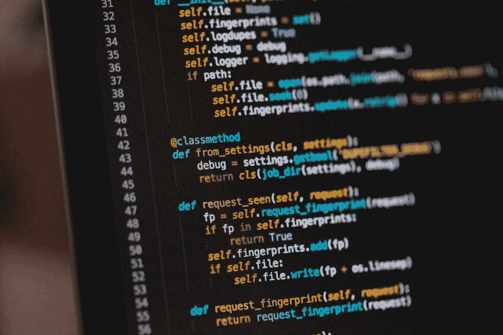

# 数据科学需要哪些技能？

> 原文：<https://towardsdatascience.com/what-skills-you-need-for-data-science-d1963064397d?source=collection_archive---------31----------------------->

## 通过编码成为数据科学家

成为一名数据科学家的很大一部分是知道如何为编码建立一个良好的环境，当你刚刚开始使用一种新的编程语言时，这可能是一个挑战。

Become a great Data Scientist

# 初始相位

以下是你在这个初始阶段想要学习的一些东西:

Python 编码能力。在大多数数据科学环境中，编码经验将是一项基本技能。很好地理解编程需要使用什么工具和库。这里有一些你可能会用到的东西:

让我们来分解一下:

工具—您需要目前在数据科学中常用的好的 Python 工具。这些工具包括 pandas、matplotlib、numpy、Scipy、SQLite 和 r。如果您想做数据科学看起来很酷的事情，您需要熟练使用大多数 Python 工具。

库——随着您开始擅长 Python 编程，您最终也需要知道如何使用一些开源 Python 工具。这些包括那些与 NumPy 和 SciPy 相关的，需要 NumPy 和 SciPy 支持的内置 Python 库，等等。您需要知道如何快速轻松地安装这些库，以及它们与机器和网络堆栈交互的选项。

网络堆栈—需要这些工具中的一些来与机器和网络堆栈进行通信。这里有一些你想了解的话题:SSH 和 FTPS，MySQL。

这只是简单概述了开始学习 Python 和数据科学需要了解的内容。

即使在您精通 Python 并适应使用所有计算工具之后，如果您打算在工作站上运行代码，您仍然希望密切关注自己工作站的硬件。如果硬件不提供这些组件，其中一些组件将会损坏。如果您当前的计算机出现故障，其他人可能会要求您购买新的计算机，并且由于计算机的年龄，其他组件也会有特殊的要求。这将是你需要学习和跟上潮流的另一个领域，在这个过程中你会有一些有趣的项目。

# 职业道路

自从“量化自我”出现以来，我们看到许多人希望他们拥有那些“生活方式”的计算机科学技能。进入应用计算机科学领域的最佳途径是什么？

根据我的经验，从一个数据科学爱好者这样的初学者成为一名数据科学家是非常困难的。这份工作可能是数据分析师，但数据仍然需要大量的软件和分析。我也看到了许多伟大的硕士学位。帮助你进入数据科学领域的一些特征是什么？

# 狭窄的技能组合

数据科学家的技能非常专业。数据科学家需要:

*   分析数据
*   将其分解成组件(或数据集)
*   理解它们所代表的数据系列
*   建立工具来做到这一点
*   计算统计模型
*   分析并构建算法来分析结果

我不想在这篇博文中有点跑题。我认为这是最重要的第一步，但如果不认真对待，人们通常会脱轨进入其他领域。

一个很好的第一步是阅读博士和硕士水平的教程。了解每个步骤和涉及的工具。然后多看例子，自己尝试一下。

# 保持相关性！

这是最关键的属性。如果你的技能不符合你所进入的行业的要求，你将只是一个没有前途的“数据分析师”。这意味着学习能为你的下一份工作、人际交往技能或一次经历增加价值的东西。

另一方面，如果你真的不在乎，你就什么也学不到。

祝你好运！

Data Science Job

最后，如果你想了解成为一名数据科学家意味着什么，那么看看我的书[数据科学工作:如何成为一名数据科学家](https://amzn.to/3aQVTjs)，它将指导你完成这个过程。

如果你在找一份书单，看看下面这些文字:

*   [2020 年你应该读的数据科学书籍](/data-science-books-you-should-read-in-2020-358f70e1d9b2)
*   [2020 年你应该读的人工智能书籍](/artificial-intelligence-books-you-should-read-in-2020-4d3cecd21efa)
*   [2020 年你应该读的创业书籍](https://medium.com/swlh/startup-books-you-should-read-in-2020-ba8684000128)