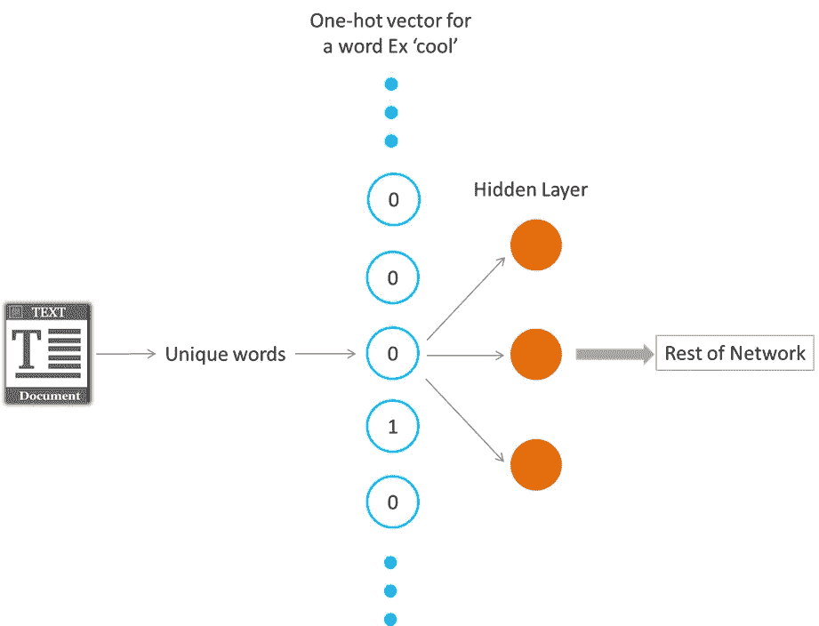
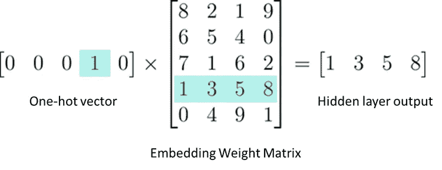

# 什么是单词嵌入

> 原文：<https://towardsdatascience.com/what-the-heck-is-word-embedding-b30f67f01c81?source=collection_archive---------8----------------------->

## 透过神经网络的透镜看文本数据

Photo by [Dmitry Ratushny](https://unsplash.com/@ratushny?utm_source=medium&utm_medium=referral) on [Unsplash](https://unsplash.com?utm_source=medium&utm_medium=referral)

> Word Embedding = >学习将词汇表中的一组单词或短语映射到数值向量的模型的统称。

神经网络被设计成从数字数据中学习。

单词嵌入实际上就是提高网络从文本数据中学习的能力。通过将数据表示为低维向量。这些向量被称为嵌入。

这种技术用于降低文本数据的维度，但这些模型也可以了解词汇表中单词的一些有趣特征。

# 这是怎么做到的！

处理文本数据中单词的一般方法是对文本进行一次性编码。你的文本词汇中会有成千上万个独特的单词。用这样的一次性编码向量来计算这些单词将是非常低效的，因为一次性编码向量中的大多数值将是 0。因此，将在一个热点矢量和第一个隐藏层之间发生的矩阵计算将导致具有大部分 0 值的输出

我们使用**嵌入**来解决这个问题，大大提高了我们网络的效率。嵌入就像一个完全连接的层。我们将这一层称为嵌入层，将权重称为嵌入权重。

现在，我们直接从嵌入权重矩阵中获取值，而不是在输入和隐藏层之间进行矩阵乘法。我们可以这样做，因为独热向量与权重矩阵的乘法返回对应于“1”输入单元的索引的矩阵行

因此，我们使用这个权重矩阵作为查找表。我们将单词编码为整数，例如,“酷”编码为 512,“热”编码为 764。然后，为了得到“酷”的隐藏层输出值，我们只需要在权重矩阵中查找第 512 行。这个过程被称为**嵌入查找**。隐藏层输出的维数就是**嵌入维数**

重申:-

a)嵌入层只是一个隐藏层

b)查找表只是一个嵌入权重矩阵

c)查找只是矩阵乘法的捷径

d)查找表就像任何权重矩阵一样被训练

目前使用的流行的现成单词嵌入模型:

1.  Word2Vec(谷歌)
2.  手套(斯坦福)
3.  快速文本(脸书)

> [**Word2Vec**](https://code.google.com/archive/p/word2vec/) :

该模型由谷歌提供，并在谷歌新闻数据上进行训练。该模型有 300 个维度，并根据谷歌新闻数据中的 300 万个词进行训练。

团队使用跳格法和负抽样来建立这个模型。2013 年上映。

> [**手套**](https://nlp.stanford.edu/projects/glove/) :

单词表示的全局向量(GloVe)由斯坦福大学提供。他们基于 2642840 亿个令牌提供了从 25、50、100、200 到 300 个维度的各种模型

团队使用词到词共现来建立这个模型。换句话说，如果两个词多次共同出现，这意味着它们在语言或语义上有一些相似之处。

> [fast text:](https://fasttext.cc/)

这个模型是由脸书开发的。他们提供了 3 个模型，每个模型有 300 个维度。

fastText 能够实现单词表示和句子分类的良好性能，因为它们利用了字符级表示。

除了单词本身之外，每个单词都被表示为一包 n 元字符。例如，对于单词`partial`，当 n=3 时，字符 n-grams 的快速文本表示是`<pa, art, rti, tia, ial, al>`。添加了`<`和`>`作为边界符号，将 n-grams 与单词本身分开。

# 感谢阅读！

*   如果你喜欢这个，请在 medium 上关注我。
*   你的掌声对你写更多、写得更好是一个巨大的鼓励和动力。
*   有兴趣合作吗？我们在 [Linkedin](https://www.linkedin.com/in/samarth-agrawal-2501/) 上连线吧。
*   请随意写下您的想法/建议/反馈。