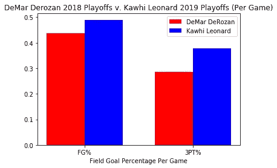

# 这些数字告诉我们什么是“科怀效应”

> 原文：<https://towardsdatascience.com/what-the-numbers-tell-us-about-a-kawhi-effect-2f48fbdb7a1?source=collection_archive---------20----------------------->

首先他拿下了国王，结束了迈阿密热火王朝。然后他在海湾结束了金州勇士王朝。我们通过数字来解释弑君者和王朝征服者科怀·伦纳德的伟大。

7 月 5 日，洛杉矶市遭到地震袭击。然而，地震的余震可能会造成比地震本身更大的震动。全联盟的篮球迷们热切期待的答案终于来了。真正值得一年的等待归结为媒体周期中一周的猜测。"科怀会在世界上的哪个地方演出？"主宰了体育新闻圈。所有其他主要的自由球员都选择了他们想要的比赛目的地。7 月 5 日，科怀·伦纳德给洛杉机带来了一场地震——只不过他要加盟的是快船，而不是湖人。伴随科怀地震而来的是余震。

“2 号”,斯基普·贝勒斯讨厌地称呼科怀——用他的球衣号码称呼他，因为科怀离开斯基普的圣安东尼奥马刺队后留下了酸味——采取了行动。他不仅震惊了篮球世界，选择了湖人的同城对手，洛杉矶快船的“小弟”，他还成功地将快船交易到保罗·乔治。

对于 7 月初的自由球员事件，不能低估经营者科怀的精明程度。体育界确信他会去湖人…然后是猛龙…然后又是湖人…“96.5%的可能性他会来这里…预定吧！”香农·夏普在体育辩论节目上说的是无可争议的，试图将他的愿望变成现实，以便科怀可以与勒布朗·詹姆斯和安东尼·戴维斯合作。科怀·伦纳德以我们从未见过的方式驾驭了体育媒体世界。他不仅让每个人都相信他会和湖人签约，他还成功地让快船管理层交易了一个即将结束 MVP 赛季的保罗·乔治，他去年刚刚和俄克拉荷马雷霆队签订了一份最大合同。

# **《科怀效应》**

讲故事讲够了。让我们直接进入数字。科怀和保罗·乔治都是联盟中的超级巨星。你可以对勇士受伤说任何你想说的话，但科怀带领多伦多猛龙队获得了他们的第一个 NBA 总冠军。尽管达米恩·利拉德向雷霆和他们的球队挥手告别，但保罗·乔治在 NBA 常规赛 MVP 投票中排名第三。我们将分析这两个玩家的价值观以及它对未来的意义。不过，首先，让我们想想“科怀效应”是否存在，以及迄今为止他的影响有多大。


没有关于科怀价值的讨论就没有德玛尔·德罗赞，这个被猛龙交易到马刺的球员最终被租借给科怀·伦纳德一年。奥格·阿努诺比—德玛尔·德罗赞—赛尔吉·伊巴卡—凯尔·洛瑞—约纳斯·瓦兰丘纳斯的首发阵容一起打了 52 场比赛，是猛龙队 2017-18 赛季所有首发阵容中最多的，36-16，赢得了 69.2%的比赛。事实证明，凯尔·洛瑞的 VORP 几乎是德玛尔·德罗赞的两倍，分别是 5.0 和 2.6。像科怀这种水平的超级巨星对整个 VORP 的贡献要大得多，对吗？不完全是。


丹尼·格伦-赛尔吉·伊巴卡-科怀·伦纳德-凯尔·洛瑞-帕斯卡尔·西亚卡姆的首发阵容一起打了 26 场比赛，是 2018-19 赛季猛龙队首发阵容中最多的。科怀·伦纳德贡献了总 VORP 的 25.9%，仅仅比一个赛季前德罗赞贡献的总 VORP 多 2.3%。虽然凯尔·洛瑞在 VORP 方面后退了一步，但这可以归因于几件事情。1)弗雷德·范弗利特有一个职业赛季，所以凯尔·洛瑞的价值没有他的替代者高是有道理的。2)帕斯卡尔·西亚卡姆职业生涯的一年，赢得了进步最多的球员。科怀的 VORP 为 3.6，西亚卡姆的 VORP 为 3.5。哦，对了，我没有提到这个首发阵容的记录，对吗？18 比 8，胜率——你猜对了——69.2%。*和上个赛季打得最多的猛龙阵容一样的胜率。*

到现在为止，我肯定你已经厌倦了我一遍又一遍地谈论同样的事情。我总是“VORP 这个，VORP 那个”，不是吗？在有人直截了当地对我说之前，我会给你们一些新的统计数据和指标，供我们评估科怀的效果时考虑。真正伟大的球员是那些在季后赛中完成任务的球员——把硬件带回家。科怀·伦纳德做了德玛尔·德罗赞不幸从未能为多伦多做的事——赢得冠军。科怀总是被吹捧为他的防守能力，所以这绝对是我们在思考“科怀效应”时应该指出的事情。

为了描绘出基本统计数据如何成为一个球员价值和效果的糟糕指标，让我们先来看看基本统计数据的直接比较。


三个主要统计类别的视力测试无疑对科怀有利。科怀在季后赛(超过 24 场)的 30.5 PPG 远胜德罗赞的 22.7 PPG。平均助攻数也差不多。科怀场均篮板数是德罗赞场均 3.6 个篮板的两倍，场均 9.1 个篮板。就像科怀说的“董事会成员得到了报酬”，这个夏天他确实得到了报酬。



由于视力测试有利于基本统计，让我们快速地将这个概念翻倍。德罗赞的投篮命中率为 43.7%，科怀的投篮命中率为 49%。用 3 分镜头可以看到更大的画面。德罗赞的三分球命中率只有 28.6%，而科怀的三分球命中率接近 38%。很明显，科怀拥有强大的进攻能力，带领猛龙队通过季后赛，获得了他们的第一个也是唯一一个 NBA 总冠军。

在查看这些高级指标之前，先快速概括一下它们的含义:

超过替补球员的价值(VORP)——某个球员给一个假设的替补球员带来的估计价值。所述替补球员通常不是常规轮换球员。计算 VORP 的数学方程式是[(方框加/减)-(-2.0)]*(上场时间的百分比)*(团队比赛/82)。返回的值是在整个赛季中，玩家在替换过程中每 100 个团队财产所产生的点数。

进攻获胜份额(OWS)——一名球员通过进攻贡献的估计获胜次数。

防守获胜份额(DWS)——一名球员通过防守贡献的估计获胜次数。

获胜份额(WS)——玩家贡献的估计获胜次数，是 OWS 和 DWS 的总和。

(来自 Basketball-Reference.com 的高级指标解释)


现在是有趣的部分:高级指标。毫无疑问，德罗赞的先进指标显示他在季后赛中表现糟糕。我知道我说过我不会谈论 VORP，但我没有选择把它包括在内。说真的，我别无选择。如果我把战争(胜于替补，用 VORP * 2.7 计算)算进去，德罗赞的情况会更糟。德马尔的 VORP 为-0.2。其他的统计，OWS(进攻赢球份额)、DWS(防守赢球份额)和 WS(赢球份额)都支持科怀在季后赛的伟大。科怀作为防守猛兽的名声再次保持，DWS 1.7，相比之下德罗赞的 *-0.2。*总体而言，与德罗赞的 0.2 Win 股份相比，科怀贡献了 4.9 Win 股份。简单地说，与德罗赞相比，科怀在季后赛中一直表现出色，而德罗赞在季后赛中就是做不到这一点——科怀比德罗赞多打了 14 场比赛。

所以很明显，在季后赛到来的时候，绝对有一个“科怀效应”,马萨伊·乌吉里(猛龙队总经理)最终做出了一个正确的决定，租借科怀·伦纳德一年。尽管德玛尔，我们仍然爱你。

# 洛杉矶快船预测

从统计的角度来看，预测洛杉矶快船队在即将到来的 2019-2020 赛季的成功有点模糊。他们打了 23 场比赛的首发阵容是艾弗里·布拉德利-达尼罗·加里纳利-沙伊-吉尔吉斯-亚历山大(Shai 马辛·戈塔特-托拜厄斯·哈里斯。该阵容以 39.1%的胜率取得了 9 胜 14 负的战绩。更重要的统计数据？这些球员都不在快船的名单上了。

在 17 场比赛中出场次数第二多的首发阵容是帕特里克·贝弗利-达尼罗·加里纳利-SGA-兰德里·沙梅特-伊维察·祖巴茨。这个首发阵容是绝对的热，烧焦他们的对手，去 15-2，在一个高达 88.2%的胜率。现在，这是一个我们实际上可以做一些分析的阵容。

如前所述，达尼罗·加里纳利和 SGA 已经不在队中了，因为他们是保罗·乔治大交易的一部分。让我们将 George 和 Leonard 分别插入他们的位置，并比较一下这对高级度量意味着什么。


这张图表没有留下多少解释的余地。新的快船将会是致命的。2018-19 年版本的 Clips 是一支有趣的球队，超出了预期，并从金州勇士队(当时在甲骨文球馆)赢了两场比赛，预计 2019-20 年的快船看起来准备好将其他球队赶出体育馆。

哦，对了，我有没有提到谁是快船的替补？卢·威廉姆斯和蒙特雷兹·哈雷尔。特雷兹场均 16.6 PPG 和 6.5 RPG，同时带来了很多勇气和强度，而斯威特·卢将他一如既往的圆滑带到了场均 20 PPG 和 5.4 APG 的比赛中——在需要的时候也充当了夹子的终结者。只是为了好玩，让我们看看与前面提到的首发阵容相比，关键时刻的阵容可能会是什么样子。


好了，你有它的乡亲。它是一个包裹。快船在 sev-开玩笑的。也许我们可以说，如果不是一个乐高 at 詹姆斯在同一栋楼里为对手球队打球。为了更深入地了解这一点，请继续关注我的下一个故事，“湖畔秀”。

# 代码实现的高级概述

我想我会为那些对理解代码实现感兴趣的人提供这一部分。对于那些不感兴趣的人，恭喜你，你可以停止阅读了！

所有代码都是用 Python 写的。我上次提到过，我想从 Basketball-Reference.com 下载 CSV(逗号分隔值)形式的统计数据，并使用 Pandas 模块将 CSV 的内容存储在 Pandas Dataframe 对象中。我就是这么做的。实际上，做起来真的很容易。大部分值的解析和提取都可以在这么多代码中完成:

旁注—“#”是在 Python 中开始注释的方式。我在代码中添加了一些注释来解释部分代码。

```
*import* pandas *as* pd*class* TeamStats(): *def* *getDataFrame*(filename):
         data *=* pd.read_csv(filename) 
         *return* data
         #stores the CSV contents as a DataFrame object and returns *def* *getStat*(data, row, column):
        stat *=* data.at[row,column]
        *return* stat
        #retrieves the statistic from the desired cell (ex. season,        PPG)
```

说真的，就是这样。我肯定还有其他人可以做得更好，但这对我很有效。在这之后，我只是在另一个 python 文件中引用了这两个函数，我的图形就是在这个文件中生成的。我想知道科怀每场比赛得分的一个例子:

```
*import* TeamStats *as* tsdata_playoffs_1819 *=* ts.getDataFrame(“201819RaptorsPlayoffsPerGame.csv”)
#store CSV contents in DataFrame Objectdata_playoffs_1819.set_index(“Player”,inplace*=*True)
#Set the index (column of table) we want (ex. Player)Kawhi_PTS *=* ts.getStat(data_playoffs_1819, ‘Kawhi Leonard’, ‘PTS/G’)
#Retrieves and stores Kawhi's PTS/G in a variable
```

一旦我得到了我想要的统计数据，我就把它们包装在一个列表中，作为参数传递给另一个函数，并使用 numpy 和 matplotlib 模块相应地绘制图表。这里有一个例子，我用来比较德马尔·德罗赞和科怀·伦纳德的数据:

```
*import* matplotlib.pyplot *as* plt
*import* numpy as *np**# This function will graph DeMar and Kawhi's stat's side by side**def* *graphDeMarKawhiAdvanced*(demar_stats, kawhi_stats):      
      stats *=* [“VORP”, “OWS”, “DWS”, “WS”]
      ind *=* np.arange(len(stats))
      # Creates a numpy Array in the range of the number of elements             in the list  
      width *=* .35              plt.bar(ind, demar_stats, label *=* ‘DeMar DeRozan’, color *=* ‘red’, width *=* width, zorder *=* 2) plt.bar(ind *+* width, kawhi_stats, label *=* ‘Kawhi Leonard’, color *=* ‘blue’, width *=* width, zorder *=* 2)
      #both of those lines will plot both of the player's stats plt.xticks(ind*+*(width*/*2), stats)
      # Gives each stat a label on the x-axis
      plt.title(‘DeMar Derozan 2018 Playoffs v. Kawhi Leonard 2019 Playoffs (Advanced)’)
      # Gives the graph a title
      plt.xlabel(‘Advanced Stats')
      # Label of the x-axis
      plt.legend()
      # displays a legend for the graph
```

很容易编写代码，并且摆脱了在我们寻找的值中进行硬编码的工作。

希望有所帮助！

下一次，我将尝试使用 plotly 模块代替 matplotlib 进行数据可视化。生成的图形更清晰、更全面，总体来说，plotly 带来了更多的功能。

感谢阅读！

**来源**

图像:

1.  [https://www . Reddit . com/r/LAClippers/comments/ca 8 xrp/made _ a _ kaw hi _ pg _ jersey swap _ and _ I _ thought _ you _ guys/](https://www.reddit.com/r/LAClippers/comments/ca8xrp/made_a_kawhi_pg_jerseyswap_and_i_thought_you_guys/)
2.  【https://www.youtube.com/watch?v=-X7ozPnYlcg 

统计数据:

Basketball-Reference.com