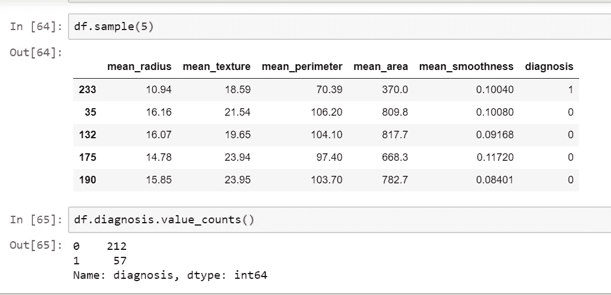

# 当您的分类数据不平衡时该怎么办

> 原文：<https://towardsdatascience.com/what-to-do-when-your-classification-dataset-is-imbalanced-6af031b12a36?source=collection_archive---------8----------------------->

## 在这篇文章中，我们将看看不同的方法和工具，可以用来解决机器学习中出现的一个常见问题，即倾斜数据集的问题。

建立一个好的机器学习模型的关键是它被训练的数据。因此，训练数据必须是干净和平衡的。在完善训练数据上花费的时间越多，在模型上花费的精力就越少。因此，让我们看看如何着手获得一个平衡的数据集。在本文中，我们将讨论，

*   不平衡的数据集意味着什么？
*   为什么数据集不平衡很重要？
*   处理不平衡数据集的不同方法。
*   处理不平衡数据集的不同工具。

## 不平衡的数据集意味着什么？

让我们看看当试图解决一个分类问题时，偏斜意味着什么。当数据集中的大多数数据项表示属于一个类的项目时，我们说数据集是偏斜的或不平衡的。为了更好地理解，让我们考虑一个二元分类问题，癌症检测。假设我们的数据集中有 5000 个实例，但只有 500 个阳性实例，即实际存在癌症的实例。然后我们有一个不平衡的数据集。这种情况在现实生活中的数据集上更常见，因为在所有发生的检查中发现癌症或在所有每天发生的交易中发现欺诈交易的几率相对较低。



In this cancer dataset, there are only 57 positive instances whereas there are 212 negative instances, making it a perfect example of class imbalance.

## 为什么数据集有偏差很重要？

当您的数据集没有平等地表示所有数据类时，模型可能会过度适应在您的数据集中表示更多的类，从而忽略了少数类的存在。它甚至可能给你一个很好的准确性，但在现实生活中却悲惨地失败了。在我们的示例中，一个每次都持续预测没有癌症的模型也将具有良好的准确性，因为癌症本身的发生在输入中是罕见的。但是，当一个实际的癌症病例被分类时，它就会失败，达不到它最初的目的。

## 处理不平衡数据集的不同方法

一种广泛采用的处理高度不平衡数据集的技术称为重采样。重采样是在数据被分成训练集、测试集和验证集之后进行的。仅在训练集上进行重采样，否则性能度量可能会出现偏差。重采样有两种类型:过采样和欠采样。

欠采样包括从多数类中移除样本，过采样包括从少数类中添加更多样本。过采样的最简单实现是从少数类中复制随机记录，这可能会导致过拟合。在欠采样中，最简单的技术是从多数类中移除随机记录，这会导致信息丢失。


Under- and Over-Sampling

另一种类似于上采样的技术是创建合成样本。将合成样本添加到训练数据中也仅在训练测试拆分之后完成。

## 处理不平衡数据集的不同工具

Scikit Learn 的 sklearn.utils.resample 包允许您对数据进行重采样。它将数组作为输入，并以一致的方式对它们进行重新采样。

首先，让我们尝试对这个数据集进行过采样。

```
X = df.drop(‘diagnosis’,axis=1)
y = df[‘diagnosis’]from sklearn.model_selection import train_test_split
from sklearn.utils import resample#split data into test and training sets
X_train, X_test, y_train, y_test = train_test_split( X, y, test_size=0.33, random_state=42)#combine them back for resampling
train_data = pd.concat([X_train, y_train], axis=1)# separate minority and majority classes
negative = train_data[train_data.diagnosis==0]
positive = train_data[train_data.diagnosis==1]# upsample minority
pos_upsampled = resample(positive,
 replace=True, # sample with replacement
 n_samples=len(negative), # match number in majority class
 random_state=27) # reproducible results# combine majority and upsampled minority
upsampled = pd.concat([negative, pos_upsampled])# check new class counts
upsampled.diagnosis.value_counts()1    139
0    139
Name: diagnosis, dtype: int64
```

现在，在我们的训练数据中，这两个类的实例数量相同。

接下来让我们看看欠采样。

```
# downsample majority
neg_downsampled = resample(negative,
 replace=True, # sample with replacement
 n_samples=len(positive), # match number in minority class
 random_state=27) # reproducible results# combine minority and downsampled majority
downsampled = pd.concat([positive, neg_downsampled])# check new class counts
downsampled.diagnosis.value_counts()1    41
0    41
Name: diagnosis, dtype: int64
```

两个类都有 41 个实例。

imblearn 库有一个名为 imblearn.over_sampling 的类。使用 SMOTE 执行过采样的 SMOTE。这是 SMOTE 或合成少数过采样技术的实现。让我们看看下面的实现。

```
from imblearn.over_sampling import SMOTE# Separate input features and target
X = df.drop(‘diagnosis’,axis=1)
y = df[‘diagnosis’]# setting up testing and training sets
X_train, X_test, y_train, y_test = train_test_split(X, y, test_size=0.25, random_state=27)sm = SMOTE(random_state=27, ratio=1.0)
X_train, y_train = sm.fit_sample(X_train, y_train)X_train.shape, y_train.shape((314, 5), (314,)) #We now have 314 data items in our training set
y_train = pd.DataFrame(y_train, columns = ['diagnosis'])
y_train.diagnosis.value_counts()
1    157
0    157
Name: diagnosis, dtype: int64
```

SMOTE 为这两个类创建了足够的合成数据，每个类有 157 个数据项。

我们刚刚讨论了最流行的重采样方法。Imblearn 在 imblearn.under_sampling 和 imblearn.over_sampling 类下定义了许多其他欠采样和过采样方法，以及在 imblearn.combine 类下组合这两种方法的方法。

你可以在 https://unbalanced-learn . readthedocs . io/en/stable/API . html # module-imb learn . over _ sampling 上了解更多信息