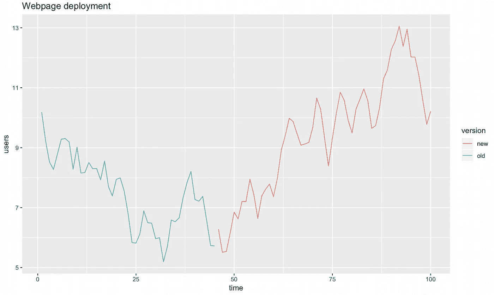
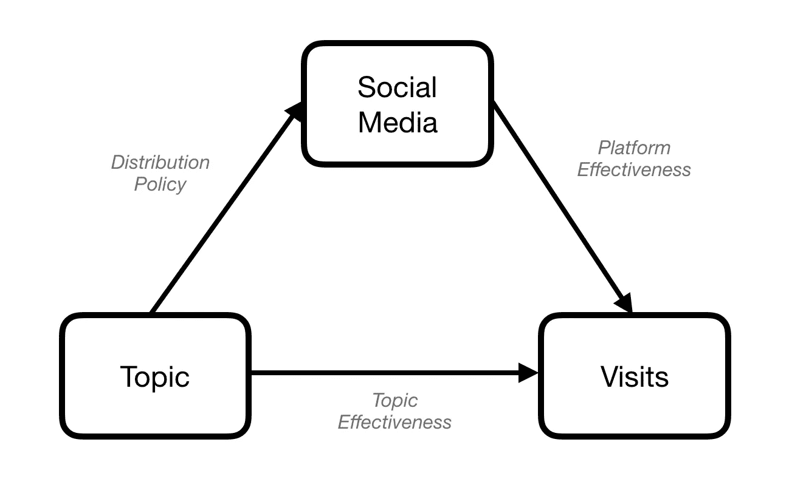

# 从因果推理商业项目中期待什么:管理人员指南 I

> 原文：<https://towardsdatascience.com/what-to-expect-from-a-causal-inference-business-project-an-executives-guide-i-7c5a35c03147?source=collection_archive---------18----------------------->

## [偶然的因果推断](https://towardsdatascience.com/tagged/casual-causal-inference)

## 第一部分:什么时候需要随意推断？

这是因果推理和数据科学系列文章的第五篇。前一个是[《解决辛普森悖论》](/solving-simpsons-paradox-e85433c68d03)。你会在这里找到这篇文章的第二部分。

因果推理是一种新的语言，用于模拟因果关系，以帮助理解更好的原因和影响，以便我们可以做出更好的决定。在这里，我们将解释它如何帮助一个公司或组织从他们的数据中获得洞察力。这篇文章是为那些在数据驱动的公司工作的人写的，不一定是技术人员，他们想了解因果推理项目中哪些是关键点。

注意:有两个因果推理的框架，潜在的结果和 DAG(有向无环图)方法。虽然两者在数学上是等价的，但我们将把重点放在基于图(Dag)的方法上。

# 我什么时候需要因果推理？

假设你的公司开发了一个新网站。它已经部署，你想知道它是否有积极的影响。为此，您需要测量用户数量，并比较新旧网页，得到以下图表:

Number of web users

现在你问，新网页成功吗？显然，你有很好的结果，但如果你仔细想想，你会发现它不是那么清楚。有一些可能的解释:这个月传统上有更多的活动，你的竞争对手做了一些错误的事情，你周围的一些条件发生了变化，…事实上，有无数种可能的原因。

我们如何解决这个问题？运行 A/B 测试。在部署你的网站之前，你将你的用户随机分成两组，并分配给他们两个版本中的一个。有些人会进入新的，有些人会进入旧的。这里的要点是它们都受相同的上下文影响，确保它们之间的比较是可比较的。

然而，A/B 测试并不总是可行的。有些情况下，它太贵了，不道德(想象一下你想看看吸烟是否会导致儿童患癌症)或者不可行(你的竞争对手推出了一种新产品——你不能要求他们为你进行 A/B 测试来衡量它对你的产品的影响！).尽管如此，你可能有一些你认为可能在某些方面对你有帮助的历史数据。嗯… ***那么你需要的是因果推断！*** 你可能会认为这是大多数情况？！答案是肯定的，是大多数情况。

# 我有数据，解释起来很简单，我看不出有什么问题！

通过实验(有 A/B 测试)获得的*数据和*观察*数据(没有 A/B 测试)之间存在巨大差异。看看下面这个来自[的例子，每个群体都会比平均水平差吗？是的](https://economix.blogs.nytimes.com/2013/05/01/can-every-group-be-worse-than-average-yes/)，在分析 2000 年至 2013 年的工资变化时，你会得到这个结果*

## 2000-2013 年实际周工资的中位数变化

*合计:+0.9%
高中辍学:-7.9%
高中毕业生，无大专:-4.7%
部分大专:-7.6%
本科以上:-1.2%*

*全球工资增长* (+0.9%) *，而每个分组的工资都在下降*。什么？！想象一下，你必须在这种情况下做出决定:事情是变好了还是变坏了？这不是一个微不足道的答案。看似计算错误，其实不然。当总和及其子群方向相反时，我们称之为辛普森悖论。如果你想要一个更详细的例子，看看“[解决辛普森悖论](/solving-simpsons-paradox-e85433c68d03)”中的肾结石案例。同样的原始数据同时支持两个完全相反的结论！

辛普森悖论只发生在观测数据中，这只是你在分析观测数据时可能会发现的一个特殊问题。虽然这看起来很罕见，但发生的频率比你想象的要高。总的来说，你必须意识到你可能在分析中引入的许多不同的偏见:它们种类繁多！

> 结论是，处理观察数据可能非常棘手，很容易导致错误的结论。

# 让我们看一个例子

想象一下你在一家名为 CausalNews 的报社工作。为了获得更广泛的受众，您使用两个不同的社交媒体平台来发布新闻，Media4You 和 MediaForU。既然你在他们身上花了很多钱，你想知道哪一个对你的公司更有效率。

您的数据可能如下所示

Example data set

现在 MediaForU 给你的是每条新闻(10+5+1)/3 = 5.3k 的访客，而 Media4You 给你的只是 3k。原来如此，MediaForU 更好！

嗯……正如你可能想象的那样，事情没那么简单。你有两种不同类型的新闻:文化和体育。

Introducing news topics

通常体育比文化拥有更多的读者。Media4You 只获得了文化新闻，这是一个不太受欢迎的话题，所以没有在相同的情况下进行比较。事实上，Media4You 在文化板块工作得更好。我们可以用下图来描述这种情况。

Advertising example

出于许多不同的原因，你以不均衡的方式尝试了两个平台(*发行策略*)。于是，新闻属于哪个话题，就影响了使用哪个平台。同时，主题本身有不同类型的读者，两个平台可能有不同的表现水平。

在我们的直接计算中(5.3k 对 3k)，我们混合了两种效果:主题的效果和平台的效果。如果我们想衡量平台的有效性，这个话题就像一个**混杂因素**，因为这个话题同时影响着两者。我们不确定看到的是平台的有效性还是话题的有效性。

这时，我们自然会想估计:

*   *平台有效性*:如果两个平台获得相同的话题分布，哪一个会创造更多的访问量？
*   主题效果:不管我们的营销政策如何，读者对每个主题的内在兴趣是什么？

这加起来估计了图中用相对箭头表示的因果关系。在接下来的文章中，我们将更详细地描述因果推理如何成为一种逐步估计这些影响的方法，明确我们在分析中采取的假设和风险。

这里可以继续看[。](https://medium.com/@aleixrvr/what-to-expect-from-a-causal-inference-business-project-an-executives-guide-ii-10e521115cb0)

## 致谢:

我要感谢 Nicole Thompson 在一起工作时给我的所有建议，告诉我如何更容易地交流困难的想法。谢谢妮可。

## 参考资料:

*   朱迪亚·珀尔和达纳·麦肯齐的《为什么之书》
*   Miguel Hernán 课程"[因果图:在得出结论之前先得出假设](https://www.edx.org/course/causal-diagrams-draw-your-assumptions-before-your-conclusions)
*   Michael D. Ryall，Aaron L. Bramson " [推理和干预:商业分析的因果模型](https://www.crcpress.com/Inference-and-Intervention-Causal-Models-for-Business-Analysis/Ryall-Bramson/p/book/9780415657600)