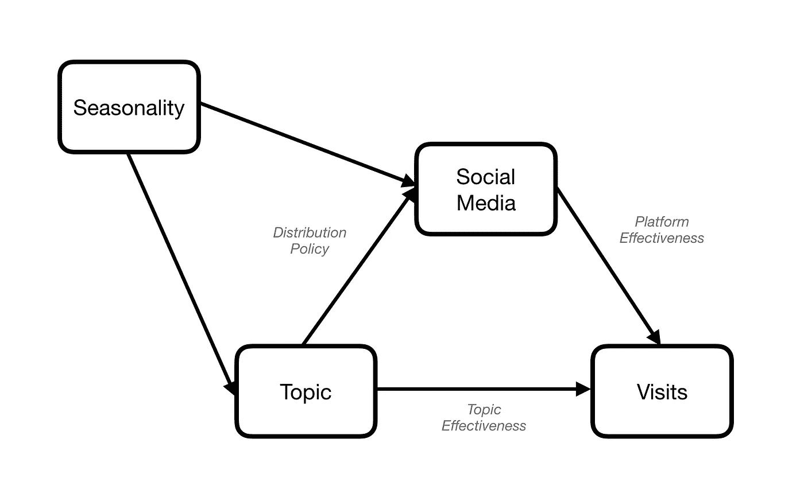
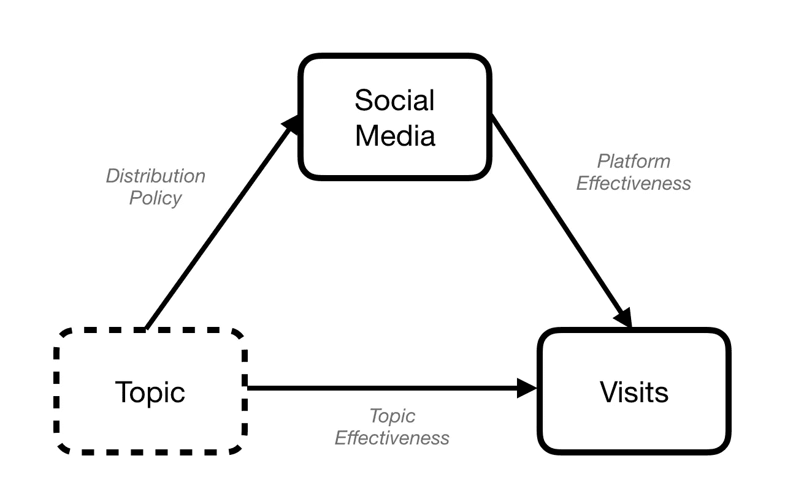

# 从因果推理商业项目中期待什么:管理人员指南 2

> 原文：<https://towardsdatascience.com/what-to-expect-from-a-causal-inference-business-project-an-executives-guide-ii-10e521115cb0?source=collection_archive---------26----------------------->

## [偶然的因果推断](https://towardsdatascience.com/tagged/casual-causal-inference)

## 第二部分:你需要知道哪些项目要点

这是文章的第二部分“[从一个因果推理商业项目中期待什么:一个管理者的指南](https://medium.com/@aleixrvr/what-to-expect-from-a-causal-inference-business-project-an-executives-guide-i-7c5a35c03147)”。你会在这里找到第三部。

# 因果建模

偶然推理模型变量如何相互影响。基于这些信息，我使用一些计算工具来回答这样的问题:如果我没有做这件事，而是做了那件事，会发生什么？我能估计一个变量对另一个变量的影响吗？

因果推断提供了一种粗略的方法来获得因果效应的初步估计。如果你想得到更明确的结论，你应该尽可能用 A/B 测试进行更精确和清晰的测量。这些不会受到混淆的影响，除了统计计算之外，你不需要任何建模。

对于与变量的建模关系，你使用一个图(参见"[使用因果图！](/use-causal-graphs-4e3af630cf64)》。这将是你分析的基础。这样的图表将基于你的人类领域知识。您正在对创建数据的过程以及变量之间的相互影响进行建模。在《[推理和干预:业务分析的因果模型](https://www.crcpress.com/Inference-and-Intervention-Causal-Models-for-Business-Analysis/Ryall-Bramson/p/book/9780415657600)》一书中，你可以找到如何用许多业务示例来详细构建这个图。

## 添加更多变量

上一篇文章中的广告例子是一个非常简单的例子。我们应该期待有更多的相关变量。例如，在大多数情况下，我们将包括季节性。文化和体育新闻通常有不同的活动月份。很有可能你在不同的时间使用了不同的平台。

重要的是，你要把你认为可能与你的分析相关的**所有** 变量都包括进去，并论证为什么会这样*。这是一个需要一些时间的练习。以下是您可能需要考虑的变量类型列表:*

*   影响你的因果变量
*   影响你的效应变量
*   上下文的
*   那些你可以干预或影响的
*   那些你没有数据但很重要、未被观察到、缺失或类似的。

## 主要险别

如果我们知道这个主题是相关的，但出于某种原因，我们没有这些信息，会发生什么？在这种情况下，主题是一个未观察到的变量，如下图所示。

Unobserved topic

因果推断告诉我们，在这种情况下，*不可能*给出媒体平台有效性的精确估计。事实上，混杂因素的影响越小，我们的估计就越准确。所以我们不应该就此止步。我们应该寻找与主题密切相关的、足以进行分析的其他变量。事实上，我们正在接近现实，就像物理学家会做的那样。建模过程越好，我们得到的结果就越真实。

> 因果推断的主要风险是在我们的分析中遗漏了相关的混杂因素。

## 因果估计

最后一部分是考虑图中表示的所有信息，以计算我们感兴趣的每个箭头的因果估计。我们不打算解释这一部分，因为我们需要进入技术考虑。如果你有兴趣了解更多，你可以从“[为什么我们需要数据科学中的因果关系](/why-do-we-need-causality-in-data-science-aec710da021e)”开始阅读这个博客以前的帖子。

# 你能从因果推理分析中得到什么？

从这个例子中，我们可以知道因果推理的重点是什么。

*   评估混淆。
*   分离和估计因果关系，将因果关系归因于每个原因。
*   决定我们是否能用我们的数据给出一个答案，我们需要在我们的分析中包括更多的变量，或者说我们不能给出一个合适的估计。
*   使用图表作为沟通工具来明确你的目标、风险和假设。
*   因果效应的定量估计。

还有一个附带的好处。创建描述您的业务流程的图表的练习使您提出了许多关于您的业务的有趣问题，并澄清了一些您以前不知道的概念。

不使用因果推断有什么风险？因果推理降低了你的分析完全错误的可能性。错了多少？正如我们在辛普森悖论中看到的，你可以很容易地从现实中得出完全相反的结论。

因果推断能保证我的分析是对的吗？不，正如我们所看到的，你仍然可能遗漏混杂因素，或者错误地建立因果关系模型，从而得出错误的结论！如果你能进行 A/B 测试，你应该从中得出明确的结论。如果您想要执行许多测试，您仍然可以使用因果推断来对您的测试进行优先级排序！然而，如果你不能进行这样的测试，因果推断是目前估计因果影响的最佳工具。

你可以继续第三部[这里](https://medium.com/@aleixrvr/what-to-expect-from-a-causal-inference-business-project-an-executives-guide-iii-53ba7d34a6cc)。