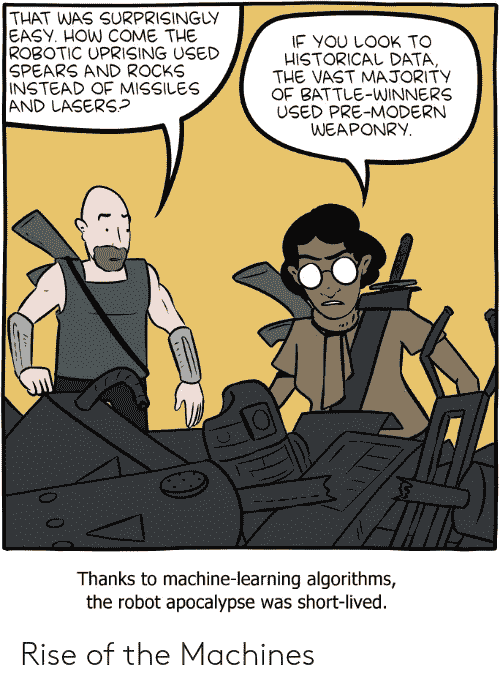

# 从因果推理商业项目中期待什么:管理人员指南 III

> 原文：<https://towardsdatascience.com/what-to-expect-from-a-causal-inference-business-project-an-executives-guide-iii-53ba7d34a6cc?source=collection_archive---------20----------------------->

## [偶然的因果推断](https://towardsdatascience.com/tagged/casual-causal-inference)

## 第三部分:因果推理在当前的人工智能、大数据、数据科学、统计学和机器学习场景中处于什么位置？

这是这篇文章的第三部分“从一个因果推理商业项目中期待什么:一个执行者的指南”。你会在这里找到第二个。

这些词大多含义模糊，至少在通俗层面是这样。让我先定义一下他们在这篇文章中的意思。

**大数据**:所有致力于为查询、预处理数据或用大型数据集训练模型提供访问和计算的计算基础设施(它们不适合你的笔记本电脑)。

大数据技术的一个主要观点是，数据越多越好。先验地，那是一个公平的假设。然而，在某些情况下，它会错误地导致这样的想法

*   如果你有一个非常大的数据集，数据自己说话，你甚至不需要建模。
*   细节或粒度越多越好。例如，如果您想知道人们去过哪里，并且您每秒或毫秒跟踪他们的位置，而实际上只有每小时的数据是相关的(当然取决于应用程序)

机器学习:这是致力于预测系统的专业技术领域。它是统计、计算和优化的结合。你在媒体上看到的大多数应用都是在监督学习领域。在监督学习中，您有一个包含许多观察值的历史数据库，其中每个观察值都有一个上下文描述和一个您想要预测的响应变量。例如，如果您想要自动读取汽车牌照的号码，您将拥有一个包含汽车牌照图像(上下文描述)和每个汽车牌照的实际号码(响应变量)的数据库。这个数据集通常是由人来标记的(你需要一个人来阅读每幅图像并标注它的编号)。目标是建立一个算法或系统，对于每一个新的汽车牌照图像(不在您的历史数据库中)，它能够自动告诉您哪个是其中的号码。监督学习的本质是通过尝试复制过去来学习。

source: [smbc-comics](https://www.smbc-comics.com)

目前，人们对强化学习越来越感兴趣。强化学习关注的不是重现过去，而是学习如何最佳地采取行动。广泛应用于训练机器打游戏。一个非常流行的案例是 DeepMind 用强化学习训练一台机器，以便在围棋比赛中获胜。甚至还有一部关于此事的[纪录片](https://www.alphagomovie.com/)！

当前的强化学习依赖于机器学习技术。此外，它主要用于你有一个你想学做的任务的模拟器的任务中。比如在学习玩游戏中，你有一台可以模拟游戏的电脑。

**AI:** 这可能是其中最模糊的一个词了。我们将把人工智能视为机器学习、机器人技术和试图复制人类行为的类似技术的结合。你可以看到很多公司都在谈论 AI。事实上，他们正在将机器学习应用于与图像、声音或文本相关的任务。

**数据科学:**这是一项专注于应用的活动，主要是在商业领域，与预测分析和从数据中获取洞察力相关。核心知识是统计学和机器学习的结合，有大量的编程(和大数据的密切关系)。

## 机器学习和传统统计学有什么区别？

机器学习和统计学在目的和用途上是不同的。让我通过一个例子来说明。再次想象你在《因果新闻》报社工作。您拥有按月付费的用户，并希望提高您的保留率。每个客户选择一个内容类型(主题)和一个价格。你也从她那里知道，她的年龄和最近的活动(多久在她手机上看一次你的新闻，她是否联系你抱怨访问你的网站的问题，…)。您有兴趣了解每个客户在下一阶段停留的概率。

机器学习从业者和统计学家都将建立一个模型(公式、算法等)，将客户信息和停留概率联系起来

> 停留概率= *f* (年龄、活动、内容类型、价格)

虽然机器学习和统计有不同类型的验证他们的模型，甚至有可能两者都建立了相同的模型！机器学习从业者和统计学家打算如何使用模型？

*机器学习从业者*:把你所有的客户都给我。我会评估下一期入住的概率。你可以开始联系那些更有可能停止订阅的人。

统计学家:年轻人有更多的活动，但愿意付更少的钱。也许你想改变一下你的内容来迎合老年人。更重要的是，价格对你的保留率没有太大影响，所以看起来你可以稍微提高它。

从这个例子中你可以看到*机器学习通常更具操作性，而统计更具战略性*。机器学习的重点是致力于下一个时期(短期)。统计致力于了解影响客户保留率的主要因素，以便您可以制定中长期政策来改善这些因素。

> 机器学习更具操作性，而因果推理更具战略性

## 因果关系在这个游戏中有什么作用？

在这个例子中，因果关系和统计学有着同样的意义。帮助你了解影响你业务的关键因素是什么。这就是我们所说的从数据中获得洞察力。

几十年来，统计一直在成功地做这项工作。但是，它也有一些局限性。因果关系没有明确的形式:因果关系具有内在的方向性，这在相关性中没有反映出来，没有干预的定义，……统计学的主要关注之一是解决不确定性(一个非常困难的问题)。因果关系使用来自统计学的知识，并更进一步完全专注于因果关系。

## 机器学习与因果文化

这两个学科都有一些不同的关键点。而在机器学习中，就像在大数据中一样，数据越多越好。在因果关系上，这远远不够。有更多的数据只是有助于得到更精确的估计，对有正确的(无偏的)估计没有帮助！你可以有无限的数据，但却遗漏了产生完全错误结果的主要混杂因素。

要么是因果推理，要么是机器学习依赖于模型，所以都认为数据很难自己说话。然而，在机器学习中通常你不需要任何领域知识，而在因果推理中领域知识是*必不可少的。*人际交往是必须的。这可能会使自动化机器学习任务比因果推理任务快得多。

每个模型的模型验证本质上是不同的。大多数机器学习应用程序的 oracle 是[交叉验证](https://en.wikipedia.org/wiki/Cross-validation_(statistics))(在一个看不见的数据子集中评估你的模型，以估计模型的预测准确性)。在因果关系中，交叉验证是不够的。你需要用 A/B 测试来检验你的假设。

除此之外，因果关系开始有助于改善机器学习。例如在推荐系统或强化学习领域。然而，这是一个更加技术性的和完全不同的故事，所以我们不会在这里谈论它。

# 为什么是现在？

这个问题很难回答。朱迪亚·珀尔和他的同事们已经做了很多努力，通过写书让更多的读者更容易理解因果推理。与此同时，使用潜在结果框架(以及处理因果推断的替代但等效的方法)的流行病学研究也取得了许多进展。

另一方面，除了深度学习(目前最流行的机器学习技术)令人印象深刻的结果之外，我们还发现了典型的监督学习方法的一些局限性。深度学习的先驱之一 Yoshua Bengio 因其在该领域的工作获得了图灵奖，他在[的这次](https://www.technologyreview.com/s/612434/one-of-the-fathers-of-ai-is-worried-about-its-future/)采访中警告说，有必要将因果关系纳入当前的机器学习观点中:“我并不是说我想忘记深度学习……但我们需要能够扩展它来做推理、学习因果关系和探索世界等事情，以便学习和获取信息。”

加里·马库斯最近在《T4 时报》上写了一篇文章，也谈到了类似的必需品。

诚然，从研究到应用的过程需要一些时间。现在机器学习中最流行的技术开始于 80 年代和 90 年代。所有的研究加上计算机的巨大进步使它们今天很受欢迎。从这个意义上说，对因果推理的研究已经进行了几十年，现在看来它正在蓬勃发展。

> 我们已经根据观察数据做出了大部分决定。让我们用更强的基础来做吧！

# 继续阅读因果推理

如果你想了解更多，你可以阅读这篇博客的其他帖子和其中的参考资料([https://towards data science . com/why-do-we-need-causality-in-data-science-AEC 710 da 021 e](/why-do-we-need-causality-in-data-science-aec710da021e))。优步还有一个非常好的博客，我推荐“[使用因果推理改善优步用户体验](https://eng.uber.com/causal-inference-at-uber/)”以及相关书籍和课程:

*   朱迪亚·珀尔和达纳·麦肯齐的《为什么之书》
*   Miguel Hernán 课程"[因果图:在得出结论之前先得出假设](https://www.edx.org/course/causal-diagrams-draw-your-assumptions-before-your-conclusions)
*   推理和干预:商业分析的因果模型