# 强化学习能带来什么？

> 原文：<https://towardsdatascience.com/what-to-expect-from-reinforcement-learning-a22e8c16f40c?source=collection_archive---------8----------------------->

## [内部 AI](https://towardsdatascience.com/inside-ai/home)

## 还有什么是超越模仿学习的？

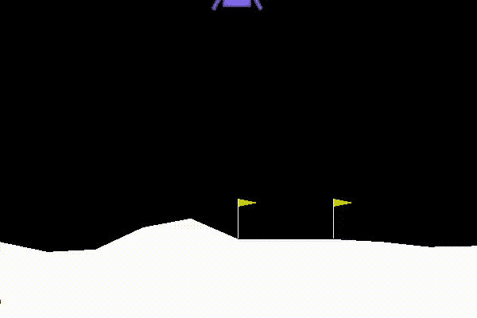

The [Lunar Lander](https://gym.openai.com/envs/LunarLanderContinuous-v2/)

Geoffrey Hinton 曾经举了一个例子“奖杯放不进行李箱，因为它太大/太小了”，这显然取决于我们对“它”指的是什么的先验知识。我们相当确信一个手提箱通常比一个奖杯大，所以要么是“太大的奖杯”，要么是“太小的手提箱”。

也就是说，通过自然地优化每一个句子甚至每一个文档，使其分别达到预期的翻译，不仅会受到缺乏真实世界语境的影响，而且由于语言是一个模糊系统，这种优化还具有相当的随机性。在这种情况下，虽然不可能确定完美的翻译，但是有多个有效的翻译。

尽管如此，对于给定的情况，应该有最佳的翻译，如目标群体的可读性、说服力或信息密度等指标。通过优化这些指标，例如强化学习，而不是简单地模仿监督学习中的人类行为，我们正在遵循一种更端到端的方法，从而大大提高我们系统的能力。

在这个故事中，我们将首先介绍一点背景，并首次尝试利用人工智能来自动化复杂的任务，如自动驾驶汽车、智能分拣机器人等。通过模仿学习。然后，我们将更深入地探讨为什么强化学习可能是一个更有能力的选择，何时值得考虑，以及它在原则上是如何工作的，但也会抽象地勾勒出两个流行的算法。代表我对寻找这种强大技术的实际用例进行总结，确实有助于将 RL 更多地传播到那些算法支持寻找更有益的解决方案的行业中。或者书呆子更喜欢说:

> 从 _ 未来 _ 导入终极解决方案

# 模仿学习

DAVE-2 by NVIDIA on [End to End Learning for Self-Driving Cars](https://devblogs.nvidia.com/deep-learning-self-driving-cars/)

早在 2016 年，英伟达就实现了地面真相创新:而不是对自动驾驶汽车目标的显式分解(例如，车道标志检测、路径规划等。)在手工制作的内部表示中，他们的系统自动抽象和优化所有必要的处理步骤，包括内部表示。在 NVIDIA 的方法中，汽车的反应给出了其传感器的某些反馈(例如，转向角度、速度、前方图像等。)，当然可以通过先进的深度学习技术进行预处理，但不是显式编程，或者他们遵循*模仿学习*的概念。

> 想象一下，你现在正在驾驶一辆汽车，你会把你的驾驶决策过程分解成小的标准，每个小的标准自己组合起来，最后在一个大宣言的帮助下进行评估吗？

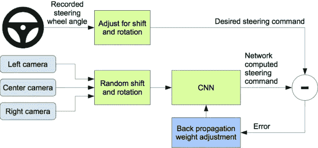

NVIDIA’s imitation learning pipeline at DAVE-2

永远不要。我们作为人类曾经通过一个未知的学习函数学会了如何驾驶，这个函数是无法提取的。然而，可以记录学习驾驶功能的结果(即转向角、速度等。)，以便神经网络可以学习如何从正面图像序列映射到那些期望的动作。这种行为克隆是由 NVIDIA 的 DAVE-2 系统完成的，被称为模仿学习，根据定义，它通过对最终动作本身的端到端训练，而不是最终动作的一小部分，来模仿已经功能化的系统的行为。

尽管如此，模仿学习遭受各种问题，这些问题实际上可以通过变通办法来减轻，以便变得有效，然而，它仍然保持在其可能的能力之下:

1.  **分布不匹配**:模仿学习的初步尝试可能是收集大量人类司机的游戏时间，然后训练系统，并抱最大希望。在神经网络不犯任何错误的约束下，这可以很好地工作。
    *让我们想象一下，在这种情况下会发生什么，比如汽车偏离了轨道？它会随机运行，因为我们既没有编程任何纠正措施，甚至也没有收集数据。我们自己的先验不仅知道如何处理这些罕见的情况，而且还知道有更糟糕的事故存在，这显然应该避免！所以我们从来没有试图开车撞树，也从来没有能够收集这些数据。
    简而言之:收集到的数据分布不仅是所有可能情况的极小子集，而且在我们能够从整个分布中收集的情况下，它将遭受太多的数据！
    更一致的方法是收集网络实际需要的数据，以便进行最佳探索(例如，通过关注新状态或通过那些能够最大化所获得信息的状态)。
    实际上，一个可以想象的解决方案是在车前放置三个大约 30°旋转的摄像头，就像 NVIDIA 练习的那样，而左边的一个一直向右转向，右边的一个坚持向左转向。有了这个技巧，那些纠正措施就能真正实施，然而，这只是沧海一粟。*
2.  **容易出错的人类行为**:直觉上，我们的系统应该比我们自己的驾驶行为更好，例如更节省燃料、时间和损耗。特别是针对某些人类偏好的优化也可能是可取的，比如驾驶舒适性与省时性。总而言之，这并不意味着我们不能彻底驾驶，这更多的是关于相关的微优化。正如[李&](https://homes.cs.washington.edu/~todorov/papers/LiThesis.pdf)所概述的那样，即使是像移动手臂这样的自然任务也可能导致每个轨迹上的巨大运动变化。
    如果我们能够建立一个系统，不仅能够复制人类的力量，而且能够建立新的力量，特别是在那些计算能力更强的领域，那将会更有希望。
3.  **没有似曾相识的抗拒**:观察同一个事物两次并不意味着也处于同样的情境。
    模仿学习只是在没有先前数据的情况下对当前进行优化，即满足[马尔可夫性质](https://en.wikipedia.org/wiki/Markov_property)并且没有任何远见:它生活和行动于当前。前者实际上可以通过使用 LSTM 中的序列数据来缓解，例如，相反，后者无法实现，尽管这可能是合理的:对可想象的未来结果的预计算不仅可以通过记住各种解决方案而不是最受欢迎的解决方案来加强某种创造性，而且还可以缓解存在两个有效解决方案轨迹(例如，向左或向右驾驶一棵树)的问题，但它们的平均值将导致悲剧。

> 强化学习能够缓解这三个问题吗？

是的，除了在实践中不可能真正实现的马尔可夫性质。

强化学习的理念本质上是直接优化人类也会使用的更高目标，而不仅仅是模仿其成果。使用这种方法，我们不会指定系统我们认为什么是相关的，相反，它会自己找出答案。

# 强化学习目标

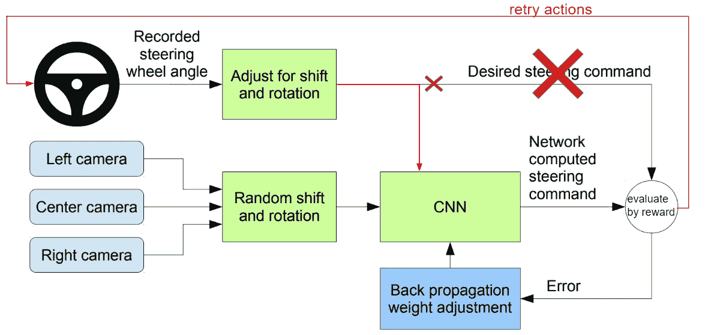

Reinforcement Learning is **end-to-end**

你还记得模仿学习的三个主要问题吗？
第一个问题实际上可以通过让您的系统有机会自己决定需要采取什么行动来取得进展来解决。与此同时，第二个问题也消失了，因为它不再模仿，而是根据更高的奖励目标进行自我学习(第三个预见问题)。

强调一下:它学习起来就像人类最初学习任务一样，但是是从最开始开始。最初几个小时的训练实际上意味着通过采取随机行动来收集数据，希望我们能做一些伟大的事情(由奖励函数决定)，这样我们就能学会加强这种行为，这在未来的迭代中更有可能。

这可以与新生婴儿的试错学习行为相比，他们并不真正了解自己的能力。他处理那种情况的方法是通过爬行和哭泣来探索它的环境，这对他来说是目前最好的选择。

请注意，随着我们变得更好，我们不仅要继续采取那些在过去的迭代中有希望的行动，还要考虑新的不寻常的行动。这被称为开发-探索权衡，在像ε-greedy 这样的算法中，一小部分被分配给随机动作。在这一点上，大多数人会停下来，声称“这样做很好，为什么要改变呢？”。总有更好的解决方案，只是需要时间、成本和努力去探索它…

## 定义

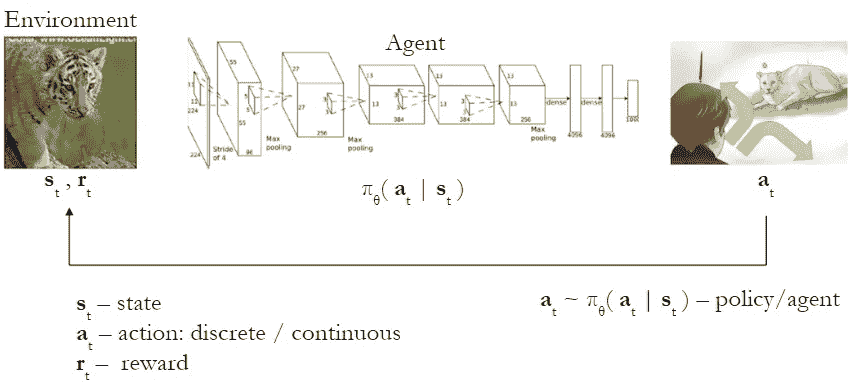

Reinforcement Learning loop, slightly enhanced from [DeepRL Course](http://rail.eecs.berkeley.edu/deeprlcourse/) by [Sergey Levine](https://people.eecs.berkeley.edu/~svlevine/)

我不想让你感到困惑，所以我将在这里快速浏览一下最基本的技术术语，并简要阐明强化学习的整个循环过程。

基本上只有两方参与其中:环境(T0)和代理(T2)。环境为代理提供当前*状态*的适当*观察*(例如，图像、视频、感觉数据等。)由代理通过*策略*(例如卷积神经网络)进行处理，输出当前状态下最可能的动作，然后由代理在其环境中执行。环境现在用一个*奖励*信号来评估该步骤的质量。这可能是一个积极的奖励信号，以加强某些行为，也可能是一个消极的信号，以惩罚错误的决定。当然，整个过程是重复的，直到或者*集*因达到目标而终止，或者我们达到一个上限。有些算法像*政策梯度*依赖于这一整集收集的数据，有些算法只需要一批{ **状态**、**动作**、**奖励**、**下一状态** }就能学会。

> 优化标准是什么？

简单来说就是在给定的一集里最大化所有预期未来回报的总和。

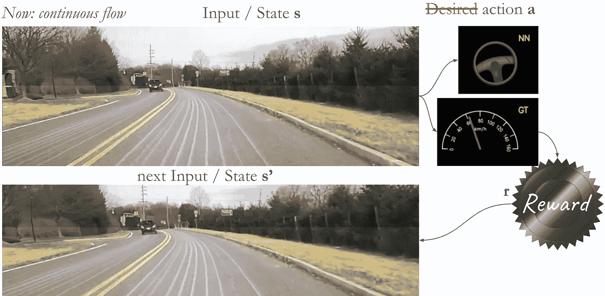

One data batch {**s**, **a**, **r**, **s’**}. Scenery images from [NVIDIA](https://devblogs.nvidia.com/deep-learning-self-driving-cars/)

在这里，这个数据批次是图形可视化。值得注意的是，我们现在需要持续的数据流。因此，像在 Imagenet 中进行的一次性标记数据过程不再有价值。这是因为我们甚至需要在这些区域收集数据，算法甚至不知道在开始时，这样一个区域可能存在。就像一个婴儿，他不知道玩玩具有多有趣，直到他最终找到一个。或者一辆汽车在下雪时不知道它应该意识到打滑的危险，直到它进入这种情况。

这就是为什么环境是算法设计的重要部分，不能像监督学习那样预先计算。

## q 学习

q 学习是强化学习中最著名的具体算法之一。它是以 Q 函数命名的，该函数通过在给定状态下采取某种行动来估计所有未来奖励的总和。注意，它不仅仅使得有机会学习任何{ *状态*，*动作*，*奖励*，*下一个* *状态*}-批次是足够的，而不是包含多个这些批次的整个情节，此外，它还减少了方差:通过 Q 函数计算，算法不仅仅依赖于一个情节的信息。相反，它更喜欢那些在多次类似情况下证明是好的步骤。一集本身总是以某种方式不寻常和有缺陷，但总结起来，他们的基本共同模式是强调。

> 你如何训练这个 Q 函数呢？

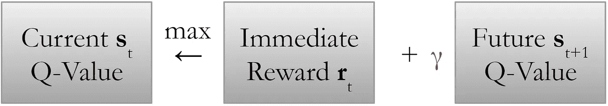

The Bellman equation: Q(s,a) = r + γ*max Q(s’, a’)

输出所有未来奖励的 Q 函数可以用一个巨大的表格来表示，其中状态为行，行为为列，或者用一个神经网络来表示。

抽象地说，训练可以像上面的图片中表达的那样简单:将下一个状态的 Q 值添加到你的数据批次的当前奖励中(假设你总是根据 Q 值采取最佳行动),这是根据定义的当前 Q 值。现在试着最大化这个奖励。

代表他的折扣因子 *γ* 确保算法更喜欢在两个或更多时间步中实现某个奖励而不是相同的奖励，因此它不会在无限地平线的某个点确定地达到目标，而是尽可能快地达到目标。将贴现因子乘以每一个计算出的 Q 值往往会让未来的回报更少。

**一个列表式 Q-Learning 的例子:FrozenLake**

FrozenLake: Example code

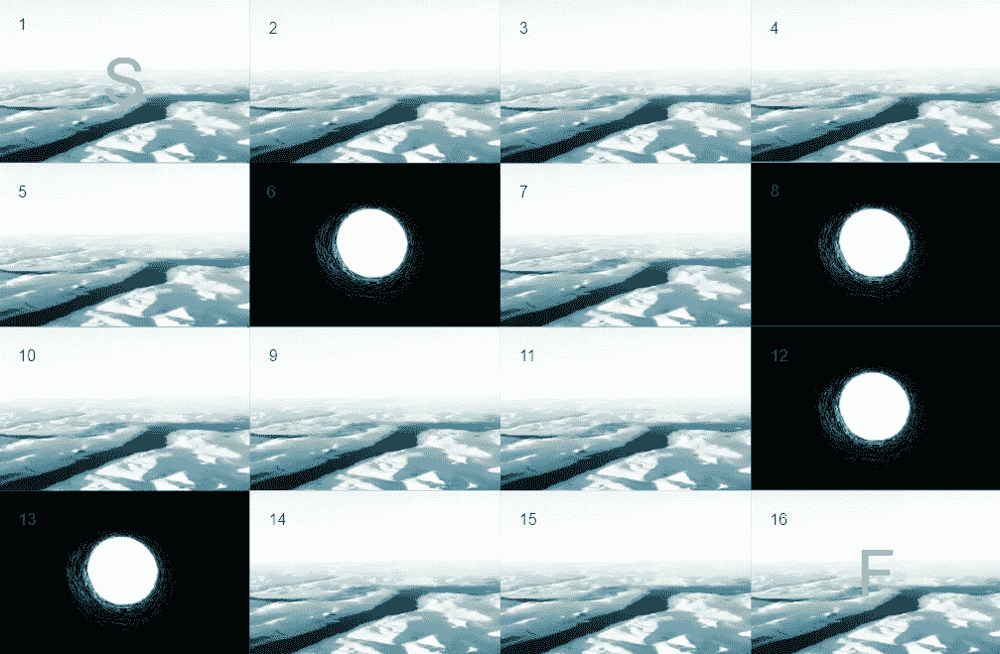

[FrozenLake](https://gym.openai.com/envs/FrozenLake-v0/): Starting at plate 1, an agent has to find its path to plate 16 which is rewarded by one while avoiding the deadly holes.

在 FrozenLake 的例子中，一个代理通过接收一个状态(1 到 16:当前盘子)和发送期望的动作(用 Q 函数计算)与他的环境进行交互，产生一定的奖励。

在这种情况下，删除折扣因子将导致一个表格，其中包含洞的 *0.00* 或剩余湖的 *1.00* :它确实知道如何在不出错的情况下解决任务，但不会尽快解决，因为这对我们人类来说是合乎逻辑的。

此外，在更现实的场景中，即使将图像视为输入状态甚至连续状态，也不能只使用表格。这就是神经网络发挥作用的地方。遗憾的是，在这种情况下，并不能保证它会收敛。然而，在实践中，情况往往如此。

比我们的玩具例子更有用的是名为 Breakout 的游戏:

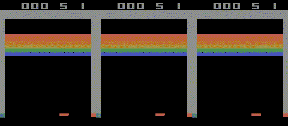

Q-learning on [Breakout](https://gym.openai.com/envs/Breakout-v0/): 1st vs. 7000th[~4h] vs. 9000th[~10h] episode

> 四十年前，史蒂夫·乔布斯和沃兹只用了 42 个 TTL 芯片就在 Atari 设计了 4 个晚上的越狱。他们当时有没有想过，现在可以通过强化学习来学习一种先进的策略，能够自己观察如何玩得最好？一个没有被特别编程到一个游戏中的人工智能，并且显然没有访问内部状态表示的权限？这不仅仅是熟悉可用的动作和保持球的活力，而是关于比赛的策略:避免击中橙色方块(增加速度)和比赛顶部(缩短桨)的处罚似乎效果很好。至少在以后的迭代中…

## 基于模型的 RL

最后但并非最不重要的一门最高学科——精英中的精英仍然缺失:元学习。卓越的学习算法！哦不，不是那个奶油。目前，我们将坚持基于模型的强化学习与元学习一样有远见，但使用起来更简单。

与其像基于模型的 RL 中的 Q-learning 那样学习奖励函数，不如考虑一种更为端到端的方法:梦想环境可能是什么样的，然后尽可能按照你的梦想行动。

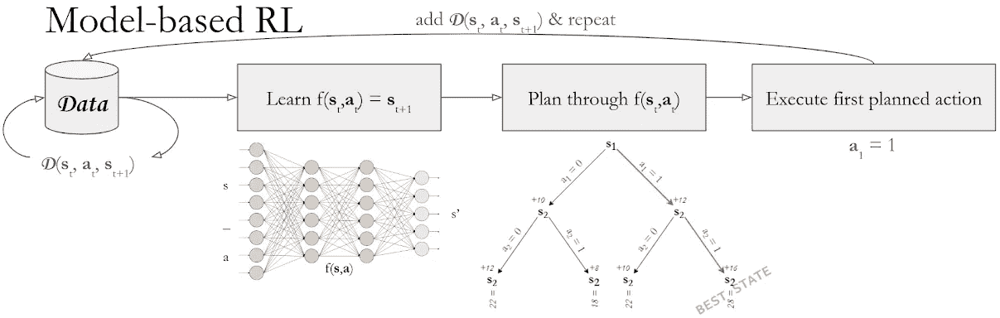

The model-based RL cycle

本质上，你从相同类型的数据开始，但继续学习一个叫做*动力学模型*的神经网络，想象下一个状态可能是如何给出当前状态以及在该状态下将要执行的动作。有了它，实际上就有可能在算法的头脑中预测未来的多个步骤，而不需要在更深思熟虑的行为之后执行那个动作。

在下一步中，通过使用蒙特卡罗树搜索考虑预定义范围(例如，15 个时间步长)内的每个可达状态及其相应的回报来规划整个生成树被证明是合适的。

> 我们执行了多少动作？

就第一个！为什么？这是因为在高回报轨迹的路径上执行生成树的第一个动作与现实相比非常准确，而整个路径特别容易出错，因为学习的动态模型不是 100%准确。在这种情况下，误差会在每个时间步中累积，我们的模型也无法预测无法预料的环境变化。

例如，考虑自动驾驶汽车中的导航系统的情况:当然，它可以预测采取什么特定的行动序列来到达驾驶员的目的地，但是，整个驾驶过程还取决于其他汽车和行人、交通灯电路，甚至风等。一旦遇到这种意想不到的行为，它应该能够采取正确的行动，以其最佳的导航。因此，在用从环境接收的真实新状态重新计划之前，只执行一个动作。

> 当然可以。大概就是基于模型的 RL 的直觉吧。但是为什么它在某种意义上是有远见的呢？

因为它有做梦的能力。例如，假设下图中的视觉预见技术。正如人们可能认为的那样，那些图像是真实的图像，但矛盾的是真实的！它们是从动力学模型预测出来的。

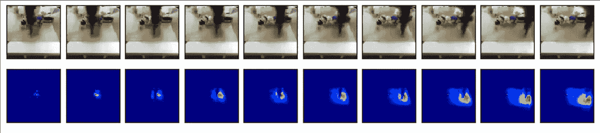

[Visual Planning](https://sites.google.com/view/sna-visual-mpc) by Ebert et al.

这个系统自己计算出，在玩具旁边移动机器人手臂很可能也会导致玩具的移动行为。并且如预期的那样，随着机器人臂的正在进行的运动，玩具从其原始位置消失，如在下面一行中另外可视化的，具有关于绿色玩具的外观的可能性图。

> 很公平。但是与 Q-Learning 相比，它有什么实际的用途吗？

当然啦！事实上，通过如下所示的计划过程，它在样本效率(即所需剧集)方面具有巨大优势。

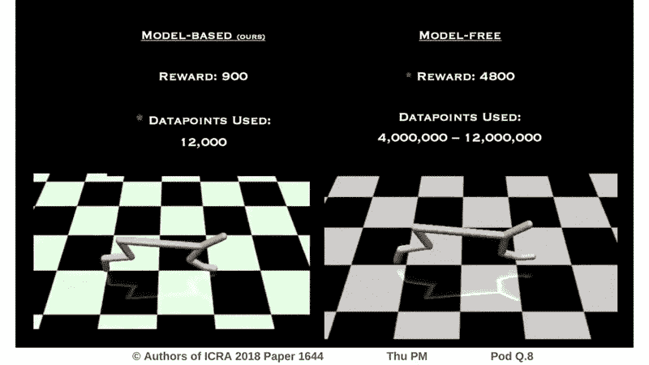

Model-based RL vs. model-free (e.g. Q-learning) performance. More details [here](https://arxiv.org/abs/1708.02596).

然而，正是这种规划强度也是它的主要缺点:它非常容易受到动力学模型的过拟合，这通常在实践中通过较浅的神经网络来减轻，其本质上不能像在 Q 学习情况下那样有效地对目标建模。

# 到目前为止我们讲了些什么？

*   模仿学习是迈向全自动和自学习算法的第一步，因为它模仿人的行为。
*   在强化学习中，一个*代理*能够通过在它的*环境*中执行需要的*动作*，观察输出的*状态*，并最大化返回的*回报*，通过试错找到它自己的安全最优解。
*   与手工制作标签和一次性数据集的监督学习相比，在处理 RL 时需要连续的数据流。
*   RL 主要有三种算法:*策略梯度*、 *Q-Learning* 和*基于模型的 RL* 。这些算法的不同之处在于它们的计算性能、在给定任务中可实现的性能和样本效率:它们的样本效率和并行化能力以升序提高，而可实现的性能降低。

我很高兴你能坚持到现在，并鼓励你永远不要说

> 自学算法是未来的事情

因为现在，尤其是在完成了加州大学伯克利分校的 DeepRL 课程后，你可以让它成为今天的话题！这也是为什么我上个月在 [meetup.ai Hamburg](https://www.meetup.com/de-DE/meetupai-Hamburg/) 做了一个关于完全相同内容的演讲。

*走出去，找到不仅仅是明确的回报函数(利润、CTR、每英里事故数、叠罗汉塔稳定性等)的用例。)是可用的，但是也可以提供安全的环境，使得错误不会造成伤害。*

自我学习并不意味着它会像 2016 年微软在 Twitter 上的 [Tay](https://en.wikipedia.org/wiki/Tay_(bot)) 机器人那样继续在野外学习。你不仅会遇到巨大的麻烦，你也无法证明你的软件已经可以生产了，因为最终的软件还没有出来。

作为起点，RL 也可以在较小的意义上操作:
*在安全的环境中自学，例如，可以获得观察到的和希望看不到的结果(在线商店中的项目订单、通过网站的用户体验、*[*GO*](https://youtu.be/HT-UZkiOLv8)*中的新策略)，然后在真实环境中静态地实现这些结果，导致系统能力的显著增加。*

还有其他想法吗？请随意留言。😉