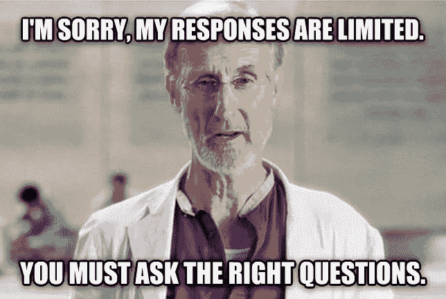
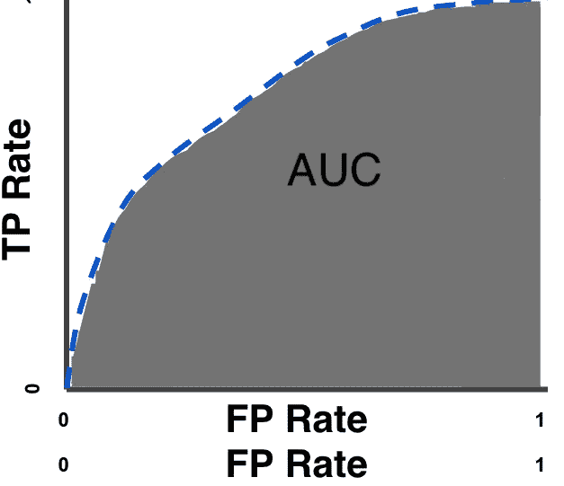

# 优化什么？损失函数备忘单

> 原文：<https://towardsdatascience.com/what-to-optimize-for-loss-function-cheat-sheet-5fc8b1339939?source=collection_archive---------17----------------------->

## 寻找合适的优化目标的一些技巧，以及如何为您的用例找到合适的目标

在他的一本书里，艾萨克·阿西莫夫设想了一个未来，计算机变得如此智能和强大，以至于它们能够回答任何问题。阿西莫夫认为，在未来，科学家不会变得多余。相反，留给他们的是一项艰巨的任务:弄清楚如何向计算机提出正确的问题:那些能产生深刻、有用答案的问题。

我们还没有到那一步，但从某种意义上说，我们已经到了。

在过去，机器学习的很多努力都花在了其机制的*实现上。随着 Tensorflow、Pytorch 等流行的机器学习框架的出现，我们可以愉快地摆脱这一负担。通过调整模型的权重来实现某个目标的*机制*被抽象掉了。定义一个定制的优化目标就像写下来一样简单，你最喜欢的深度学习框架会相应地减少错误(或损失)。但是这种自由带来了一个非常重要的问题:*

> 你应该为什么目标进行优化？

# 两种类型的损失(哪个更重要)

我们经常发现自己在衡量两种类型的损失:

1.  培训损失，对此我们积极优化模型。在每次迭代中，我们的模型对所有自由度的训练损失进行求导，并试图直接降低训练损失。
2.  验证损失，我们通过它来衡量模型的性能。在这里，我们对模型没有训练的一些维持集进行了一系列预测，并对我们对结果的满意程度进行评分——不涉及导数或优化。
    当我们尝试不同的模型架构、数据扩充或对我们的模型进行任何其他更改时— **验证损失**最终决定我们是否对更改感到满意或重新开始。

Most of us have been subject to “validation loss” for a good chunk of our life. But I would argue the education system is very susceptible to [reward hacking](https://www.alexirpan.com/2018/02/14/rl-hard.html)

如果幸运的话，1 和 2 可能是一样的。很多时候，他们不是。以二进制分类为例:测量验证集的准确性非常容易:您预测所有项目的概率，设定所有通过 50%概率(例如)的预测的阈值，并测量您正确的频率。这是一个很大的、定义明确的验证损失，但它不满足我们在培训中的要求，即损失应该是*可导的*。换句话说，如果你稍微改变模型的权重，精确度将保持不变，这意味着你不能直接优化精确度，即使这可能是你真正关心的。

那么，在这两个损失中，哪个更重要呢？我认为**验证损失是最重要的**。验证损失是我们如何决定“模型 A 优于模型 B”的。这是我们的指导方针，它将指导我们做出的每一个建模决策。培训损失是一种工具，是降低验证损失的战术需要。

所以我们最好选择正确的目标，对吗？

# 分类损失— 3 个常见问题

现在让我们坚持二进制分类，只是为了有一个积极的讨论。你决定尝试向人们推荐中型职位。你只需要向用户展示一个推荐，他们要么接受，要么忽略你，转到下一个网站。

为此，您正在构建一个分类器:

`Classifier(person, article)-> click probability`

你应该优化什么？

## 原木损失

分类之王。这是我们通常在分类模型训练中优化的损失。作为一种性能指标，对数损失是对你在预测一个类别的概率时的校准程度的一种度量。在我们的示例中，该指标衡量我们在预测点击可能性方面做得有多好。如果你说某件事发生的几率是 0%,而它确实发生了，那么你在估计概率方面做得很糟糕——对数损失将是无穷大。

**直觉:**衡量您预测概率的能力
**边缘情况:**如果模型预测概率为 0.0，标签为 1，则损失趋于无穷大(反之亦然)
**理解数字的意义:**在具有 50–50 先验和一个无线索分类器的二元预测中，您应该看到`loss = ln(0.5) = 0.693`。有了 N 个类和平坦的先验，你应该看到`loss=ln(1/N)=-ln(N).`对数损失并不难得到一个直觉。二元分类的一个有用技巧是取`e^(loss)`。你得到的数字大约是你预测正确类别的概率。
**定义:** `**loss=-sum(log(p_i) * y_i)**` 其中`p_i`是你对某类`i`的预测概率，`y_i`是该类的标签。

> 对于一个推荐引擎来说，这是一个好的衡量标准吗？

不完全是。我们并不关心用户点击我们返回结果的可能性有多大。我们想把最有可能的文章放在顶部。预测点击概率是一个相关的问题，但不是同一个问题*。*举个例子，也许我们有信号表明某个用户是个点击狂，与其他用户相比，她点击任何东西的可能性要高 10 倍。这些信息对于为该用户返回最佳结果是无用的——将我们对所有推荐项目的预测提高 10 倍不会改变它们的顺序，但会降低我们的日志损失，因为它会大大影响我们的点击概率。

> 什么时候这是一个有用的指标？

当你关心一个事件发生的概率时，而不是当你订购推荐时。举个例子，假设我试图预测 ***下雨*** 的可能性，对数损失将是一个非常有用的度量，因为它量化了我们在预测下雨概率方面做得有多好。

## 准确(性)

这个挺直观的。我们以我们打算使用模型的方式设定结果的阈值(例如，在我们的例子中，我们将在所有候选人中选择得分最高的中等文章，而不是阈值)，并询问最高结果是否被点击。对于我们在这种情况下所做的事情，更准确的名称应该是将这个指标称为 *top1 点击率*，因为这为重新访问我们的产品和推荐前 K 名结果(而不仅仅是 1)奠定了基础。

直觉:这是对“你做出正确猜测的频率”的直接测量。
**理解数字的含义**:99%的准确率听起来可能是惊人的表现，除非你考虑到“用户不会点击这篇文章”的平面预测已经在 99.9%的时间里是正确的。准确性的基线模型是最常见类的出现频率。在 50-50 的二进制问题中，这个数字是 50%。但是在猜测今天是否会有飓风时，99.99%绝对是你能做的最坏的情况，所以这个数字必须总是与基线相比较。

> 对于一个推荐引擎来说，这是一个好的衡量标准吗？

是的，这种损失衡量的是确切的用例——顶部的推荐是否被选中。

但是请注意这个指标的弱点。这个度量标准是**量化的**，这意味着即使模型在工作中变得更好，准确性也可能根本不会改变。假设我们的模型提高了对文章推荐的排名，但是完全正确的几率和从数百万候选文章中猜出用户最终点击的文章的几率非常接近于 0。在这种情况下，即使我们改进了我们的模型并提出了更好的建议，准确性作为一个度量标准也不会发生任何变化。这就引出了下一个损失定义。

## 罗马纪元

我不明白为什么人们用一种对任何人来说都难以理解的方式来定义 AUC。但是为了完整起见，我们将从干定义开始。AUC 被定义为曲线下面积，它是您在真阳性率对假阳性率曲线上绘制的曲线的积分。这是一个典型的可视化

If you ever want a confuse someone, go for the classic AUC definition.

我相信上面的定义是没用的，因为它没有让你明白 0.9 **的 AUC 是什么意思**。所以让我们试试另一个定义，它在数学上是等价的，但我觉得更贴切:

> 在二元分类中，AUC 为 0.9 意味着给定一个阴性样本和一个阳性样本，您的分类器在 90%的情况下会预测阳性样本的得分高于阴性样本的得分。

**直觉:**衡量你有多优秀**排序**正类高于负类
**理解数字:** AUC 是你的分类器对随机正样本高于随机负样本给出更高预测的可能性。0.5 已经够糟了！
**定义**:此处[为](https://developers.google.com/machine-learning/crash-course/classification/roc-and-auc)

> 对于一个推荐引擎来说，这是一个好的衡量标准吗？

是啊，但让我们想想这少了什么。我们在一开始就说过，我们只向用户展示最上面的文章。所以真的，这并没有抓住我们的模型在这种情况下被使用的方式。另一方面，与顶级准确性不同，这个度量标准*对模型中的微小改进*很敏感，并且不会受到与准确性度量标准相同的病理的困扰。

## 还有更多

对于推荐问题的具体情况，有一个专门为这种情况设计的大量指标列表: [NDCG](https://en.wikipedia.org/wiki/Discounted_cumulative_gain) 、 [GMAP](https://trec.nist.gov/pubs/trec15/appendices/CE.MEASURES06.pdf) 、 [MRR](https://en.wikipedia.org/wiki/Mean_reciprocal_rank) 等等。但是本文的目的不是深入研究推荐引擎指标的细节，而是讨论最常用的全面有用的指标——并希望在如何解决我们测量的问题上给出一点直觉。

最后，关于衡量进展和结果的个人观察。

> 作为科学家，我们讨厌改变目标。有一个单一的测试集，有一个单一的度量标准，并且逐渐变得更好，这要干净得多。那很少发生。
> 
> 现实比这更有趣。期望改变你的测试集，重新定义你的验证标准，排除异常值，并给你的测试集增加新的观察值。期望改变你的目标，直到它们真正反映出你想要完成的目标。

原贴[霍斯科技的机器学习博客](https://www.hosstechnology.com/blog/what-to-optimize-for-loss-function-cheat-sheet)(那是我的机器学习咨询公司)。