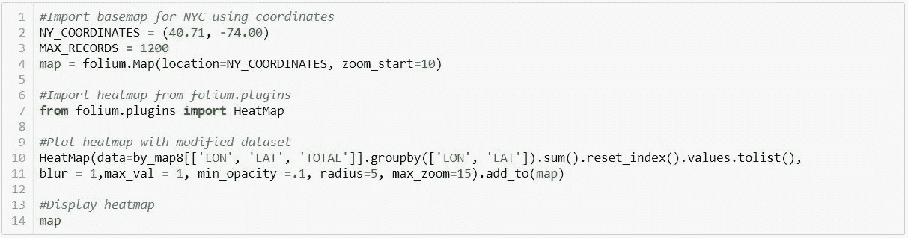

# 是什么引发了纽约公园的犯罪？

> 原文：<https://towardsdatascience.com/what-triggers-crime-in-nyc-parks-3953c5df2be2?source=collection_archive---------17----------------------->


Photo Credit: [Pixabay](https://www.pexels.com/photo/aerial-view-of-cityscape-327502/), licensed by [Creative Commons Images](https://www.pexels.com/creative-commons-images/)

在城市的某个公园遛狗可能是你每天的例行公事，或者你偶尔会去公园呼吸一下新鲜空气。不管你来的目的是什么，安全是最重要的。谈到安全，我想起罗马律师和哲学家马库斯·图留斯·西塞罗的一句名言，内容如下:

> "人民的安全应是最高法律."

在这个故事中，以下关于纽约公园犯罪的问题将基于数据分析得到解答。此分析是使用来自两个不同来源的数据集完成的:

1.  [纽约市公园犯罪统计(NYCPCS)](https://www1.nyc.gov/site/nypd/stats/crime-statistics/park-crime-stats.page)
2.  [纽约开放数据(NYCOD)](https://data.cityofnewyork.us/City-Government/Parks-Properties/k2ya-ucmv)

报告从 2014 年第三季度到 2019 年第二季度，共从 NYCPCS 网站下载了 20 个数据集。NYCPCS 网站上的所有数据集都可以在。xlsx 和 pdf 格式。删除不必要的标题和文件转换。xsl 到。csv 发生在上传到 Jupyter 笔记本之前。

另一方面，一个包含公园地理信息(即邮政编码、坐标)的数据集是从。csv 格式。最后，所有数据集合并成一个最终数据集，这增加了分析所需的数据。以下库用于完成该分析:

Numpy，Pandas，Matplotlib，Seaborn，Plotly 和 leav

这个分析是为了让我接触 Python。本分析的目的是回答以下关于纽约公园犯罪的问题。

1.  过去几年纽约公园的犯罪率是多少？
2.  一年中的季度和总犯罪率有什么关系？
3.  哪个区的公园犯罪风险更高？
4.  哪些公园不太安全？
5.  公园的大小和犯罪率有关系吗？
6.  公园的风险是如何在纽约扩散的？

# 导入库

下面的代码片段显示了各种库的导入。 *Pandas* 和 *numpy* 分别是数据分析和数值库。这两个库对于现代数据分析至关重要。此外，本次分析还使用了 *matplotlib* 、 *seaborn、*和大部分 *plotly* 来创建交互式图表，并使用*leaf*进行地图可视化。

```
#numpy provides math functions
import numpy as np#pandas provides data manipulation and analysis
import pandas as pd#following libraries for data visualization
import matplotlib.pyplot as plt
import seaborn as sns
import plotly.plotly as py#folium provides map visualization
import folium%matplotlib inline
init_notebook_mode(connected=True)
```

# 读取和清除数据

由于不同的表结构(例如，各种标题、不同长度的列名)，阅读所有内容是一项挑战。csv *文件转换成*熊猫*数据帧。在连接成数据帧之前，表被读取并转换成标准格式。*

```
#Read all datasets containing data of different years and quarter
df1 = pd.read_csv('2019Q2.csv')
df2 = pd.read_csv('2019Q1.csv')
df3 = pd.read_csv('2018Q1.csv')
df4 = pd.read_csv('2018Q2.csv')
df5= pd.read_csv('2018Q3.csv')
df6= pd.read_csv('2018Q4.csv')
df7= pd.read_csv('2017Q1.csv')
df8= pd.read_csv('2017Q2.csv')
df9= pd.read_csv('2017Q3.csv')
df10 = pd.read_csv('2017Q4.csv')
df11= pd.read_csv('2016Q1.csv')
df12= pd.read_csv('2016Q2.csv')
df13= pd.read_csv('2016Q3.csv')
df14 = pd.read_csv('2016Q4.csv')
df15 = pd.read_csv('2015Q1.csv')
df16 = pd.read_csv('2015Q2.csv')
df17 = pd.read_csv('2015Q3.csv')
df18 = pd.read_csv('2015Q4.csv')
df19 = pd.read_csv('2014Q3.csv')
df20 = pd.read_csv('2014Q4.csv')#Read dataset containing geographical information of parks
df21 = pd.read_csv('OpenData_ParksProperties.csv')
```

下面的代码片段用于清理所有数据集并使其成为标准格式。

```
#Cleansing of messy column headers and bring headers of all tables into standard format
df1.columns = df1.columns.str.strip().str.upper().str.replace(' ', '_').str.replace('(', '').str.replace(')', '')
df2.columns = df2.columns.str.strip().str.upper().str.replace(' ', '_').str.replace('(', '').str.replace(')', '')
df3.columns = df3.columns.str.strip().str.upper().str.replace(' ', '_').str.replace('(', '').str.replace(')', '')
df4.columns = df4.columns.str.strip().str.upper().str.replace(' ', '_').str.replace('(', '').str.replace(')', '')
df5.columns = df5.columns.str.strip().str.upper().str.replace(' ', '_').str.replace('(', '').str.replace(')', '')
df6.columns = df6.columns.str.strip().str.upper().str.replace(' ', '_').str.replace('(', '').str.replace(')', '')
df7.columns = df7.columns.str.strip().str.upper().str.replace(' ', '_').str.replace('(', '').str.replace(')', '')
df8.columns = df8.columns.str.strip().str.upper().str.replace(' ', '_').str.replace('(', '').str.replace(')', '')
df9.columns = df9.columns.str.strip().str.upper().str.replace(' ', '_').str.replace('(', '').str.replace(')', '')
df10.columns = df10.columns.str.strip().str.upper().str.replace(' ', '_').str.replace('(', '').str.replace(')', '')
df11.columns = df11.columns.str.strip().str.upper().str.replace(' ', '_').str.replace('(', '').str.replace(')', '')
df12.columns = df12.columns.str.strip().str.upper().str.replace(' ', '_').str.replace('(', '').str.replace(')', '')
df13.columns = df13.columns.str.strip().str.upper().str.replace(' ', '_').str.replace('(', '').str.replace(')', '')
df14.columns = df14.columns.str.strip().str.upper().str.replace(' ', '_').str.replace('(', '').str.replace(')', '')
df15.columns = df15.columns.str.strip().str.upper().str.replace(' ', '_').str.replace('(', '').str.replace(')', '')
df16.columns = df16.columns.str.strip().str.upper().str.replace(' ', '_').str.replace('(', '').str.replace(')', '')
df17.columns = df17.columns.str.strip().str.upper().str.replace(' ', '_').str.replace('(', '').str.replace(')', '')
df18.columns = df18.columns.str.strip().str.upper().str.replace(' ', '_').str.replace('(', '').str.replace(')', '')
df19.columns = df19.columns.str.strip().str.upper().str.replace(' ', '_').str.replace('(', '').str.replace(')', '')
df20.columns = df20.columns.str.strip().str.upper().str.replace(' ', '_').str.replace('(', '').str.replace(')', '')
df21.columns = df21.columns.str.strip().str.upper().str.replace(' ', '_').str.replace('(', '').str.replace(')', '')
```

以下代码片段用于将所有数据集追加到一个数据集中。

```
#Append all dataframes into one dataframe
df = df1.append([df2, df3,  df4, df5, df6, df7, df8, df9, df10, df11, df12, df13, df14, df15, df16, df17, df18, df19,df20], sort = False)#Display df dataframe
df.head()
```

最后，我处理了下面的数据集。这个数据集还有一个名为 *TOTAL、*的列，记录了每个公园每年每季度的犯罪总数。


另一个包含纽约公园地理信息的数据集如下。在这个分析中，*_ GEOM*(公园的几何图形)和 *SIGNNAME* (公园的名称)列被用来绘制公园的地图。


# 分析

过去几年纽约公园的犯罪率是多少？

分析从寻找问题的答案开始，“过去几年纽约公园的犯罪率是多少？”。2015 年至 2018 年的完整数据可用。2014 年和 2019 年的数据从数据集中删除，以消除代码修改后的结果偏差，并创建到新的数据框架中，以便按年份进行分析。


为了更好地了解和可视化上面的数据集，生成了以下图表。以下图表的代码如下。

```
#For Scatter Chart
by_year.iplot(kind='scatter',xTitle='Year',yTitle='No of Crimes',title='Crimes in NYC Parks by Year')#For Bar Chart
by_year.iplot(kind='bar', xTitle='Year',yTitle='No of Crimes',title='Crimes in NYC Parks by Year')#For Stacked Bar Chart
by_year.iplot(kind='bar', barmode = 'stack', bargap = .40, xanchor = 'center', nticks = 8, xTitle='Year',yTitle='No of Crimes',title='Crimes in NYC Parks by Year')
```


Scatter Chart


Bar Chart


Stacked Bar Chart

从上面的三张图表中，我们可以观察到重大盗窃、抢劫和重罪袭击是纽约公园里最常发生的犯罪。犯罪率从 2015 年到 2017 年有所上升，但在 2018 年略有下降，但这是基于仅四年的数据；很难预测趋势。有趣的是，在这四年中，重大盗窃罪和抢劫罪遵循着类似的起伏模式。

**一年中的季度和总犯罪率有什么关系？**

这一分析有助于找到前面提到的其他问题的答案。下面的代码片段计算出了该季度的犯罪率之间的关系。


上面的数据集可以更好地理解数据。之前运行的类似代码生成了下图。


Scatter Chart


Bar Chart


Stacked Bar Chart

从图表中可以明显看出，纽约市的公园犯罪率在今年第一季度最低，但在今年第三季度最高。好像很有意思。绘制回归图以查看一年中该季度与总犯罪率之间的统计关系。


回归图描绘了两个变量之间的正关系。然而，皮尔逊相关(0.41)的结果证明这是一种适度的正相关。无论如何，它猜测公园犯罪的选择可能是天气的因变量，因为一年的第三季度是从 7 月到 9 月的几个月，这是纽约的夏天。

哪个区的公园犯罪风险更高？

分析进一步发现了纽约市各区和公园犯罪率之间的关系。顺便说一句，谁不知道，纽约有五个区:曼哈顿、皇后区、布鲁克林、布朗克斯和斯塔滕岛。执行下面的代码片段来查找犯罪率和行政区之间的关系。


之前运行的类似代码从上面的数据集生成图形，以便从数据中获得更好的直觉。


一张图胜过千言万语，上面的图说明了一切。曼哈顿是最危险的区，而斯塔滕岛在公园犯罪方面是最安全的。布鲁克林是曼哈顿最近的邻居。另一方面，皇后区和布朗克斯区正在相互竞争。

哪些公园不太安全？

我们说的是公园，到目前为止，其他一些与公园犯罪相关的变量已经讨论过了。我们现在来列举几个公园，在公园犯罪方面是排在前列的。为了找到这些公园，执行了下面的代码片段。犯罪率最高的十大公园如下所示:


在这里我们可以看到，法拉盛梅多斯科罗纳公园在列表的顶部，其次是兰德尔岛公园，科尼岛海滩和木板路，等等。布鲁克林大桥公园排在第十位。好了，我们视觉上来看看这张公园多的表。


Stacked Bar Chart

上图显示了犯罪率最高的 50 个公园。图表不能很好地容纳所有 50 个名字。如果你有兴趣去看那些公园，请随意访问下面提供的 GitHub 链接。

**公园的大小和犯罪率有关系吗？**

好奇的头脑想知道公园的大小和与之相关的犯罪率之间的关系？在分析完成之前是未知的，并且结果是不可见的—通过运行以下代码来回答第五个问题而得到的修改后的数据帧。


如果没有统计测试，回答这个问题会很有挑战性。因此，这种关系通过 Pearson 相关性进行了测试，并显示在如下回归图中。


从回归图来看，公园规模与犯罪率之间存在微弱或中度的正相关关系。然而，皮尔逊相关系数(0.34)证实了这是一种中度的正相关。让我们也来看看这种关系。


Scatter Plot

正如皮尔森相关所表明的，从上面的散点图来看，公园的大小和犯罪率之间存在适度的正相关关系。

**公园的风险如何在纽约扩散？**

绘制了一张热图来回答最后一个问题。热点图显示了纽约市公园犯罪的风险区和安全区(用不同的颜色表示)。创建了一个修改的数据框架，将包含犯罪数据和公园地理数据的两个表结合起来绘制热图。为开发新的 dataframe 而执行的以下代码片段。


执行以下代码片段，使用上述数据框架绘制热图。



上面两张热图分别用红色和绿色显示了从高风险到安全的区域。不难发现纽约最危险公园的位置。读者可以知道他们的生活区有多不安全。请采取必要的措施，在纽约保持安全。

# 让我们来欣赏

感谢您花时间和耐心阅读本文。随时问我任何问题。如有错别字或错误，请评论。如果你能帮我学习更好的分析方法，我将不胜感激。你可以联系我:

```
Email: kunduishere@gmail.com
LinkedIn: [https://www.linkedin.com/in/shuvokundu/](https://www.linkedin.com/in/shuvokundu/)
Github: [https://github.com/ShuvoKKundu](https://github.com/ShuvoKKundu)
Medium: [https://medium.com/@kunduishere](https://medium.com/@kunduishere)
```

完整的代码可以在 https://github.com/ShuvoKKundu/NYC-Park-Crime-Data-Analysis 找到