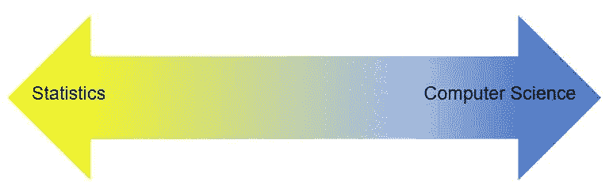

# 你是哪种类型的数据科学家？

> 原文：<https://towardsdatascience.com/what-type-of-data-scientist-are-you-84c3c2b9fc16?source=collection_archive---------11----------------------->

当我第一次进入数据科学领域时，我在保险行业工作，那里大多数从事分析工作的人都有统计学或精算背景。

我所做的数据科学工作集中在使用统计和机器学习技术从数据中获得洞察力，例如，这些数据可以用于降低索赔成本或改善保费定价，这是我认识的其他数据科学家所做的典型工作，他们也在该行业工作。

由于这些经历，我开始将数据科学视为统计学的一种高级形式，带有编程成分。

从那以后，我换了工作，现在在一个团队中工作，其他分析角色由计算机科学或编程背景的人担任。我现在所做的工作专注于建立机器学习模型，这些模型可以部署到生产系统中，以自动化和增强手动流程。

如果我只知道第二份工作，那么我会把数据科学视为一门类似于计算机科学和软件开发的学科，以统计学为基础。

尽管数据科学的这两种定义截然不同，但它们都同样有效。

# 数据科学连续体

数据科学是一个新兴领域，数据科学家的角色尚未完全定义。但是，即使数据科学已经存在了几个世纪，事实仍然是，很少有职业的定义如此狭窄，以至于从事该职业的每个人都执行完全相同的任务。

数据科学可以被视为统计学和计算机科学的结合，因此，可以预期，数据科学的角色将根据这些学科对特定职位的相对重要性而有所不同。我将“数据科学家”头衔下的各种不同工作称为数据科学连续体。

在我上面描述的两个数据科学工作中，两个都是数据科学家工作的有效例子，但是第一个工作更接近数据科学连续体的统计端，而第二个工作更接近计算机科学端。

更复杂的是，不同的数据科学角色也需要不同水平的技术技能。例如，专注于特定领域的高级数据科学角色可能比入门级通才角色需要更高的技能和资格。

此外，自从数据科学家被命名为“21 世纪最性感的工作”以来，已经有很多人将自己的角色重新命名为数据科学家(例如，在 LinkedIn 上)，即使他们不是；还有一些组织对他们广告的职位也是如此，要么是出于无知，要么是为了吸引更多的求职者。

例如，在我上一次找工作时，我遇到了几个我会归类为高级数据分析师的职位，它们的广告标题是“数据科学家”。我还遇到了几个明显是数据科学家角色的职位，它们以“数据分析师”的头衔出现

结果是，如果你正在寻找一个数据科学的职位，那么你需要超越职称，看看这个职位实际上涉及到什么，以及你在这个职位上需要达到的水平。

也就是说，如果你看到足够多的数据相关职位的招聘广告，某些模式就会开始出现，这使得识别各种类型的数据职位成为可能，而与职位无关。

# 七种类型的数据角色

在 2019 年 4 月 22 日至 2019 年 5 月 5 日期间，我从 LinkedIn 收集了 200 个数据相关角色的招聘广告(即，标题为数据科学家(100 个广告)、数据分析师(40 个广告)、商业智能分析师(20 个广告)、机器学习工程师(20 个广告)和数据工程师(20 个广告)的角色)，横跨四个英语国家(澳大利亚、加拿大、英国和美国)。

我超越了“数据科学家”这个头衔的工作，考虑到了潜在的命名错误，以及不同雇主对一份工作具体要求的差异。

通过将 k-means 聚类应用于这些广告，使用选择标准作为特征，我能够将招聘广告分组为七个聚类或角色类型。

这些角色的特征如下所述，从最常见到最不常见排列如下:

# 角色类型#1:报告和 ETL 分析师

**(24%的招聘广告被考虑，包括 10%的“数据科学家”职位)**

报告和 ETL 分析师专注于提取数据，并从中生成报告和/或仪表板，但通常也负责数据库/数据仓库管理任务，如开发和维护 ETL(提取、转换、加载)管道。

**典型职位:**数据分析师或商业智能(BI)分析师。

**使用的关键技术:** SQL 和 Excel。

典型的学位要求:最好是计算机科学学士学位。

# 角色类型 2:数据科学通才

**(23%的招聘广告被考虑，包括 39%的“数据科学家”职位)**

数据科学通才专注于应用机器学习和统计技术来开发模型，解决业务问题并提供见解。这些角色通常在中级职位上招聘，对专业技能没有明确要求，如深度学习或自然语言处理。

**典型职位名称:**数据科学家。

**使用的关键技术:** Python，R 和 SQL。

典型的学位要求:统计学、数学或计算机科学学位，最好是研究生水平。

# 角色类型 3:洞察分析师

**(15.5%的招聘广告被考虑，包括所有“数据科学家”角色的 10%)**

与报告和 ETL 分析师类似，Insights 分析师专注于提取、争论和分析数据，以便提供见解并生成报告和/或仪表板。但是，他们通常不负责数据仓库或数据库的管理。

**典型职位:**数据分析师或数据科学家。

**使用的关键技术:** SQL，Python，Tableau，R 和 Excel。

典型的学位要求:数学或统计学学士学位是理想的。

# 角色类型# 4:ML 研究数据科学家

**(13%的招聘广告被考虑，包括 25%的“数据科学家”职位)**

ML 研究数据科学家专注于使用机器学习技术来开发和部署模型，重点是研究和开发，而不是软件工程。

**典型职位名称:**数据科学家。

**使用的关键技术:** Python，R，Spark。

**典型学位要求:**统计学、数学或计算机科学学位，最好是研究生水平。

# 角色类型# 5:ML 软件工程师

**(11%的招聘广告被考虑，包括 6%的“数据科学家”职位)**

像 ML 研究数据科学家一样，ML 软件工程师使用机器学习技术来开发和部署模型，但在 ML 软件工程师的情况下，重点是工作的软件工程方面。例如，一个 ML 软件工程师可能部署一个由 ML 研究数据科学家开发的模型。

**典型职位名称:**机器学习工程师。

**使用的关键技术:** Python 和 Tensorflow。

**典型学位要求:**计算机科学学位，最好是研究生水平。

# 角色类型#6:平台和仓库工程师

**(9%的招聘广告被考虑，包括 1%的“数据科学家”职位)**

平台和仓库工程师专注于构建数据管道，并与数据库、数据仓库和数据平台合作。他们很少参与模型开发或数据洞察的生成。

**典型职位名称:**数据工程师。

**使用的关键技术:** Python，云计算，SQL，Spark。

典型的学位要求:最好是计算机科学或工程学士学位。

# 角色类型#7:数据科学专家

**(4.5%的招聘广告被考虑，包括 9%的“数据科学家”职位)**

数据科学专家与数据科学通才非常相似，只是数据科学专家的重点是将机器学习和统计技术应用于人工智能/数据科学的专业领域，以开发模型等。这些角色需要自然语言处理、大数据、深度学习或计算机视觉等领域的高级技能。

**典型职位名称:**数据科学家。

**使用的关键技术:** Python，SQL，R，Spark，云计算。

**典型学位要求:**统计学、数学或计算机科学学位，最好是研究生水平。

这七种角色类型为第一次尝试进入数据科学或从当前数据角色中找出下一步该做什么的人提供了很好的指导。

通过将你的资质、技术技能和兴趣与每种角色类型所列的进行比较，你可以很容易地确定你目前的技能和经验最适合哪种角色类型，以及为了转换到不同的角色类型，你需要获得什么技能和资质。

针对特定类型的角色为求职提供了一个更有效的框架。这增加了你成功申请的可能性，也意味着你更有可能得到一份符合你期望的工作。

你想成为哪种类型的数据科学家？

*Genevieve Hayes 博士是数据科学家、教育家、人工智能和分析专家，供职于*[*Genevieve Hayes Consulting*](https://www.genevievehayes.com/)*。你可以在*[*LinkedIn*](https://www.linkedin.com/in/gkhayes/)*或者*[*Twitter*](https://twitter.com/genevievekhayes)*上关注她。她还是* [*价值驱动数据科学*](https://www.genevievehayes.com/episodes/) *的主持人，这是一个每月两次的播客，面向寻求最大化其数据和数据团队价值的企业。*

*想要发掘企业数据的价值，但不知道从哪里开始？**[***下载免费的数据科学项目发现指南。***](https://www.genevievehayes.com/discovery-guide/)*