# 贝叶斯神经网络告诉你什么不确定性

> 原文：<https://towardsdatascience.com/what-uncertainties-tell-you-in-bayesian-neural-networks-6fbd5f85648e?source=collection_archive---------8----------------------->

这一次，我们将检验**同方差、异方差、认知和随机不确定性**实际上告诉了你什么。在我看来，这是贝叶斯深度学习中一个即将到来的研究领域，并且已经受到了[亚林·戈尔](http://www.cs.ox.ac.uk/people/yarin.gal/website/publications.html)贡献的极大影响。这里的大多数插图取自他的出版物。但也可以看到该领域的最新[贡献之一](https://arxiv.org/abs/1806.05978)，我们提出了一种新的、可靠的和简单的方法来计算不确定性。

作为背景，在贝叶斯深度学习中，我们有权重的概率分布。因为大多数时候我们假设这些概率分布是高斯分布，所以我们有一个均值 *μ* 和一个方差 *σ* 。平均值 *μ* 是我们对重量进行采样的最有可能的值。

> 方差可以被看作是不确定性的一种度量——但是什么样的不确定性呢？我的神经网络不确定在哪里或者我的神经网络不确定什么？

基本上，有两组不确定性，方差 *σ* 是两者之和。我们称它们为**任意**和**认知**不确定性。正如我们在以前的帖子中提到的，我们对预测后验概率分布 *p(y*|x*)* 感兴趣。但是，不幸的是，这种预测分布是难以处理的。我们需要做的是用拉普拉斯近似法对其进行近似(具体做法见[本帖](https://medium.com/neuralspace/probabilistic-deep-learning-bayes-by-backprop-c4a3de0d9743))并计算出期望值，即均值 *μ* ，及其方差 *σ* 。

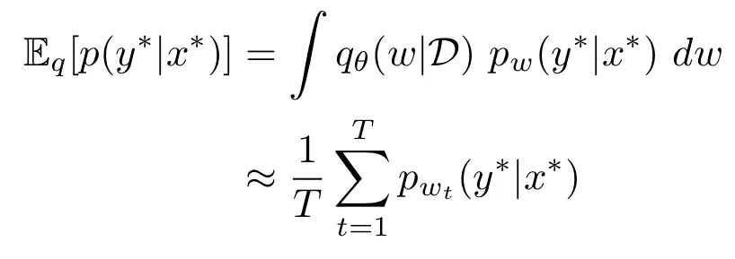

Mean of predictive posterior probability distribution

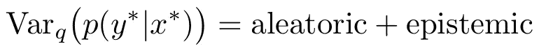

Variance of predictive posterior probability distribution is the sum of aleatoric and epistemic uncertainty

现在让我们详细看看这两种不确定性估计。

# 任意不确定性

你可能已经看到了很多类似下图的图表。我们有一个观察样本，在随后的图中的黑点，我们假设有一些噪声。如果你在高中化学、生物或物理课上做过实验，你就会知道没有一系列测量是完美的。尤其是你在同一点 *x* 多次测量一个 *y* 值的时候，很少会得到完全相同的 *y* 不是吗？这就是我们所说的**随机不确定性**。噪声数据集 *{x，y}* 引起的观测值 *y* 的不确定性。

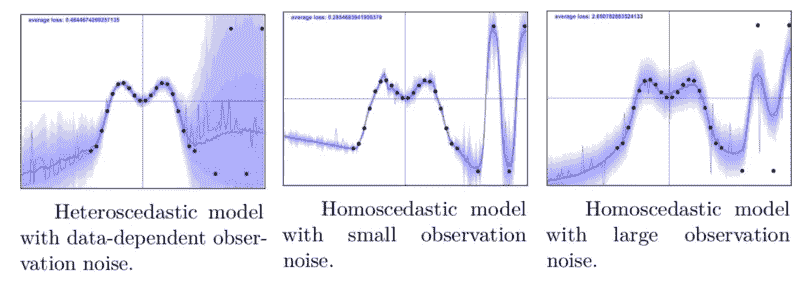

## 异方差随机不确定性

举例来说，将*x*-轴视为从早上 8 点到晚上 10 点的时间刻度，我们测量一周内的心率。我们首先在早上 8 点起床后进行测量，在你骑车 20 分钟到达办公室后的 10 点进行测量，在晚上 6 点离开办公室前进行测量。你早上 8 点的心率在一周内可能相当稳定，约为每分钟 80 次，可能在每分钟 75 到 85 次之间。但是，上午 10 点的测量值可能从 120 到 160 次/分不等，这取决于你骑自行车的速度，你每天早上的体型等等。然后，在你坐了一整天的晚上，你的心率将再次稳定在每分钟 90 次左右，也许在每分钟 85 到 95 次之间。

> 我刚才描述的是**异方差随机不确定性的真实例子。**对于每个观察值(x，y)，我们都有不同程度的噪声。

让我们更进一步，用数学术语来定义它。我们可以说，我们的深度学习模型的输出 *y* 是从具有均值 *μ、*和方差 *σ* 的高斯分布采样的，其中均值*μ、*是依赖于权重 *w* 的神经网络的确定性输出 *f(x)* ，方差*σ*也依赖于权重 *w* 和输入 *x* 。提醒自己， *x* 不是整个数据集的输入向量， *x* 只是*一个*数据点。我们通常将整个数据集称为 *X* 。因此，对于每个数据点 *x，*我们可能会有不同的方差，当我们对 *y* 进行多次采样时，我们会识别出这些方差，范围很广。

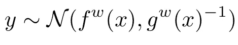

## 同方差随机不确定性

另一方面，**同方差**回归假设每个输入点 *x* 的观测噪声相同。我们必须确定一个所谓的模型精度 *τ* 并将其乘以单位矩阵 *I* ，而不是使方差依赖于输入 *x* ，以使所有输出 *y* 具有相同的方差，并且它们之间不存在共方差。这个模型精度 *τ* 就是逆观测标准差。

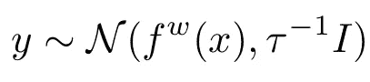

# 认知不确定性

除了由我们有些嘈杂的数据引起的不确定性之外，我们还可能有其他不确定性，当我们建立模型时，我们实际上能够最小化这些不确定性。认知的不确定性抓住了我们对最适合解释我们数据的模型的无知。换句话说，如果我们预测分布的方差有很高的认知不确定性，作为建模者，你知道你可以做得更好。

现在让我们在这个层次上理解，并探索如何计算这些估计值。

# 计算任意和认知不确定性的方法

在我看来，如何计算这两种类型的不确定性是一个即将到来的研究领域。在这里，我想讨论一个由 [Kwon 等人(2018)](https://openreview.net/pdf?id=Sk_P2Q9sG) 提出的特别有前途的方法。虽然它使这两个不确定性的估计变得容易得多，但在我看来，它仍有其不足之处。

让我们回顾一下方差的基本代数公式:

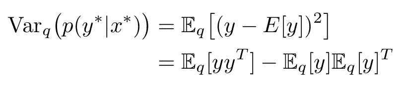

方差是任何给定输出 *y* 和任何给定输入 *y* 的期望值之间的期望平方差。

这个量可以分解为任意的和认知的不确定性:

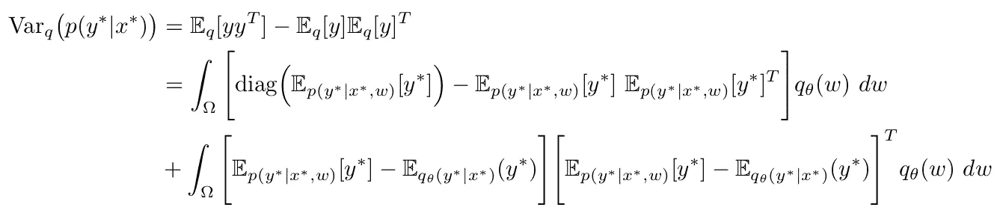

这个方程是由总方差定律的一个变种得到的。这是一个很大的进步，这里需要进行大量的数学重构。知道富比尼定理已经很有帮助了，但是完整的证明可以在 [Kwon 论文](https://openreview.net/pdf?id=Sk_P2Q9sG)的附录 A 中看到。我建议你浏览一遍，但是如果你不能遵循所有的步骤，不要太麻烦。

让我们慢慢地通过这个等式来理解它实际上代表什么。首先，让我们检查一下包含的所有参数和术语:

*   *ω*是我们的权重 *w* 的所有可能值的空间，表示为*w*∈*ω。*
*   diag 是对角矩阵。对角矩阵的对角线上有元素，其他地方都是零。如果这个对角矩阵是权重的方差-协方差矩阵，我们将没有协方差，只有方差。
*   E[ *y** ]是输入 *x*的期望输出。*仔细考虑其不同的指标:我们可以基于难以处理的预测后验分布 *p(y*|x*，w)，*或基于之前已经针对参数 *θ* 优化的变分预测后验分布 *q(y*|x*，w)* 得到 *y** 。
*   *q(w)* 是逼近难处理后验分布 *p(w|D)的变分后验分布。*

## 任意不确定性

变分后验分布预测方差的第一项

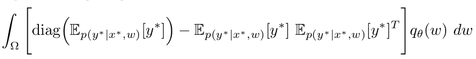

**是任意的不确定性**。我们首先有期望输出的对角矩阵 *y** ，基于棘手的预测后验分布 *p(y*|x*，w)。*我们从中减去一个矩阵，该矩阵是基于棘手的预测后验分布 *p(y*|x*，w)* 及其转置的期望输出 *y** 的乘积。然后，将该整个构造乘以变分后验分布，并在权重空间*ω*中对权重 *w* 进行积分。

之前，我们区分了异方差(每个输入不同)和同方差(每个输入相同)随机不确定性。我们在这里使用的术语可以针对每个输入进行计算(以获得异方差不确定性)或作为所有输入的平均值(以获得同方差不确定性)。

正如你可能已经猜到的，由于积分的原因，这一项很难精确估计。现在最有趣的部分来了:我们如何估计它？ [Kendall & Gal (2017)](https://arxiv.org/abs/1703.04977) 提出了一种简化方法，但是 Kwon 等人(2018)讨论了这种方法用于分类的缺陷，并提出了另一种方法:

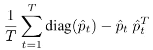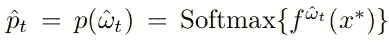

让我们跟随他们的思维过程来理解他们是如何想出这样一个估计量的。

核心变化是取代

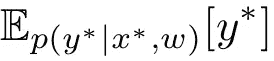

随着

我们可以这样做，因为 Softmax 生成的向量将概率作为元素，因此通过重复此计算 *T* 次来计算预测分布的*可变性*。对角矩阵减去另一个矩阵，该矩阵是 Softmax 生成的向量乘以其转置。

此外，我们用一个和而不是一个积分来使它易于处理，并且不用和乘以变分后验分布，我们通过将它除以 *T.* 来计算平均值

> 这为我们提供了来自数据集的输出可变性的平均值。因此，它可以被视为从数据集的可变性演变而来的不确定性。

## 认知不确定性

变分后验分布预测方差的第二项

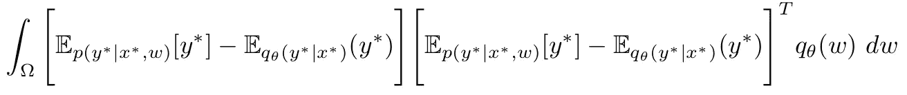

是**认知的不确定性**。我们有和任意不确定项完全相同的替换，但是增加了一个。

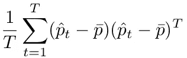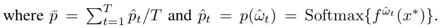

这里，我们基于具有参数 *θ* 的变分分布 *q(y*|x*)* ，用 *T* 个样本的 Softmax 生成向量的平均值来替换预期结果 *y** 。然后，我们用这个平均值减去 Softmax 生成的向量，并通过用这个减法乘以它的转置来构造一个矩阵。

当然，为了便于处理，我们还是用和来代替积分。

> 这给了我们来自模型的输出的可变性的平均值，并且与验证准确性成反比。

## 可视化结果

这些技术实现起来相当简单，特别是对于计算机视觉设置中的二进制分类任务。让我们来看一个生物医学图像的例子，准确地说是人脑的核磁共振成像记录。

我们在这里计算了异方差的任意性和认知不确定性。回想一下，异方差意味着每个输入都有不同的不确定性。在图像分析中，输入是像素。下图对 Kwon 等人(2018 年)的方法和 Kendall & Gal (2017 年)的方法进行了对比。

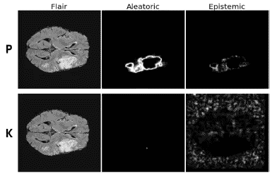

**P** is the method by Kwon et al (2018), **K** is the method by Kendall & Gal (2017)

我们还可以比较一些数据点的同方差随机不确定性和认知不确定性:

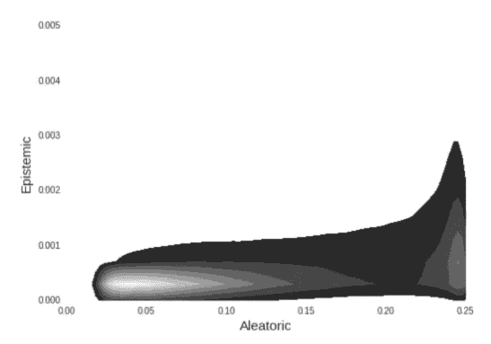

The brighter the area, the more data points are accumulated in this area.

我们还可以计算平均同方差随机不确定性和认知不确定性，但这些数字并没有给我们太多的洞察力:

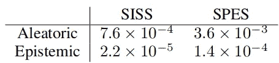

For the data sets SISS and SPES

# Softplus 标准化

我和几个同事对这些不确定性的估计也有了新的进展:[https://arxiv.org/abs/1806.05978](https://arxiv.org/abs/1806.05978)

这里，我们通过用 Softplus 函数替换 Softmax 函数并使其输出正常化，绕过了在输出层实现附加 soft max 函数的瓶颈。我们可以将这种不确定性估计写成:

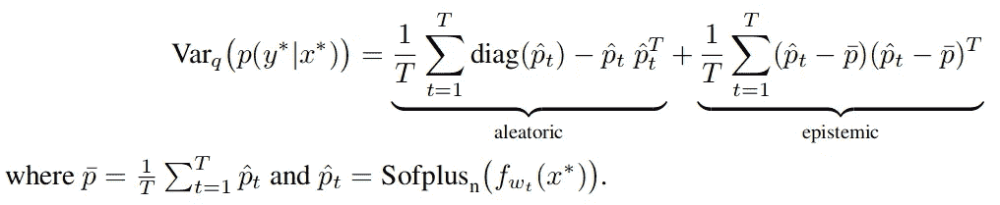

这样做的可怕后果是，不管模型如何，我们每个数据集都有恒定的随机不确定性，因为随机不确定性完全取决于数据集。尽管如此，这是以前发表的方法无法实现的。

另一个有趣的结果是验证准确性和认知不确定性之间的相关性:

随着验证准确性的提高，认知不确定性降低。这是合乎逻辑的:我们的模型预测的标签越正确，它就越确定。

要了解我们是如何实现的，请查看我们的 [GitHub repo](https://github.com/kumar-shridhar/PyTorch-Softplus-Normalization-Uncertainty-Estimation-Bayesian-CNN) 。

# 结束语

如前所述，对预测方差实际上告诉我们什么的整个探索是一个非常先进的研究领域，并将给我们很多关于我们的深度学习模型如何变得越来越好的见解。让自己了解该领域的最新研究，这些方法可能对你的应用非常有帮助，因为不确定性的测量和不确定性来源的测量在任何方面都与决策有关。

这些不确定性有助于神经空间做出决定。看看它们是如何在其[演示](https://ns-demo.azurewebsites.net/)中实现的，并看看 [NeuralSpace](https://medium.com/neuralspace) 还在做些什么。