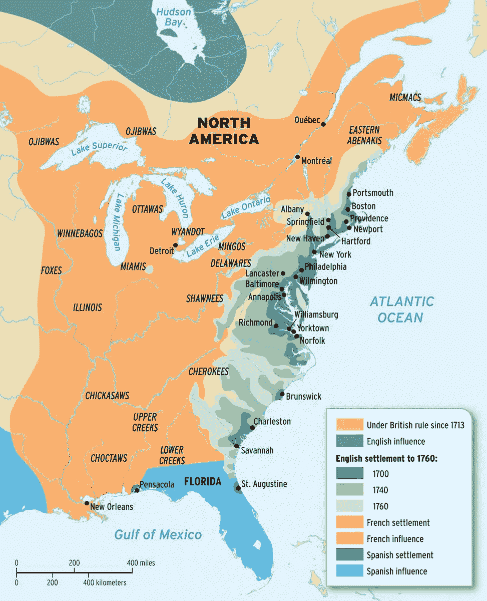
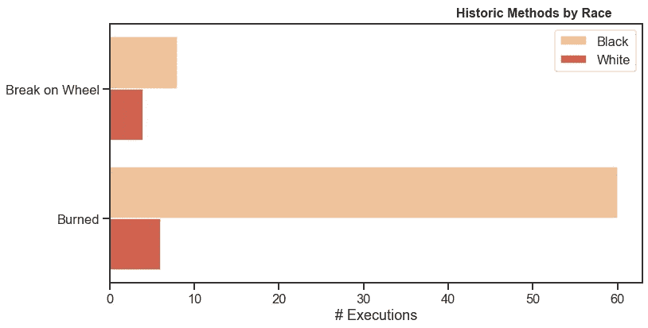
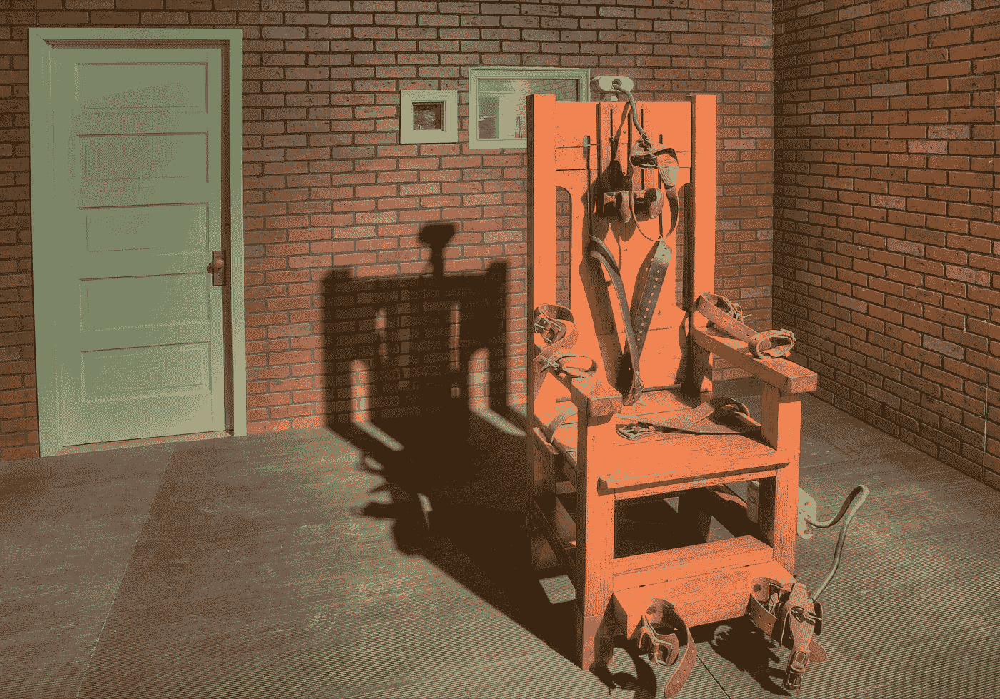
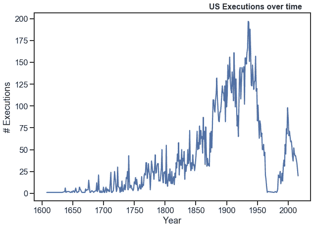
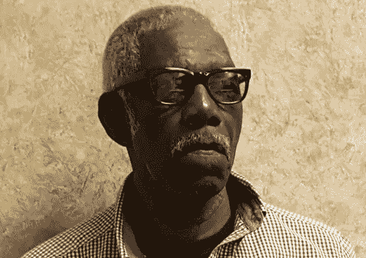
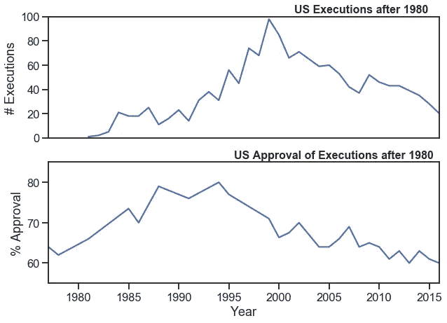
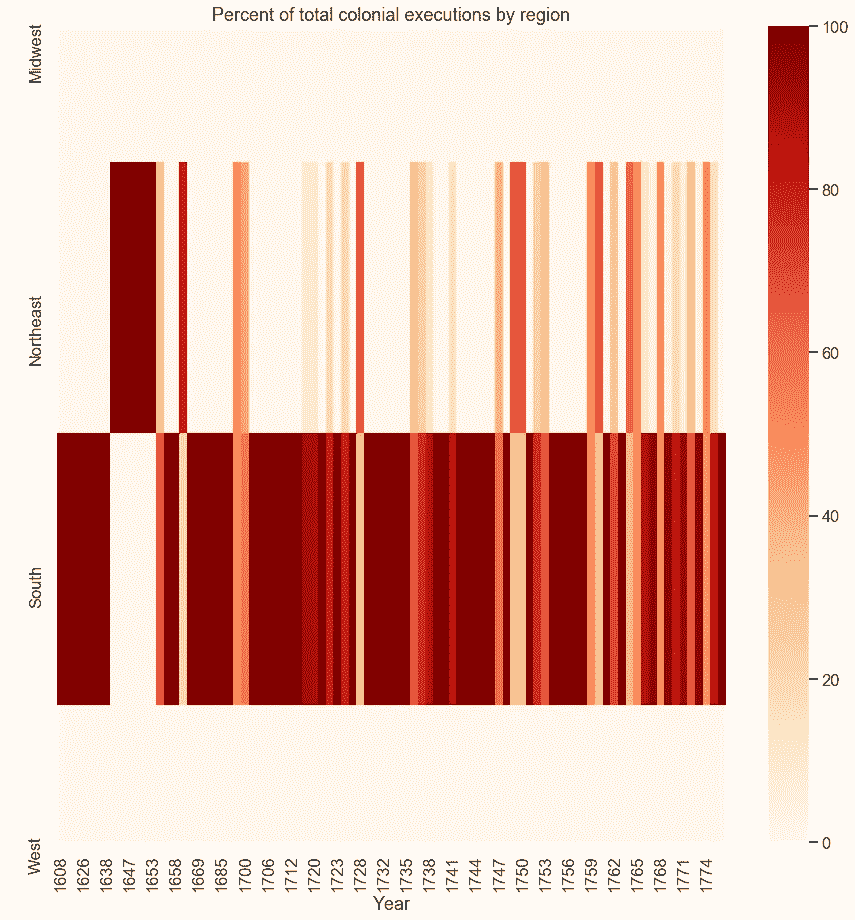
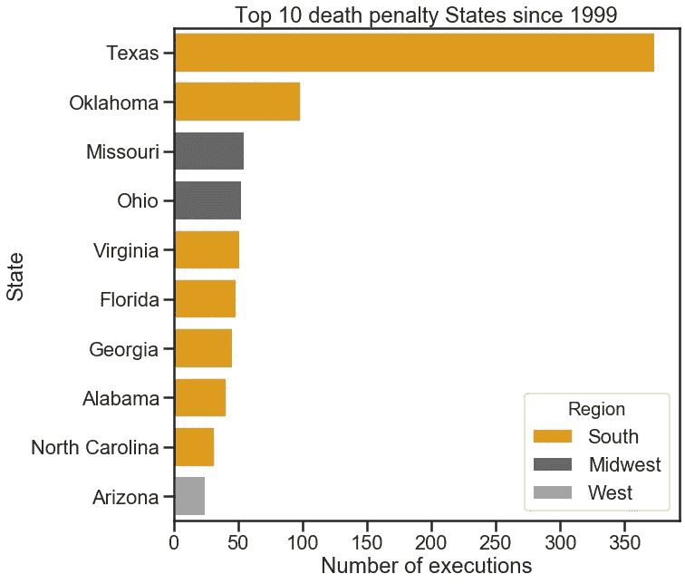
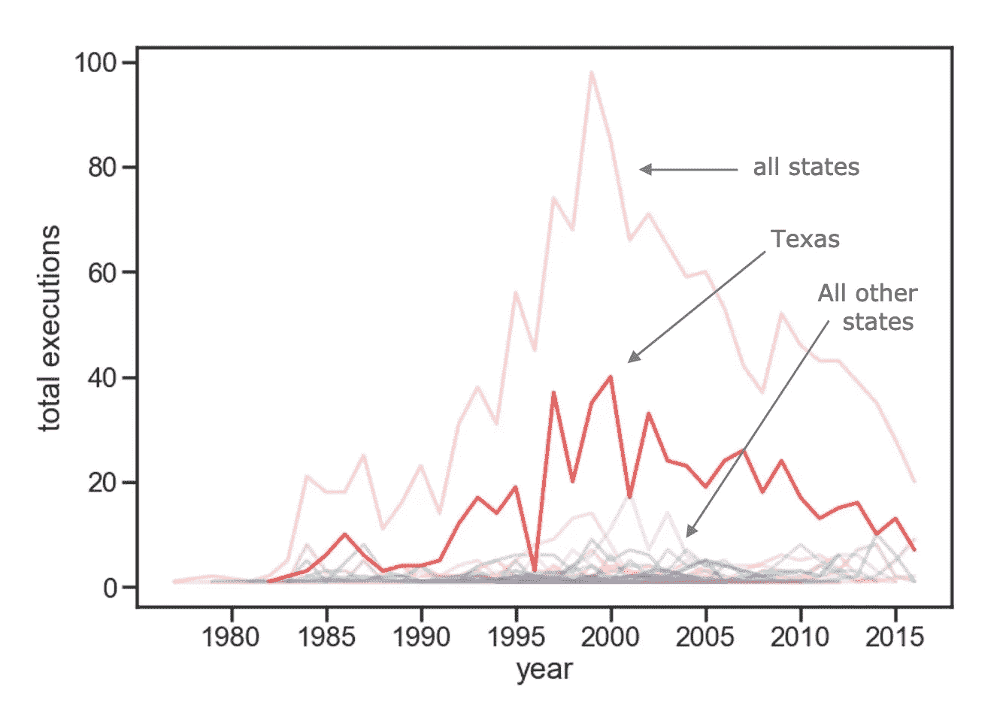

# 我们能从美国 400 年的处决中学到什么

> 原文：<https://towardsdatascience.com/what-we-can-learn-from-400-years-of-us-executions-a6a8f522dba?source=collection_archive---------30----------------------->

**重磅内容警告:我讲的几乎都是令人不安的。**

—

乔治·肯德尔站在一群男人面前，他们拿着长长的德国式手枪指着他的胸口。他可能穿着一件[白色亚麻长衬衫](https://www.leaf.tv/articles/facts-on-clothes-in-jamestown-virginia-during-colonial-times/)，塞在他的马裤里，用一条精致的蕾丝领带装饰他的脖子。一听到信号，他的刽子手们就会将灼热的金属丝塞入他们 16 英寸的[铁桶](https://www.nps.gov/jame/learn/historyculture/history-of-armour-and-weapons-relevant-to-jamestown.htm)，从而释放出他们重型武器内部的火药。肯德尔，一个在新殖民地弗吉尼亚富有且有影响力的人，犯了叛变罪和为西班牙皇室做间谍。他将是第一个在现在的美国使用西方处决方式被处决的人。

尽管各州的大量研究表明执行死刑比“终身不得假释”更昂贵，汉谟拉比式的复仇仍然在这个北美超级大国盛行。我想知道我们是如何走到今天这一步的，我们从哪里开始的，以及今天的死刑是什么样子的。

请注意我的局限性和盲点:我不是死刑专家，也根本没有资格在我出生的国家写这个主题的种族色彩。作为一名数据科学家和训练有素的硕士级经济学家，我有研究经验。我有资格查看数据并得出见解。我使用公开的数据集开始了我的研究(见参考文献)。从这些资料中挖掘见解后，我寻找其他历史和新闻来源来理解我所看到的模式。我学到了一些东西。

# 处决时尚，死刑时尚

自 1608 年新生的英国殖民政府弗吉尼亚用行刑队枪决乔治·肯德尔以来，该州“执行”死刑的方法并没有太多变化，而是受制于每次持续几十年或几个世纪的时尚潮流。

Data sources: [1] and [2]

伴随着英国的惩罚而来的是方法。其中一些方法实际上是中世纪的。从英国传入的最早的殖民处决方法之一是[“绞刑”，或“用锁链绞死”，一个人被穿上某种定制的金属衣服，有时还活着，然后展示给每个人看和闻。英国人认为这太可怕了，所以必须阻止犯罪(](https://www.atlasobscura.com/articles/the-incredibly-disturbing-medieval-practice-of-gibbeting)[没有](https://allthatsinteresting.com/gibbet)！).

[The Gibbet](http://www.ushistory.org/oddities/images/gibbet.jpg). You get the idea.

最严重的判决没有得到公平的处理。即使是乔治·肯德尔，第一个被处决的弗吉尼亚州人，[也因为他的社会地位(绞刑是为更“卑微”的人准备的)而免于被套索套在他的领带上。众所周知，绞刑令人毛骨悚然——如果处理不当(这种情况经常发生),一个人可能会被吊死几十分钟。那么，在这片他们被视为不如人的土地上，来自非洲的侨民能期望得到什么样的待遇呢？](https://www.history.com/news/death-penalty-jamestown-virginia-colony)

现在美国所在的地区是除英国以外的欧洲国家的殖民地。法国在今天的路易斯安那州的密西西比河上有一个殖民地。法国人带来了一种叫做“车轮上的断裂”的处决方法，这是一种绝对可怕的死法，我甚至不会描述它。法国路易斯安那州政府这样做了 11 次，相当于当今美国车轮断裂死刑的 92%(纽约在 1712 年处决了一名开车的白人)。

Source [5]

更糟糕的是，从 1730 年到 1748 年，路易斯安那州 100%的可怕的车轮断裂处决都是在被奴役的非洲移民身上进行的，尽管被奴役的人可能只占当时人口的 65%，而且在同一时期同一地区完全没有白人被处决。很明显，处决，更确切地说，打破车轮的方法，是一个残酷的社会“威慑”有关其“财产”的犯罪的特殊方式。

1754 年，在法国和印第安人战争开始时，打破轮子的方法有了短暂而最终的复兴，当时三个不知名的白人被判死刑。他们一定是做了什么坏事才在路易斯安那州使用那种方法。

Data source [2]

不幸的是，这并不是唯一对非裔美国人特别的方法。29 个人，有些在记录中没有名字，有些只有一个名字(比如杰克，1825 年，在 1825 年一个炎热的八月的一天被处决，或者蒙克，他在 1791 年 2 月 9 日被政府处死)，被“烧死”，这不需要更多的细节，因为这个词本身就说明了一切。这似乎为现在美国的死刑定下了基调。

这些方法即使以现代的标准来看似乎也有点可怕，而且随着新美国的建立，它们基本上已经过时了。今天我们更熟悉的其他方法有更强的持久力。数百年来，绞刑一直是最受欢迎的方法，直到另一种看起来更“无痛”的方法出现。

[据说，索思威克博士在看到一个无家可归的人触摸发电机时，萌生了用电刑执行死刑的想法](https://www.history.com/this-day-in-history/first-execution-by-electric-chair)。索思威克看着那个人倒在地上。这位医生凭借其对第三方疼痛观察的高超能力，认为这是一次“无痛”死亡，因此，美国最新形式的死刑诞生于纽约布法罗的一名闲逛的牙医(是的，索思威克医生是一种牙科医生)。

电椅并不是托马斯·爱迪生吹捧的人道处决奇迹。他在美国巡回演出时，在来看他的人群面前电击流浪动物致死，以此来推广这一理念([是的，他做了这个](https://www.washingtonexaminer.com/the-shocking-truth-about-the-electric-chair))。这种惩罚听起来像是来自 1975 年的一部糟糕的恐怖电影——众所周知，不幸被判死刑的罪犯会着火，死时会散发出烧焦的肉味，而且通常比本应迅速杀死他们的“简单的两次摇晃”要多。

[The electric chair that Ted Bundy was executed in](https://bundyphile.wordpress.com/2015/07/18/bundy-and-the-electric-chair/) in the state of Florida.

最后一种也是最常见的死刑方式是注射死刑，1977 年在俄克拉荷马州首次使用。一系列的化学物质被注射到死刑犯体内，直到他们死去，理论上，这应该在五分钟内无痛杀死他们。不幸的是，[一些拙劣的处决](https://deathpenaltyinfo.org/executions/botched-executions) [花费了长达两个小时](https://www.britannica.com/topic/lethal-injection)，混淆药物顺序导致一些死刑犯感到极度痛苦，但却瘫痪了，因此他们无法表达出哪里出错了(这听起来像是 2018 年的恐怖电影)。更糟糕的是，进行这些注射的人没有经过医学训练，因此更容易犯这样的错误。医生不能执行死刑——以这种方式伤害一个人将违背医生的希波克拉底誓言。

从《美国旁观者》的镜头来看，致命注射看似愚蠢的本质，与它的痛苦和残酷的可怕现实相提并论，可能给了索尼娅·索托马约尔存在主义的停顿。正如她在《T4》阿瑟·v·邓恩的《致命注射》中所写的:

> “各州已经设计了注射死刑的方案，目的是保护他们自己的尊严，但是他们不应该被允许在官方和公众面前掩盖死刑的真正恐怖。”

尽管注射死刑似乎是唯一一种死刑，只要死刑还在继续，这种死刑就会持续下去，但是执行死刑所必需的药物却很难得到。这导致弗吉尼亚、阿拉巴马和田纳西等州通过法律，允许因注射致命药物的问题而执行电椅死刑。

然后是屡试不爽的行刑队，这是美国殖民地第一次执行死刑的方法，也是今天仍在使用的唯一方法([罗尼·李·加德纳是最近的一个](https://en.wikipedia.org/wiki/Execution_by_firing_squad)，2010 年)。行刑队的方法与第一次弗吉尼亚处决相同，可能有一种古老的感觉。但是[正如我们从拙劣的恐怖和致命注射的一般管理中了解到的那样](https://deathpenaltyinfo.org/executions/botched-executions)，我们必须问自己:在第 14 修正案中，我们关心的是对死刑犯的残酷惩罚还是对旁观者的残酷惩罚？正如[大法官索尼娅·索托马约尔](https://www.law.cornell.edu/supremecourt/text/16-602)在亚瑟诉邓恩一案中所说，

> “除了几乎瞬间死亡之外，开枪致死也可能相对没有痛苦。……从历史上看，行刑队执行拙劣的死刑要少得多。”

[五点三十八好像同意了。](https://fivethirtyeight.com/features/is-the-firing-squad-more-humane-than-lethal-injection/)

# **死亡的高峰和低谷**

美国死刑的故事是一个衰落、流动、解散和重新建立的故事。尽管死刑是从英国引进的，但它的应用和终结并没有随之而来。在 20 世纪上半叶(1900 年至 1949 年)，英国执行死刑的人数比美国少 89%，当时两国都有死刑。更重要的是，[英国在 20 世纪 60 年代废除了死刑](https://en.wikipedia.org/wiki/Capital_punishment_in_the_United_Kingdom)并且一直有效。现代美国废除死刑只持续了十年。

在美国，死刑执行在 1935 年达到顶峰，有 197 起州政府批准的死刑。如果没有第二次世界大战和可怕的大屠杀的发现，1935 年可能只是另一个较小的高峰，在不断增长的人口中，国家批准的死亡越来越多。1948 年，联合国走到一起，打造了一种新的道德——一种“生命权”虽然世界上大多数国家并没有实现这项法令(在世界范围内废除死刑)的厚望，但它确实成为了美国的一个转折点。第二次世界大战后，死刑数量急剧下降，标志着人们对杀人作为一种可接受的惩罚形式的看法发生了道德转变。

Data: [1] and [2]

这种关于死刑的观点的下降与 1967 年最高法院对弗曼诉佐治亚州案的判决[5-4 的意识形态转变相一致。这一裁决后，美国不再通过死刑判决。](https://www.law.cornell.edu/supremecourt/text/408/238)

在*弗曼*中，威廉·亨利·弗曼，一个[的黑人](https://www.cjr.org/analysis/language_corner_1.php)在试图破门进入一户人家时开枪打死了他的受害者。大法官在该案中的意见强调了处决种族和经济上受压迫的个人是如何违反宪法的——第 14 修正案保护公民免受“残酷和不寻常的惩罚”道格拉斯法官解释道:

> “……我们知道，法官和陪审团在判处死刑时的酌处权使得死刑能够有选择地适用，如果被告贫穷、被人鄙视、缺乏政治影响力，或者如果他是嫌疑人或不受欢迎的少数群体的成员，就会助长对被告的偏见，而那些由于社会地位而可能处于更受保护地位的人除外。”

[William Henry Furman](https://torontosun.com/2016/04/27/georgia-inmate-in-historic-death-penalty-case-finally-free/wcm/0c82907b-1d15-4e9b-8114-c1adffb505b5)

弗曼和他衣服上所有不太出名的人都是黑人，这是很恰当的；正是由于意识到死刑在种族上的不平等，死刑的执行受到了公平的审视。从广义上讲，现代的死刑问题是一个种族问题。1986 年，一位名叫麦克莱斯基的起诉人向最高法院展示了在一项名为巴尔杜斯研究的实证研究中，佐治亚州的非裔美国人是如何被不成比例地判处死刑的。[在对佐治亚州的 2000 多起凶杀案](https://uscivilliberties.org/themes/3159-baldus-study.html)进行分析后[控制了 200 多个变量](https://www.law.cornell.edu/supremecourt/text/481/279#writing-USSC_CR_0481_0279_ZS)，该研究报告称，杀害白人的黑人中有 11%被判死刑，而杀害黑人的白人中只有 1%被判死刑。最高法院的大多数意见并不完全反对这项研究，他们只是发现

> “……巴尔杜斯的研究“未能对麦克莱斯基的主张做出任何有价值的贡献。”

5 比 4 的决定不是在指定的政党路线中做出的。三名民主任命的法官中有两名(白人)同意多数人的意见。四个反对意见中的三个是由共和党总统任命的。

Sources for data: [1] (top) and [4] (bottom)

在 1977 年死刑再次活跃起来后，它的攀升又开始了，死刑的支持率也是如此，在 1994 年达到了 80%的历史最高水平。但是在世纪之交，发生了一些事情，使它再次下降。[在 20 世纪 80 年代末和 90 年代初，DNA 证据成为了全国法庭上客观性的革命性工具。随着 CODIS(联合 DNA 索引系统)的出现，该国第一个拥有 DNA 信息的国家数据库，被错误定罪的重罪犯第一次有了真正的机会获释并被免除罪行。这再加上不断变化的舆论潮流和不断变化的法律，使得无辜的人从死囚区被释放出来。从 1973 年开始，一系列的免罪证明开始了，到今天](https://www.forensicmag.com/article/2005/01/evolution-dna-evidence-crime-solving-judicial-and-legislative-history)[将会增长到 166 个](https://deathpenaltyinfo.org/policy-issues/innocence-database)，许多都是在 DNA 技术的帮助下。

1998 年，在越来越多的对处决无辜者的关注中，第一次在芝加哥附近举行了全国错判会议。一年后，处决人数达到了现代史上的最后一次高峰。

# 南方是执行死刑的地方，德克萨斯州走在了前面

自 1608 年以来，南方一直是死刑的发源地。当英国殖民者开始占领并扩张到我们现在称之为北美的土地上时，他们首先在我们称之为弗吉尼亚(以英格兰的“处女女王”伊丽莎白一世的名字恰当地命名)的地区取代土著人。弗吉尼亚是一个南方的州，因此可以推断，殖民时代的死刑主要发生在南方，直到 18 世纪。同样，南方将领导我们现在称之为“西部”和“中西部”的地区，这些地区直到 19 世纪还没有被占领、[被窃取、](https://www.history.com/topics/native-american-history/indian-reservations)被殖民、[被购买、](https://www.britannica.com/event/Louisiana-Purchase)或所有这些的混合。

Data: [2]

然而，这种模式一直延续到现代。在过去 20 年里，处决人数最多的 10 个州中有 7 个位于南方。这可能有很多原因。从严格的统计角度来看，南部仍然是最常见的执行死刑的地方[,因为截至 2019 年，南部每个州仍在执行死刑](https://deathpenaltyinfo.org/state-and-federal-info/state-by-state),而许多北部和西部的州要么宣布死刑违宪，要么州长下令暂停执行死刑。至于*为什么*韩国没有宣布死刑为非法，我的猜测是围绕死刑的价值观和信仰是基于地区的。

Data: [1]

如果我们必须孤立一个州，那么自 1977 年恢复死刑直到 2004 年左右，德克萨斯州显然是整个国家死刑执行率的驱动力。他们不仅处决的人比其他任何州都多，而且处决罪犯的速度也很快。

[得克萨斯州在死刑方面领先有几个原因。](https://www.pbs.org/wgbh/pages/frontline/shows/execution/readings/texas.html)首先，他们没有公设辩护人制度。这意味着请不起律师的人可以得到法院指定的律师，而这些律师可能对这类案件没有经验。其次，德克萨斯州在 1995 年通过了一项法律，加速了定罪和执行之间的过程。第三，德克萨斯州的上诉法官是选举产生的官员，他们更密切地关注该地区的政治，这意味着他们可能会更经常地开展“严厉打击犯罪”的运动，并且必须以一种被任命的法官所不具备的方式来兑现这些承诺。

Data: [1] and [2]

也有人猜测，德州的死刑制度在某种程度上是高效的，其他州将来也可以实现。这种观点认为，这并不是因为德州做出了更多的死刑判决，而是因为他们更擅长执行死刑。

# 总而言之

理论上，我们在改变以人道方式处决人的方式方面已经取得了很大进展，但是普通的方法并不是最人道的。目前实际上最“人道”的方法(如果可能的话)可能是第一种:行刑队。我绝不是第一个这么说的人，最高法院已经公开讨论过这个问题。

在过去的一个世纪里，美国被执行死刑的人数大大减少了，但是我们仍然生活在一个自殖民时代以来就不公平对待死刑的体系中。尽管各州花费更多的钱来杀死罪犯而不是让他们活着，死刑仍然存在，而且在一个特定的地方(主要是南方，甚至更多的是德克萨斯州)被处决的人数似乎是由文化驱动的。死刑问题在很大程度上似乎是一个种族问题。

鉴于我们对即使是现代的死刑执行方法会有多么痛苦有着丰富的知识，执行死刑要花费大量纳税人的钱，而且进步国家没有死刑，我觉得美国处决罪犯是令人惊讶的。

参考资料:

*   [【1】死刑信息中心](https://deathpenaltyinfo.org/executions/execution-database)(通过 [Kaggle](https://www.kaggle.com/usdpic/execution-database)
*   [[2]来自 ICPSR 的 Espy 文件](https://www.icpsr.umich.edu/icpsrweb/NACJD/studies/23900):
    Espy，M. Watt，和约翰·奥提兹·斯迈克拉。美国的死刑执行，1608-2002:ESPY 文件。ICPSR08451-v5。密歇根州安阿伯市(Ann Arbor):大学间政治和社会研究联合会(Inter-university Consortium for Political and Social Research)[分销商]，2016–07–20。[http://doi.org/10.3886/ICPSR08451.v5](http://doi.org/10.3886/ICPSR08451.v5)
*   [3]来自时间分析的 Dict 助手[和 Git](https://time.com/82375/every-execution-in-u-s-history-in-a-single-chart/) 上的[源代码](https://github.com/TimeMagazine/death-penalty-data/blob/master/Mapping.py)
*   [[4]盖洛普死刑支持率](https://news.gallup.com/poll/1606/Death-Penalty.aspx)
*   [5] [美国的地平线:全球背景下的美国历史](https://global.oup.com/us/companion.websites/9780199389315/map/maps/mapsch5/)