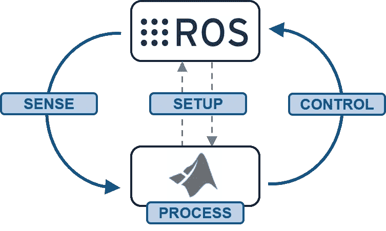
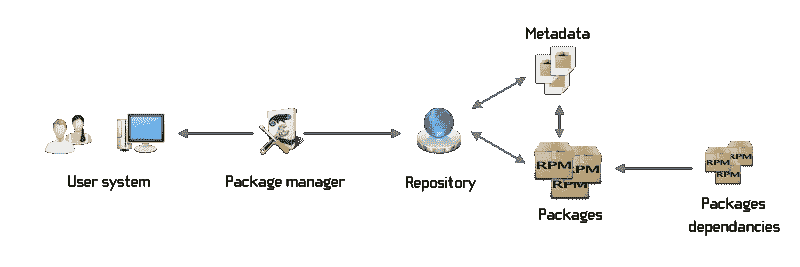
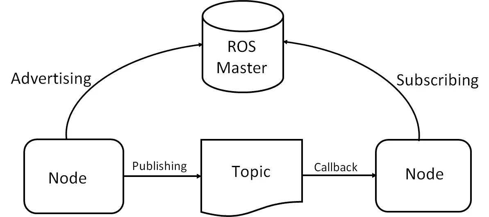
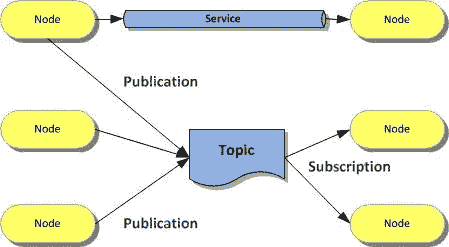
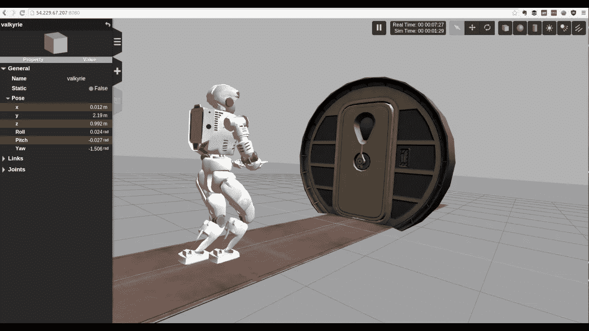
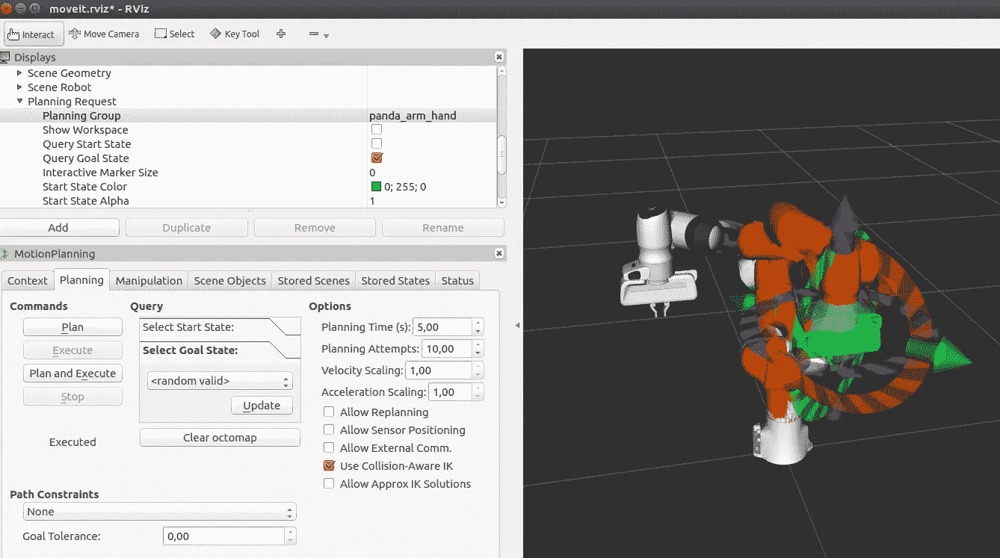

# ROS 的内容、原因和方式

> 原文：<https://towardsdatascience.com/what-why-and-how-of-ros-b2f5ea8be0f3?source=collection_archive---------3----------------------->

*人类一直对机器人着迷，无论是*[](https://www.stufftoblowyourmind.com/blogs/the-pooping-duck-marvel-of-18th-century-robotics.htm)**[*雷奥纳多的机械狮子*](https://www.thelocal.fr/20190912/da-vincis-mechanical-lion-is-now-on-display-in-paris) *还是* [*特克*](https://en.wikipedia.org/wiki/The_Turk) *。我们总是试图建造与我们或我们周围的自然生物相似的东西。***

****

**The Turk**

**机器人是能够感知环境(即其周围环境)(使用传感器)、基于环境状态做出决策(使用计算和算法)并能够执行生成的指令(使用致动器)的任何系统。**

**这些传感器和执行器并不理想，因此会给系统带来很大的不确定性。因此，我们永远无法知道系统的实际状态是什么，因此我们永远无法知道机器人的确切位置，或者使用致动器施加相同的力是否会导致相同的运动。这将随机性引入到系统中，使得与现实生活中的机器人一起工作变得极其困难。再加上环境中其他因素(如人类和动物)看似不可预测的运动，你就有了一个非常棘手的问题。**

****

**Robotic System**

**我们如何解决这些问题，更不用说开始解决它们了？我们需要一些系统作为传感器和执行器之间的桥梁。这是一个决策过程或一系列步骤，系统必须遵循这些步骤来实现预期的结果。这些步骤被称为算法，可以被认为是机器人的大脑。**

**为了建造一个复杂的机器人，我们需要各种各样的传感器，例如，为了建造一辆自动驾驶汽车，我们需要激光雷达、相机、惯性测量单元、全球定位系统等。这些系统可以由不同的公司制造，并且可能遵循非常不同的方法。因此，缺乏统一性。此外，一些算法在机器人系统中非常常用，如卡尔曼滤波器、PID 控制等。如果每个人都重写相同的算法，可能会导致不必要的时间和精力浪费。更别说这些程序的质量(就软件工程实践和计算效率而言)不会很好。**

**来自描述 ROS 的论文的作者[2]:**

> **为了应对这些挑战，包括我们在内的许多机器人研究人员之前已经创建了各种各样的框架来管理复杂性并促进实验软件的快速原型制作，从而产生了目前在学术界和工业界使用的许多机器人软件系统
> 。这些框架中的每一个都是为特定的目的而设计的，可能是为了应对其他可用框架的弱点，或者是为了强调设计过程中最重要的方面。[2]**

**因此，需要一种系统来消除这些不必要的开销，以便世界各地的研究人员能够更好地做出贡献，解决机器人系统带来的难题。我们需要协议将数据从系统的一部分传输到另一部分，我们需要统一的实践和工具来构建我们的软件，我们需要预先编写的库来避免兼容性问题。ROS 就是这样一个系统，它为我们提供了规则和标准的方式来组织我们的东西，这样我们就可以大规模地合作，并在事物之间保持某种一致性。**

# **ROS 是什么？**

**ROS 不是一个操作系统，而是一个元操作系统，这意味着它假设有一个底层操作系统来帮助它执行任务。但是什么是操作系统呢？操作系统没有明确的定义。通常，操作系统由操作系统提供商提供的所有东西组成。**

****

**Working of ROS**

**原论文中 ROS 的定义[2]:**

> **开源机器人操作系统 ROS。ROS 不是传统意义上的进程管理和调度的操作系统
> ；相反，它在异构计算集群的主机操作系统之上提供了一个结构化的通信层。[2]**

**操作系统是在应用程序和硬件之间提供接口的软件。它处理诸如内存、处理器时间等资源的分配。通过使用调度算法并记录不同用户的权限，从而提供一个安全层。操作系统可以包括基本应用程序，例如网络浏览器、编辑器、系统监控应用程序等。它几乎总是有一个称为内核的低级程序，帮助与硬件接口，本质上是任何操作系统最重要的部分。操作系统可能提供也可能不提供图形用户界面。**

**在理解元操作系统之前，我们需要理解什么是库和框架。库本质上是在软件/程序中广泛使用的函数组，其流行程度足以证明将它们打包到单独的文件中是合理的。库也被用来使软件看起来更整洁，并建立在经过测试的软件之上，从而减少出错的机会。这并不意味着你不能建立自己的库，但这里我们指的是常用的库。框架本质上是可用于特定应用的库的集合。**

**API 是一个应用程序编程接口。如果你有一些代码，并且你想在不知道所有代码的情况下使用它，你可以使用 API。API 提供了一个抽象层，并提供了对底层代码的访问。这在处理项目时非常有用，因为我们可以很容易地使用同行评审过的、彻底测试过的代码(库、框架等)。)而不必担心它可能如何工作。**

**元操作系统具有大量的功能，以至于它不能被归类为一个框架或一组库，但也不能被归类为操作系统。它既提供操作系统的功能，也提供框架的功能，但并不全面。因此，它不能被归为任何一类。例如，它不提供操作系统应该提供的核心功能，但提供 API。**

# **Linux 操作系统**

****

**ROS 依赖于底层操作系统。ROS 要求操作系统具备很多功能。此外，ROS 必须对大量用户免费开放，否则大量用户可能无法访问它。ROS 的流行很大程度上是由于它的开放性和对大众的易获得性。它还需要一个开放源代码的操作系统，这样操作系统和操作系统就可以根据应用程序的要求进行修改。**

**Windows 10 和 Mac OS X 等专有操作系统可能会限制我们使用它们的方式。这可能会导致开发过程中的僵化，这对于 ROS 这样的行业标准来说并不理想。因此，大多数人更喜欢在 Linux 上运行 ROS，特别是 Debian 和 Ubuntu，因为 ROS 对基于 Debian 的操作系统，特别是 Ubuntu 有很好的支持。这并不意味着 ROS 不能在 Mac OS X 或 Windows 10 上运行。但是支持是有限的，人们可能会发现自己处境艰难，几乎得不到社区的帮助。**

**操作系统和操作系统之间有着紧密的联系，以至于为了使用操作系统，有必要了解更多的操作系统知识。作为一个新手使用 Linux 可能是一个挑战，一个人肯定会遇到 Linux 的问题，尤其是在使用 ROS 时，对 Linux 的良好了解将有助于避免/修复这些问题。**

**由于某些驱动程序不匹配(看着你 [NVIDIA](https://www.youtube.com/watch?v=IVpOyKCNZYw) ),我个人不得不多次重新安装我的操作系统，依赖性破坏的问题已经导致我陷入严重的生存危机。为了避免这种情况，我整理了一个在关键时刻拯救生命的链接列表。**

****

**如上所述， [NVIDIA 驱动程序与 Linux 不太匹配。](https://www.pcworld.com/article/2911459/why-nvidia-graphics-cards-are-the-worst-for-open-source-but-the-best-for-linux-gaming.html)英伟达没有为 Linux 提供官方驱动程序，所以人们黑掉了英伟达的卡，对驱动程序进行了逆向工程，建立了一个叫做[的东西](https://en.wikipedia.org/wiki/Nouveau_(software))。但是 NVIDIA 知道这些，长话短说，这些和 NVIDIA 显卡不太搭。但是 NVIDIA 确实提供了一些你可以使用的驱动，它们很可能会工作(一切顺利！).**

**使用 ROS 还有许多其他常见错误。但是要理解这些，我们必须理解软件包在 Linux 中是如何安装的。这是一个有趣的话题，值得多篇博客来讨论，但是我们在这篇博客中只是简单地介绍一下。**

**要在 Linux 中安装任何软件或库，我们需要一种叫做 repos(仓库的缩写)的东西。这些是由组织提供的官方服务器，用于促进软件的分发。这些包存储在它们的服务器上，您可以通过使用包管理器或手动过程来获得它们。默认情况下，只有一定数量的回购，由包管理器为所请求的包进行搜索。但是当然，我们不能在一次回购中拥有所有的产品包。因此，我们需要多个回购，因为每个人都不需要每个回购，所以只包括有限数量的回购是有意义的。**

****

**How package manager works**

**但是如果我们想从不同的仓库下载软件包呢？我们必须将它们添加到要搜索的回购列表中。这个系统保护 Linux 免受病毒的侵害，因为所有的软件都来自可靠的来源，其中一个是病毒的可能性很小。但是，如果你添加了自己的回购，那么你将对后果负责。因此，当你从 ROS 下载软件包时，你需要提供 GPG 密钥，以确认这个回购确实是安全的。下面是我们的第一个错误“ *gpg 键错误*”，[这个博客](https://www.linuxhelp.com/how-to-install-y-ppa-manager-on-ubuntu)可以帮助你更好的理解 gpg 键并解决这个错误。**

**一些软件包可能不适用于当前版本的操作系统，比如说 Ubuntu 16.04 可能有一些过时的软件包，或者你可能需要一些只在某些网站上可用的软件包。这可以通过 PPAs 或个人包存档来完成。这可能会导致很多错误，因此我们需要一个 ppa 管理器来帮助我们导入密钥，如果需要的话，这就是 Y-PPA 管理器的用武之地。**

**最常见的错误之一是 [dpkg 错误](https://askubuntu.com/questions/219545/dpkg-error-dpkg-status-database-is-locked-by-another-process)。dpkg 或 debian package 是一个软件包管理器，位于 ubuntu 软件包管理器(如 apt)的后端。问题是，它一次只能安装[一个包](https://en.wikipedia.org/wiki/Halting_problem)，因此锁定了它的使用。因此，如果你试图安装多个包，它可能会抛出 [dpkg 错误](https://askubuntu.com/questions/219545/dpkg-error-dpkg-status-database-is-locked-by-another-process)。**

**尽管 Ubuntu 附带了许多预装软件，其中一些非常有用，但有时可能需要安装提供更好替代方案的软件。以下是我使用的一些软件。这是一个非常好看的包装器，让 bash 看起来更好，并提供了一些额外的功能。 [Sublime](http://tipsonubuntu.com/2017/05/30/install-sublime-text-3-ubuntu-16-04-official-way/) 是我最喜欢的文本编辑器之一，它的界面和提供的快捷方式极其方便。你可能还想安装 [chrome](https://linuxize.com/post/how-to-install-google-chrome-web-browser-on-ubuntu-18-04/) 。**

# **积木**

**在 ROS 中，一切都以包的形式存在。这有助于以更易于维护的方式打包代码。ROS 提供了很多现成的包。ROS 包可以通过以下方式安装**

```
**sudo apt install ros-<distro>-<package-name>**
```

**例如，在 ROS kinetic 上，robot_localization 包将安装为:**

```
**sudo apt install ros-kinetic-robot-localization**
```

**关于包装的更多信息，请参见[本页](http://wiki.ros.org/Packages):**

> **ROS 中的软件被组织在*包*中。一个包可能包含 ROS [节点](http://wiki.ros.org/Nodes)，一个独立于 ROS 的库，一个数据集，配置文件，一个第三方软件，或者任何其他逻辑上构成一个有用模块的东西。这些包的目标是以一种易于使用的方式提供这种有用的功能，以便软件可以很容易地被重用。一般来说，ROS 包遵循一个“金发女孩”原则:足够的功能是有用的，但不要太多，以至于包太重，难以从其他软件中使用。**
> 
> **包中的一些重要文件/目录是:**
> 
> **1.[节点](http://wiki.ros.org/Nodes):节点*节点*是执行计算的进程。
> 2。CMakeLists.txt :它是 CMake 构建系统的输入，用于构建软件包。
> 3。 [Package.xml](http://wiki.ros.org/Manifest) :它定义了关于包的属性，比如包名、版本号、作者、维护者以及对其他柳絮包的依赖。
> 4。[。yaml](https://en.wikipedia.org/wiki/YAML) 文件:运行 rosnode 可能需要很多参数，例如 [PID 控制](http://wiki.ros.org/pid)中的 Kp、Ki、Kd 参数。我们可以使用 YAML 文件来配置这些。
> 5。[启动文件:](http://wiki.ros.org/roslaunch/Tutorials/Roslaunch%20tips%20for%20larger%20projects)为了在 ROS 中同时运行多个节点，我们使用启动文件。**

**任何将要编写的代码都应该是包的形式。并且包应该在工作空间内。更多信息请参见[这一](http://wiki.ros.org/catkin/workspaces)页。**

> **一个[柳絮工作空间](http://wiki.ros.org/catkin/workspaces#Catkin_Workspaces)是一个文件夹，您可以在其中修改、构建和安装柳絮包。它可以包含多达四个不同的*空间*，每个空间在软件开发过程中扮演不同的角色。
> 
> 1。[源空间](http://wiki.ros.org/catkin/workspaces#Source_Space)包含了柳絮包的源代码。在这里，您可以提取/检出/克隆您想要构建的包的源代码。源空间[中的每个文件夹](http://wiki.ros.org/catkin/workspaces#Source_Space)包含一个或多个柳絮包。**
> 
> **2.[构建空间](http://wiki.ros.org/catkin/workspaces#Build_Space)是调用 CMake 来构建[源空间](http://wiki.ros.org/catkin/workspaces#Source_Space)中的柳絮包的地方。CMake 和柳絮在这里保存它们的缓存信息和其他中间文件。**
> 
> **3.[开发空间](http://wiki.ros.org/catkin/workspaces#Development_.28Devel.29_Space)(或[开发空间](http://wiki.ros.org/catkin/workspaces#Development_.28Devel.29_Space))是在安装之前放置构建目标的地方。目标在[开发空间](http://wiki.ros.org/catkin/workspaces#Development_.28Devel.29_Space)中的组织方式与其安装时的布局相同。这提供了一个有用的测试和开发环境，不需要调用安装步骤。**
> 
> **4.一旦构建了目标，就可以通过调用安装目标(通常使用 make install)将它们安装到[安装空间](http://wiki.ros.org/catkin/workspaces#Install_Space)中。**

**当我们运行我们的 rosnodes 时，它们执行计算并获得结果。但是它们可能需要来自其他节点的结果，以便执行一些其他功能。因此，我们需要一种机制来帮助我们将数据从一个节点传输到另一个节点。我们需要做的第一件事就是设置一个 ROS 主机。**

****

**The ROS Master**

> **ROS 主机为 ROS 系统中的其余[节点](http://wiki.ros.org/Nodes)提供命名和注册服务。它跟踪[主题](http://wiki.ros.org/Topics)以及[服务](http://wiki.ros.org/Services)的出版商和订户。主节点的作用是使各个 ROS 节点能够相互定位。一旦这些节点相互定位，它们就相互进行对等通信。**

**数据的传输是通过主题进行的。如果你想发送你的数据，你可以将它发布到主题，任何需要的人都可以通过发布者订阅它。这有助于编写代码，甚至在我们使用 [ROS 包](http://wiki.ros.org/Bags)时更有帮助。当我们想记录一些数据时，ROS 包很有帮助，所以我们可以稍后播放它，如果我们想复制一个行为。**

****

**Topics and services**

> **主题是[命名的](http://wiki.ros.org/Names)总线，通过这些总线[节点](http://wiki.ros.org/Nodes)交换[消息](http://wiki.ros.org/Messages)。主题具有匿名的发布/订阅语义，这将信息的产生和消费分离开来。一般来说，节点不知道它们在与谁通信。相反，对数据*感兴趣的节点订阅*相关主题；生成数据的节点*发布*到相关主题。一个主题可以有多个发布者和订阅者。**

**服务是另一种形式的交流。它们用于[远程程序调用](https://searchapparchitecture.techtarget.com/definition/Remote-Procedure-Call-RPC)。即，一个程序可以从位于另一台计算机中的程序请求服务。传输的数据是以[消息](http://wiki.ros.org/Messages)的形式，这是在 ROS 中使用的特别定义的数据类型。我们要看的最后一种沟通类型是[行动](http://wiki.ros.org/actionlib)，它们类似于服务，但长期目标可以被抢占，即可以被要求改变。**

> **actionlib 包提供了创建服务器的工具，这些服务器执行可以被抢占的长期运行的目标。它还提供了一个客户端接口，以便向服务器发送请求。**

# **工具**

**一旦我们准备好所有的代码并运行，我们需要测试我们的代码，这样我们就可以在必要的时候进行修改。在真实的机器人上这样做将会很昂贵，并且可能导致每次设置机器人时浪费时间。因此我们使用机器人模拟。与 ROS 一起工作的最流行的模拟器是 [Gazebo](http://gazebosim.org/) 。它有很好的社区支持，它是开源的，在它上面部署机器人更容易。**

****

**NASA’s robot in gazebo**

**机器人将安装不同的传感器和致动器，幸运的是我们可以在凉亭找到许多这样的传感器和致动器，或者我们自己建造它们，这可能需要很长时间，但仍然不是很困难。在运行这些传感器时，我们可能需要可视化它们的数据。为此，我们使用了 [RViz](http://wiki.ros.org/rviz) 。**

****

**[moveit](https://moveit.ros.org/) in rviz**

**RViz 是 ROS 的 3D 可视化工具。它是最流行的可视化工具之一。它接受一个主题作为输入，并基于要发布的消息类型将其可视化。它让我们从机器人的角度看环境。**

# **其他资源和结论**

**ROS 极其复杂，因此对新手来说有些难以理解。让 ROS 对人们来说很难的是这个人需要具备的大量先决知识。由于大多数初学者没有这方面的知识，他们发现很难掌握 ROS。**

**这包括对 Linux 的良好了解和对计算机工程原理的良好理解，包括网络概念和软件工程哲学。ROS 主要基于广泛流行的、经过测试的工具和技术，例如 rqt 就是从 qt 派生出来的。Gazebo 和 stage 在与 ROS 和柳絮集成之前就已经很流行了，是基于 CMake 的。**

**让事情变得更复杂的是，只有几个好的在线资源。写了很多书，但对新来者几乎没有帮助。我发现《ROS 简介》这本书非常有用，因为它简明扼要，可以帮助我入门。《用 ROS 编程机器人:机器人操作系统实用介绍》这本书很好地概述了不同的东西在 Ros 中是如何工作的。人们还推荐“ [ROS Robotics By Example](https://www.amazon.in/ROS-Robotics-Example-Learning-control-ebook/dp/B076HQC1KH?tag=googinhydr18418-21&tag=googinkenshoo-21&ascsubtag=_k_CjwKCAjwlovtBRBrEiwAG3XJ-4f6wh-oYnowhm0lI7_09a3cW8hHH2-anHwgafIimIgYn3buCRUu7hoCrKEQAvD_BwE_k_&gclid=CjwKCAjwlovtBRBrEiwAG3XJ-4f6wh-oYnowhm0lI7_09a3cW8hHH2-anHwgafIimIgYn3buCRUu7hoCrKEQAvD_BwE) ”。不同工具的很多用法可以在 [wiki](http://wiki.ros.org/kinetic/Installation) 上找到，如果你有困难，可以去[论坛](https://answers.ros.org/questions/)看看。**

**我希望这篇博客能帮助你更多地了解 ROS，现在你明白它的用处了。但是 ROS 是在 2007 年推出的，它是为特定的用例设计的。从那以后，发生了很多变化，我们看到了人工智能研究的复兴和用例数量的增加。机器人技术在大众中变得越来越受欢迎，尽管 ROS 很好地应对了这些挑战(尽管它不是特意设计的)，但它需要大量的黑客。**

****

**因此，我们要求对 ROS 进行改革，使其能够应对这些新的挑战。ROS2 就是这样一个项目，它的开发是为了让 ROS 可以在其他操作系统上使用，比如 Windows，并且可以支持更多种类的硬件(比如嵌入式系统)。它还应该对强化学习和多机器人系统有更好的支持。**

**还提供了附带的演示文稿和 Youtube 视频:**

**[1] *克莱默、詹姆斯和马蒂亚斯·舍茨。"自主移动机器人的开发环境:综述."自主机器人 22.2(2007):101–132。* 【2】*奎格利、摩根等人《ROS:一个开源的机器人操作系统》。开放源码软件 ICRA 研讨会。第三卷。№3.2.2009.***