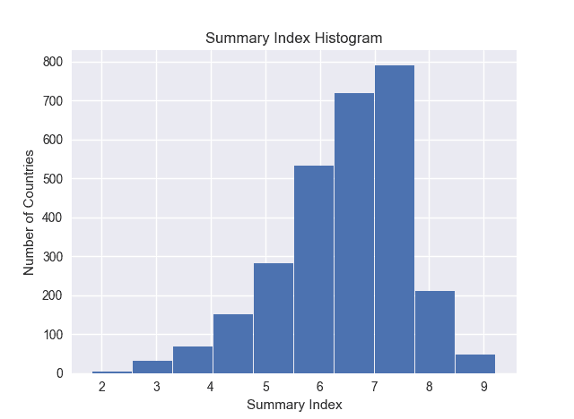
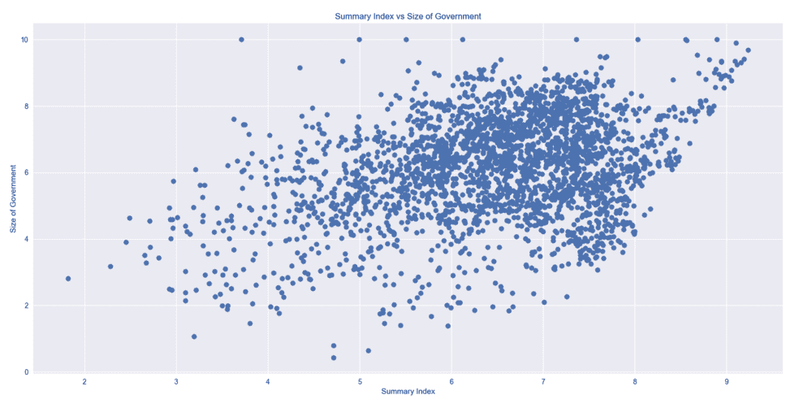
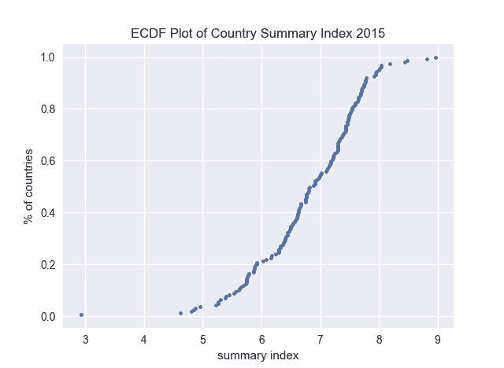
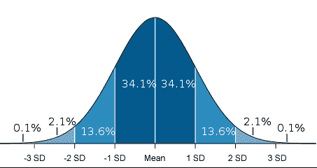
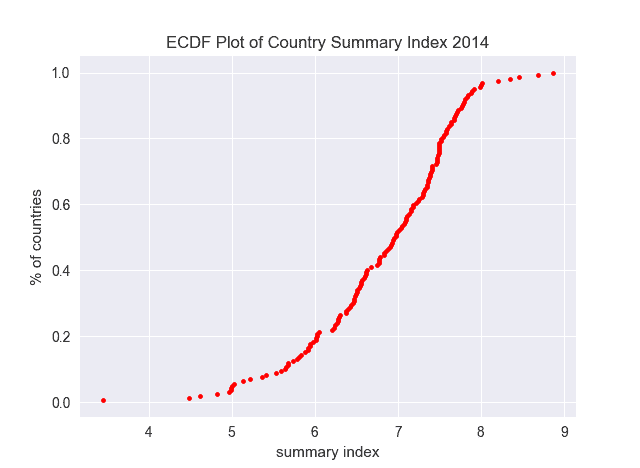
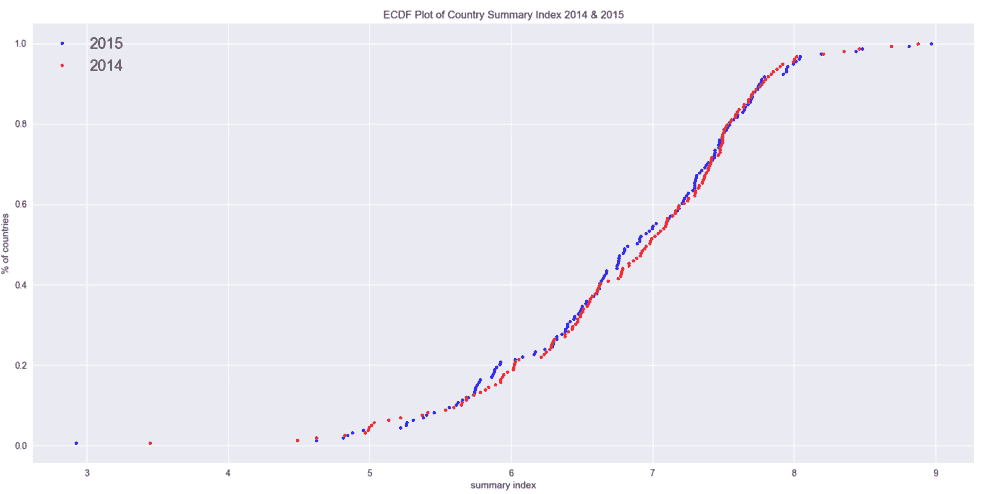
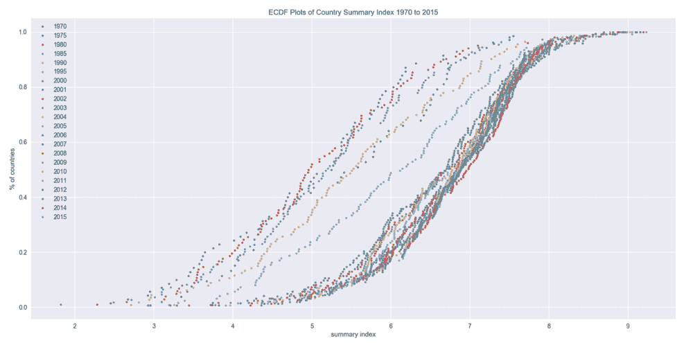
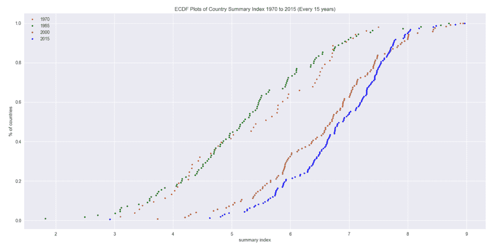

# 什么，为什么，以及如何阅读经验 CDF

> 原文：<https://towardsdatascience.com/what-why-and-how-to-read-empirical-cdf-123e2b922480?source=collection_archive---------6----------------------->

鼓励探索性数据分析(EDA)来获得数据的可消化的一瞥。这包括汇总统计的直方图:

和散点图来确定数据中特征的相关性。

Scatter plot comparing the Economic Summary Index of Countries with their Size of Government.

但是有一个汇总统计可视化，我是在探索了 Datacamp 的[统计思维课程之后才知道的。它被称为经验累积分布函数(试着说快 10 倍…我们简称它为 ECDF)。](https://www.datacamp.com/courses/statistical-thinking-in-python-part-1)

在本帖中，我们将探索什么是 ECDF，为什么要使用它，以及我们可以通过使用由[#改头换面星期一](http://makeovermonday.co.uk/)的人们提供的世界经济自由数据集从中获得的见解。这些数据也被用来制作上面的图。用于这些图表的代码和 excel 文件的副本在这个 [Github Repo](https://github.com/JohnDeJesus22/EDA-Scripts-and-Notebooks/tree/master) 中。代码没有包含在这篇文章中，所以你可以把注意力放在视觉效果上并解释它们。

# 那么什么是经验积云呢？什么是 ECDF？

ECDF 是累积分布函数的估计量。实际上，ECDF 允许您按照从少到多的顺序绘制数据的要素，并查看整个要素，就像分布在整个数据集中一样。让我们看看帖子中上面的 ECDF 图表。

这里我们可以看到各国经济自由度综合指数的差异(2015 年)。这张图表可以为我们提供一些关于这些国家经济表现的统计摘要。一个快速的洞察是指数的范围从略低于 3 到 9(范围大约为 6)。所以没有一个国家有完全的经济自由。

# 听起来很棒！但是我如何阅读 ECDF 来获得这些汇总统计数据呢？

一开始我读起来也有困难，但它比你想象的要简单。我得到的解释对我来说还不够。然后我想一定有类似的东西我可以使用，类似于 ECDF，可以提高我的理解。让我通过高斯(正态)分布为你们提供这个支架，你们可能更熟悉。

Gaussian Distribution. Image from [etfhq.com](http://etfhq.com/blog/2011/02/07/standard-deviation/)

如果你熟悉高斯分布，我来问你这个问题。数据点小于平均值的百分比是多少？如果你回答了 50%，那么你就对了！

ECDF 可以用类似的方式来阅读！例如，汇总指数低于 6 的国家比例是多少？在 x 轴上看向 6，然后垂直移动，直到碰到曲线。你得到了大约 20%。因此，大约 20%的国家的综合指数低于 6。所以他们有一些经济自由。

这是 2014 年的另一张 ECDF 图，数据相同。

ECDF of the Countries’ Economic Summary Index in 2014.

试着用上面的图表回答下列问题。我会把答案写在问题下面。

1.汇总指数低于 6 的国家百分比是多少？

2.综合指数低于 8 的国家的大约百分比是多少？

答案:

1.20%左右。

2.大约 97–98%。

# 厉害！同时绘制多个 ECDFs 怎么样？

我们可以绘制多个 ECDF 图！例如，让我们将 2014 年和 2015 年的两个 ECDFs 绘制到一个图表上。

现在，您可以确定两年的汇总统计数据并进行比较。您可以看到，在某些汇总指数范围内，例如从 7 到 8，这两年的汇总指数几乎相同。但在 6 到 7 的范围内，2015 年综合指数低于 7 的国家比例略高。

现在你可能想知道，你能在一张图上画出多少个 ECDFs？我看到最多的大概是 3 个。这个数据有 22 年的汇总指数价值。让我们看看 22 ECDFs 有多好(剧透:不会太好…)

ECDF plot with all 22 years worth of Country Summary Indexes. Nulls were dropped.

正如您可能很难看到的，由于同时绘制的 ECDFs 的数量，这不容易解释。即使有这个传说，也很难区分哪一年和其他年份。在这种情况下，展示得越少，揭示得越多。让我们画出 4 年的价值。具体来说，我们将从 1970 年到 2015 年绘制图表，在此期间每隔 15 年绘制一次。

ECDF plot of summary indexes for 1970, 1985, 2000, and 2015

清楚多了不是吗？此外，这让你可以看到在 15 年的跳跃中总结指数变化的区别。从这幅图中你能观察到什么？在下一段阅读它们之前，试着思考一下这个问题。

你可以直接观察到的是，1970 年和 1985 年的综合指数比后来的年份要低。因此，从 2000 年开始，经济自由度总体上有所提高，至少在 2015 年也是如此。1970 年和 1985 年还有一些有趣的观察结果。一是 1970 年的数据点似乎最少，这可能表明很少有国家拥有经济自由，或者有些数量没有记录。

第二个观察结果是，在 1985 年，尽管拥有一定经济自由度的国家数量有所增加(更多数据点)，但由于 ECDF 曲线的变化，综合指数值的可变性较小。也就是说，1985 年综合指数低于 6 的国家的百分比高于 1970 年的百分比。

# ECDF 的额外资源

感谢阅读这篇文章！如果你想了解更多关于 ECDF 的信息，请查看以下内容:

1.[ECDF 的概念基础](https://chemicalstatistician.wordpress.com/2013/06/24/exploratory-data-analysis-conceptual-foundations-of-empirical-cumulative-distribution-functions/)-展示 ECDF 背后的数学原理的伟大博客文章。

2. [ECDF](https://en.wikipedia.org/wiki/Empirical_distribution_function) 和 [CDF](https://en.wikipedia.org/wiki/Cumulative_distribution_function) 维基百科的附加阅读页面。

3.[数据营统计思维 ECDF 视频](https://campus.datacamp.com/courses/statistical-thinking-in-python-part-1/graphical-exploratory-data-analysis?ex=11)——Justin Bois 的介绍视频，在那里我了解到 ecdf 的存在。对视觉学习者有好处，并能听到它相对于蜂群图的优势。他还展示了如何使用 Python 创建 ECDF 图。

4.下面是这篇文章的视频版本，带有鳄梨销售的数据集。我经历了与上面相同的解释。因此，如果你是一个视觉学习者，这将对你有所帮助。

希望你和我一样对 ECDF 感兴趣(上次我输入 ECDF 时，我保证…包括这个…)。我计划将它添加到我的 EDA 工具箱中，并尽可能地使用它。你也会这样做吗？你在数据中做了哪些我遗漏的观察？请在下面的评论中告诉我。

如果你喜欢阅读 Medium，并愿意进一步支持我，你可以使用我的[推荐链接](https://medium.com/@j.dejesus22/membership)注册 Medium 会员。这样做可以用你的会费的一部分在经济上支持我，我将不胜感激。

如果你喜欢这篇文章，也可以看看我下面的其他一些数学相关的文章:

 [## 与 Python 的点双列相关

### 线性回归是确定数据的两个或多个连续特征之间相关性的经典技术…

towardsdatascience.com](/point-biserial-correlation-with-python-f7cd591bd3b1)  [## 用 Python 解释超几何分布

### 数学课上的概率问题，你需要的概率要么给你，要么相对容易…

towardsdatascience.com](/hypergeometric-distribution-explained-with-python-2c80bc613bf4)  [## 使用混淆矩阵度量避免混淆

### 从混淆矩阵中理解 17 个指标

towardsdatascience.com](/avoiding-confusion-with-confusion-matrix-metrics-a8a3d0ead144) 

直到下一次，

约翰·德杰苏斯