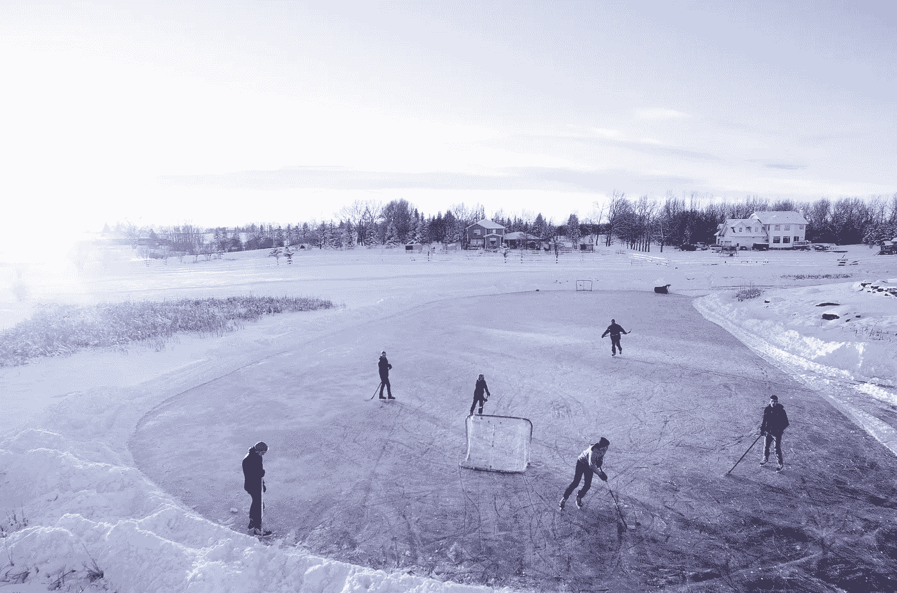
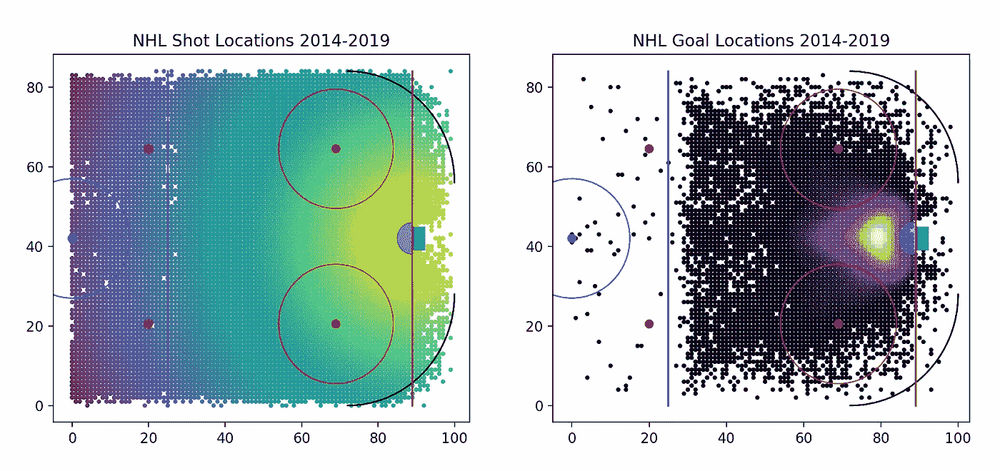
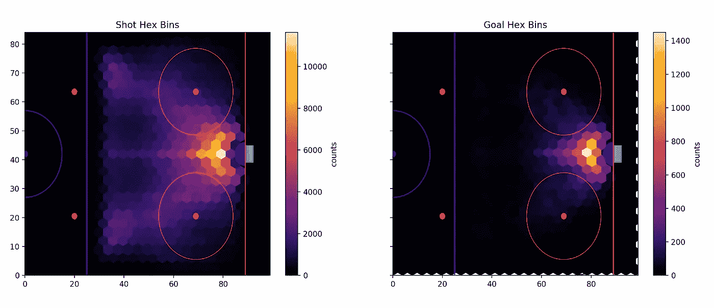
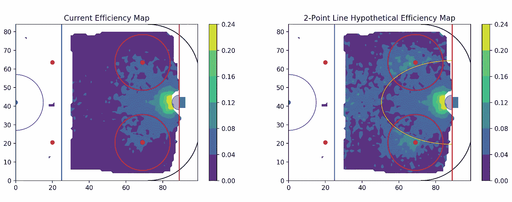
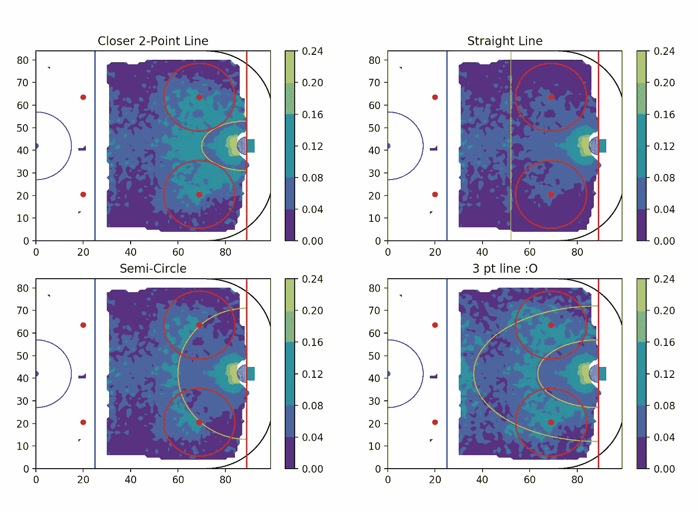
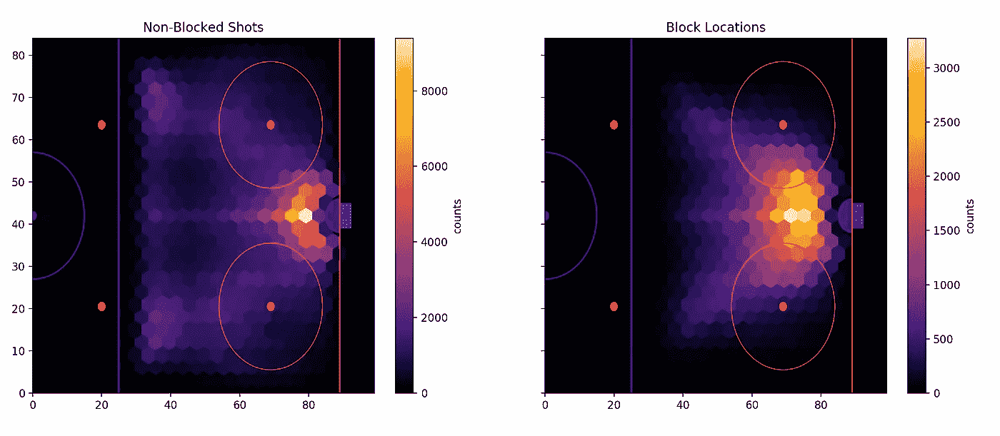

# NHL 曲棍球 2 点线看起来像什么？

> 原文：<https://towardsdatascience.com/what-would-a-hockey-2-point-line-look-like-bf6b3192226a?source=collection_archive---------19----------------------->



Photo by [Braden Barwich](https://unsplash.com/photos/yaAruHxQ9OQ?utm_source=unsplash&utm_medium=referral&utm_content=creditCopyText) on [Unsplash](https://unsplash.com/search/photos/hockey?utm_source=unsplash&utm_medium=referral&utm_content=creditCopyText)

## 感谢 NHL stats API，我们可以找到答案！

# 这个想法

曲棍球中两点线的想法并不算是新的。曲棍球也没有什么独特的地方比足球更需要 2 分线。我选择研究曲棍球，因为 NHL 有最容易获得的数据。事实上，只需要几行代码和 30 分钟的下载时间，就可以下载过去 5 年的所有 685，000 个镜头和拍摄地点。按照惯例，我已经把我使用的 python 代码发布在了 [Github](https://github.com/btatkinson/hockey_2pt) 上。此外，提到最初激发这篇文章的第 538 篇 NBA 文章[似乎很重要。正如 NBA 球迷所知，这项运动在过去几年里发生了巨大的变化，很大程度上是由于地图拍摄。每个 NBA 球队(希望如此)现在都非常清楚，三分球或多或少是比赛中仅次于上篮或扣篮的第二有价值的投篮。虽然这似乎是一个基本的概念，但直到统计学家开始绘制镜头，它才变得显而易见。让我们为曲棍球做同样的事情！](https://fivethirtyeight.com/features/how-mapping-shots-in-the-nba-changed-it-forever/)

# 第一步:下载超过 685，000 张照片

我喜欢 API。我没有太多和他们一起工作的经验，但是我有过几次这样的经历，感觉很棒。据我所知，大多数体育数据都是从像 sports-reference.com 这样的网站上搜集来的。很多先进的运动数据你必须建立更先进的爬虫。如果你运气不好，高级统计数据会在付费墙后面(比如 PGA 巡回赛历史击球数)或者更糟…它实际上都在付费墙后面(赛马😡).这就是为什么它是如此令人耳目一新，找到非霍奇金淋巴瘤统计 API。我首先生成了所有的常规赛 API 游戏 URL。下面是这段代码的主要片段:

```
for gm in range(gms):
     game_num = "0000" + str((gm+1))
     game_num = game_num[-4:]
     game_id = str(year)+"02"+game_num
     url= "[https://statsapi.web.nhl.com/api/v1/game/](https://statsapi.web.nhl.com/api/v1/game/)"
     +game_id+"/feed/live"
     urls.append(url)
```

简单的东西！然后，API 端点提供了一个数据宝库。数据几乎太多了。在 python3 请求和 json 库的帮助下，我只需选择播放数据:

```
# Note: tqdm is a progress bar library.for ep in tqdm(urls):
     response = requests.get(ep)
     game_json = json.loads(response.text)
     all_plays = game_json['liveData']['plays']['allPlays']
```

最后，我将比赛数据过滤为非空净的常规时间目标。我因为 3v3 的怪异排除了加班。在 json 数据内，有坐标！我的最终输出只是一个 3 列的表格:镜头类型、X 坐标和 Y 坐标。

# 第二步:绘制它们！

这是我们可以发挥创造力的地方。Matplotlib 和 Numpy 提供了许多表示数据的方法。下面，在左边，我有一个所有镜头的散点图。它们按照距离目标的远近来着色。在右边，我标出了所有的目标位置。根据频率不同，它们的颜色也不同。我们只是触及表面！



I’m aware that a handful of shots come from outside the rink. Rink dimensions I plotted are from Wikipedia so they have to be 100% accurate. Another possibility is that rinks are not uniform in size or that there is systematic error in plotting shot locations.

此外，我发现六角垃圾桶工作良好，视觉上很有吸引力:



It’s almost as if being close to the net helps. 🤔

# 我们在 2 点线上想要什么？

回到手头的问题。我们得到了拍摄数据。我们已经得到了目标数据。现在我们需要确定冰上不同点的投篮命中率。以篮球为例，很明显，在两分线后的理想投篮不会比高危险的一分机会得到更多的回报。这给了我们一个界限，界限可以有多近。如果最高危险的一分投篮在 25%的时间里进，那么你不希望两分投篮在高于 12.5%的时间里进。如果是的话，那就没有动力去投一分球了。

关于两点线应该有多远的另一个界限是完全可以讨论的。它应该如此遥远，以至于只能作为克服后期赤字的最后努力吗？还是应该这么高效，一个线上的投篮优先于很多一分投篮位置(类似篮球)？我可能会努力在一个快乐的中间状态下做出我最好的猜测。

# 映射效率

所有这些猜测都无关紧要，直到我们实际绘制出冰上的投篮命中率。我是怎么做到的？我用了一个数字面具🦸🏻‍♂️将从冰上的一个点设置一个最小的 8 杆阈值，以防止样本量过小。仍然有一两个高异常值。我通过反复试验将最大效率设定为 24%，尽管网前的一些点接近 30%。然后，我使用高斯滤波器平滑数据，并通过 Matplotlib 应用轮廓。我也通过 Matplotlib 画线。最后，我用了一个数字面具🦸🏻‍♂️将把两分线外的任何进球的价值加倍。



NHL shooting percentages are on the left. The result of doubling the value of points outside the two-point line is show on the right.

正如预期的那样，效率在接近目标时显著提高。我很震惊它是如何急剧增加的。事实上，在球门前有一个很小的区域有 30%的效率。我认为这种近网效率部分来自于幸运的篮板，这些篮板基本上是射进了一个空网。

另一个有趣的特征是，有一些线从效率提高的目标向外延伸大约 30 度。我认为这是一个甜蜜的地带，跨冰传球允许一次性击败守门员，但他们不是在一个如此尖锐的角度，这是一个艰难的射门。再说一次，我从来没有打过曲棍球，所以有很多人可以比我更好地诠释它。迎面是另一个有效的射击点，这很直观。

# 我的 2 点线

起初，我试图拥有和篮球完全一样的效率比，这条线似乎太接近了。我喜欢我画它的地方有几个原因。一，毫无疑问，在靠近球网的高危险区投篮还是比较有优势的。二，散开了！而之前在现行规则下，进攻区域可能只有 25%(我粗略的猜测)是有威胁的，这个数字接近两线制的两倍。看看冰球的移动和策略会如何变化会很有趣。第三，我喜欢红色的圆点就在它的外面。教练可以很容易地告诉球员最有效的射门地点在哪里。篮球也有类似的甜蜜点(角落三分和迎面投篮)。

当然，这只是一种看法。尝试不同的选择很有趣。我鼓励你玩代码。如果有什么不同的话，这是 Matplotlib 中很棒的一课。这里有一些其他的例子…是的，我已经有太多的乐趣了…



# 这是个好主意吗？

曲棍球中的 2 分线是个好主意吗？那是一个我没有资格回答的问题，也不是这篇帖子的目的。我从未打过曲棍球。我的大部分曲棍球知识来自于观看赛季后期的纳什维尔掠夺者队，以及播放被称为 NHL 伊茨 2002 的杰作。我不能排除这是个愚蠢的想法有明显的原因。我不认为 2 点线是荒谬的。篮球三分线好像成功了。这将使冰上出现不同的比赛风格和不同的冰球运动。这也将创造高度的游戏后期的戏剧性。然而，也有很多缺点。一条 2 点的线会打乱基本上所有的统计数据。格雷茨基记录将更难解读。你会把守门员的扑救和两分球的射门算作一分球吗？守门员救球百分比不会因为更多的低概率射门而上升吗？它会如何影响尝试给目标小费的常见策略？很容易被投机冲昏头脑。

# 盖帽

这个分析中的一个潜在问题是盖帽。盖帽占记录镜头的 25%。我的理解是，NHL API 给出的是盖帽的位置，而不是进攻球员投篮的位置。我映射了没有块的数据，变化不大:



移除遮挡镜头后，镜头热图没有太大差异。我最大的猜测是，大部分盖帽来自于远距，给出的坐标是中距离。我不认为这消极地影响了我的分析，本质上把被阻挡的投篮视为比实际稍微近一点的投篮。这就产生了一个小偏差，看起来中距离射击不如实际有效，而长距离射击比实际有效。更彻底的分析可以解释这一点。